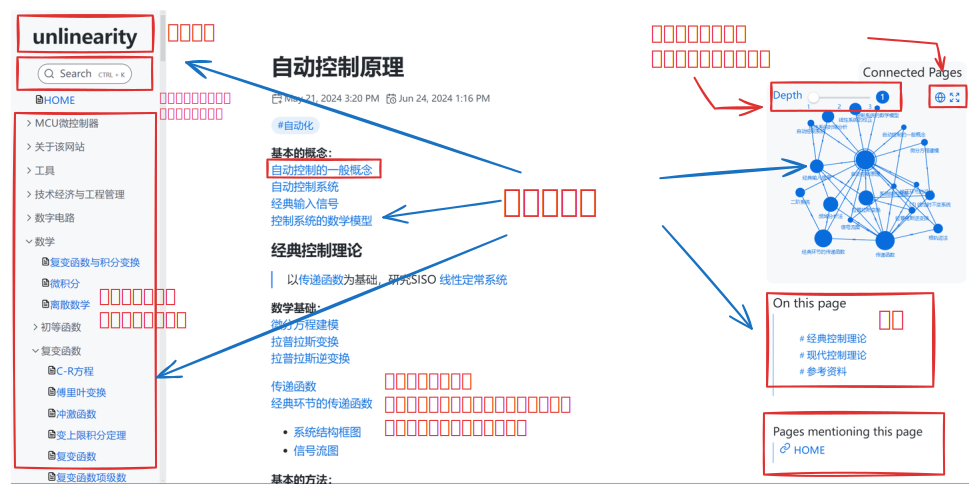
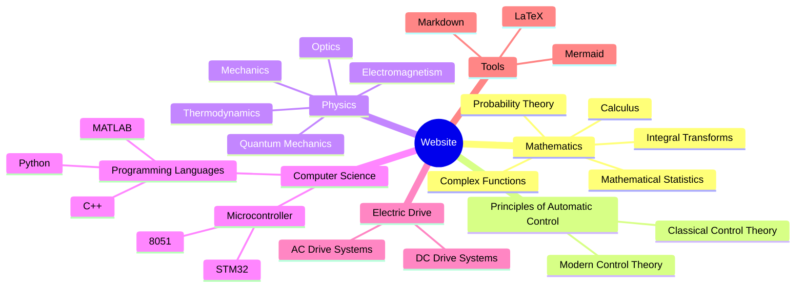

# Learn Everything!
This is a project based on Obsidian + Digital Garden + Vercel (**[English](https://github.com/UNLINEARITY/Learn-for-Everything/blob/main/translation/中文.md)**)

You can visit this [website](https://www.unlinearity.top) to see the results!

> [!warning]
> Due to the limitations of time, energy, and skill of the website builder, the main content of the website is currently presented in Chinese. An English version will be added in the future.
***

## I. Core Ideas
> ***Have you often heard: Integrals are useful / Linear algebra is helpful for future studies / Quantum mechanics / Electromagnetism / Electrical engineering / Algorithms... such sayings?***  

> ***Or have you often wondered: How will learning this course benefit my future studies and life? What is the significance of learning this knowledge?***

As we grow and continue to learn, we encounter many profound ideas, have many moments of sudden insight, and are amazed by the thoughts and theories of many predecessors.

However, there are too many concepts. We might be amazed for a while, or be influenced for a long time, but eventually, they may be forgotten.

***
This is the significance of this repository!

The project aims to build a knowledge base centered on **bi-directional linking** and **relationship mapping**.

  

It emphasizes the connections between different pieces of knowledge, focuses on mathematical and physical fundamentals, and explores the roles and impacts of mathematics and physics in various fields.

- The main files are in Markdown format (.md files).
- Mathematical formulas are rendered using LaTeX syntax.
- Relationships between notes are presented using simple Wiki syntax.

The long-term three-step plan for this project:
1. Establish connections between basic and general knowledge.
2. Link basic knowledge with specialized professional knowledge.
3. Connect all prior knowledge with real-life and practical work.

***

### II. Target Audience

#### 1. Beginners of open-source projects
This project is based on the most basic **Markdown** syntax with `.md` file rendering.
In theory, as long as you can type and use **git**, you can participate.

You don't need to do a lot of work. You can change a few sentences or add one or two specific knowledge points.

#### 2. University students
As this project will cover the most basic general mathematics and physics courses and will also cover automation-related specialized courses, it can be used for brief reviews or understanding the connections between knowledge points.

#### 3. University teachers
We might seek cooperation with university teachers to jointly build the website and introduce new ideas for teaching reform.

#### 4. People involved in practical work
In actual work and life, basic mathematics and physics knowledge are often needed. The ultimate goal of this project is to establish a connection between fundamental knowledge and the real world.

***

## III. Website Content

### Currently Covered and Continuously Updated Content:
**Well-developed sections:**
- [x] Principles of Automatic Control—Classical Control Theory
- [x] Electrical Machinery and Electric Drive
- [x] Probability Theory
- [x] Mathematical Statistics
- [x] Complex Functions and Integral Transforms
- [x] Microcontroller Principles—Basic 8051

**Upcoming sections:**
- [x] Physics
  - [x] Electromagnetism
- [x] Linear Algebra
- [x] Manim

**Future additions:**
- [x] Machine Learning
- [x] Philosophy
- [ ] Biology
  - [ ] Ecology

***

## IV. How to Contribute to the Website
- If you find errors or issues on the website.
- If you think the relationships between notes are too chaotic or the bi-directional links are not reasonable.
- If you think the website's features are not sufficient.
- If you want to contribute new branches.
- .....

### 1. Modify existing knowledge on the website
The original Markdown files of the notes are under the src/site/notes [directory](https://github.com/UNLINEARITY/Learn-Everything/tree/main/src/site/notes) and can be viewed anytime.

### 2. Contribute new knowledge branches
You can add your own folder in the **Contributions** section of this website, adding your unique branch!

For specific contribution steps, check the [readme file](https://github.com/UNLINEARITY/Learn-for-Everything/tree/main/Contributions) in that folder.

**Trust me, it's very simple!**  ~~However, doing a good job might be a bit difficult to ensure the overall quality of the website.~~

### 3. Adjust the website's functionality and architecture
If you think the website should have new features and have the ability to improve it, you can make adjustments anytime.
Possible features to implement?
Already implemented:

~~- [x] Like and comment on articles~~, this was already implemented, but considering its actual use was not significant, it was removed.

Not implemented:
- [ ] Switch between Chinese and English?
- [ ] Dark mode?
- [ ] 3D display of the knowledge graph

***

## V. Current Issues with the Website
- The project builder is not from a computer science background, so the knowledge of website building is insufficient, and many common features are not implemented.
- The server is deployed on Vercel, which cannot be accessed smoothly in China, and is limited by the free version's deployment restrictions, limiting the number of file uploads per day.
- Since the initial construction is mainly maintained by one person, and the workload is large, the presented content is not complete enough.

***

## VI. Contributors to the Website
> ***Greatness often originates from small thoughts***
