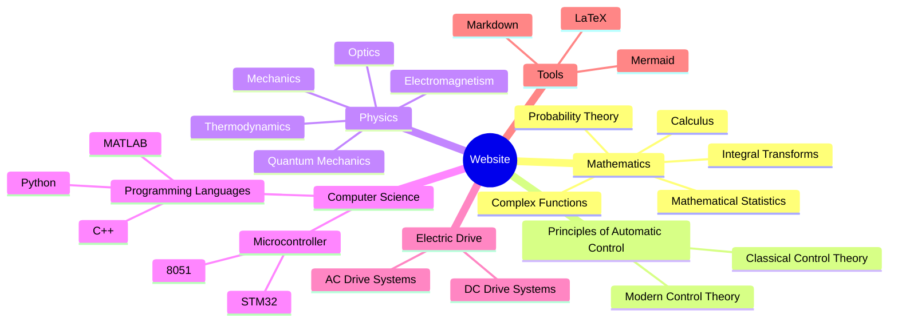

# Learn Everything!
This is a project based on Obsidian + Digital Garden + Vercel

你可以访问这个[网站](https://www.unlinearity.top),看看所搭建成果!   

You can visit this [website](https://www.unlinearity.top) to see the results!

> [!warning]
> Due to the limitations of time, energy, and skill of the website builder, the main content of the website is currently presented in Chinese. An English version will be added in the future.
***

## I. Core Ideas
>***你是否经常听到：积分很有用/线性代数在之后的学习里有帮助/量子力学/电磁学/电机/算法... 诸如此类的说辞***  

>***或者经常在想：我学xx课程究竟对之后的学习生活有什么帮助?学习这些知识有什么意义?***

在我们成长和不断学习的过程中，我们会接触到很多影响深远的理念，会产生很多灵光乍现的想法，会惊叹于诸多前人的思想和理论

可是概念太多了，我们也许会惊叹一时，也许会被影响很久，但是终究会被个体遗忘

> ***Have you often heard: Integrals are useful / Linear algebra is helpful for future studies / Quantum mechanics / Electromagnetism / Electrical engineering / Algorithms... such sayings?***  

> ***Or have you often wondered: How will learning this course benefit my future studies and life? What is the significance of learning this knowledge?***

As we grow and continue to learn, we encounter many profound ideas, have many moments of sudden insight, and are amazed by the thoughts and theories of many predecessors.

However, there are too many concepts. We might be amazed for a while, or be influenced for a long time, but eventually, they may be forgotten.

***
这就是本库存在的意义！

该项目旨在构建以**双向链接**和**关系图谱**为核心的知识库

强调知识与知识之间的联系，注重数理基础，深入探讨数学与物理知识在各个领域的作用与影响

- 主体文件为Markdown(即.md文件)
- 数学公式使用Latex语法渲染
- 笔记之间的关系使用简单的Wiki语法呈现

本项目长期的三步规划：
1. 初步构建基础知识、通识知识之间的联系
2. 将基础知识与细分的专业知识相联系
3. 将所有前置的知识与实际的生活、实际的工作相联系

This is the significance of this repository!

The project aims to build a knowledge base centered on **bi-directional linking** and **relationship mapping**.

It emphasizes the connections between different pieces of knowledge, focuses on mathematical and physical fundamentals, and explores the roles and impacts of mathematics and physics in various fields.

- The main files are in Markdown format (.md files).
- Mathematical formulas are rendered using LaTeX syntax.
- Relationships between notes are presented using simple Wiki syntax.

The long-term three-step plan for this project:
1. Establish connections between basic and general knowledge.
2. Link basic knowledge with specialized professional knowledge.
3. Connect all prior knowledge with real-life and practical work.

***

### II. Target Audience 预期覆盖的人群

本项目就是基于最为基础的 **Markdown** 语法的 `.md` 文件渲染的
理论上只要会打字，会 **git**  就能参与进来

要做的工作也不用很多，可以更改几个句子
也可以增加一两篇特定的知识点
#### 2. 高校学生
由于本项目即将覆盖最为基础的通识性数理课程
也将覆盖自动化类的专业课

可以利用此网站进行简要的复习，或是了解知识点之间的联系

#### 3. 高校教师
可能谋求与高校老师合作

共同建设网站，引入新的思想来进行教学改革

#### 4. 参与实际工作的人

实际的工作与生活中，
往往需要用到最为基础的数理知识，

本项目的终极目标就是希望能建立起基础知识与真实世界的联系

#### 1. Beginners of open-source projects
This project is based on the most basic **Markdown** syntax with `.md` file rendering.
In theory, as long as you can type and use **git**, you can participate.

You don't need to do a lot of work. You can change a few sentences or add one or two specific knowledge points.

#### 2. University students
As this project will cover the most basic general mathematics and physics courses and will also cover automation-related specialized courses, it can be used for brief reviews or understanding the connections between knowledge points.

#### 3. University teachers
We might seek cooperation with university teachers to jointly build the website and introduce new ideas for teaching reform.

#### 4. People involved in practical work
In actual work and life, basic mathematics and physics knowledge are often needed. The ultimate goal of this project is to establish a connection between fundamental knowledge and the real world.

***

## III. Website Content

### 目前该网站**涵盖**并**持续更新**的内容！！！
**较为完善的部分：**
- [x] 自动控制原理——经典控制理论
- [x] 电机与电力拖动
- [x] 概率论
- [x] 数理统计
- [x] 复变函数与积分变换
- [x] 微机原理——8051基础部分

**近期将更新的部分：**
- [x] 物理
  - [x] 电磁学
- [x] 线性代数
- [x] manim

**之后逐步添加的内容**
- [x] 机器学习
- [x] 哲学
- [ ] 生物
  - [ ] 生态学

***

### Currently Covered and Continuously Updated Content:
**Well-developed sections:**
- [x] Principles of Automatic Control—Classical Control Theory
- [x] Electrical Machinery and Electric Drive
- [x] Probability Theory
- [x] Mathematical Statistics
- [x] Complex Functions and Integral Transforms
- [x] Microcontroller Principles—Basic 8051

**Upcoming sections:**
- [x] Physics
  - [x] Electromagnetism
- [x] Linear Algebra
- [x] Manim

**Future additions:**
- [x] Machine Learning
- [x] Philosophy
- [ ] Biology
  - [ ] Ecology

***

## IV. How to Contribute to the Website

- 如果在网站中发现有错误或者存在问题
- 如果你觉得笔记之间的关系过乱，或者设置的正反向链接不够合理
- 如果你觉得网站的功能不够完善
- 如果你想贡献新的分支
- ......

- If you find errors or issues on the website.
- If you think the relationships between notes are too chaotic or the bi-directional links are not reasonable.
- If you think the website's features are not sufficient.
- If you want to contribute new branches.
- .....

### 1. Modify existing knowledge on the website
The original Markdown files of the notes are under the src/site/notes [directory](https://github.com/UNLINEARITY/Learn-Everything/tree/main/src/site/notes) and can be viewed anytime.

### 2. Contribute new knowledge branches
You can add your own folder in the **Contributions** section of this website, adding your unique branch!

For specific contribution steps, check the [readme file](https://github.com/UNLINEARITY/Learn-for-Everything/tree/main/Contributions) in that folder.

**Trust me, it's very simple!**  ~~However, doing a good job might be a bit difficult to ensure the overall quality of the website.~~

### 3. Adjust the website's functionality and architecture
If you think the website should have new features and have the ability to improve it, you can make adjustments anytime.
Possible features to implement?
Already implemented:

~~- [x] Like and comment on articles~~, this was already implemented, but considering its actual use was not significant, it was removed.

Not implemented:
- [ ] Switch between Chinese and English?
- [ ] Dark mode?
- [ ] 3D display of the knowledge graph

***

## V. Current Issues with the Website
- 由于本项目的构建者并非为计算机专业出身，对网站构建的知识不够了解，没有实现很多网站具备的功能
- 服务器部署于Vercel，在国内不能流畅访问，而且限于免费版的部署限制，一天文件的上传次数有限
- 由于建设初期主要只有一人建设和维护，而且工作量较大，所以呈现的内容不够完善

- The project builder is not from a computer science background, so the knowledge of website building is insufficient, and many common features are not implemented.
- The server is deployed on Vercel, which cannot be accessed smoothly in China, and is limited by the free version's deployment restrictions, limiting the number of file uploads per day.
- Since the initial construction is mainly maintained by one person, and the workload is large, the presented content is not complete enough.

***

## VI. Contributors to the Website
> ***伟大，总是起源于微小的念头***
> 
> ***Greatness often originates from small thoughts***
