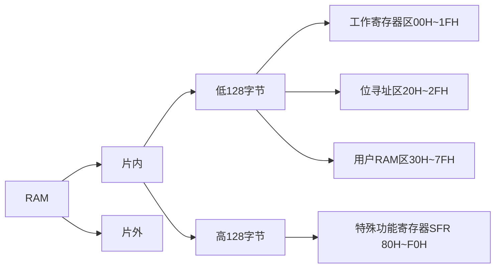

---
{"dg-publish":true,"dg-path":"MCU微控制器/51 单片机/51单片机的储存空间.md","permalink":"/MCU微控制器/51 单片机/51单片机的储存空间/","dgPassFrontmatter":true,"noteIcon":"","created":"2024-06-09T20:56:02.560+08:00","updated":"2024-08-15T22:30:37.177+08:00"}
---

三个逻辑空间
四个物理空间
（1）片内数据存储器（2）片内程序存储器
（3）片外数据存储器（4）片外程序存储器
## RAM 数据空间
**Data Memory Space**    [[RAM\|RAM]] 作为**数据储存器**
数据空间是单片机中用于存储变量、临时数据和堆栈信息的区域



### 片内 RAM 
51 单片机的内部 RAM 分为几个不同的区域，每个区域都有特定的用途和地址范围：
#### 低 128 字节
1. **寄存器组（Register Banks）**：
	通用工作寄存器区
   - 地址范围：==00H - 1FH==
   - 包含 4 个 8 位通用寄存器组（R0-R7），
	每个寄存器组占用 8 个字节，共计 32 个字节。
   - 寄存器组可以通过 RS0 和 RS1 位在 PSEN（程序状态字寄存器中的位 2）和 PSW（程序状态字寄存器）中的位 0 和位 1 来选择。

2. **位地址区域（Bit Addressable Area）**：
	可位寻址 RAM 区
   - 地址范围：==20H - 2FH==
   - 包含 128 位的可位寻址区域，每个位占用一个地址，用于位操作指令。

3. **变量存储区域（General Purpose RAM）**：
	通用 RAM 区
   - 地址范围：==30H - 7FH==
   - 用于存储程序中的变量和临时数据。


#### 高 128 字节
[[特殊功能寄存器\|特殊功能寄存器]]
控制具体硬件的工作，有特殊的功能

### 片外 RAM
` DPTR ` 数据指针
	用于**片外数据存储器**地址的指针
	一般当为**间接寻址寄存器使用，指向外部地址**
	==64KB==   16 位字节   $2^{16}$
	可拆分为两个八位的独立寄存器 `DPL`  `DPH`

```C
MOV DPTR,#0650H   ;设置片外地址指针0650H
MOV R0,#30H    ;片内30H
MOV A,@R0      ; 间接寻址，传30H中数据给累加器A
MOVX @DPTR,A  ;将累加器的值给片外的0650H
```

外部 RAM 是通过外部接口连接到 51 单片机的内存区域，它可以提供比内部 RAM 更大的存储空间。
外部 RAM 的地址范围取决于具体的硬件设计和连接的内存大小。
通常，外部 RAM 的地址由单片机的地址线直接给出，而数据则通过数据总线进行传输。
## ROM  程序空间
**Program Memory Space**    [[ROM\|ROM]] 作为**程序储存器**
程序空间是单片机中用于存储程序代码和常量数据的区域

存放编好的程序和表格常数,采用PC 程序计数器寻址
 ` PC ` **程序计数器**
	用于存放**下一条**要执行指令地址
	==64KB==   16 位字节   $2^{16}$
	地址范围==0000H～FFFFH==
   
编译和烧录过程将汇编代码转换成机器代码，然后这个机器代码被放置到单片机的程序空间里
在8051单片机中，程序空间通常是只读的，意味着写入程序空间的数据在单片机上电后是不可更改的。
### 片内 ROM  
` PC ` 地址指针指向
7 个特殊的存储器单元   [[8051中断系统\|8051中断系统]]
0000H：复位后程序自动运行的首地址
0003H：外部中断 0 入口地址
000BH：定时器 0 溢出中断入口地址
0013H：外部中断 1 入口地址
001BH：定时器 0 溢出中断入口地址
0023H：串行口中断入口地址
### 片外 ROM  
` PC ` 地址指针指向


