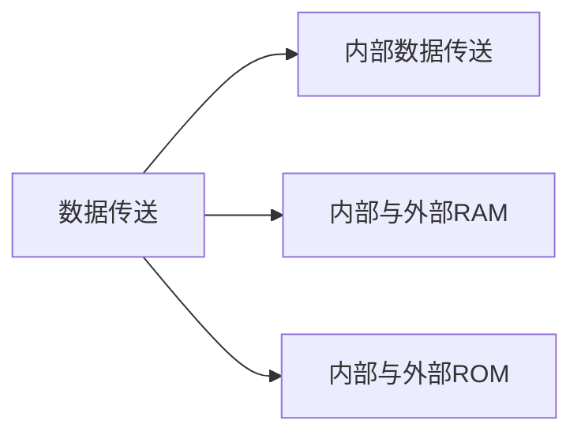

---
{"dg-publish":true,"dg-path":"MCU微控制器/51 单片机/8051汇编指令集.md","permalink":"/MCU微控制器/51 单片机/8051汇编指令集/","dgPassFrontmatter":true,"noteIcon":"","created":"2024-04-18T15:30:43.121+08:00","updated":"2024-08-15T23:04:10.804+08:00"}
---

[[51 单片机\|51 单片机]]中的[[汇编语言\|汇编语言]]，最长指令占 3 字节
`标号：\quad 操作码\quad操作数\quad;注释`
### 助记符
[[寻址方式\|寻址方式]]

```C
//  助记
Rn     R0~R7
Ri     R0~R1
#data    8位立即数
#data16  16位立即数
addr16   16位地址，用于64K范围内寻址 
addr11   11位地址，用于2K范围内寻址 
direct   8位直接地址  
Rel      带符号的8位偏移量 relative_address 
bit      位寻址区的直接寻址位
```

### 一、数据传送




#### 1.内部数据传送
`MOV destination,source`
**destination:**
	`A`, `Rn`, `direct1`,`@Ri`
**source:**
	`A`, `Rn`, `direct2`, `@Ri`, `# data`

`MOV DPTR,#data16`
传送 16 位的数据给 DPTR

#### 2.外部数据传送
片内与片外 RAM
`MOVX A,@DPTR/@Ri`
`MOVX @DPTR/@Ri,A`
用来访问外部数据存储器（External Data Memory，通常是指扩展 RAM）
通过**间接寻址**方式指定外部 RAM 的一个字节单元地址, 寄存器 A 数据交换

```C
MOV DPTR,#1000H
MOVX A,@DPTR
MOVC  程序储存器
```

#### 3.字节交换
`XCH A，direct/Rn/@Ri`
用于将累加器A中的值与另一个寄存器或内存位置中的值进行交换

`XCHD A，@Ri`   **Exchange Decimal**
低半字节交换，只交换低 4 位

`SWAP A`  
累加器 A 高 4 位和低 4 位交换
#### 4.查表
`MOVC A,@A+PC`   

更常使用：
`MOVC A,@A+DPTR`   **Move Code**
**变址寻址**
`@` 表示间接寻址，`A` 是累加器寄存器，`DPTR` 是数据指针寄存器。这条指令将累加器A的值和数据指针DPTR的值相加，然后以这个和作为地址，从**程序存储器**中取出一个字节的数据，并将这个数据移动到累加器A中
- 这里的 `@A` 并非是指累加器 A 中的内容，而是指累加器 A 的内容作为一个 8 位偏移量。
- CPU 会首先将累加器 A 的内容与 DPTR 的内容进行逻辑拼接（高位扩展 A 至 16 位并与 DPTR 合并），形成一个完整的 16 位地址。
- CPU 随后会根据这个拼接后形成的地址从程序存储器中读取一个字节数据。
- 最后，这个从程序存储空间读出的字节数据会被存入累加器 A。

此指令常常用于执行查表操作，比如当程序需要快速查找预先存放在程序存储器中的一张表格时，通过设置 DPTR 指向表格的首地址，然后利用 A 寄存器作为索引偏移量来快速获取表格中的特定数据项。

由于 C51 单片机的程序存储器可以被映射为数据空间的一部分，因此可以直接从中读取数据，这对于诸如字符发生器表、函数表等应用场景非常实用。

#### 5.堆栈操作
[[堆栈\|堆栈]]原则：后进先出 LIFO
`PUSH direct`  入栈
将直接地址指定的内存位置中的值压入栈顶
`POP direct`    出栈
从栈顶取出数据，并将其放入直接地址指定的内存位置

```C
PUSH 33H  //将33H中的值压入栈顶，假设为1
PUSH 34H  //将34H中的值压入栈顶，假设为2
POP 36H   //将栈顶的值取出到36H，值为2
POP 35H   //将栈顶的值取出到35H，值为1
```

### 二、算数运算
>**source**: `Rn`  `direct`  `@Ri`  `# data`
#### 1.加减法
`ADD A,source`    
不带进位的加法操作

`ADDC A,source`   **Add with Carry**
带进位的加法操作
A=A+source+CY

`SUBB A,source`   **Subtract with Borrow**
带借位的减法操作   
A=A-source-CY

10-6 无借位，CY=0
4-4 有借位，CY=1   可以借助此判断数值大小
#### 2.BCD 调整码
`DA A`   **Decimal Adjust Accumulator**
BCD 调整码，跟在 ADD、ADDC 加法指令之后
用于将二进制编码的十进制数调整为正确的十进制表示形式
```C
MOV A,32H
ADD A,23H
DA A
MOV 42H,A
```

[[二进制\|BCD 码]]的调整
假设有十进制计算：
18+16=34  对应结果的 BCD 码： `0011 0100`
二进制计算应该表示为：
0001 1000  +  0001 0110= `0010 1110`
结果差：0011 0100 - 0010 1110=0000 0110
即差 6

#### 3.加一减一
`INC source`    **Increment**
source=source+1

>**source**: `A`  `Rn`  `direct`  `@Ri`  `DPTR`

`DEC source`     **Decrement**
source=source-1

>**source**:  `A`  `Rn`  `direct`  `@Ri`  

#### 4.乘除法
`MUL A,B`   
无符号乘法，高位存 B，低位存 A

`DIV A，B`   
无符号除法，商存 A，余数存 B

### 三、逻辑及位移
[[逻辑代数\|逻辑代数]]
>**source**： `direct`  `Rn`  `@Ri`  `#data`
#### 1.逻辑与
`ANL A,source`  
`ANL direct,A/#data`   
按位相与
#### 2.逻辑或
`ORL A,source` 
`ORL direct,A/#data`  
按位相或
#### 3.逻辑异或
`XRL A,source`  
`XRL direct,A/#data` 
按位相异或

#### 4.清零和取反
`CLR A`   清零
A 中内容清零，影响 P 标志位

`CPL A`  取反
Converse Position Logical  
A 中内容取反，影响 P 标志位

#### 5.循环位移
`RL A`   **Rotate Left**   循环左移 
累加器A中最低位向高位移动（不带进位位）

`RR A`  **Rotate Right**   循环右移 
累加器 A 中最高位向低位移动（不带进位位）

`RLC A`  **Rotate Left through Carry**   循环左移 
累加器 A 中最低位向高位移动（带进位位）
<svg xmlns="http://www.w3.org/2000/svg" version="1.1" viewBox="0 0 741.8698228751198 173.20666032742412" width="741.8698228751198" height="173.20666032742412">  <!-- svg-source:excalidraw -->    <defs>    <style class="style-fonts">      @font-face {        font-family: "Virgil";        src: url("https://excalidraw.com/Virgil.woff2");      }      @font-face {        font-family: "Cascadia";        src: url("https://excalidraw.com/Cascadia.woff2");      }      @font-face {        font-family: "Assistant";        src: url("https://excalidraw.com/Assistant-Regular.woff2");      }    </style>      </defs>  <rect x="0" y="0" width="741.8698228751198" height="173.20666032742412" fill="#ffffff"></rect><g stroke-linecap="round" transform="translate(151.19984072255406 58.66405457161699) rotate(0 33.02701903401025 32.58957134951595)"><path d="M0 0 C20.38 0, 40.75 0, 66.05 0 M0 0 C14.39 0, 28.78 0, 66.05 0 M66.05 0 C66.05 21.11, 66.05 42.22, 66.05 65.18 M66.05 0 C66.05 13.18, 66.05 26.37, 66.05 65.18 M66.05 65.18 C40.28 65.18, 14.5 65.18, 0 65.18 M66.05 65.18 C41.73 65.18, 17.41 65.18, 0 65.18 M0 65.18 C0 39.85, 0 14.52, 0 0 M0 65.18 C0 48.88, 0 32.58, 0 0" stroke="#1e1e1e" stroke-width="2" fill="none"></path></g><g stroke-linecap="round" transform="translate(218.27750723735372 58.987746538413774) rotate(0 33.02701903401025 32.58957134951595)"><path d="M0 0 C20.96 0, 41.93 0, 66.05 0 M0 0 C15.69 0, 31.38 0, 66.05 0 M66.05 0 C66.05 20.46, 66.05 40.91, 66.05 65.18 M66.05 0 C66.05 22.33, 66.05 44.66, 66.05 65.18 M66.05 65.18 C47.95 65.18, 29.84 65.18, 0 65.18 M66.05 65.18 C50.9 65.18, 35.75 65.18, 0 65.18 M0 65.18 C0 43.64, 0 22.11, 0 0 M0 65.18 C0 39.82, 0 14.45, 0 0" stroke="#1e1e1e" stroke-width="2" fill="none"></path></g><g stroke-linecap="round" transform="translate(287.3061491903525 58.83027632945408) rotate(0 33.02701903401025 32.58957134951595)"><path d="M0 0 C16.7 0, 33.4 0, 66.05 0 M0 0 C15.52 0, 31.03 0, 66.05 0 M66.05 0 C66.05 14.73, 66.05 29.47, 66.05 65.18 M66.05 0 C66.05 21.68, 66.05 43.36, 66.05 65.18 M66.05 65.18 C48.25 65.18, 30.45 65.18, 0 65.18 M66.05 65.18 C46.33 65.18, 26.61 65.18, 0 65.18 M0 65.18 C0 43.54, 0 21.91, 0 0 M0 65.18 C0 41.39, 0 17.6, 0 0" stroke="#1e1e1e" stroke-width="2" fill="none"></path></g><g stroke-linecap="round" transform="translate(355.0924748985955 58.37533996491317) rotate(0 33.02701903401025 32.58957134951595)"><path d="M0 0 C15.28 0, 30.56 0, 66.05 0 M0 0 C23.81 0, 47.62 0, 66.05 0 M66.05 0 C66.05 16.8, 66.05 33.61, 66.05 65.18 M66.05 0 C66.05 24.44, 66.05 48.87, 66.05 65.18 M66.05 65.18 C48.64 65.18, 31.22 65.18, 0 65.18 M66.05 65.18 C48.16 65.18, 30.27 65.18, 0 65.18 M0 65.18 C0 46.92, 0 28.67, 0 0 M0 65.18 C0 45.23, 0 25.27, 0 0" stroke="#1e1e1e" stroke-width="2" fill="none"></path></g><g stroke-linecap="round" transform="translate(422.8266716520236 58.542227286033494) rotate(0 33.02701903401025 32.58957134951595)"><path d="M0 0 C22.84 0, 45.68 0, 66.05 0 M0 0 C22.67 0, 45.34 0, 66.05 0 M66.05 0 C66.05 25.97, 66.05 51.93, 66.05 65.18 M66.05 0 C66.05 25.08, 66.05 50.16, 66.05 65.18 M66.05 65.18 C49.42 65.18, 32.8 65.18, 0 65.18 M66.05 65.18 C40.37 65.18, 14.69 65.18, 0 65.18 M0 65.18 C0 40.09, 0 14.99, 0 0 M0 65.18 C0 50.67, 0 36.15, 0 0" stroke="#1e1e1e" stroke-width="2" fill="none"></path></g><g stroke-linecap="round" transform="translate(489.90433816682327 58.86591925283034) rotate(0 33.02701903401025 32.58957134951595)"><path d="M0 0 C14.84 0, 29.67 0, 66.05 0 M0 0 C25.16 0, 50.32 0, 66.05 0 M66.05 0 C66.05 18.78, 66.05 37.57, 66.05 65.18 M66.05 0 C66.05 24.83, 66.05 49.67, 66.05 65.18 M66.05 65.18 C46.53 65.18, 27.01 65.18, 0 65.18 M66.05 65.18 C44.1 65.18, 22.15 65.18, 0 65.18 M0 65.18 C0 49.58, 0 33.98, 0 0 M0 65.18 C0 39.32, 0 13.45, 0 0" stroke="#1e1e1e" stroke-width="2" fill="none"></path></g><g stroke-linecap="round" transform="translate(558.932980119822 58.70844904387059) rotate(0 33.027019034010266 32.58957134951595)"><path d="M0 0 C19.25 0, 38.49 0, 66.05 0 M0 0 C21.88 0, 43.77 0, 66.05 0 M66.05 0 C66.05 24.67, 66.05 49.33, 66.05 65.18 M66.05 0 C66.05 24.53, 66.05 49.06, 66.05 65.18 M66.05 65.18 C40.74 65.18, 15.43 65.18, 0 65.18 M66.05 65.18 C52.17 65.18, 38.28 65.18, 0 65.18 M0 65.18 C0 40.57, 0 15.96, 0 0 M0 65.18 C0 47.35, 0 29.52, 0 0" stroke="#1e1e1e" stroke-width="2" fill="none"></path></g><g stroke-linecap="round" transform="translate(626.719305828065 58.25351267932973) rotate(0 33.027019034010266 32.58957134951595)"><path d="M0 0 C21.39 0, 42.79 0, 66.05 0 M0 0 C13.36 0, 26.72 0, 66.05 0 M66.05 0 C66.05 25.44, 66.05 50.87, 66.05 65.18 M66.05 0 C66.05 24, 66.05 48, 66.05 65.18 M66.05 65.18 C40.39 65.18, 14.72 65.18, 0 65.18 M66.05 65.18 C49.54 65.18, 33.02 65.18, 0 65.18 M0 65.18 C0 43.31, 0 21.43, 0 0 M0 65.18 C0 48.8, 0 32.43, 0 0" stroke="#1e1e1e" stroke-width="2" fill="none"></path></g><g stroke-linecap="round"><g transform="translate(210.31326588312902 92.76655210715165) rotate(0 -28.634891392350625 0.17250092121116722)"><path d="M0 0 C-17.97 0.11, -35.95 0.22, -57.27 0.35 M0 0 C-19.62 0.12, -39.24 0.24, -57.27 0.35" stroke="#1e1e1e" stroke-width="2" fill="none"></path></g><g transform="translate(210.31326588312902 92.76655210715165) rotate(0 -28.634891392350625 0.17250092121116722)"><path d="M-33.83 -8.35 C-41.19 -5.62, -48.54 -2.89, -57.27 0.35 M-33.83 -8.35 C-41.86 -5.37, -49.89 -2.39, -57.27 0.35" stroke="#1e1e1e" stroke-width="2" fill="none"></path></g><g transform="translate(210.31326588312902 92.76655210715165) rotate(0 -28.634891392350625 0.17250092121116722)"><path d="M-33.73 8.75 C-41.12 6.11, -48.5 3.48, -57.27 0.35 M-33.73 8.75 C-41.79 5.87, -49.86 2.99, -57.27 0.35" stroke="#1e1e1e" stroke-width="2" fill="none"></path></g></g><mask></mask><g stroke-linecap="round"><g transform="translate(279.21643665660946 94.15030770929246) rotate(0 -28.634891392350617 0.17250092121116722)"><path d="M0 0 C-12.94 0.08, -25.89 0.16, -57.27 0.35 M0 0 C-19.05 0.11, -38.1 0.23, -57.27 0.35" stroke="#1e1e1e" stroke-width="2" fill="none"></path></g><g transform="translate(279.21643665660946 94.15030770929246) rotate(0 -28.634891392350617 0.17250092121116722)"><path d="M-33.83 -8.35 C-39.13 -6.38, -44.43 -4.42, -57.27 0.35 M-33.83 -8.35 C-41.63 -5.46, -49.42 -2.56, -57.27 0.35" stroke="#1e1e1e" stroke-width="2" fill="none"></path></g><g transform="translate(279.21643665660946 94.15030770929246) rotate(0 -28.634891392350617 0.17250092121116722)"><path d="M-33.73 8.75 C-39.05 6.85, -44.37 4.95, -57.27 0.35 M-33.73 8.75 C-41.56 5.96, -49.39 3.16, -57.27 0.35" stroke="#1e1e1e" stroke-width="2" fill="none"></path></g></g><mask></mask><g stroke-linecap="round"><g transform="translate(349.56859015247454 94.5643076460367) rotate(0 -28.634891392350617 0.17250092121116722)"><path d="M0 0 C-14.76 0.09, -29.53 0.18, -57.27 0.35 M0 0 C-21.47 0.13, -42.94 0.26, -57.27 0.35" stroke="#1e1e1e" stroke-width="2" fill="none"></path></g><g transform="translate(349.56859015247454 94.5643076460367) rotate(0 -28.634891392350617 0.17250092121116722)"><path d="M-33.83 -8.35 C-39.87 -6.11, -45.92 -3.87, -57.27 0.35 M-33.83 -8.35 C-42.62 -5.09, -51.41 -1.83, -57.27 0.35" stroke="#1e1e1e" stroke-width="2" fill="none"></path></g><g transform="translate(349.56859015247454 94.5643076460367) rotate(0 -28.634891392350617 0.17250092121116722)"><path d="M-33.73 8.75 C-39.8 6.59, -45.87 4.42, -57.27 0.35 M-33.73 8.75 C-42.55 5.6, -51.38 2.45, -57.27 0.35" stroke="#1e1e1e" stroke-width="2" fill="none"></path></g></g><mask></mask><g stroke-linecap="round"><g transform="translate(416.8710233309895 95.39229614871175) rotate(0 -28.634891392350617 0.17250092121116722)"><path d="M0 0 C-22.81 0.14, -45.63 0.27, -57.27 0.35 M0 0 C-22.04 0.13, -44.07 0.27, -57.27 0.35" stroke="#1e1e1e" stroke-width="2" fill="none"></path></g><g transform="translate(416.8710233309895 95.39229614871175) rotate(0 -28.634891392350617 0.17250092121116722)"><path d="M-33.83 -8.35 C-43.17 -4.88, -52.51 -1.42, -57.27 0.35 M-33.83 -8.35 C-42.85 -5, -51.87 -1.66, -57.27 0.35" stroke="#1e1e1e" stroke-width="2" fill="none"></path></g><g transform="translate(416.8710233309895 95.39229614871175) rotate(0 -28.634891392350617 0.17250092121116722)"><path d="M-33.73 8.75 C-43.11 5.4, -52.48 2.05, -57.27 0.35 M-33.73 8.75 C-42.79 5.52, -51.85 2.28, -57.27 0.35" stroke="#1e1e1e" stroke-width="2" fill="none"></path></g></g><mask></mask><g stroke-linecap="round"><g transform="translate(483.44199483983834 95.62689876605651) rotate(0 -28.634891392350617 0.17250092121116722)"><path d="M0 0 C-16.51 0.1, -33.01 0.2, -57.27 0.35 M0 0 C-21.82 0.13, -43.64 0.26, -57.27 0.35" stroke="#1e1e1e" stroke-width="2" fill="none"></path></g><g transform="translate(483.44199483983834 95.62689876605651) rotate(0 -28.634891392350617 0.17250092121116722)"><path d="M-33.83 -8.35 C-40.58 -5.84, -47.34 -3.34, -57.27 0.35 M-33.83 -8.35 C-42.76 -5.04, -51.69 -1.72, -57.27 0.35" stroke="#1e1e1e" stroke-width="2" fill="none"></path></g><g transform="translate(483.44199483983834 95.62689876605651) rotate(0 -28.634891392350617 0.17250092121116722)"><path d="M-33.73 8.75 C-40.51 6.33, -47.3 3.91, -57.27 0.35 M-33.73 8.75 C-42.7 5.55, -51.67 2.35, -57.27 0.35" stroke="#1e1e1e" stroke-width="2" fill="none"></path></g></g><mask></mask><g stroke-linecap="round"><g transform="translate(550.4407363401813 96.24790435657945) rotate(0 -28.634891392350625 0.17250092121116722)"><path d="M0 0 C-21.67 0.13, -43.35 0.26, -57.27 0.35 M0 0 C-21.55 0.13, -43.11 0.26, -57.27 0.35" stroke="#1e1e1e" stroke-width="2" fill="none"></path></g><g transform="translate(550.4407363401813 96.24790435657945) rotate(0 -28.634891392350625 0.17250092121116722)"><path d="M-33.83 -8.35 C-42.7 -5.06, -51.57 -1.77, -57.27 0.35 M-33.83 -8.35 C-42.65 -5.08, -51.47 -1.8, -57.27 0.35" stroke="#1e1e1e" stroke-width="2" fill="none"></path></g><g transform="translate(550.4407363401813 96.24790435657945) rotate(0 -28.634891392350625 0.17250092121116722)"><path d="M-33.73 8.75 C-42.64 5.57, -51.55 2.39, -57.27 0.35 M-33.73 8.75 C-42.59 5.59, -51.45 2.42, -57.27 0.35" stroke="#1e1e1e" stroke-width="2" fill="none"></path></g></g><mask></mask><g stroke-linecap="round"><g transform="translate(619.5647283054433 95.5717048389244) rotate(0 -28.634891392350625 0.17250092121116722)"><path d="M0 0 C-22.35 0.13, -44.7 0.27, -57.27 0.35 M0 0 C-21.09 0.13, -42.18 0.25, -57.27 0.35" stroke="#1e1e1e" stroke-width="2" fill="none"></path></g><g transform="translate(619.5647283054433 95.5717048389244) rotate(0 -28.634891392350625 0.17250092121116722)"><path d="M-33.83 -8.35 C-42.98 -4.95, -52.12 -1.56, -57.27 0.35 M-33.83 -8.35 C-42.46 -5.15, -51.09 -1.95, -57.27 0.35" stroke="#1e1e1e" stroke-width="2" fill="none"></path></g><g transform="translate(619.5647283054433 95.5717048389244) rotate(0 -28.634891392350625 0.17250092121116722)"><path d="M-33.73 8.75 C-42.91 5.47, -52.1 2.19, -57.27 0.35 M-33.73 8.75 C-42.4 5.66, -51.06 2.56, -57.27 0.35" stroke="#1e1e1e" stroke-width="2" fill="none"></path></g></g><mask></mask><g stroke-linecap="round"><g transform="translate(688.6335945684517 96.59289482818855) rotate(0 -28.634891392350625 0.17250092121116722)"><path d="M0 0 C-15.7 0.09, -31.4 0.19, -57.27 0.35 M0 0 C-13.14 0.08, -26.28 0.16, -57.27 0.35" stroke="#1e1e1e" stroke-width="2" fill="none"></path></g><g transform="translate(688.6335945684517 96.59289482818855) rotate(0 -28.634891392350625 0.17250092121116722)"><path d="M-33.83 -8.35 C-40.26 -5.96, -46.68 -3.58, -57.27 0.35 M-33.83 -8.35 C-39.21 -6.35, -44.58 -4.36, -57.27 0.35" stroke="#1e1e1e" stroke-width="2" fill="none"></path></g><g transform="translate(688.6335945684517 96.59289482818855) rotate(0 -28.634891392350625 0.17250092121116722)"><path d="M-33.73 8.75 C-40.18 6.45, -46.64 4.14, -57.27 0.35 M-33.73 8.75 C-39.13 6.82, -44.53 4.9, -57.27 0.35" stroke="#1e1e1e" stroke-width="2" fill="none"></path></g></g><mask></mask><g stroke-linecap="round" transform="translate(33.084672865270875 58.271384780089704) rotate(0 33.02701903401025 32.58957134951595)"><path d="M0 0 C17.8 0, 35.6 0, 66.05 0 M0 0 C19.72 0, 39.44 0, 66.05 0 M66.05 0 C66.05 21.63, 66.05 43.27, 66.05 65.18 M66.05 0 C66.05 23.79, 66.05 47.58, 66.05 65.18 M66.05 65.18 C45.14 65.18, 24.23 65.18, 0 65.18 M66.05 65.18 C45.29 65.18, 24.53 65.18, 0 65.18 M0 65.18 C0 39.33, 0 13.48, 0 0 M0 65.18 C0 44.72, 0 24.27, 0 0" stroke="#1e1e1e" stroke-width="2" fill="none"></path></g><g stroke-linecap="round"><g transform="translate(147.15192879164988 95.0636459120189) rotate(0 -23.060411379402083 0.41058510324592135)"><path d="M0 0 C-18.35 0.33, -36.7 0.65, -46.12 0.82 M0 0 C-12.09 0.22, -24.18 0.43, -46.12 0.82" stroke="#1e1e1e" stroke-width="2" fill="none"></path></g><g transform="translate(147.15192879164988 95.0636459120189) rotate(0 -23.060411379402083 0.41058510324592135)"><path d="M-24.59 -7.45 C-33.16 -4.16, -41.72 -0.87, -46.12 0.82 M-24.59 -7.45 C-30.23 -5.28, -35.88 -3.11, -46.12 0.82" stroke="#1e1e1e" stroke-width="2" fill="none"></path></g><g transform="translate(147.15192879164988 95.0636459120189) rotate(0 -23.060411379402083 0.41058510324592135)"><path d="M-24.31 8.32 C-32.99 5.34, -41.67 2.35, -46.12 0.82 M-24.31 8.32 C-30.03 6.36, -35.74 4.39, -46.12 0.82" stroke="#1e1e1e" stroke-width="2" fill="none"></path></g></g><mask></mask><g stroke-linecap="round"><g transform="translate(29.592728463618982 90.29603045214327) rotate(0 341.3421829739409 -37.06240635609299)"><path d="M0 0 C-4.05 0.05, -8.1 0.1, -19.22 0.23 M0 0 C-7.47 0.09, -14.95 0.18, -19.22 0.23 M-19.22 0.23 C-19.29 -15.94, -19.37 -32.1, -19.59 -80.3 M-19.22 0.23 C-19.36 -29.65, -19.5 -59.52, -19.59 -80.3 M-19.59 -80.3 C140.24 -79.68, 300.08 -79.07, 701.7 -77.52 M-19.59 -80.3 C145.35 -79.66, 310.29 -79.03, 701.7 -77.52 M701.7 -77.52 C701.93 -44.31, 702.16 -11.1, 702.28 5.79 M701.7 -77.52 C701.93 -44.81, 702.15 -12.1, 702.28 5.79 M702.28 5.79 C692.42 5.89, 682.55 5.99, 664.57 6.17 M702.28 5.79 C687.43 5.94, 672.58 6.09, 664.57 6.17" stroke="#1e1e1e" stroke-width="2" fill="none"></path></g><g transform="translate(29.592728463618982 90.29603045214327) rotate(0 341.3421829739409 -37.06240635609299)"><path d="M682.22 -0.46 C678.5 0.94, 674.78 2.34, 664.57 6.17 M682.22 -0.46 C675.35 2.12, 668.49 4.7, 664.57 6.17" stroke="#1e1e1e" stroke-width="2" fill="none"></path></g><g transform="translate(29.592728463618982 90.29603045214327) rotate(0 341.3421829739409 -37.06240635609299)"><path d="M682.35 12.44 C678.6 11.12, 674.85 9.8, 664.57 6.17 M682.35 12.44 C675.43 10, 668.52 7.56, 664.57 6.17" stroke="#1e1e1e" stroke-width="2" fill="none"></path></g></g><mask></mask><g transform="translate(52.35795745743053 79.53526330875314) rotate(0 13.12060546875 10.866107632797764)"><text x="0" y="17.386141305806348" font-family="Helvetica, Segoe UI Emoji" font-size="18.897578491822205px" fill="#1e1e1e" text-anchor="start" style="white-space: pre;" direction="ltr" dominant-baseline="alphabetic">CY</text></g><g transform="translate(171.47264201811805 137.9701663437051) rotate(0 15.009765625 11.5)"><text x="0" y="18.400390625" font-family="Helvetica, Segoe UI Emoji" font-size="20px" fill="#1e1e1e" text-anchor="start" style="white-space: pre;" direction="ltr" dominant-baseline="alphabetic">A.7</text></g><g transform="translate(648.4578829286785 140.20666032742412) rotate(0 15.009765625 11.5)"><text x="0" y="18.400390625" font-family="Helvetica, Segoe UI Emoji" font-size="20px" fill="#1e1e1e" text-anchor="start" style="white-space: pre;" direction="ltr" dominant-baseline="alphabetic">A.0</text></g></svg>

`RRC A` **Rotate Right through Carry**   循环右移 
累加器 A 中最高位向低位移动（带进位位）
<svg xmlns="http://www.w3.org/2000/svg" version="1.1" viewBox="0 0 742.5635543032188 170.67145950590378" width="742.5635543032188" height="170.67145950590378">  <!-- svg-source:excalidraw -->    <defs>    <style class="style-fonts">      @font-face {        font-family: "Virgil";        src: url("https://excalidraw.com/Virgil.woff2");      }      @font-face {        font-family: "Cascadia";        src: url("https://excalidraw.com/Cascadia.woff2");      }      @font-face {        font-family: "Assistant";        src: url("https://excalidraw.com/Assistant-Regular.woff2");      }    </style>      </defs>  <rect x="0" y="0" width="742.5635543032188" height="170.67145950590378" fill="#ffffff"></rect><g stroke-linecap="round" transform="translate(155.51744888975458 58.092875397078274) rotate(0 32.60689591031712 32.17501281787614)"><path d="M0 0 C24.62 0, 49.25 0, 65.21 0 M0 0 C17.84 0, 35.67 0, 65.21 0 M65.21 0 C65.21 14.49, 65.21 28.99, 65.21 64.35 M65.21 0 C65.21 20.55, 65.21 41.09, 65.21 64.35 M65.21 64.35 C45.82 64.35, 26.42 64.35, 0 64.35 M65.21 64.35 C49.04 64.35, 32.87 64.35, 0 64.35 M0 64.35 C0 45.78, 0 27.22, 0 0 M0 64.35 C0 48.81, 0 33.27, 0 0" stroke="#1e1e1e" stroke-width="2" fill="none"></path></g><g stroke-linecap="round" transform="translate(221.7418480007591 58.41244981151391) rotate(0 32.60689591031712 32.175012817876166)"><path d="M0 0 C21.88 0, 43.77 0, 65.21 0 M0 0 C16.38 0, 32.77 0, 65.21 0 M65.21 0 C65.21 19.25, 65.21 38.5, 65.21 64.35 M65.21 0 C65.21 17.92, 65.21 35.85, 65.21 64.35 M65.21 64.35 C51.25 64.35, 37.28 64.35, 0 64.35 M65.21 64.35 C47.18 64.35, 29.14 64.35, 0 64.35 M0 64.35 C0 38.75, 0 13.14, 0 0 M0 64.35 C0 47.48, 0 30.62, 0 0" stroke="#1e1e1e" stroke-width="2" fill="none"></path></g><g stroke-linecap="round" transform="translate(289.89240499393384 58.256982716308016) rotate(0 32.60689591031712 32.17501281787614)"><path d="M0 0 C13.68 0, 27.36 0, 65.21 0 M0 0 C24.29 0, 48.58 0, 65.21 0 M65.21 0 C65.21 16.08, 65.21 32.16, 65.21 64.35 M65.21 0 C65.21 20.87, 65.21 41.73, 65.21 64.35 M65.21 64.35 C44.68 64.35, 24.14 64.35, 0 64.35 M65.21 64.35 C51.01 64.35, 36.81 64.35, 0 64.35 M0 64.35 C0 50.79, 0 37.23, 0 0 M0 64.35 C0 39.32, 0 14.29, 0 0" stroke="#1e1e1e" stroke-width="2" fill="none"></path></g><g stroke-linecap="round" transform="translate(356.816448736284 57.807833410125625) rotate(0 32.60689591031712 32.175012817876166)"><path d="M0 0 C20.64 0, 41.29 0, 65.21 0 M0 0 C20.5 0, 41 0, 65.21 0 M65.21 0 C65.21 25.52, 65.21 51.05, 65.21 64.35 M65.21 0 C65.21 20.2, 65.21 40.39, 65.21 64.35 M65.21 64.35 C50.15 64.35, 35.09 64.35, 0 64.35 M65.21 64.35 C48.93 64.35, 32.65 64.35, 0 64.35 M0 64.35 C0 46.36, 0 28.36, 0 0 M0 64.35 C0 41.09, 0 17.83, 0 0" stroke="#1e1e1e" stroke-width="2" fill="none"></path></g><g stroke-linecap="round" transform="translate(423.68902663481055 57.972597826281856) rotate(0 32.60689591031712 32.175012817876166)"><path d="M0 0 C22.95 0, 45.9 0, 65.21 0 M0 0 C18.21 0, 36.42 0, 65.21 0 M65.21 0 C65.21 22.74, 65.21 45.48, 65.21 64.35 M65.21 0 C65.21 17, 65.21 34, 65.21 64.35 M65.21 64.35 C45.4 64.35, 25.58 64.35, 0 64.35 M65.21 64.35 C49.27 64.35, 33.33 64.35, 0 64.35 M0 64.35 C0 39.68, 0 15.02, 0 0 M0 64.35 C0 48.41, 0 32.47, 0 0" stroke="#1e1e1e" stroke-width="2" fill="none"></path></g><g stroke-linecap="round" transform="translate(489.913425745815 58.292172240717605) rotate(0 32.60689591031712 32.17501281787614)"><path d="M0 0 C16.33 0, 32.65 0, 65.21 0 M0 0 C25.15 0, 50.29 0, 65.21 0 M65.21 0 C65.21 25.01, 65.21 50.03, 65.21 64.35 M65.21 0 C65.21 15.61, 65.21 31.22, 65.21 64.35 M65.21 64.35 C49.2 64.35, 33.19 64.35, 0 64.35 M65.21 64.35 C41.8 64.35, 18.39 64.35, 0 64.35 M0 64.35 C0 45.93, 0 27.51, 0 0 M0 64.35 C0 42.81, 0 21.27, 0 0" stroke="#1e1e1e" stroke-width="2" fill="none"></path></g><g stroke-linecap="round" transform="translate(558.0639827389897 58.13670514551171) rotate(0 32.60689591031712 32.175012817876166)"><path d="M0 0 C22.48 0, 44.96 0, 65.21 0 M0 0 C23.36 0, 46.73 0, 65.21 0 M65.21 0 C65.21 18.33, 65.21 36.67, 65.21 64.35 M65.21 0 C65.21 22.99, 65.21 45.98, 65.21 64.35 M65.21 64.35 C45.84 64.35, 26.46 64.35, 0 64.35 M65.21 64.35 C44 64.35, 22.79 64.35, 0 64.35 M0 64.35 C0 38.75, 0 13.16, 0 0 M0 64.35 C0 43.82, 0 23.29, 0 0" stroke="#1e1e1e" stroke-width="2" fill="none"></path></g><g stroke-linecap="round" transform="translate(624.9880264813398 57.687555839329264) rotate(0 32.60689591031712 32.175012817876166)"><path d="M0 0 C14.69 0, 29.38 0, 65.21 0 M0 0 C20.82 0, 41.64 0, 65.21 0 M65.21 0 C65.21 19.14, 65.21 38.28, 65.21 64.35 M65.21 0 C65.21 15.96, 65.21 31.91, 65.21 64.35 M65.21 64.35 C46.4 64.35, 27.58 64.35, 0 64.35 M65.21 64.35 C49.47 64.35, 33.72 64.35, 0 64.35 M0 64.35 C0 43, 0 21.65, 0 0 M0 64.35 C0 38.76, 0 13.17, 0 0" stroke="#1e1e1e" stroke-width="2" fill="none"></path></g><g stroke-linecap="round"><g transform="translate(161.05627522901804 93.48848857821662) rotate(0 26.316499096024117 -0.17545057462251634)"><path d="M0 0 C15.75 -0.1, 31.49 -0.21, 52.63 -0.35 M0 0 C14.66 -0.1, 29.32 -0.2, 52.63 -0.35" stroke="#1e1e1e" stroke-width="2" fill="none"></path></g><g transform="translate(161.05627522901804 93.48848857821662) rotate(0 26.316499096024117 -0.17545057462251634)"><path d="M29.2 8.36 C36.21 5.75, 43.22 3.15, 52.63 -0.35 M29.2 8.36 C35.73 5.93, 42.25 3.51, 52.63 -0.35" stroke="#1e1e1e" stroke-width="2" fill="none"></path></g><g transform="translate(161.05627522901804 93.48848857821662) rotate(0 26.316499096024117 -0.17545057462251634)"><path d="M29.08 -8.74 C36.13 -6.23, 43.17 -3.72, 52.63 -0.35 M29.08 -8.74 C35.64 -6.41, 42.2 -4.07, 52.63 -0.35" stroke="#1e1e1e" stroke-width="2" fill="none"></path></g></g><mask></mask><g stroke-linecap="round"><g transform="translate(228.1457716412804 94.63435828197981) rotate(0 26.316499096024117 -0.17545057462251634)"><path d="M0 0 C13.15 -0.09, 26.31 -0.18, 52.63 -0.35 M0 0 C17.07 -0.11, 34.14 -0.23, 52.63 -0.35" stroke="#1e1e1e" stroke-width="2" fill="none"></path></g><g transform="translate(228.1457716412804 94.63435828197981) rotate(0 26.316499096024117 -0.17545057462251634)"><path d="M29.2 8.36 C35.05 6.18, 40.91 4, 52.63 -0.35 M29.2 8.36 C36.8 5.53, 44.4 2.71, 52.63 -0.35" stroke="#1e1e1e" stroke-width="2" fill="none"></path></g><g transform="translate(228.1457716412804 94.63435828197981) rotate(0 26.316499096024117 -0.17545057462251634)"><path d="M29.08 -8.74 C34.97 -6.65, 40.85 -4.55, 52.63 -0.35 M29.08 -8.74 C36.72 -6.02, 44.36 -3.3, 52.63 -0.35" stroke="#1e1e1e" stroke-width="2" fill="none"></path></g></g><mask></mask><g stroke-linecap="round"><g transform="translate(297.9441758906851 95.25192210010943) rotate(0 26.316499096024117 -0.17545057462251634)"><path d="M0 0 C20.88 -0.14, 41.75 -0.28, 52.63 -0.35 M0 0 C16.52 -0.11, 33.04 -0.22, 52.63 -0.35" stroke="#1e1e1e" stroke-width="2" fill="none"></path></g><g transform="translate(297.9441758906851 95.25192210010943) rotate(0 26.316499096024117 -0.17545057462251634)"><path d="M29.2 8.36 C38.49 4.9, 47.79 1.45, 52.63 -0.35 M29.2 8.36 C36.55 5.62, 43.91 2.89, 52.63 -0.35" stroke="#1e1e1e" stroke-width="2" fill="none"></path></g><g transform="translate(297.9441758906851 95.25192210010943) rotate(0 26.316499096024117 -0.17545057462251634)"><path d="M29.08 -8.74 C38.42 -5.42, 47.76 -2.09, 52.63 -0.35 M29.08 -8.74 C36.47 -6.11, 43.87 -3.48, 52.63 -0.35" stroke="#1e1e1e" stroke-width="2" fill="none"></path></g></g><mask></mask><g stroke-linecap="round"><g transform="translate(363.61609734843336 95.74319758689131) rotate(0 26.316499096024117 -0.17545057462251634)"><path d="M0 0 C18.6 -0.12, 37.2 -0.25, 52.63 -0.35 M0 0 C13.9 -0.09, 27.81 -0.19, 52.63 -0.35" stroke="#1e1e1e" stroke-width="2" fill="none"></path></g><g transform="translate(363.61609734843336 95.74319758689131) rotate(0 26.316499096024117 -0.17545057462251634)"><path d="M29.2 8.36 C37.48 5.28, 45.76 2.2, 52.63 -0.35 M29.2 8.36 C35.39 6.06, 41.58 3.76, 52.63 -0.35" stroke="#1e1e1e" stroke-width="2" fill="none"></path></g><g transform="translate(363.61609734843336 95.74319758689131) rotate(0 26.316499096024117 -0.17545057462251634)"><path d="M29.08 -8.74 C37.41 -5.78, 45.73 -2.81, 52.63 -0.35 M29.08 -8.74 C35.31 -6.53, 41.53 -4.31, 52.63 -0.35" stroke="#1e1e1e" stroke-width="2" fill="none"></path></g></g><mask></mask><g stroke-linecap="round"><g transform="translate(429.00727013110827 96.6133843271785) rotate(0 26.316499096024117 -0.17545057462251634)"><path d="M0 0 C20.46 -0.14, 40.92 -0.27, 52.63 -0.35 M0 0 C12.77 -0.09, 25.54 -0.17, 52.63 -0.35" stroke="#1e1e1e" stroke-width="2" fill="none"></path></g><g transform="translate(429.00727013110827 96.6133843271785) rotate(0 26.316499096024117 -0.17545057462251634)"><path d="M29.2 8.36 C38.31 4.97, 47.42 1.59, 52.63 -0.35 M29.2 8.36 C34.88 6.24, 40.57 4.13, 52.63 -0.35" stroke="#1e1e1e" stroke-width="2" fill="none"></path></g><g transform="translate(429.00727013110827 96.6133843271785) rotate(0 26.316499096024117 -0.17545057462251634)"><path d="M29.08 -8.74 C38.24 -5.48, 47.39 -2.22, 52.63 -0.35 M29.08 -8.74 C34.8 -6.71, 40.51 -4.67, 52.63 -0.35" stroke="#1e1e1e" stroke-width="2" fill="none"></path></g></g><mask></mask><g stroke-linecap="round"><g transform="translate(497.6547389651523 96.40283438573903) rotate(0 26.316499096024117 -0.17545057462251634)"><path d="M0 0 C15 -0.1, 29.99 -0.2, 52.63 -0.35 M0 0 C18.81 -0.13, 37.61 -0.25, 52.63 -0.35" stroke="#1e1e1e" stroke-width="2" fill="none"></path></g><g transform="translate(497.6547389651523 96.40283438573903) rotate(0 26.316499096024117 -0.17545057462251634)"><path d="M29.2 8.36 C35.88 5.88, 42.55 3.39, 52.63 -0.35 M29.2 8.36 C37.57 5.25, 45.94 2.13, 52.63 -0.35" stroke="#1e1e1e" stroke-width="2" fill="none"></path></g><g transform="translate(497.6547389651523 96.40283438573903) rotate(0 26.316499096024117 -0.17545057462251634)"><path d="M29.08 -8.74 C35.79 -6.35, 42.5 -3.96, 52.63 -0.35 M29.08 -8.74 C37.5 -5.75, 45.91 -2.75, 52.63 -0.35" stroke="#1e1e1e" stroke-width="2" fill="none"></path></g></g><mask></mask><g stroke-linecap="round"><g transform="translate(564.8846328446823 95.63090274280813) rotate(0 26.31649909602413 -0.17545057462251634)"><path d="M0 0 C15.65 -0.1, 31.31 -0.21, 52.63 -0.35 M0 0 C13.05 -0.09, 26.1 -0.17, 52.63 -0.35" stroke="#1e1e1e" stroke-width="2" fill="none"></path></g><g transform="translate(564.8846328446823 95.63090274280813) rotate(0 26.31649909602413 -0.17545057462251634)"><path d="M29.2 8.36 C36.17 5.77, 43.14 3.18, 52.63 -0.35 M29.2 8.36 C35.01 6.2, 40.82 4.04, 52.63 -0.35" stroke="#1e1e1e" stroke-width="2" fill="none"></path></g><g transform="translate(564.8846328446823 95.63090274280813) rotate(0 26.31649909602413 -0.17545057462251634)"><path d="M29.08 -8.74 C36.09 -6.25, 43.09 -3.75, 52.63 -0.35 M29.08 -8.74 C34.92 -6.66, 40.76 -4.58, 52.63 -0.35" stroke="#1e1e1e" stroke-width="2" fill="none"></path></g></g><mask></mask><g stroke-linecap="round"><g transform="translate(629.9249738673052 95.13962725602636) rotate(0 26.31649909602413 -0.17545057462251634)"><path d="M0 0 C11.27 -0.08, 22.54 -0.15, 52.63 -0.35 M0 0 C14.56 -0.1, 29.11 -0.19, 52.63 -0.35" stroke="#1e1e1e" stroke-width="2" fill="none"></path></g><g transform="translate(629.9249738673052 95.13962725602636) rotate(0 26.31649909602413 -0.17545057462251634)"><path d="M29.2 8.36 C34.22 6.49, 39.23 4.63, 52.63 -0.35 M29.2 8.36 C35.68 5.95, 42.16 3.54, 52.63 -0.35" stroke="#1e1e1e" stroke-width="2" fill="none"></path></g><g transform="translate(629.9249738673052 95.13962725602636) rotate(0 26.31649909602413 -0.17545057462251634)"><path d="M29.08 -8.74 C34.13 -6.95, 39.17 -5.15, 52.63 -0.35 M29.08 -8.74 C35.6 -6.42, 42.11 -4.1, 52.63 -0.35" stroke="#1e1e1e" stroke-width="2" fill="none"></path></g></g><mask></mask><g stroke-linecap="round" transform="translate(48.712529788866675 57.26930338654381) rotate(0 32.60689591031712 32.17501281787614)"><path d="M0 0 C19.82 0, 39.63 0, 65.21 0 M0 0 C15.94 0, 31.89 0, 65.21 0 M65.21 0 C65.21 24.67, 65.21 49.33, 65.21 64.35 M65.21 0 C65.21 15.94, 65.21 31.88, 65.21 64.35 M65.21 64.35 C49.05 64.35, 32.88 64.35, 0 64.35 M65.21 64.35 C40.43 64.35, 15.64 64.35, 0 64.35 M0 64.35 C0 48.53, 0 32.72, 0 0 M0 64.35 C0 41.17, 0 17.99, 0 0" stroke="#1e1e1e" stroke-width="2" fill="none"></path></g><g stroke-linecap="round"><g transform="translate(116.45742931038549 91.46126912480719) rotate(0 18.187853647613565 -0.6043406754202465)"><path d="M0 0 C10.17 -0.34, 20.34 -0.68, 36.38 -1.21 M0 0 C13.15 -0.44, 26.3 -0.87, 36.38 -1.21" stroke="#1e1e1e" stroke-width="2" fill="none"></path></g><g transform="translate(116.45742931038549 91.46126912480719) rotate(0 18.187853647613565 -0.6043406754202465)"><path d="M19.49 5.58 C24.21 3.68, 28.93 1.78, 36.38 -1.21 M19.49 5.58 C25.6 3.13, 31.7 0.67, 36.38 -1.21" stroke="#1e1e1e" stroke-width="2" fill="none"></path></g><g transform="translate(116.45742931038549 91.46126912480719) rotate(0 18.187853647613565 -0.6043406754202465)"><path d="M19.08 -6.86 C23.91 -5.28, 28.75 -3.7, 36.38 -1.21 M19.08 -6.86 C25.33 -4.82, 31.58 -2.77, 36.38 -1.21" stroke="#1e1e1e" stroke-width="2" fill="none"></path></g></g><mask></mask><g stroke-linecap="round"><g transform="translate(692.8308097757747 93.902064363325) rotate(0 -321.5490326241653 -41.9510321816625)"><path d="M0 0 C15.23 0, 30.46 0, 39.73 0 M0 0 C9.84 0, 19.69 0, 39.73 0 M39.73 0 C39.69 -20.16, 39.64 -40.33, 39.55 -81.34 M39.73 0 C39.66 -30.91, 39.59 -61.82, 39.55 -81.34 M39.55 -81.34 C-137.91 -81.97, -315.36 -82.6, -682.43 -83.9 M39.55 -81.34 C-220.53 -82.26, -480.6 -83.19, -682.43 -83.9 M-682.43 -83.9 C-682.56 -56.16, -682.7 -28.43, -682.83 -0.49 M-682.43 -83.9 C-682.57 -54.35, -682.71 -24.81, -682.83 -0.49 M-682.83 -0.49 C-673.04 -0.51, -663.24 -0.53, -648.7 -0.55 M-682.83 -0.49 C-672.26 -0.51, -661.69 -0.53, -648.7 -0.55" stroke="#1e1e1e" stroke-width="2" fill="none"></path></g><g transform="translate(692.8308097757747 93.902064363325) rotate(0 -321.5490326241653 -41.9510321816625)"><path d="M-664.73 5.31 C-658.58 3.06, -652.44 0.82, -648.7 -0.55 M-664.73 5.31 C-660.76 3.86, -656.79 2.41, -648.7 -0.55" stroke="#1e1e1e" stroke-width="2" fill="none"></path></g><g transform="translate(692.8308097757747 93.902064363325) rotate(0 -321.5490326241653 -41.9510321816625)"><path d="M-664.75 -6.36 C-658.6 -4.13, -652.45 -1.91, -648.7 -0.55 M-664.75 -6.36 C-660.77 -4.92, -656.8 -3.48, -648.7 -0.55" stroke="#1e1e1e" stroke-width="2" fill="none"></path></g></g><mask></mask><g transform="translate(69.24561816938308 82.09807858003956) rotate(0 12.953910827636719 10.727884347300034)"><text x="0" y="17.164979353925563" font-family="Helvetica, Segoe UI Emoji" font-size="18.65719016921747px" fill="#1e1e1e" text-anchor="start" style="white-space: pre;" direction="ltr" dominant-baseline="alphabetic">CY</text></g><g transform="translate(643.2556091956077 139.21569081130366) rotate(0 13.996597290039062 10.727884347300062)"><text x="0" y="17.164979353925563" font-family="Helvetica, Segoe UI Emoji" font-size="18.65719016921747px" fill="#1e1e1e" text-anchor="start" style="white-space: pre;" direction="ltr" dominant-baseline="alphabetic">A.0</text></g><g transform="translate(178.1567109401253 136.62548778949332) rotate(0 13.996597290039062 10.727884347300062)"><text x="0" y="17.164979353925563" font-family="Helvetica, Segoe UI Emoji" font-size="18.65719016921747px" fill="#1e1e1e" text-anchor="start" style="white-space: pre;" direction="ltr" dominant-baseline="alphabetic">A.7</text></g></svg>

>带进位位的循环位移
>使用之前必须先将 CY 位清零或置位

### 四、控制转移
==**跳转指令**==   用于**改变程序的执行顺序**，使得程序可以跳到指定的地址继续执行。
跳转指令不保存当前的程序状态，因此在跳转后如果需要返回到原来的执行点，需要手动保存并恢复程序计数器（PC）的值
- 当需要无条件地改变程序执行流程时。
- 实现**程序循环**时，通过跳转回到循环的开始处。

==**调用指令**==   用于调用**子程序**或**中断服务程序**，并在调用时自动保存当前的程序计数器（PC）值到堆栈中，以便之后可以返回到调用点。
调用指令通常成对使用，与返回指令（如 `RET` 或 `RETI`）配合，以实现子程序的调用和返回。
- 当需要执行一段可能会**重复使用**的代码时，可以将其编写为子程序，并通过调用指令执行。
- 在需要中断服务程序时，中断服务程序的入口通过调用指令实现。

程序可以使用标签来指示跳转的目标地址。标签通常用于提高代码的可读性和可维护性，允许程序员通过一个易于理解的名称来引用特定的内存地址。

要标签正确定义且在跳转指令的支持范围内，就可以无限制地使用标签来实现跳转。这为程序的结构化和模块化提供了极大的灵活性。
大多数的跳转指令都可以直接将标签作为跳转目标

#### 1.无条件转移
`LJMP addr16`  **Long Jump**   
**长跳转**用于实现长距离的无条件跳转操作
可以转移到 64K 程序储存器的任意位置
PC=addr16

`AJMP addr11`   **Absolute Jump**
**绝对跳转** 只能跳转到PSW寄存器高5位地址范围内的地址
PC=addr11

`addr11` 是一个11位的地址，表示在8051的64KB的程序存储空间中的位置。
由于8051的地址是按照字节对齐的，所以这个地址实际上是一个16位的地址，其中低11位被用来指定确切的位置

`SJMP Rel`  **Short Jump**
实现短距离的无条件跳转操作
`Rel` 为有符号的 8 位的偏移量
PC=PC+Rel  

#### 2.条件转移
##### 累加器 A 判零
`JZ rel`    **Jump if Zero**
A 为 0，PC=PC+Rel
`JNZ rel`   **Jump if  Not Zero**
A 不为 0，PC=PC+Rel
##### 减 1 非零
`DJNZ Rn/direct,Rel`  
**Decrement** and **Jump if Not Zero**
首先将指定的寄存器的值减一，
然后检查结果是否为零，
- 如果结果不为零，程序将跳转到指定的标签位置 
	PC=PC+Rel
- 如果结果为零，则不跳转

##### 比较转移
`CJNE A/Rn/@Ri,# data,Rel`
`CJNE A,direct,Rel`
**Compare**   and   **Jump if Not Equal**
先进行数值的比较
如果不相等则进行跳转：PC=PC+Rel 
#### 3.调用
用于调用一个子程序，并使用堆栈保存当前的程序计数器（PC）的值，
调用指令执行后，堆栈中的值可以被 `RET` 指令弹出，恢复到调用前的PC值，实现子程序的返回。
##### 绝对调用
`ACALL addr11`  **Absolute Call**
`addr11` 由于8051的程序存储器是按字节寻址的，因此这个地址实际上是一个16位的地址的低11位。
	高5位地址由当前的PSW（程序状态字）寄存器中的高5位自动确定
##### 长调用
`LCALL addr16`   **Long Call**
`LCALL` 可以指定完整的16位地址，它提供了更大的灵活性，允许程序员在程序存储器的任何位置调用子程序
#### 4.返回
`RET`     **Return from Subroutine**  **子程序返回**
确保了程序在执行完子程序后能够正确地返回到主程序中的适当位置继续执行

`RETI`    **Return from Interrupt**    **中断返回**
用于从[[8051中断系统\|中断]] 服务程序（ISR）返回
当执行 `RETI` 指令时，之前在进入中断服务程序时压入堆栈的程序状态字（PSW）和程序计数器（PC）的值会被依次弹出，并加载到相应的寄存器中，使得程序继续从被中断的点执行
#### 5.空操作
`NOP`    消耗 1 个机器周期
### 五、位操作
20H～2FH  [[51单片机的储存空间\|RAM位寻址区]]
#### 1.位传送
`MOV C,bit`    C=bit
`MOV bit,C`    bit=C

可位寻址区 bit 与 CY 位进行数据交换

#### 2.位设置和位清零
`CLR C/bit`
将 C 或 bit 置 0

`SETB C/bit`
将 C 或 bit 置 1
#### 3.位运算
`ANL C,bit`   将 bit 与 CY 相与后给 CY 位
`ANL C,/bit`  将 bit 取非与 CY 相与后给 CY 位

`ORL C,bit`  将 bit 与 CY 相或后给 CY 位
`ORL C,/bit`  将 bit 取非 与 CY 相与后给 CY 位

`CPL C/bit`   CY/bit 位取反
#### 4.位转移
`JB bit,Rel`    **Jump if Bit is set**
如果 bit=1，PC=PC+Rel  

`JNB bit,Rel`    **Jump if  Not Bit**
如果 bit=0，PC=PC+Rel  

`JBC bit,Rel`   **Jump if  Bit  , Clear**
如果 bit=1，
程序跳转：PC=PC+Rel ,并将位清零 bit=0
#### 5.判 CY 标志
`JC Rel`   **Jump if Carry**
如果 CY=1，PC=PC+Rel 
`JNC Rel`  **Jump if No Carry**
如果 CY=0，PC=PC+Rel 

### 六、伪指令
帮助组织代码和数据在内存中的布局
用于控制汇编器的行为，而不是实际的机器指令
`ORG`  定位伪指令 
	用于设置程序或数据的起始地址。它告诉汇编器程序或数据应该从哪个内存地址开始放置

`END`  汇编结束伪指令
	表示汇编源代码的结束。它用于指示汇编器源文件中不再有程序代码或数据定义

`DATA`  数据赋值伪指令

### 标签 Label
用于给程序中的某个位置或常量赋予一个易于识别的名称。标签的使用可以提高程序的可读性和可维护性，使得程序结构更加清晰

**地址标签**：用于标识程序或数据的内存地址。 
**变量标签**：用于定义程序中使用的变量的地址。
**常量标签**：用于定义常量值，便于在程序中引用。


**作为跳转目标**：在跳转指令中使用标签作为跳转目标。
`MOV A, # 10H ; 将立即数10H加载到累加器
`A JZ END_IF ; 如果A为0，则跳转到标签END_IF``

**作为指令的操作数**：在指令中直接使用标签，汇编器会自动替换为对应的地址。
`MOV A, START ; 将标签START处的数据移动到累加器A`

