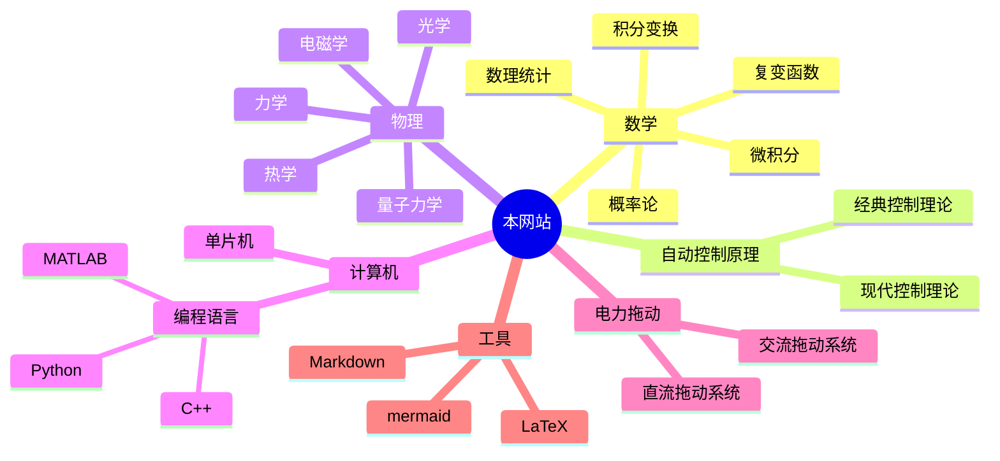

---
{"dg-publish":true,"dg-home":true,"dg-pinned":true,"permalink":"/HOME/","pinned":true,"tags":["gardenEntry"],"dgPassFrontmatter":true,"noteIcon":"","created":"2024-05-21T15:20:27.767+08:00","updated":"2024-06-16T23:07:27.664+08:00"}
---

### 序言

>“方存乎见少，又奚以自多！”——《[[秋水\|秋水]]》· 庄周
#### 为什么会有这个网站?
>这个网站的由来**纯粹是一个巧合**
>正如你看到这段话是一个巧合一样

其实也不能完全说是一种巧合，更多的是源于一种**兴致的上升**，一种想要**传播基础知识的念头**，一个致力于**构建知识体系、惠及他人的想法**。

#### 如何使用该网站？
>[!important]- 如何使用这个网站
[[该网站的基本使用\|该网站的基本使用]]

如果其中的内容对你有帮助，你可以为本网站[开源的项目](https://github.com/UNLINEARITY/Learn-for-Everything) 点一颗⭐star
如果你有疑问，可以随时联系我，或者直接在评论区发布评论
### 章节导航

>“一切高级数学，归根结底都是微积分和线性代数的各种变化”
>——丘成桐

#### 较为完善
[[概率论\|概率论]]
[[数理统计\|数理统计]]
[[复变函数与积分变换\|复变函数与积分变换]]
[[自动控制原理\|自动控制原理]]
[[技术经济与工程管理\|技术经济与工程管理]]
#### 即将完善
[[线性代数\|线性代数]]
[[微积分\|微积分]]
[[电机及电力拖动\|电机及电力拖动]]
[[51 单片机\|微机原理及其应用]]
[[数字电路\|数字电路]]
[[模拟电路\|模拟电路]]
[[物理\|物理]]
[[计算机\|计算机]]
[[数学建模\|数学建模]]
### 关于该网站的更多信息
[本网站库的地址](https://github.com/UNLINEARITY/Learn-for-Everything)
[[网站的构建历程\|网站的构建历程]]
[[加入到网站的建设中\|加入到网站的建设中]]
[[支持本网站\|支持本网站]]
[[Unlinearity\|Unlinearity]]

