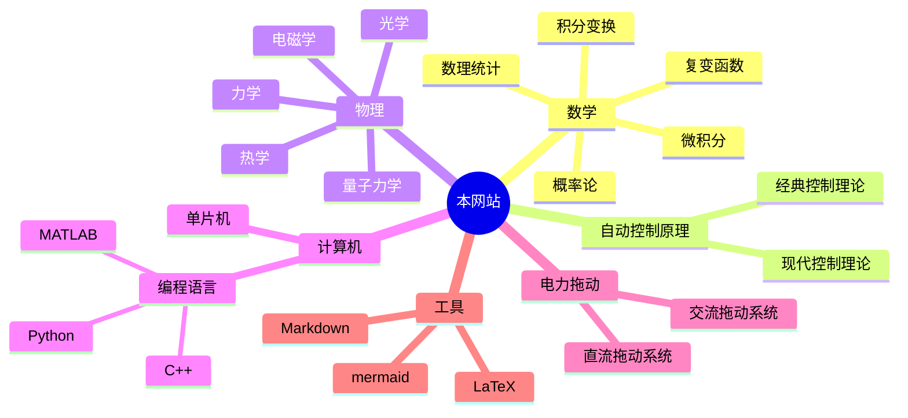

---
{"dg-publish":true,"dg-home":true,"dg-pinned":true,"permalink":"/HOME/","pinned":true,"tags":["gardenEntry"],"dgPassFrontmatter":true,"noteIcon":"","created":"2024-05-21T15:20:27.767+08:00","updated":"2024-07-08T00:26:43.923+08:00"}
---

<svg xmlns="http://www.w3.org/2000/svg" version="1.1" viewBox="0 0 601.7389093589961 274.9934933278376" width="601.7389093589961" height="274.9934933278376">  <!-- svg-source:excalidraw -->    <defs>          </defs>  <rect x="0" y="0" width="601.7389093589961" height="274.9934933278376" fill="#ffffff"></rect><g stroke-linecap="round"><g transform="translate(286.21860943459797 70.23585531224396) rotate(0 -33.62216314897 47.9576307234056)"><path d="M-0.55 0.5 C-11.56 16.24, -54.87 79.58, -66.08 95.33 M1.36 -0.28 C-9.7 15.54, -54.7 80.54, -66.41 96.56" stroke="#1e1e1e" stroke-width="4" fill="none"></path></g></g><mask></mask><g stroke-linecap="round" transform="translate(10 44.14912282401963) rotate(0 278.8699565250985 95.08026765194813)"><path d="M32 0 C157.12 -2.36, 282.42 -1.78, 525.74 0 M32 0 C213.7 -1, 396.18 -1.64, 525.74 0 M525.74 0 C547.33 -0.05, 556.38 12.38, 557.74 32 M525.74 0 C547.98 0.1, 557.36 11.61, 557.74 32 M557.74 32 C558.07 72.41, 557.23 113.93, 557.74 158.16 M557.74 32 C558.86 71.37, 559.36 108.08, 557.74 158.16 M557.74 158.16 C557.48 178.02, 546.09 191.96, 525.74 190.16 M557.74 158.16 C559.09 177.7, 547.79 189.18, 525.74 190.16 M525.74 190.16 C338.62 190.46, 152.11 191.45, 32 190.16 M525.74 190.16 C414.61 191.04, 303.74 191.36, 32 190.16 M32 190.16 C10.68 188.42, 0.48 180.08, 0 158.16 M32 190.16 C12.59 192.18, 0.02 181.64, 0 158.16 M0 158.16 C1.49 112.08, -1.83 65.88, 0 32 M0 158.16 C1.66 109.79, 1.51 63.58, 0 32 M0 32 C-0.53 11.32, 11.09 1.72, 32 0 M0 32 C-1.3 9.12, 10.45 -0.68, 32 0" stroke="#1e1e1e" stroke-width="2" fill="none"></path></g><g stroke-linecap="round"><g transform="translate(378.38321163741944 111.89835067508702) rotate(0 -33.62216314897 47.9576307234056)"><path d="M-0.58 -0.89 C-11.93 15.33, -55.95 80.47, -66.97 96.74 M1.32 1.25 C-10.27 17.19, -56.36 79.46, -67.77 95.05" stroke="#1e1e1e" stroke-width="4" fill="none"></path></g></g><mask></mask><g stroke-linecap="round"><g transform="translate(218.97513336059615 169.3950928330208) rotate(0 44.29700432819482 0)"><path d="M0.28 0.82 C15.23 1.1, 74.54 0.76, 89.16 0.76 M-1.04 0.21 C13.86 0.22, 73.86 -0.75, 88.5 -0.96" stroke="#1e1e1e" stroke-width="4" fill="none"></path></g></g><mask></mask><g stroke-linecap="round"><g transform="translate(380.8403102368359 112.00400165289855) rotate(0 -48.893861968532065 0)"><path d="M0.56 0.76 C-15.89 0.76, -82.2 1.12, -98.43 0.82 M-0.6 0.11 C-16.68 -0.29, -79.98 -0.81, -96.05 -0.87" stroke="#1e1e1e" stroke-width="4" fill="none"></path></g></g><mask></mask><g stroke-linecap="round" transform="translate(285.41180178023114 126.69842043348183) rotate(0 13.771567908306906 15.405035477593003)"><path d="M16.63 0 C19.55 0.48, 23.24 3.48, 25.06 6.13 C26.88 8.77, 27.7 12.59, 27.56 15.87 C27.42 19.15, 26.15 23.3, 24.21 25.81 C22.26 28.32, 18.83 30.48, 15.87 30.93 C12.91 31.39, 9 30.26, 6.43 28.53 C3.85 26.81, 1.32 23.67, 0.42 20.57 C-0.48 17.47, -0.11 13.05, 1.03 9.95 C2.17 6.84, 4.5 3.47, 7.28 1.96 C10.05 0.45, 16.01 1.07, 17.68 0.9 C19.35 0.72, 17.5 0.76, 17.3 0.9 M17.08 0.07 C19.87 0.61, 23.53 3.09, 25.34 5.75 C27.15 8.41, 28.3 12.64, 27.93 16.04 C27.56 19.45, 25.19 23.83, 23.14 26.17 C21.1 28.52, 18.58 29.7, 15.66 30.12 C12.75 30.55, 8.25 30.51, 5.65 28.75 C3.04 26.98, 0.9 22.73, 0.03 19.54 C-0.84 16.35, -0.82 12.69, 0.42 9.61 C1.67 6.52, 4.73 2.54, 7.5 1.04 C10.27 -0.46, 15.37 0.56, 17.02 0.61 C18.67 0.66, 17.49 1.02, 17.41 1.35" stroke="#1e1e1e" stroke-width="4" fill="none"></path></g><g stroke-linecap="round"><g transform="translate(221.162933373157 60.95221322086397) rotate(0 -27.97806373511804 48.40211995720438)"><path d="M1.01 -1.04 C-8.19 14.95, -46.17 80.3, -55.8 96.78 M0.08 1.03 C-9.2 17.15, -47.61 82.47, -56.67 98.3" stroke="#1e1e1e" stroke-width="4" fill="none"></path></g></g><mask></mask><g stroke-linecap="round"><g transform="translate(141.09733149340116 184.45147523181075) rotate(0 43.18264130932755 14.62635436745483)"><path d="M0.15 -0.03 C14.24 5.19, 71.1 25.39, 85.55 30.28 M-1.22 -1.09 C13.16 3.91, 73.25 23.41, 87.84 28.7" stroke="#1e1e1e" stroke-width="4" fill="none"></path></g></g><mask></mask><g stroke-linecap="round"><g transform="translate(335.00783884925204 24.108873424034584) rotate(0 39.80562827659196 23.964158218818426)"><path d="M-0.81 1.03 C12.51 9.03, 66.71 40.08, 80.09 47.98 M0.96 0.52 C14.15 8.73, 66.46 41.91, 79.39 49.55" stroke="#1e1e1e" stroke-width="4" fill="none"></path></g></g><mask></mask><g stroke-linecap="round"><g transform="translate(423.6609316362949 167.64110842543377) rotate(0 -32.948046723682864 48.430079692721904)"><path d="M0.47 0.05 C-10.41 16.11, -55.07 81.14, -66.09 97.35 M-0.74 -0.96 C-11.72 15.25, -56.21 79.46, -67.14 95.49" stroke="#1e1e1e" stroke-width="4" fill="none"></path></g></g><mask></mask><g stroke-linecap="round"><g transform="translate(204.53576469237646 152.39058848318479) rotate(0 32.91034221426787 -50.406011883782384)"><path d="M-1.15 0.46 C9.76 -16.46, 55.13 -84.95, 66.12 -101.72 M0.44 -0.35 C11.17 -17.12, 54.21 -83.69, 65.33 -100.66" stroke="#1e1e1e" stroke-width="4" fill="none"></path></g></g><mask></mask><g stroke-linecap="round"><g transform="translate(195.76244446269845 186.84655935530364) rotate(0 44.50952764695393 0.7924613959293367)"><path d="M0.3 -0.91 C15.15 -0.61, 73.35 1.93, 87.98 2.23 M-1.01 1.23 C14.31 1.14, 74.9 0.34, 90.15 0.45" stroke="#1e1e1e" stroke-width="4" fill="none"></path></g></g><mask></mask><g stroke-linecap="round"><g transform="translate(308.148072937576 96.76101937501093) rotate(0 47.54728327209989 0.6603714373579948)"><path d="M-1.03 0.65 C14.61 0.92, 78.32 0.52, 94.17 0.68 M0.62 -0.05 C16.61 0.44, 80.44 1.36, 96.4 1.89" stroke="#1e1e1e" stroke-width="4" fill="none"></path></g></g><mask></mask><g stroke-linecap="round"><g transform="translate(396.5831784732932 131.53374486886577) rotate(0 -34.868005411228864 48.86804355914893)"><path d="M-0.93 -0.64 C-12.55 15.59, -59.33 81.82, -70.8 98.04 M0.79 1.64 C-10.39 17.44, -56.76 80.11, -68.64 96.08" stroke="#1e1e1e" stroke-width="4" fill="none"></path></g></g><mask></mask><g stroke-linecap="round"><g transform="translate(183.32974866025347 234.5510420508951) rotate(0 53.45572720190262 8.323560273256504)"><path d="M-0.81 0.36 C16.97 2.96, 88.01 12.81, 106.09 15.58 M0.97 -0.49 C19.18 2.21, 90.65 14, 108.36 16.56" stroke="#1e1e1e" stroke-width="4" fill="none"></path></g></g><mask></mask><g stroke-linecap="round"><g transform="translate(199.23703999243378 30.716437272236362) rotate(0 -35.698814063053874 32.55435091514718)"><path d="M-0.3 0.89 C-12.15 11.42, -59.13 53.72, -70.84 64.29 M1.74 0.32 C-10.23 11.49, -59.39 54.58, -71.49 65.4" stroke="#1e1e1e" stroke-width="4" fill="none"></path></g></g><mask></mask><g stroke-linecap="round"><g transform="translate(454.49275018826165 73.6289580526645) rotate(0 30.334729152347677 29.96480235247229)"><path d="M-1.08 0.48 C8.76 10.26, 49.51 49.35, 59.95 59.27 M0.55 -0.32 C10.7 9.57, 52.17 50.18, 62.29 60.46" stroke="#1e1e1e" stroke-width="4" fill="none"></path></g></g><mask></mask><g stroke-linecap="round"><g transform="translate(514.7922816930816 169.07241342072524) rotate(0 -32.184436307980945 43.28249635114082)"><path d="M-0.32 -0.66 C-11.01 13.94, -54.12 72.9, -64.68 87.62 M1.71 1.61 C-9.12 15.89, -54.83 72, -65.79 86.06" stroke="#1e1e1e" stroke-width="4" fill="none"></path></g></g><mask></mask><g stroke-linecap="round"><g transform="translate(452.2731406181715 119.87092976635574) rotate(0 3.884328940367027 39.028240610898365)"><path d="M0.77 -0.13 C1.95 13.12, 6.64 65.41, 7.67 78.3 M-0.29 -1.24 C0.68 11.73, 5.05 63.08, 6.68 76.31" stroke="#1e1e1e" stroke-width="4" fill="none"></path></g></g><mask></mask><g stroke-linecap="round"><g transform="translate(66.43005119104248 107.66305274544152) rotate(0 -12.022913620976453 41.617776980863965)"><path d="M0.61 1.02 C-3.6 14.62, -20.4 68.73, -24.56 82.32 M-0.53 0.51 C-5 14.17, -21.65 69.54, -25.78 83.38" stroke="#1e1e1e" stroke-width="4" fill="none"></path></g></g><mask></mask><g stroke-linecap="round"><g transform="translate(112.30209610485826 18.138609066028096) rotate(0 -18.681778909374714 60.11457420123695)"><path d="M-0.66 -0.34 C-6.88 19.78, -32.07 100.45, -38.33 120.7 M1.19 -1.56 C-4.57 18.19, -29.96 98.68, -36.12 118.82" stroke="#1e1e1e" stroke-width="4" fill="none"></path></g></g><mask></mask><g stroke-linecap="round"><g transform="translate(66.06012439116705 198.2973134026094) rotate(0 38.658289425604266 22.93603464961714)"><path d="M-0.22 0.5 C12.67 8.26, 64.73 39.24, 77.66 46.76 M-1.8 -0.29 C10.94 7.13, 63.82 37.26, 76.89 45.11" stroke="#1e1e1e" stroke-width="4" fill="none"></path></g></g><mask></mask><g stroke-linecap="round"><g transform="translate(504.06420941334363 25.907218175924868) rotate(0 22.566095657032292 33.294222803962086)"><path d="M1.13 0.26 C8.61 11.43, 37.99 55.2, 45.39 66.19 M0.27 -0.64 C7.56 10.77, 37.13 56.19, 44.58 67.51" stroke="#1e1e1e" stroke-width="4" fill="none"></path></g></g><mask></mask><g stroke-linecap="round"><g transform="translate(252.87771840156506 119.13107616660474) rotate(0 -77.31660323662715 -12.022919717331106)"><path d="M0 0 C-10.89 4.17, -21.05 5.29, -34.77 9.62 M0 0 C-10.87 3.33, -20.48 5.78, -34.77 9.62 M-34.77 9.62 C-34.45 17.15, -30.71 22.72, -26.27 33.29 M-34.77 9.62 C-31.74 16.76, -29.06 23.85, -26.27 33.29 M-26.27 33.29 C-42.18 42.68, -57.78 51.43, -90.26 69.18 M-26.27 33.29 C-41.9 42.09, -55.22 48.87, -90.26 69.18 M-90.26 69.18 C-111.57 35.13, -134.87 -0.04, -154.63 -40.32 M-90.26 69.18 C-105.4 42.66, -121.97 15.14, -154.63 -40.32 M-154.63 -40.32 C-137.69 -44.11, -121.56 -44.7, -99.51 -51.05 M-154.63 -40.32 C-141.88 -43.47, -126.93 -45.86, -99.51 -51.05 M-99.51 -51.05 C-98.89 -66.83, -92.5 -81.28, -92.11 -93.22 M-99.51 -51.05 C-97.5 -60.81, -95.15 -72.73, -92.11 -93.22" stroke="#e03131" stroke-width="0.5" fill="none"></path></g></g><mask></mask><g stroke-linecap="round"><g transform="translate(258.42671794137186 172.0319009759849) rotate(0 95.8134065533547 -4.254280125661069)"><path d="M0 0 C4.72 5.89, 7.28 8.71, 12.58 15.54 M0 0 C2.97 4.69, 7.72 8.17, 12.58 15.54 M12.58 15.54 C19.14 9.2, 23.71 0.81, 28.12 -2.22 M12.58 15.54 C18.75 7.72, 25.32 1.92, 28.12 -2.22 M28.12 -2.22 C39.1 5.81, 48.72 12.14, 58.82 19.98 M28.12 -2.22 C39.37 6, 52.28 16.33, 58.82 19.98 M58.82 19.98 C24.83 21.06, -7.16 24.73, -45.5 31.81 M58.82 19.98 C36.73 23.11, 15.62 25.01, -45.5 31.81 M-45.5 31.81 C-45.87 28.04, -47.12 21.87, -46.98 16.65 M-45.5 31.81 C-46.66 26.6, -47.16 22.85, -46.98 16.65 M-46.98 16.65 C-26.94 32.17, -8.71 48.29, 21.83 76.58 M-46.98 16.65 C-24.88 35.82, -4.58 52.39, 21.83 76.58 M21.83 76.58 C46.68 53.62, 69.21 32.9, 99.88 5.92 M21.83 76.58 C52.74 48.57, 82.32 21.63, 99.88 5.92 M99.88 5.92 C99.03 -5.06, 97.19 -14.07, 96.92 -25.16 M99.88 5.92 C99.42 -4.8, 98.36 -14.25, 96.92 -25.16 M96.92 -25.16 C105.74 -24.53, 115.04 -25.5, 128 -29.59 M96.92 -25.16 C106.08 -25.41, 115.52 -27.41, 128 -29.59 M128 -29.59 C124.59 -36.56, 124.53 -41.22, 119.12 -51.05 M128 -29.59 C124.26 -35.46, 121.65 -43.22, 119.12 -51.05 M119.12 -51.05 C138.71 -58.36, 158.63 -66.91, 207.9 -85.09 M119.12 -51.05 C141.79 -59.5, 165.5 -68.72, 207.9 -85.09 M207.9 -85.09 C219.52 -44.2, 229.95 -8.81, 238.61 16.28 M207.9 -85.09 C217.05 -59.76, 223.55 -32.59, 238.61 16.28 M238.61 16.28 C214.23 34.27, 193.31 52.17, 163.14 74.73 M238.61 16.28 C211.03 37.79, 182.67 59.58, 163.14 74.73" stroke="#ffc9c9" stroke-width="0.5" fill="none"></path></g></g><mask></mask><g stroke-linecap="round"><g transform="translate(293.9405686044879 108.77285753048659) rotate(0 79.90613960659277 30.149790137828603)"><path d="M0 0 C13.71 -23.88, 24.75 -44.32, 44.02 -77.69 M0 0 C10.04 -15.44, 18.37 -32.25, 44.02 -77.69 M44.02 -77.69 C49.78 -65.63, 61.02 -48.65, 78.8 -12.95 M44.02 -77.69 C51.91 -61.8, 61.05 -47.73, 78.8 -12.95 M78.8 -12.95 C98.56 -17.39, 121.81 -21.27, 159.81 -28.85 M78.8 -12.95 C102.83 -16.57, 127.01 -23.09, 159.81 -28.85 M159.81 -28.85 C143.22 4.06, 130.17 38.35, 122.08 64 M159.81 -28.85 C145.56 6.92, 129.63 44.32, 122.08 64 M122.08 64 C105.4 66.05, 91.32 68.24, 75.1 71.03 M122.08 64 C107.62 66.73, 95.5 67.67, 75.1 71.03 M75.1 71.03 C72.66 95.61, 73.16 122.41, 73.25 137.99 M75.1 71.03 C73.94 91.77, 74.12 109.73, 73.25 137.99" stroke="#fa5252" stroke-width="0.5" fill="none"></path></g></g><mask></mask><g stroke-linecap="round"><g transform="translate(178.8905295200732 126.52978286204467) rotate(0 146.1246462219321 39.02824061089835)"><path d="M0 0 C-46.53 8.8, -94.57 18.39, -120.6 25.16 M0 0 C-36.49 7.44, -73.61 15.45, -120.6 25.16 M-120.6 25.16 C-108.01 43.5, -96.68 62.81, -74.73 96.55 M-120.6 25.16 C-104.95 50.87, -88.61 74.87, -74.73 96.55 M-74.73 96.55 C-49.71 89.59, -23.78 78.18, 5.18 71.4 M-74.73 96.55 C-45.95 87.21, -17.26 77.71, 5.18 71.4 M5.18 71.4 C9.21 77.72, 14.04 87.95, 25.53 109.13 M5.18 71.4 C13.07 86.18, 21.45 100.42, 25.53 109.13 M25.53 109.13 C69.62 102.83, 110.94 93.01, 158.7 83.24 M25.53 109.13 C53.19 105.68, 80.68 99.09, 158.7 83.24 M158.7 83.24 C165.49 63.79, 169.54 48.45, 180.9 11.1 M158.7 83.24 C166.37 55.28, 176.96 25.93, 180.9 11.1 M180.9 11.1 C221.68 -4.17, 259.44 -18.54, 292.99 -31.07 M180.9 11.1 C214.43 -1.1, 248.4 -14.42, 292.99 -31.07 M292.99 -31.07 C306.39 -10.61, 319.48 12.32, 337.38 45.5 M292.99 -31.07 C306.68 -6.31, 322.06 18.89, 337.38 45.5 M337.38 45.5 C353.25 44.84, 370.01 42.03, 412.85 34.4 M337.38 45.5 C359.75 41.11, 382.29 37.92, 412.85 34.4" stroke="#e77d04" stroke-width="0.5" fill="none"></path></g></g><mask></mask><g stroke-linecap="round"><g transform="translate(525.520451514494 54.76222793606138) rotate(0 -68.99305515607989 9.433371154656214)"><path d="M0 0 C-7.59 20.36, -14.4 42.29, -19.98 63.63 M0 0 C-3.87 14.21, -7.84 27.18, -19.98 63.63 M-19.98 63.63 C-16.51 36.12, -10.17 7.4, -7.03 -13.32 M-19.98 63.63 C-15.76 34.46, -11.17 6.39, -7.03 -13.32 M-7.03 -13.32 C-14.18 2.19, -19.98 14.29, -33.29 49.2 M-7.03 -13.32 C-15.42 6.43, -24.26 24.81, -33.29 49.2 M-33.29 49.2 C-27.83 30.47, -21.36 9.88, -13.32 -24.05 M-33.29 49.2 C-27.98 30.56, -22.55 11.43, -13.32 -24.05 M-13.32 -24.05 C-39.51 -18.59, -64.58 -15.18, -136.14 2.59 M-13.32 -24.05 C-58.62 -15.33, -101.95 -4.28, -136.14 2.59 M-136.14 2.59 C-138.02 -16.19, -137.05 -33.87, -137.99 -44.76 M-136.14 2.59 C-137.17 -8.45, -136.8 -18.45, -137.99 -44.76" stroke="#f7ef18" stroke-width="0.5" fill="none"></path></g></g><mask></mask></svg>
### 一、序言
>“方存乎见少，又奚以自多！”——《[[秋水\|秋水]]》· 庄周

#### 为什么会有这个网站?
>这个网站的由来**纯粹是一个巧合**
>正如你看到这段话是一个巧合一样

其实也不能完全说是一种巧合，更多的是源于一种**兴致的上升**，一种想要**传播基础知识的念头**，一个致力于**构建知识体系、惠及他人的想法**。

#### 如何使用该网站？
>[!important]- 如何使用这个网站
[[该网站的基本使用\|该网站的基本使用]]

如果其中的内容对你有帮助，你可以为本网站[开源的项目](https://github.com/UNLINEARITY/Learn-for-Everything) 点一颗⭐star
如果你有疑问，可以随时联系我，或者直接在评论区发布评论

### 二、章节导航

>“一切高级数学，归根结底都是**微积分**和**线性代数**的各种变化”
>——丘成桐

#### 1. 较为完善
[[自动控制原理\|自动控制原理]]  
[[概率论\|概率论]]
[[数理统计\|数理统计]]
[[复变函数与积分变换\|复变函数与积分变换]]
[[技术经济与工程管理\|技术经济与工程管理]]
[[电机及电力拖动\|电机及电力拖动]]
[[51 单片机\|微机原理及其应用]]   8051 基础
#### 2. 即将完善
[[微积分\|微积分]]
[[线性代数\|线性代数]]
#### 3. 之后完善

[[数字电路\|数字电路]]
[[模拟电路\|模拟电路]]
[[物理\|物理]]
[[计算机\|计算机]]
[[数学建模\|数学建模]]

### 三、关于该网站的更多信息
[本网站库的地址](https://github.com/UNLINEARITY/Learn-for-Everything)
[[网站的构建历程\|网站的构建历程]]
[[加入到网站的建设中\|加入到网站的建设中]]
[[支持本网站\|支持本网站]]
[[Unlinearity\|Unlinearity]]

