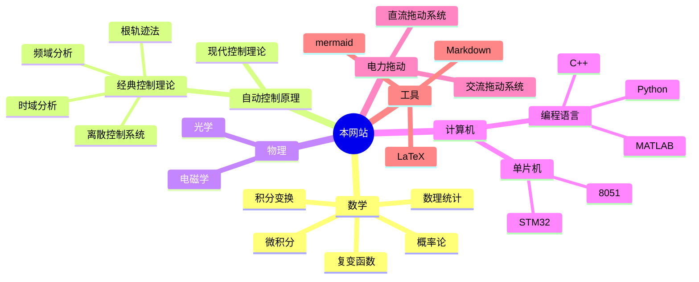

---
{"dg-publish":true,"dg-home":true,"dg-pinned":true,"permalink":"/HOME/","pinned":true,"tags":["gardenEntry"],"dgPassFrontmatter":true,"noteIcon":"","created":"2024-05-21T15:20:27.767+08:00","updated":"2024-08-25T19:05:37.886+08:00"}
---

>“方存乎见少，又奚以自多！”——《[[秋水\|秋水]]》· 庄周
>"How can one be self-important when they have seen so little?"--"Autumn Floods," Zhuang Zhou

### 一、该网站的核心思想
本网站的由来其实也不能完全说是一种巧合，更多的是源于一种兴致的上升，
一种想要传播基础知识的念头，一个致力于构建知识体系、惠及他人的想法。

本网站的内容将包括基础的数理知识，然后在此基础上深化，期望通过构建**基础知识的网络**，不断地将看似 “毫无用处而枯燥”的数学知识与**特定领域**或**现实世界**结合起来。

>[!important] 注意
> 目前上传的文件可见：[[网站内容索引\|网站内容索引]]，也可展开左侧文件树看所有的文件
> 如果第一次接触此类型的网站，见[[该网站的基本使用\|该网站的基本使用]]

### 二、目录导航
>“一切高级数学，归根结底都是**微积分**和**线性代数**的各种变化”
>——丘成桐
#### 1. 较为完善
[[自动控制原理\|自动控制原理]]  
[[概率论\|概率论]]
[[数理统计\|数理统计]]
[[复变函数论\|复变函数论]]
[[电机及电力拖动\|电机及电力拖动]]
[[51 单片机\|51 单片机]]（基础部分）
[[技术经济与工程管理\|技术经济与工程管理]]

#### 2 . 即将完善
[[变换\|变换]]
[[微积分\|微积分]]
[[线性代数\|线性代数]]
[[数字电路\|数字电路]]
[[物理\|物理]]
[[STM32\|STM32]]（基础部分）

### 关于网站
有关网站的其他信息查看[[关于该网站\|关于该网站]]
如果其中的内容对你有帮助，你可以为本网站[开源的项目](https://github.com/UNLINEARITY/Learn-for-Everything) 点一颗⭐star

I'm grateful to **Obsidian** and the open-source plugin **Digital Garden**, which have enabled my knowledge network to be presented to the public.

