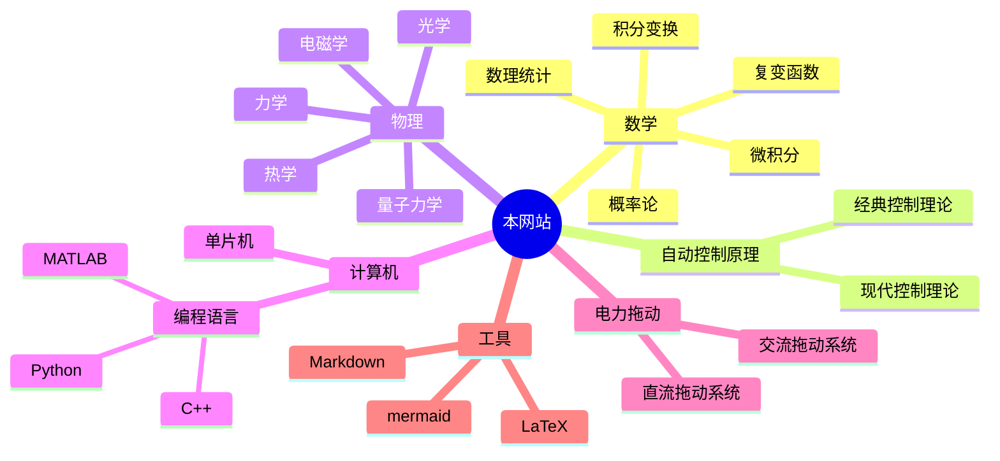

---
{"dg-publish":true,"dg-home":true,"dg-pinned":true,"permalink":"/HOME/","pinned":true,"tags":["gardenEntry"],"dgPassFrontmatter":true,"noteIcon":"","created":"2024-04-16T13:01:27.501+08:00","updated":"2024-05-11T16:06:57.870+08:00"}
---

<!-- Baidu Site Verification -->
<meta name="baidu-site-verification" content="codeva-9KnD0U41iT" />
<!-- MS Validate Site Verification -->
<meta name="msvalidate.01" content="E37F6D89C39A53DA30623F60A0822598" />
<!-- End Site Verifications -->

### 序言
>“方存乎见少，又奚以自多！”——《[[秋水\|秋水]]》· 庄周
#### 为什么会有这个网站?
>这个网站的由来**纯粹是一个巧合**
>正如你看到这段话是一个巧合一样

个人认为**双向链接**和**关系图谱**的思想很有助于学习和思想的，~~而在网络上，类似像这样的网站少之又少~~，于是在 2024-04-16 受到 [[Digital Garden\|Digital Garden]] 思想的启发
决定将自己的积累贡献出来，致力于构建一个以**数学知识为根基**的体系或知识库

而经过一段时间的部署，从 Github Pages 到 Vercel，从文件的基础推送到评论功能的增加、网站域名的解析、mermaid的渲染...... 我逐渐意识到：以这套工作流构建的网站很多，但似乎像我这样的工作还是很少

但实际上，目前的局面还是很尴尬的
我还是不喜欢一般博客的线性化结构，
我喜欢**非线性**的发散思维，喜欢上了 Obsidian 呈现的关系图谱，也喜欢 Latex 公式的书写

也许现在的工作还是太过于基础了，体量还是不够大，但是我还是想要以这种方式呈现些什么，给他人带来些什么，可能还是会继续完善下去

如果其中的内容对你有帮助，你可以为本网站[开源的项目](https://github.com/UNLINEARITY/Learn-for-Everything) 点一颗⭐star
如果你有疑问，可以随时联系我，或者直接在评论区发布评论

#### 如何使用该网站？
>[!important]- 如何使用这个网站
[[该网站的基本使用\|该网站的基本使用]]

### 章节导航

- [x] 自动化
	- [x] [[自动控制原理\|自动控制原理]]
	- [x] [[电机及电力拖动\|电机及电力拖动]]
	- [x] [[51 单片机\|微机原理及其应用]]
	- [ ] [[数字电路\|数字电路]]
	- [ ] 模拟电路
- [x] [[数学\|数学]]
- [x] [[物理\|物理]]
- [x] [[计算机\|计算机]]
- [x] [[数学建模\|数学建模]]
- [x] [[知识管理\|知识管理]]
- [x] [[技术经济与工程管理\|技术经济与工程管理]]

### 关于该网站的更多信息
[本网站库的地址](https://github.com/UNLINEARITY/Learn-for-Everything)
[[网站的构建历程\|网站的构建历程]]
[[加入到网站的建设中\|加入到网站的建设中]]
[[支持本网站\|支持本网站]]
[[Unlinearity\|Unlinearity]]

