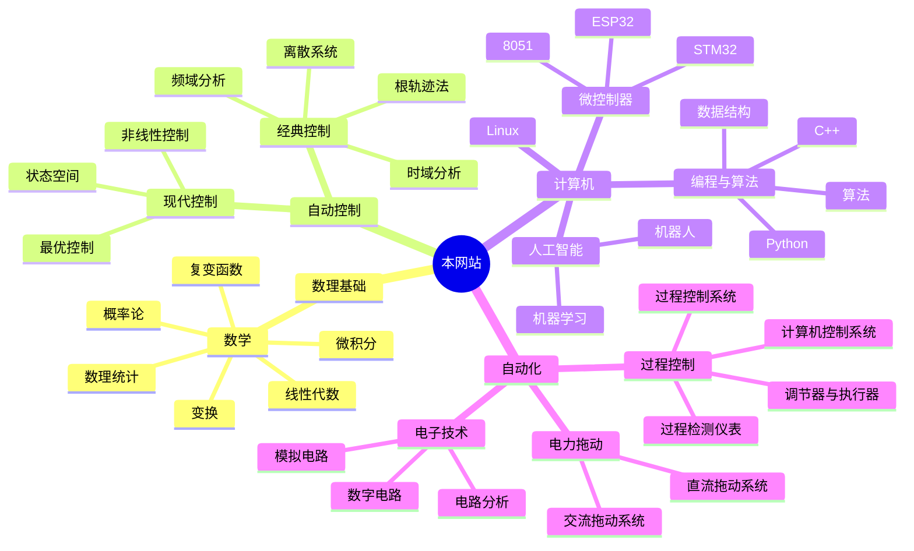

---
{"dg-publish":true,"dg-home":true,"dg-pinned":true,"dg-path":"Nonlinear.md","permalink":"/Nonlinear/","pinned":true,"tags":["gardenEntry"],"dgPassFrontmatter":true,"noteIcon":"","created":"2024-05-21T15:20:27.000+08:00","updated":"2025-04-19T15:56:38.938+08:00"}
---

>“方存乎见少，又奚以自多！”——《[[秋水\|秋水]]》· 庄周
>"How can one be self-important when they have seen so little?"--"Autumn Floods," Zhuang Zhou

> 指穷于为薪，火传也，不知其尽也。

***
### 一、该网站的核心思想 
本网站的由来其实也不能完全说是一种巧合，更多的是源于一种兴致的上升，
一种想要传播基础知识的念头，一个致力于构建知识体系、惠及他人的想法。

本网站的内容将包括基础的数理知识，然后在此基础上深化，期望通过构建**基础知识的网络**，不断地将看似 “毫无用处而枯燥”的数学知识与**特定领域**或**现实世界**结合起来。

### 二、目录导航
>“一切高级数学，归根结底都是**微积分**和**线性代数**的各种变化”     ——丘成桐

>**通信**的目的是传递消息，话音、文字、图像、视频等都是消息
>**数据**是运送消息的实体，通常是使用特定方式表示的有意义的符号序列
> **信号**则是数据的电气或电磁表现形式

目前上传的总文件一览：[[网站内容索引-Index\|网站内容索引-Index]] （注意目前的内容偏向自动化：整体性系统性的东西，计算机相关的还较为基础）

|                      | **较为完善**                                                                                          | **即将完善**                                                                                         |
| :------------------- | ------------------------------------------------------------------------------------------------- | ------------------------------------------------------------------------------------------------ |
| **数理基础**             | [[概率论\|概率论]]  [[数理统计\|数理统计]]  [[复变函数论\|复变函数论]]  [[变换\|变换]]                                            | [[微积分\|微积分]]  [[线性代数\|线性代数]]  [[物理\|物理]]                                                            |
| **专业知识**    | [[自动控制原理\|自动控制原理]]  [[电机及电力拖动\|电机及电力拖动]]  [[51 单片机\|51 单片机]]  [[调节器与执行器\|调节器与执行器]]  [[检测仪表\|检测仪表]]  [[PLC\|PLC]] | [[数字电路\|数字电路]]  [[STM32\|STM32]]  [[计算机网络\|计算机网络]]  [[数据结构与算法\|数据结构与算法]]  [[机器学习\|机器学习]]  [[计算机控制系统\|计算机控制系统]] |
| **其他领域**             | [[技术经济与工程管理\|技术经济与工程管理]]                                                                                     |                                                                                                  |

***
### 关于网站
有关网站的相关信息查看[[关于该网站\|关于该网站]]，如果其中的内容对你有帮助，你可以为本网站[开源的项目](https://github.com/UNLINEARITY/Learn-for-Everything) 点一颗⭐star

I'm grateful to **Obsidian** and the open-source plugin **Digital Garden**, which have enabled my knowledge network to be presented to the public.

