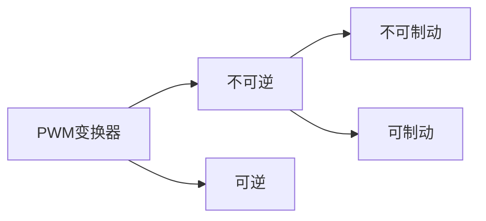

---
{"dg-publish":true,"dg-path":"A3- 电机及电力拖动/PWM调速系统.md","permalink":"/A3- 电机及电力拖动/PWM调速系统/","dgPassFrontmatter":true,"noteIcon":"","created":"2024-04-17T23:29:32.412+08:00","updated":"2025-04-14T18:38:58.854+08:00"}
---

脉宽调制变换器-直流电动机调速系统

简单单管控制：直流斩波器
逐渐发展：脉宽调制变换器
基本原理：[[PWM\|脉冲宽度调制]]

直流PWM调速系统作为一种新技术，发展迅速，应用日益广泛，
特别在中、小容量的系统中，已取代[[V-M系统\|V-M系统]]成为主要的直流调速方式

### 直流斩波器

- VT 电力电子开关器件   [[斩波器\|斩波器]]
- VD 续流二极管
	提供电流的反向路径
	在电感负载突然断电时，续流二极管允许电流继续流动，防止电流突变

***工作过程：***
- 当VT 导通时，直流电源电压 $U_{s}$ 加到电动机上
	电源电压 $U_{s}$ 在 $t_{on}$ 时间内被接上
- 当VT 关断时，直流电源与电机脱开，
	电动机电枢经 VD 续流，两端电压接近于零
	电源电压在 $T-t_{on}$ 时间内被斩断，故称“斩波”

$$\begin{align}
U_{d}= \dfrac{t_{on}}{T}U_{s}=\rho U_{s}
\end{align}$$

按照**波形面积相等**的原则，计算**平均电压**
- $T$   晶闸管开关周期
- $t_{on}$   开通时间
- $\rho$     占空比

***三种控制方式:***
1.  $t_{on}$ 改变   PWM  脉冲宽度调制
2.  $T$ 改变     PFW   脉冲频率调制
3.  $t_{on}、T$  均改变    混合调制
### PWM 变换器
[[PWM变换器\|PWM变换器]]
用PWM调制的方法，把恒定的直流电源电压调制成频率一定、宽度可变的脉冲电压系列，从而可以改变平均输出电压的大小，以调节电机转速
PWM变换器电路有多种形式，主要分为不可逆与可逆两大类

