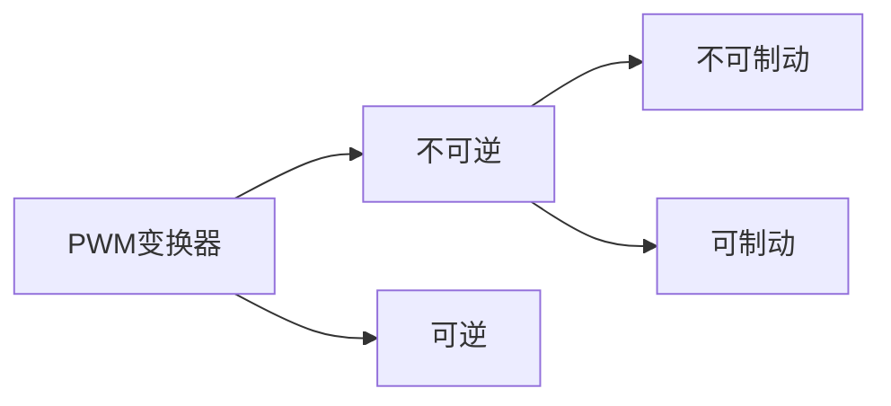

---
{"dg-publish":true,"dg-path":"电机及电力拖动/PWM调速系统.md","permalink":"/电机及电力拖动/PWM调速系统/","dgPassFrontmatter":true,"noteIcon":"","created":"2024-04-17T23:29:32.412+08:00","updated":"2024-05-12T15:27:13.271+08:00"}
---

脉宽调制变换器-直流电动机调速系统

简单单管控制：直流斩波器
逐渐发展：脉宽调制变换器

基本原理：[[PWM\|脉冲宽度调制]]
### 直流斩波器

VT 电力电子开关器件
VD 续流二极管
[[斩波器\|斩波电路]]
当VT 导通时，直流电源电压 $U_{s}$ 加到电动机上
当VT 关断时，直流电源与电机脱开，电动机电枢经 VD 续流，两端电压接近于零
电源电压 $U_{s}$ 在 $t_{on}$ 时间内被接上，又在 $T-t_{on}$ 时间内被斩断，故称“斩波”
$$\begin{align}
U_{d}= \dfrac{t_{on}}{T}U_{s}=\rho U_{s}
\end{align}$$
按照**波形面积相等**的原则，计算**平均电压**
- $T$   晶闸管开关周期
- $t_{on}$   开通时间
- $\rho$   占空比

### PWM 变换器
用PWM调制的方法，把恒定的直流电源电压调制成频率一定、宽度可变的脉冲电压系列，从而可以改变平均输出电压的大小，以调节电机转速
PWM变换器电路有多种形式，主要分为不可逆与可逆两大类

[[PWM变换器\|PWM变换器]]

### 三种控制方式
$t_{on}$ 改变
	PWM  脉冲宽度调制
$T$ 改变
	PFW   脉冲频率调制
$t_{on}、T$  均改变
	混合调制
