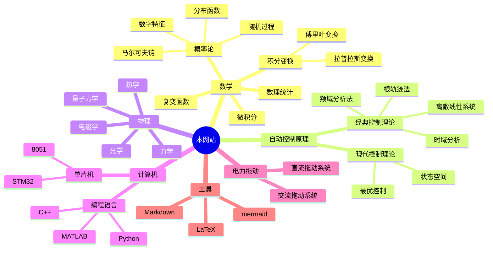

---
{"dg-publish":true,"dg-path":"test.md","permalink":"/test/","dgPassFrontmatter":true,"noteIcon":"","created":"2024-07-06T15:03:28.496+08:00","updated":"2024-08-06T13:00:23.657+08:00"}
---

| File              | tags                      |
| ----------------- | ------------------------- |
| [[特殊标签\|特殊标签]] | <ul><li>Subject</li></ul> |

{ .block-language-dataview}

| File                                  | dg-publish |
| ------------------------------------- | ---------- |
| [[180°根轨迹绘制法则\|180°根轨迹绘制法则]]       | true       |
| [[0°根轨迹绘制规则\|0°根轨迹绘制规则]]           | true       |
| [[51 单片机\|51 单片机]]                 | true       |
| [[51单片机的储存空间\|51单片机的储存空间]]         | true       |
| [[51单片机的汇编语言程序设计\|51单片机的汇编语言程序设计]] | true       |
| [[8051中断系统\|8051中断系统]]             | true       |
| [[8051模数转换\|8051模数转换]]             | true       |
| [[8051汇编指令集\|8051汇编指令集]]           | true       |
| [[AFIO\|AFIO]]                     | true       |
| [[Bode图\|Bode图]]                   | true       |
| [[C-R方程\|C-R方程]]                   | true       |
| [[C51\|C51]]                       | true       |
| [[CPU\|CPU]]                       | true       |
| [[DMA\|DMA]]                       | true       |
| [[F分布\|F分布]]                       | true       |
| [[G-M系统\|G-M系统]]                   | true       |
| [[EXTI\|EXTI]]                     | true       |
| [[GPIO\|GPIO]]                     | true       |
| [[HOME\|HOME]]                     | true       |
| [[LTI 线性时不变系统\|LTI 线性时不变系统]]       | true       |
| [[NVIC\|NVIC]]                     | true       |
| [[Nyquist图\|Nyquist图]]             | true       |
| [[n重伯努利试验\|n重伯努利试验]]               | true       |
| [[PID\|PID]]                       | true       |
| [[PWM变换器\|PWM变换器]]                 | true       |
| [[PWM调速系统\|PWM调速系统]]               | true       |
| [[STM32\|STM32]]                   | true       |
| [[STM32片上外设\|STM32片上外设]]           | true       |
| [[Test\|Test]]                     | true       |
| [[TIM\|TIM]]                       | true       |
| [[t分布\|t分布]]                       | true       |
| [[Unlinearity\|Unlinearity]]       | true       |
| [[V-M系统\|V-M系统]]                   | true       |
| [[z变换\|z变换]]                       | true       |
| [[一阶系统的时域分析\|一阶系统的时域分析]]           | true       |
| [[三角函数\|三角函数]]                     | true       |
| [[上分位点\|上分位点]]                     | true       |
| [[不确定性分析和风险分析\|不确定性分析和风险分析]]       | true       |
| [[串行通信\|串行通信]]                     | true       |
| [[中心极限定理\|中心极限定理]]                 | true       |
| [[中断\|中断]]                         | true       |
| [[事件域\|事件域]]                       | true       |
| [[事件的独立性\|事件的独立性]]                 | true       |
| [[二维分布函数\|二维分布函数]]                 | true       |
| [[二维连续概率密度\|二维连续概率密度]]             | true       |
| [[二阶系统的时域分析\|二阶系统的时域分析]]           | true       |
| [[二阶系统\|二阶系统]]                     | true       |
| [[二维离散分布律\|二维离散分布律]]               | true       |
| [[二项分布\|二项分布]]                     | true       |
| [[交流拖动控制系统\|交流拖动控制系统]]             | true       |
| [[传递函数的简化\|传递函数的简化]]               | true       |
| [[传递函数\|传递函数]]                     | true       |
| [[估计量的评选标准\|估计量的评选标准]]             | true       |
| [[伽马分布\|伽马分布]]                     | true       |
| [[信号流图\|信号流图]]                     | true       |
| [[傅里叶变换\|傅里叶变换]]                   | true       |
| [[傅里叶级数\|傅里叶级数]]                   | true       |
| [[假设检验的思想\|假设检验的思想]]               | true       |
| [[储存逻辑电路\|储存逻辑电路]]                 | true       |
| [[克拉默法则\|克拉默法则]]                   | true       |
| [[关于该网站\|关于该网站]]                   | true       |
| [[内部定时计数器\|内部定时计数器]]               | true       |
| [[冲激函数\|冲激函数]]                     | true       |
| [[几何分布\|几何分布]]                     | true       |
| [[分布函数\|分布函数]]                     | true       |
| [[切比雪夫不等式\|切比雪夫不等式]]               | true       |
| [[初等函数\|初等函数]]                     | true       |
| [[利润\|利润]]                         | true       |
| [[加入到网站的建设中\|加入到网站的建设中]]           | true       |
| [[区域\|区域]]                         | true       |
| [[区间估计\|区间估计]]                     | true       |
| [[单片机接口技术\|单片机接口技术]]               | true       |
| [[协方差\|协方差]]                       | true       |
| [[协方差矩阵\|协方差矩阵]]                   | true       |
| [[卡方分布\|卡方分布]]                     | true       |
| [[双曲函数\|双曲函数]]                     | true       |
| [[反馈\|反馈]]                         | true       |
| [[变上限积分定理\|变上限积分定理]]               | true       |
| [[古典概型\|古典概型]]                     | true       |
| [[变换\|变换]]                         | true       |
| [[场\|场]]                           | true       |
| [[均匀分布\|均匀分布]]                     | true       |
| [[复利\|复利]]                         | true       |
| [[复变函数\|复变函数]]                     | true       |
| [[复变函数基础\|复变函数基础]]                 | true       |
| [[复变函数项级数\|复变函数项级数]]               | true       |
| [[复合闭路定理\|复合闭路定理]]                 | true       |
| [[复数\|复数]]                         | true       |
| [[复数项级数\|复数项级数]]                   | true       |
| [[复积分\|复积分]]                       | true       |
| [[多维正态分布\|多维正态分布]]                 | true       |
| [[多维随机变量\|多维随机变量]]                 | true       |
| [[多维随机变量函数的分布\|多维随机变量函数的分布]]       | true       |
| [[大数定律\|大数定律]]                     | true       |
| [[奇点\|奇点]]                         | true       |
| [[孤立奇点\|孤立奇点]]                     | true       |
| [[对数函数\|对数函数]]                     | true       |
| [[寻址方式\|寻址方式]]                     | true       |
| [[寄存器\|寄存器]]                       | true       |
| [[导数\|导数]]                         | true       |
| [[幂函数\|幂函数]]                       | true       |
| [[幂级数\|幂级数]]                       | true       |
| [[并行IO口\|并行IO口]]                   | true       |
| [[平面点集\|平面点集]]                     | true       |
| [[平面曲线\|平面曲线]]                     | true       |
| [[广义函数\|广义函数]]                     | true       |
| [[广义根轨迹\|广义根轨迹]]                   | true       |
| [[异步电机\|异步电机]]                     | true       |
| [[异步电机线性化动态建模\|异步电机线性化动态建模]]       | true       |
| [[开环频率特性分析性能\|开环频率特性分析性能]]         | true       |
| [[异步电机变压调速系统\|异步电机变压调速系统]]         | true       |
| [[微分方程建模\|微分方程建模]]                 | true       |
| [[微控制器\|微控制器]]                     | true       |
| [[微分方程\|微分方程]]                     | true       |
| [[微积分\|微积分]]                       | true       |
| [[总体和样本\|总体和样本]]                   | true       |
| [[成本费用\|成本费用]]                     | true       |
| [[投资\|投资]]                         | true       |
| [[技术经济与工程管理\|技术经济与工程管理]]           | true       |
| [[抽样分布\|抽样分布]]                     | true       |
| [[拉普拉斯变换\|拉普拉斯变换]]                 | true       |
| [[拉普拉斯方程\|拉普拉斯方程]]                 | true       |
| [[拓扑\|拓扑]]                         | true       |
| [[拉普拉斯逆变换\|拉普拉斯逆变换]]               | true       |
| [[指数函数\|指数函数]]                     | true       |
| [[指数分布\|指数分布]]                     | true       |
| [[控制系统的数学模型\|控制系统的数学模型]]           | true       |
| [[推挽电路\|推挽电路]]                     | true       |
| [[插值\|插值]]                         | true       |
| [[支持本网站\|支持本网站]]                   | true       |
| [[数字电路\|数字电路]]                     | true       |
| [[数理统计\|数理统计]]                     | true       |
| [[数项级数\|数项级数]]                     | true       |
| [[数模转换\|数模转换]]                     | true       |
| [[方差\|方差]]                         | true       |
| [[时序逻辑电路\|时序逻辑电路]]                 | true       |
| [[时间常数\|时间常数]]                     | true       |
| [[时间响应的性能指标\|时间响应的性能指标]]           | true       |
| [[映射\|映射]]                         | true       |
| [[曲线积分\|曲线积分]]                     | true       |
| [[曲面积分\|曲面积分]]                     | true       |
| [[期望\|期望]]                         | true       |
| [[机器学习\|机器学习]]                     | true       |
| [[机器语言\|机器语言]]                     | true       |
| [[条件概率\|条件概率]]                     | true       |
| [[极限\|极限]]                         | true       |
| [[柯西积分公式\|柯西积分公式]]                 | true       |
| [[柯西积分定理\|柯西积分定理]]                 | true       |
| [[校正环节的设计\|校正环节的设计]]               | true       |
| [[样本空间\|样本空间]]                     | true       |
| [[根轨迹法\|根轨迹法]]                     | true       |
| [[概率\|概率]]                         | true       |
| [[概率密度函数\|概率密度函数]]                 | true       |
| [[概率分布律\|概率分布律]]                   | true       |
| [[概率论\|概率论]]                       | true       |
| [[模态\|模态]]                         | true       |
| [[欧拉公式\|欧拉公式]]                     | true       |
| [[欠阻尼二阶系统动态分析\|欠阻尼二阶系统动态分析]]       | true       |
| [[正则表达式—边\|正则表达式—边]]               | true       |
| [[正项级数\|正项级数]]                     | true       |
| [[正态总体的假设检验\|正态总体的假设检验]]           | true       |
| [[正态总体统计量的分布特征\|正态总体统计量的分布特征]]     | true       |
| [[正态分布\|正态分布]]                     | true       |
| [[泊松分布\|泊松分布]]                     | true       |
| [[泰勒级数\|泰勒级数]]                     | true       |
| [[波方程\|波方程]]                       | true       |
| [[洛必达法则\|洛必达法则]]                   | true       |
| [[洛朗级数\|洛朗级数]]                     | true       |
| [[滞后校正\|滞后校正]]                     | true       |
| [[点估计\|点估计]]                       | true       |
| [[热方程\|热方程]]                       | true       |
| [[物理\|物理]]                         | true       |
| [[特殊标签\|特殊标签]]                     | true       |
| [[特殊功能寄存器\|特殊功能寄存器]]               | true       |
| [[狄利克雷条件\|狄利克雷条件]]                 | true       |
| [[独立同分布\|独立同分布]]                   | true       |
| [[现金流量\|现金流量]]                     | true       |
| [[现金流量图\|现金流量图]]                   | true       |
| [[电机及电力拖动\|电机及电力拖动]]               | true       |
| [[电磁学\|电磁学]]                       | true       |
| [[电路元件\|电路元件]]                     | true       |
| [[留数\|留数]]                         | true       |
| [[电阻\|电阻]]                         | true       |
| [[留数的应用\|留数的应用]]                   | true       |
| [[盈亏平衡分析\|盈亏平衡分析]]                 | true       |
| [[直流无静差调速系统\|直流无静差调速系统]]           | true       |
| [[直流电机的电流截止负反馈\|直流电机的电流截止负反馈]]     | true       |
| [[直流电机反馈控制的动态建模\|直流电机反馈控制的动态建模]]   | true       |
| [[直流电机的闭环调速系统\|直流电机的闭环调速系统]]       | true       |
| [[直流电机的开环调速\|直流电机的开环调速]]           | true       |
| [[相关系数\|相关系数]]                     | true       |
| [[直流电机的调速指标\|直流电机的调速指标]]           | true       |
| [[矩\|矩]]                           | true       |
| [[矩阵\|矩阵]]                         | true       |
| [[离散数学\|离散数学]]                     | true       |
| [[秋水\|秋水]]                         | true       |
| [[税金\|税金]]                         | true       |
| [[稳定裕度\|稳定裕度]]                     | true       |
| [[笼型异步电机变压变频调速系统\|笼型异步电机变压变频调速系统]] | true       |
| [[系统科学\|系统科学]]                     | true       |
| [[系统结构框图\|系统结构框图]]                 | true       |
| [[级数\|级数]]                         | true       |
| [[线性代数\|线性代数]]                     | true       |
| [[线性微分方程\|线性微分方程]]                 | true       |
| [[线性方程组\|线性方程组]]                   | true       |
| [[线性变换\|线性变换]]                     | true       |
| [[线性系统时域分析\|线性系统时域分析]]             | true       |
| [[线性系统的校正\|线性系统的校正]]               | true       |
| [[线性自回归滑动平均模型\|线性自回归滑动平均模型]]       | true       |
| [[线性系统稳定性分析\|线性系统稳定性分析]]           | true       |
| [[线性系统稳态误差计算\|线性系统稳态误差计算]]         | true       |
| [[经典输入信号\|经典输入信号]]                 | true       |
| [[经济中的敏感度分析\|经济中的敏感度分析]]           | true       |
| [[组合逻辑电路\|组合逻辑电路]]                 | true       |
| [[经典环节的传递函数\|经典环节的传递函数]]           | true       |
| [[经济效果评价方法\|经济效果评价方法]]             | true       |
| [[经济效果评价指标\|经济效果评价指标]]             | true       |
| [[绝对可积\|绝对可积]]                     | true       |
| [[统计量\|统计量]]                       | true       |
| [[编程语言\|编程语言]]                     | true       |
| [[老三论SCI\|老三论SCI]]                 | true       |
| [[脉冲函数\|脉冲函数]]                     | true       |
| [[自动控制原理\|自动控制原理]]                 | true       |
| [[自动控制的一般概念\|自动控制的一般概念]]           | true       |
| [[自动控制系统\|自动控制系统]]                 | true       |
| [[营业收入\|营业收入]]                     | true       |
| [[解析\|解析]]                         | true       |
| [[计数器\|计数器]]                       | true       |
| [[解析函数的高阶导数\|解析函数的高阶导数]]           | true       |
| [[计算机\|计算机]]                       | true       |
| [[计算\|计算]]                         | true       |
| [[调和函数\|调和函数]]                     | true       |
| [[该网站的基本使用\|该网站的基本使用]]             | true       |
| [[财务评价\|财务评价]]                     | true       |
| [[贴现现金流法\|贴现现金流法]]                 | true       |
| [[资金的等值计算\|资金的等值计算]]               | true       |
| [[超几何分布\|超几何分布]]                   | true       |
| [[超前校正\|超前校正]]                     | true       |
| [[过阻尼二阶系统动态分析\|过阻尼二阶系统动态分析]]       | true       |
| [[通信\|通信]]                         | true       |
| [[逻辑代数\|逻辑代数]]                     | true       |
| [[邻域\|邻域]]                         | true       |
| [[逻辑门电路\|逻辑门电路]]                   | true       |
| [[阶跃函数\|阶跃函数]]                     | true       |
| [[随机事件\|随机事件]]                     | true       |
| [[随机变量\|随机变量]]                     | true       |
| [[随机变量函数的分布\|随机变量函数的分布]]           | true       |
| [[随机变量的独立性\|随机变量的独立性]]             | true       |
| [[随机过程\|随机过程]]                     | true       |
| [[零极点\|零极点]]                       | true       |
| [[非最小相位系统\|非最小相位系统]]               | true       |
| [[面向对象编程\|面向对象编程]]                 | true       |
| [[非线性微分方程\|非线性微分方程]]               | true       |
| [[频域稳定判据\|频域稳定判据]]                 | true       |
| [[频域分析法\|频域分析法]]                   | true       |
| [[频率特性\|频率特性]]                     | true       |
| [[频带宽度\|频带宽度]]                     | true       |
| [[风险决策\|风险决策]]                     | true       |
| [[高阶系统的时域分析\|高阶系统的时域分析]]           | true       |
| [[麦克斯韦方程组\|麦克斯韦方程组]]               | true       |

{ .block-language-dataview}