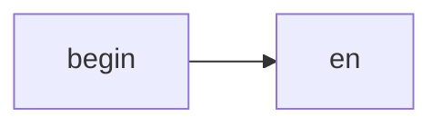
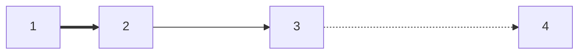
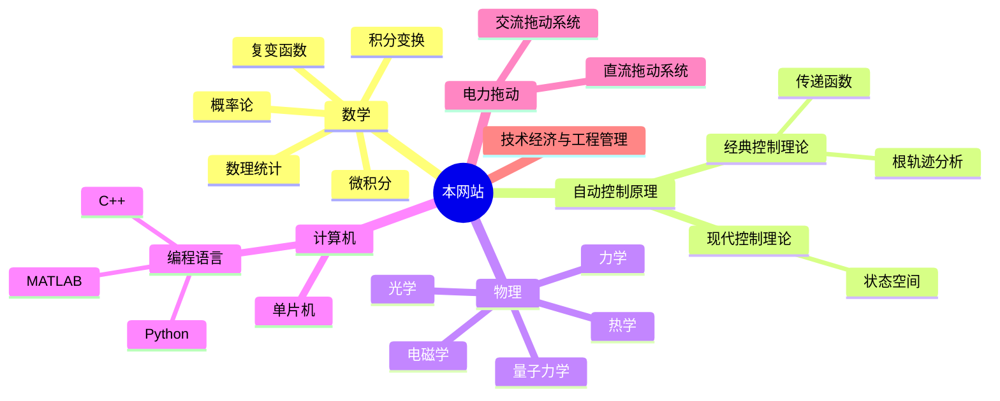
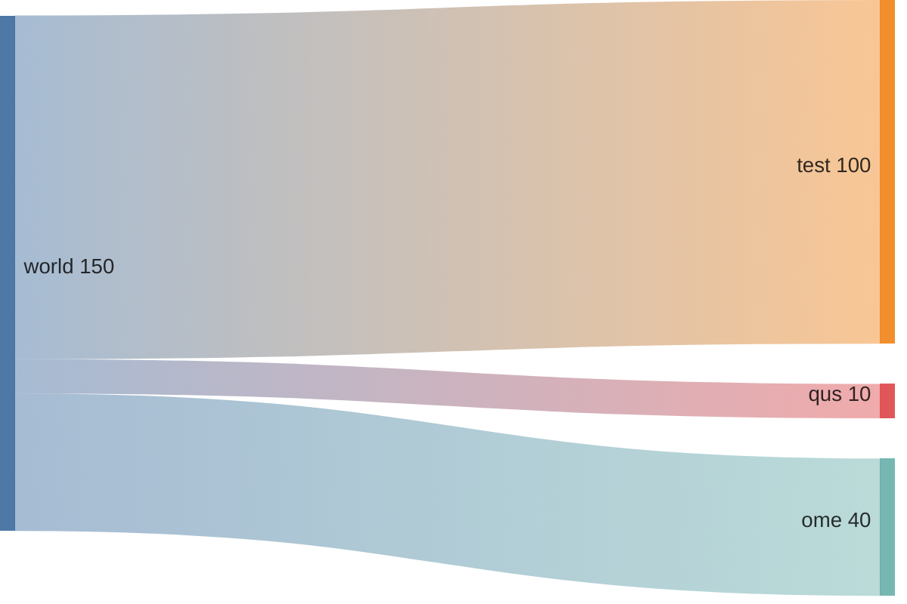
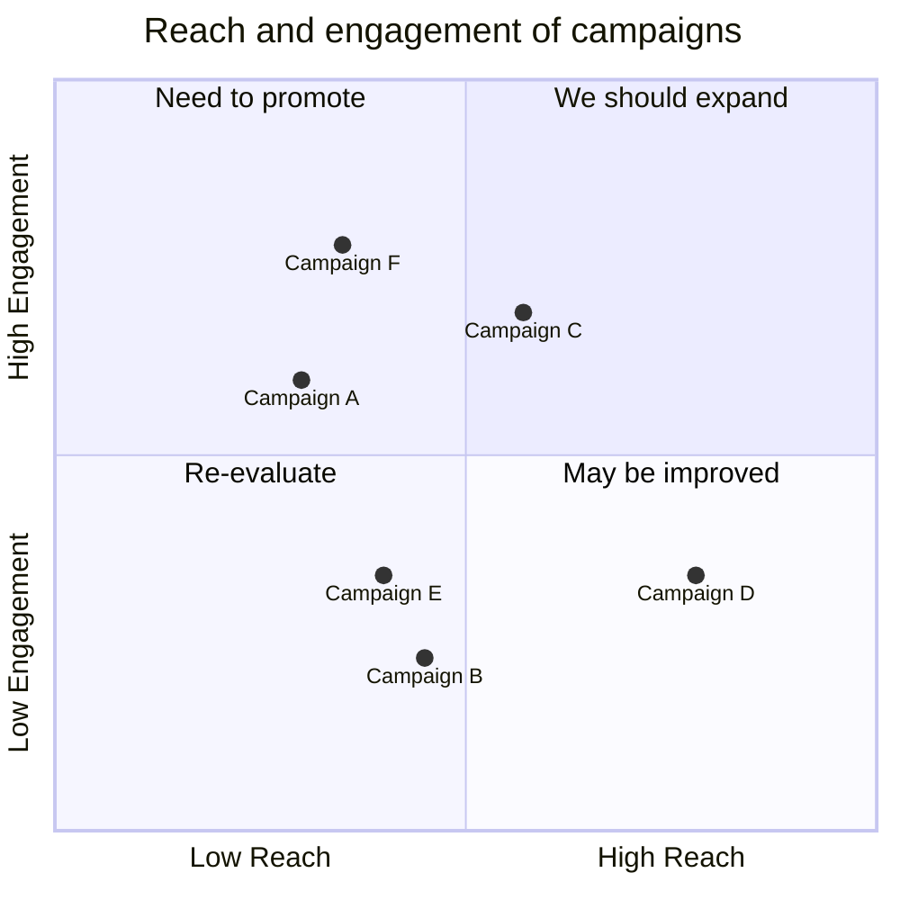
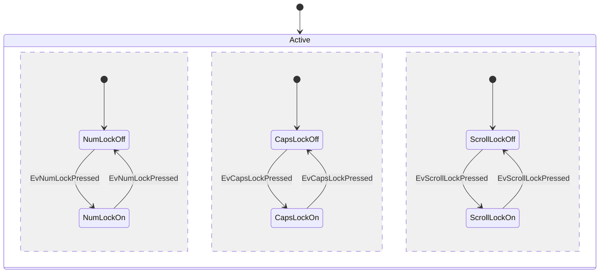

---
{"dg-publish":true,"dg-path":"工具/mermaid.md","permalink":"/工具/mermaid/","dgPassFrontmatter":true,"noteIcon":"","created":"2024-04-22T22:03:17.417+08:00","updated":"2024-04-28T18:56:07.854+08:00"}
---

[官网](https://mermaid.js.org/)




### 基本语法
```
---
title: name
---
```
#### 方向
direction 
TB/TD  自上而下
BT  自下而上
RL  从右到左
LR  从左到右
#### 基本图形
`[]`   方框（默认）
`()`  圆角框
`[[]]`  子程序
`[()]` 圆柱体
`(())`  单圆
`((()))` 双圆
`{}`  菱形
`{{}}`  六边形
`[//]  [\\]`  平行四边形
`[/\] [\/]`  梯形
#### 节点之间链接
```
-->
---
--text---
--text-->
-.->
-.text.->
==> 
~~~
--o
--x
o--o
x--x
<-->
```



subgraph one 
direction RL
a1-->a2 
end
### 状态图
stateDiagram
`[*]` 开始和结束
`state id{  }`   复合体

### 思维导图
mindmap

`))((`    Bang
`)(`  Cloud



### 桑基图
sankey-beta








