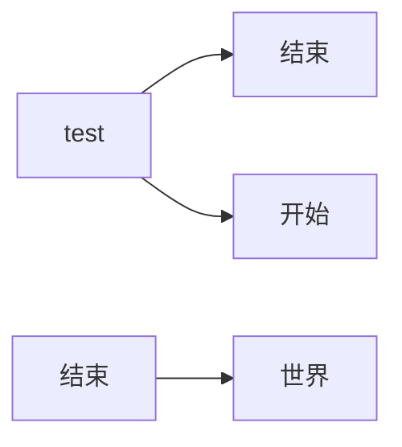
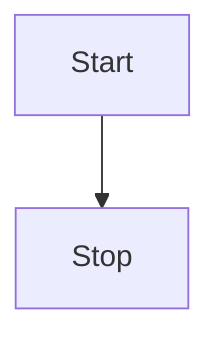
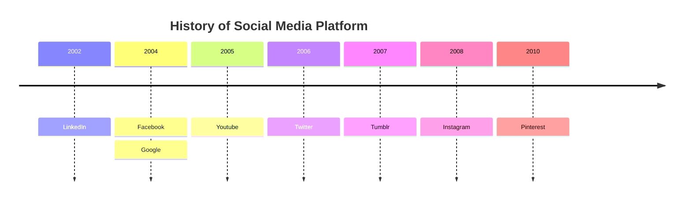
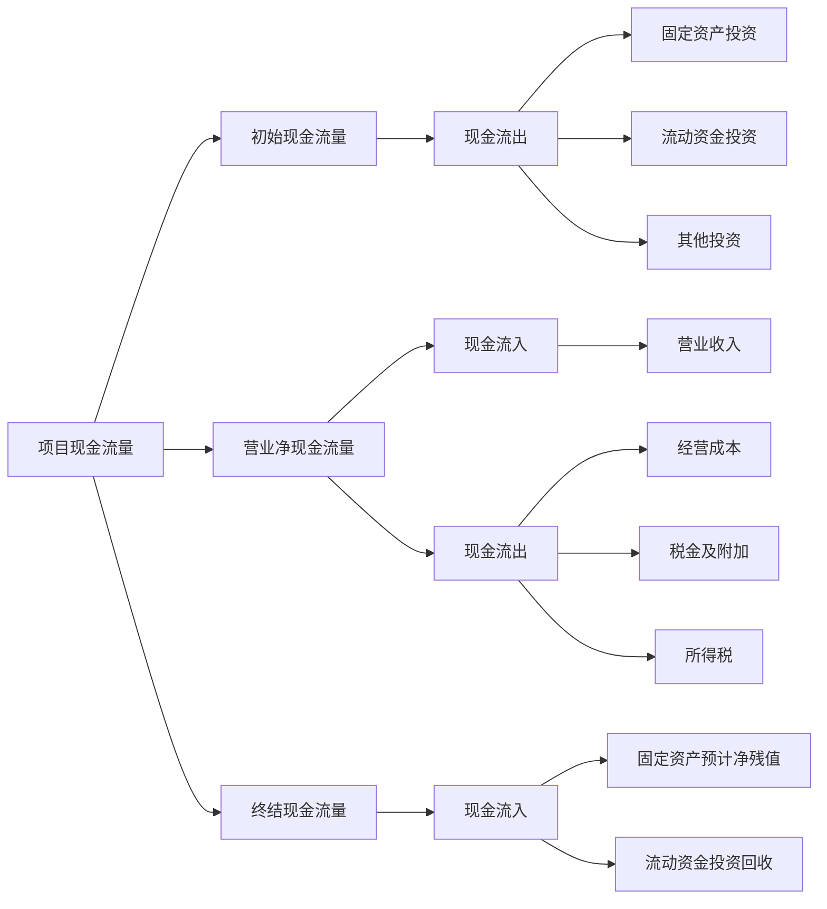
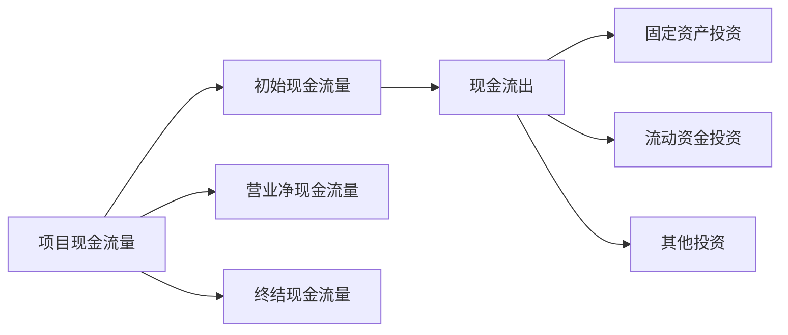

---
{"dg-publish":true,"dg-path":"工具/mermaid.md","permalink":"/工具/mermaid/","dgPassFrontmatter":true,"noteIcon":"","created":"2024-04-22T22:03:17.417+08:00","updated":"2024-04-26T21:05:10.065+08:00"}
---

[官网](https://mermaid.js.org/)

