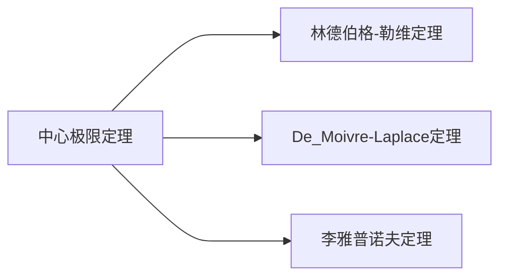

当一个量受许多随机因素的共同影响而随机取值时，它的分布近似服从[[正态分布\|正态分布]]

[[方差\|随机变量的标准化]]
和式的标准化形式
$$\begin{align}
Z_{n}=\dfrac{ \sum\limits_{k=1}^{n}X_{k}-\sum\limits_{k=1}^{n}E\left( X_{k} \right)}{\sqrt{\sum\limits_{k=1}^{n} D\left( X_{k} \right) }}
\end{align}$$
$$\begin{align}
\lim\limits_{ n \to \infty } P\left\{Z_{n}\leq x \right\}=\lim\limits_{ n \to \infty } F(x)=\Phi(x)=\dfrac{1}{\sqrt{ 2\pi }}\int _{-\infty}^{x} e^{ - \frac{t^{2}}{2} }\, dt
\end{align}$$

>[!important] 本质
>将随机变量序列的总体看成一个随机变量，
>再进行随机变量的标准化，
>转化为[[正态分布\|标准正态分布]]的计算

[[特征函数\|特征函数]]
### De_Moivre-Laplace 定理
$Y_{n}\sim B(n,p)$ 服从[[二项分布\|二项分布]]
$$\begin{align}
\lim\limits_{ n \to \infty } P\left\{\dfrac{Y_{n}-np}{\sqrt{ np(1-p) }} \leq x\right\}=\int _{-\infty}^{x} \dfrac{1}{\sqrt{ 2\pi }}e^{ -\frac{t^{2}}{2} }\, dt
\end{align}$$

