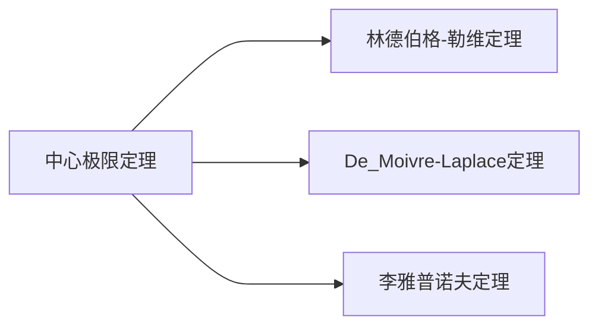

---
{"dg-publish":true,"dg-path":"数学/概率论/中心极限定理.md","permalink":"/数学/概率论/中心极限定理/","dgPassFrontmatter":true,"noteIcon":"","created":"2024-05-21T15:20:27.901+08:00","updated":"2024-06-14T23:55:16.884+08:00"}
---

**Central Limit Theorem**     **CLT**

当一个量受许多**随机因素的共同影响**而**随机取值**时，它的分布近似服从[[正态分布\|正态分布]]
>概率的计算就可以简化为标准正态分布的简单计算

[[方差\|随机变量的标准化]]
和式的标准化形式
$$\begin{align}
Z_{n}=\dfrac{ \sum\limits_{k=1}^{n}X_{k}-\sum\limits_{k=1}^{n}E\left( X_{k} \right)}{\sqrt{\sum\limits_{k=1}^{n} D\left( X_{k} \right) }}
\end{align}$$

当 $n$ 充分大时：
$$\begin{align}
\lim\limits_{ n \to \infty } P\left\{Z_{n}\leq x \right\}=\lim\limits_{ n \to \infty } F(x)=\Phi(x)=\dfrac{1}{\sqrt{ 2\pi }}\int _{-\infty}^{x} e^{ - \frac{t^{2}}{2} }\, dt
\end{align}$$

>[!important] 本质
>将随机变量序列的总体看成一个随机变量，
>再进行随机变量的标准化，
>转化为[[正态分布\|标准正态分布]]的计算

[[特征函数\|特征函数]]
### Lindeberg-Lévy Theorem
林德伯格-勒维定理

$X_{1},X_{2},\cdots,X_{n},\cdots$ 为[[独立同分布\|独立同分布]]的随机变量序列
$E(X_{i})=\mu$   $D(X_{i}=\sigma^{2})$  

$$\begin{align}
\lim\limits_{ n \to \infty } P\left\{ \dfrac{\sum\limits_{i=1}^{n}X_{i}-n\mu}{\sigma \sqrt{ n }} \leq x \right\} =\int _{-\infty}^{x} \dfrac{1}{\sqrt{ 2\pi }}e^{ -\frac{t^{2}}{2} }\, dt
\end{align}$$

### De_Moivre-Laplace Theorem
为 Lindeberg-Lévy Theorem 的一个特列

$Y_{n}\sim B(n,p)$ 服从[[二项分布\|二项分布]]
$$\begin{align}
\lim\limits_{ n \to \infty } P\left\{\dfrac{Y_{n}-np}{\sqrt{ np(1-p) }} \leq x\right\}=\int _{-\infty}^{x} \dfrac{1}{\sqrt{ 2\pi }}e^{ -\frac{t^{2}}{2} }\, dt
\end{align}$$

当 $n$ 充分大时，二项分布可以近似为正态分布
### 例题

==问题==
一大批产品中，一级品率为 $10\%$, 现从中任取 500 件
分别用**切比雪夫不等式**和**中心极限定理**计算这 500 件产品中一级品的比例与 $10\%$ 之差的绝对值小于 $2\%$ 的概率
==解答==
设每次抽取为一次试验
从一大批产品中抽取，可近似为 n 重伯努利试验
设抽取出来的一级品的件数为 $X$
服从二项分布 $X\sim B(500,0.1)$
$E(X)=np=50$    $D(X)=np(1-p)=45$
问题即求概率：
$$\begin{align}
P\left\{\left\lvert  \dfrac{X}{500}-10\% \right\rvert<2\% \right\} 
\end{align}$$

[[切比雪夫不等式\|切比雪夫不等式]]得：
$$\begin{align}
 & P\left\{\left\lvert  \dfrac{X}{500}-10\% \right\rvert<2\% \right\} \\
&=P\left\{\left\lvert  X-50 \right\rvert<10 \right\}\geq 1-\dfrac{45}{10^{2}}=0.55
\end{align}$$
中心极限定理得：
$$\begin{align}
 & P\left\{\left\lvert  \dfrac{X}{500}-10\% \right\rvert<2\% \right\} \\
&=P\left\{\left\lvert  X-50 \right\rvert<10 \right\} \\
&=P\left\{-\dfrac{10}{\sqrt{ 45 }}\leq \dfrac{X-50}{\sqrt{ 45 }}\leq \dfrac{10}{\sqrt{ 45 }} \right\} \\
&=\Phi (\dfrac{2\sqrt{ 5 }}{3})-\Phi (-\dfrac{2\sqrt{ 5 }}{3}) \\
&=2\Phi (\dfrac{2\sqrt{ 5 }}{3})-1\approx 0.8638
\end{align}$$
***

==问题==
一盒同型号螺钉共有 100 个，该螺钉的质量为一个随机变量，
期望值是 100g，标准差 10g
求该盒螺钉质量超过 10.2kg 的概率
==解答==
该螺钉的质量为**独立同分布**的随机变量序列
一盒螺钉的总质量为 $X=\sum\limits_{i=1}^{100}X_{i}$
$E(X_{i})=100,D(X_{i})=10^{2}$
问题即求概率：$P\left\{X>10200 \right\}$
$$\begin{align}
 & P\left\{X>10200 \right\} \\
&=P\left\{\dfrac{\sum\limits_{i=1}^{100}X_{i}-n\mu}{\sigma \sqrt{ n }}> \dfrac{10200-n\mu}{\sigma \sqrt{ n }} \right\} \\
&=P\left\{\dfrac{X-10000}{100}> \dfrac{10200-10000}{100} \right\} \\
&=P\left\{ \dfrac{X-10000}{100}>2\right\} \\
&=1-P\left\{\dfrac{X-10000}{100}\leq 2 \right\} \\
&=1-\Phi(2)=0.02275
\end{align}$$

