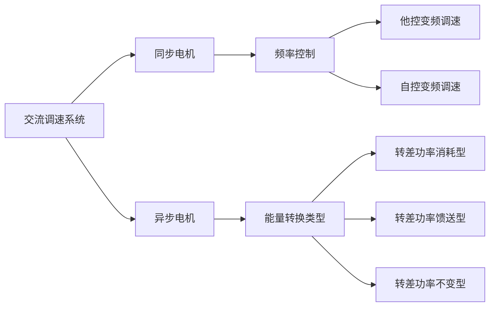

---
{"dg-publish":true,"dg-path":"A3- 电机及电力拖动/交流拖动控制系统.md","permalink":"/A3- 电机及电力拖动/交流拖动控制系统/","dgPassFrontmatter":true,"noteIcon":"","created":"2024-05-16T21:48:29.040+08:00","updated":"2025-04-14T18:38:58.898+08:00"}
---

随着[[电力电子技术\|电力电子技术]]的发展，使得采用电力电子变换器的交流拖动系统得以实现，特别是大规模[[集成电路\|集成电路]]和[[计算机\|计算机]]控制的出现，高性能交流调速系统便应运而生
交流拖动控制系统已经成为当前电力拖动控制的主要发展方向
### 应用领域
#### 1. 一般性能的节能调速
过去使用：不能调速的交流拖动系统
	依赖挡板和阀门来调节送风和供水的流量，
	因而把许多电能白白地浪费了
如果换成：交流调速系统
	把消耗在挡板和阀门上的能量节省下来，
	每台风机、水泵平均都可以节约 20 ~ 30% 以上的电能，效果是很可观的

控制交流电机的转速（节能）
控制阀门的开度（耗能）

开度减小
$T_{e}\quad \omega_{n}$ 减小
$P_{m}\quad P_{mech}$
$P_{mech}=(1-s)P_{m}=(1-s)T_{e}\omega_{n}$
$P_{m}=P_{mesh}+P_{s}$
- $P_{s}$ 转差功率
静压能消耗
压力损失

#### 2. 高性能的交流调速和伺服系统
20世纪70年代初发明了矢量控制技术，或称磁场定向控制技术，通过坐标变换，把交流电机的定子电流分解成转矩分量和励磁分量，用来分别控制电机的转矩和磁通，就可以获得和直流电机相仿的高动态性能，从而使交流电机的调速技术取得了突破性的进展

其后，又陆续提出了直接转矩控制、解耦控制等方法，形成了一系列可以和直流调速系统媲美的高性能交流调速系统和交流伺服系统
#### 3. 特大容量、极高转速的交流调速
直流电机的换向能力限制了它的容量转速积不超过 $10^{6} kW · r /min$，超过这一数值时，其设计与制造就非常困难了。交流电机没有换向器，不受这种限制
特大容量的电力拖动设备,都以采用交流调速为宜
### 主要类型
交流电机主要分为[[异步电机\|异步电机]]和同步电机两大类，每类电机又有不同类型的调速系统

### 异步电机
#### 按电机调速方法分类
***转差功率消耗型：***
	**降电压调速**
	转差离合器调速
	转子串电阻调速
	
***转差功率馈送型：***
	绕线电机串级调速
	双馈电机调速
	
***转差功率不变型：***
	**变压变频调速**
	变极对数调速
	
......
#### 按能量转换类型分类
按照交流[[异步电机\|异步电机]]的原理，
从定子传入转子的电磁功率 $P_{m}$ 可分成两部分：

$$\begin{align}
P_{m}&=P_{mech}+P_{s} \\
P_{s}&=sP_{m} \\
P_{mech}&=(1-s)P_{m}
\end{align}$$

- 一部分是拖动负载的有效功率，称作**机械功率**
- 另一部分是传输给转子电路的**转差功率**
	与 [[异步电机\|转差率]] $s$ 成正比

从能量转换的角度上看，转差功率是否增大，是消耗掉还是得到回收，是评价调速系统效率高低的标志

##### 1. 转差功率消耗型
全部转差功率都转换成热能消耗在转子回路中

**恒转矩负载时**，这类系统的效率最低，而且越到低速时效率越低，它是以增加转差功率的消耗来换取转速的降低的
[[异步电机变压调速系统\|异步电机变压调速系统]]

##### 2. 转差功率馈送型
除转子铜损外，大部分转差功率在转子侧通过变流装置馈出或馈入，转速越低，能馈送的功率越多

无论是馈出还是馈入的转差功率，
扣除变流装置本身的损耗后，最终都转化成有用的功率，因此这类系统的效率较高

##### 3. 转差功率不变型
转差功率只有转子铜损，而且无论转速高低，转差功率基本不变，因此效率更高
[[笼型异步电机变压变频调速系统\|笼型异步电机变压变频调速系统]]
### 同步电机
- 同步电机没有转差，也就没有转差功率
	所以同步电机调速系统只能是转差功率不变型（恒等于 0 ）的，
- 同步电机转子极对数又是固定的，
	因此只能靠变压变频调速，没有像异步电机那样的多种调速方法

在同步电机的变压变频调速方法中，
从频率控制的方式来看，可分为
***他控变频调速***
***自控变频调速***
	利用转子磁极位置的检测信号来控制变压变频装置换相，
	类似于直流电机中电刷和换向器的作用，
	因此有时又称作无换向器电机调速，或**无刷直流电机调速**

变压变频
交流电动机的稳态
当 $\Phi_{m}=C$ 时
$\dfrac{E_{g}}{f_{1}}=C_{2}$
电压和频率的比值为一个定值
[[风力发电\|风力发电]]

馈送装置
一般铁芯中嵌入类似定子绕组排列的铁芯 （定子绕向型）
转子转动，而定子不转
磁场切割时，绕组发电，并统一引出
类似三相同步电机

无刷直流电机
供电电源为直流电源

无电刷
贴有很多 NS 磁极磁片
转子
外边有大型 NS 旋转磁场
磁场旋转，同极相斥异极相吸，

比亚迪技术

将内部磁片换为鼠笼型绕组，则为：
三相异步交流电机
内部通交流电，产生旋转磁场
切割转子绕组

三相同步电机
气体膨胀，使得磁铁旋转，切割固定的定子绕组，电磁感应发电
在定子产生三相平衡的交流电

直流发电机

