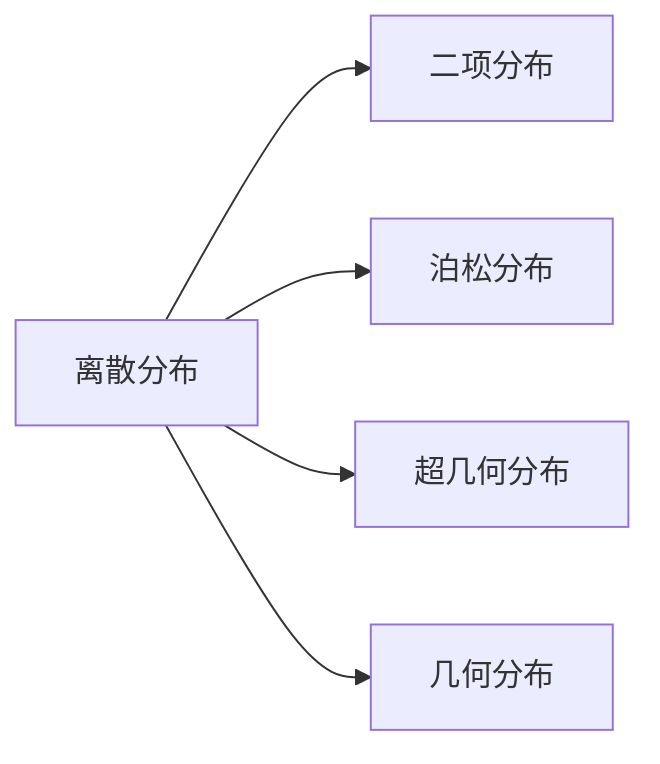
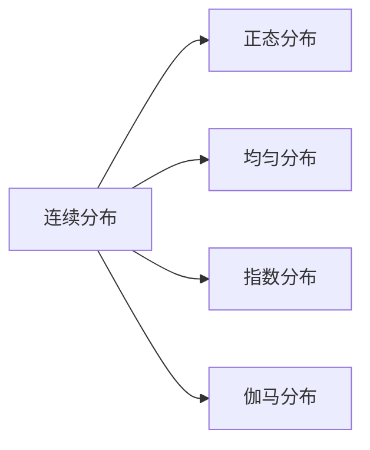

概率的函数
### 基本定义
$X$ 为[[随机变量\|随机变量]]，$x$ 为任意实数，
则函数 $F(x)=P\{X\leq x\}$ 称为 $X$ 的分布函数
$X$ 服从 $F(x)$，记为 $X\sim F(x)$
{ #6fd0de}

完整地描述了随机变量的统计规律性
表示了概率分布情况
$$\begin{align}
P \left\{x_{1}<X\leq x_{2} \right\}&=P \left\{X \leq x_{2} \right\}-\left\{X \leq x_{1} \right\} \\
&=F(x_{2})-F(x_{1})
\end{align}$$
### 基本性质
单调性：单调不减
有界性
右连续性

满足上述三条性质的函数，必为某一随机变量的分布函数
### 离散分布
[[概率分布律\|概率分布律]]的累加

[[二项分布\|二项分布]]
[[泊松分布\|泊松分布]]
[[超几何分布\|超几何分布]]
[[几何分布\|几何分布]]
### 连续分布
[[概率密度函数\|概率密度函数]]的积分

[[正态分布\|正态分布]]
[[均匀分布\|均匀分布]]
[[指数分布\|指数分布]]
[[伽马分布\|伽马分布]]

### 求随机变量函数的分布函数
[[随机变量函数的分布\|随机变量函数的分布]]

### 特殊分布的期望和方差
#### 0-1 分布
$X\sim B(1,p)$
$E(X)=p$
$D(X)=p(1-p)$

#### 二项分布
$X\sim B(n,p)$
$E(X)=np$
$D(X)=np(1-p)$
#### 泊松分布
$X\sim P(\lambda)$
$E(X)=\lambda$
$D(X)=\lambda$

#### 均匀分布
$X\sim U(a,b)$
$E(X)=\dfrac{a+b}{2}$
$D(X)=\dfrac{(b-a)^{2}}{12}$
#### 指数分布
$X\sim Exp(\lambda)$
$E(X)=\dfrac{1}{\lambda}$
$D(X)=\dfrac{1}{\lambda^{2}}$
#### 正态分布
$X\sim N(\mu,\sigma^{2})$
$E(X)=\mu$
$D(X)=\sigma^{2}$

