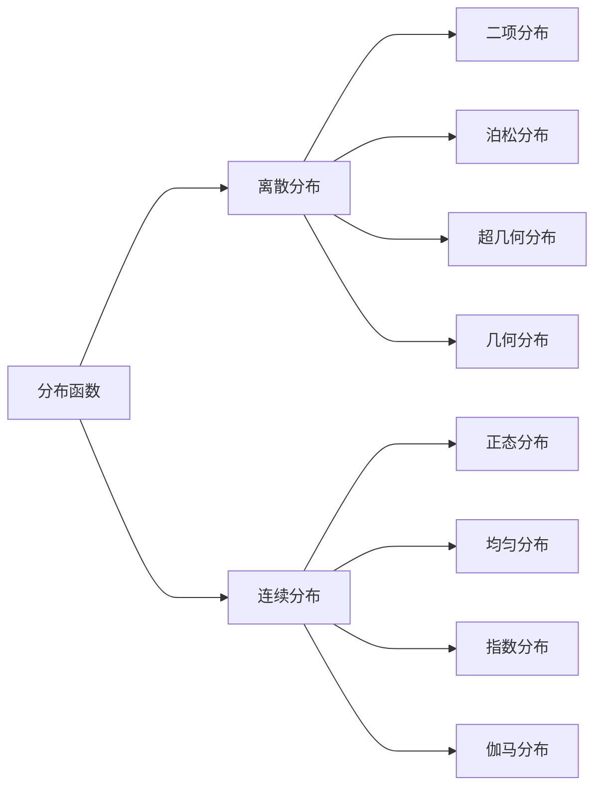

---
{"dg-publish":true,"dg-path":"A1- 数学/5. 概率论/分布函数.md","permalink":"/A1- 数学/5. 概率论/分布函数/","dgPassFrontmatter":true,"noteIcon":"","created":"2024-05-21T15:20:27.978+08:00","updated":"2025-04-14T18:25:19.713+08:00"}
---

[[概率\|概率]]的函数，可以描述任何类型的[[随机变量\|随机变量]]
### 基本定义
$X$ 为[[随机变量\|随机变量]]，$x$ 为任意实数，
则函数 $F(x)=P\{X\leq x\}$ 称为 $X$ 的**分布函数**
$X$ 服从 $F(x)$，记为 $X\sim F(x)$

>完整地描述了随机变量的**统计规律性**
>表示了概率分布情况

$$\begin{align}
P \left\{x_{1}<X\leq x_{2} \right\}&=P \left\{X \leq x_{2} \right\}-\left\{X \leq x_{1} \right\} \\
&=F(x_{2})-F(x_{1})
\end{align}$$
### 基本性质
- **单调性：**
	$F(x)$ 为单调不减的函数
	$x_{1}<x_{2}$ 时，$F(x_{1})\leq F(x_{2})$
	
- **有界性：**
	$0\leq F(x)\leq 1$
	$F(-\infty)=0$
	$F(+\infty)=1$
	
- **右连续性：**
	为右连续的函数
	$F(x_{0}+0)=F(x_{0})$

满足上述三条性质的函数，必为某一随机变量的分布函数

### 离散分布
> [[概率分布律\|概率质量函数]] 的累加

[[二项分布\|二项分布]]
[[泊松分布\|泊松分布]]
[[超几何分布\|超几何分布]]
[[几何分布\|几何分布]]
### 连续分布
> [[概率密度函数\|概率密度函数]]的积分

[[正态分布\|正态分布]]
[[均匀分布\|均匀分布]]
[[指数分布\|指数分布]]
[[伽马分布\|伽马分布]]

[[抽样分布\|抽样分布]]

>[!important] 注意
>1. 记特殊分布时，记的是特殊分布的 **分布律** / **密度函数**
>求分布函数时，**累加/积分**  即可得到分布函数
>2. 千万要注意**密度函数**的**分段表达**
>求分布函数时，注意对应的积分上下限

### 求随机变量函数的分布函数
[[随机变量函数的分布\|随机变量函数的分布]]

