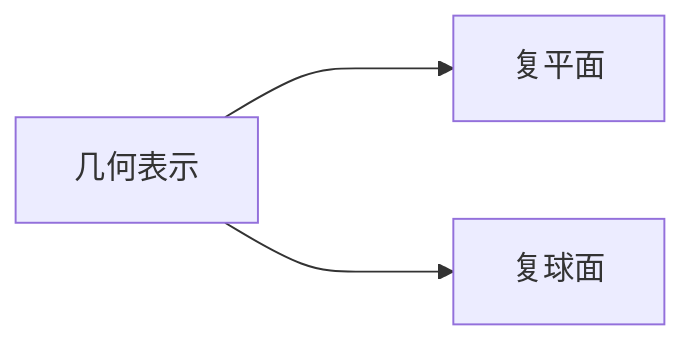

---
{"dg-publish":true,"dg-path":"数学/复变函数/复数.md","permalink":"/数学/复变函数/复数/","dgPassFrontmatter":true,"noteIcon":"","created":"2024-05-21T15:20:28.114+08:00","updated":"2024-11-18T23:30:04.633+08:00"}
---

(terminology::**Complex number**)
>起源于求方程的根，在二次、三次代数方程的求根中出现负数开平方的情况

### 虚数
**虚数单位** $i$
定义：$i^2 = -1$
$i$   的幂次在 $\; i \: -1\: -i\;\;\;1$  中循环
$$\begin{align}
i^{4n}=1\quad i^{4n+1}=i \quad i^{4n+2}=-1\quad i^{4n+3}=-i
\end{align}$$

### 复数
对于两实数 $x\quad y$
$z=x+iy$
$i$  为虚数单位
- **实部  real part**  
	$\mathrm{Re}$ $z=x$    
- **虚部 imaginary part**
	$\mathrm{Im}$ $z=y$      

**复数相等**的充要条件：
实部和虚部分别相等
>[!important] 注意
>这一充要条件似乎“天经地义”，“理所当然”
>但实际上有很多用处

比如可以化简诸如 $\sqrt{ 5+12i },\sqrt{ -i }$ 等根式
直接令 $\sqrt{ 5+12i }=x+iy$
再利用复数相等，实部与虚部的相等，即可求得
$5+12i=x^{2}-y^{2}+2xyi$
(复数中无法定义大小关系)

### 四则运算
$$\begin{align} 
 & z_{1}=x_{1}+iy_{1} \quad z_{2}=x_{2}+iy_{2}\\ \\

 & z_{1}\pm z_{2}=(x_{1}\pm x_{2})+i(y_{1}\pm y_{2}) \\
 & z_{1}\cdot z_{2}=(x_{1}x_{2}-y_{1}y_{2})+i(x_{2}y_{1}+x_{1}y_{2}) \\
 & \dfrac{z_{1}}{z_{2}}=\dfrac{z_{1}\bar{z_{2}}}{z_{2}\bar{z_{2}}}
\end{align}$$

### 共轭复数
(terminology::**Conjugate**)
**实部相同**而**虚部**绝对值相等**符号相反**的两个复数
$z=x+iy$
$\overline{z}=x-iy$

$$\begin{align}
z\cdot \overline{z}&=(x+iy)(x-iy) \\
&=x^{2}-(iy)^{2} \\
&=x^{2}+y^{2}   \\
&=[Re(z)]^{2}+[Im(z)]^{2}
\end{align}$$
 两个共轭复数的积为一个实数
 常常使用此来对分式进行化简
 （==上下同乘==分母的共轭复数）
 $z+\overline{z}=2Re(z)$
 $z-\overline{z}=2iIm(z)$
 $\overline{\overline{z}}=z$
 
### 复数的几何表示

复数与[[复平面\|复平面]]中的[[向量\|向量]]对应起来 
复数可以表示平面向量，所以有关平面向量的问题可以用复变函数来研究

### 三角表示和指数表示
$z$ 对应向量 $\vec{Oz}$

**模**： $\mid z\mid$ 为对应向量的长度
 $\mid z\mid$ = $\sqrt{ x^2+y^2 }$
 
**辐角**： $\vec{Oz}$ 与实轴正向的夹角
$Arg$ 一般表示，不受限制地取辐角的任意值
$Arg z=\theta$  

$z=0$ 模为 0，而辐角不确定

**主辐角**:  辐角的主值
辐角限制在 $-\pi$ 与 $\pi$ 之间
$$argz=\begin{cases}
\arctan \dfrac{y}{x}\quad x>0 \\
\quad \dfrac{\pi}{2}\quad \quad \quad x=0,y>0 \\
\arctan \dfrac{y}{x}+\pi\quad x<0,y\geq 0 \\
\arctan \dfrac{y}{x}-\pi\quad x<0,y<0 \\
\quad - \dfrac{\pi}{2}\quad \quad x=0,y<0
\end{cases}$$

$arg z \in(-\pi,\pi]$
$Arg\,z =arg\,z+2k \pi$ 

**三角表示**：$z=r(\cos \theta+i\sin\theta)$
**指数表示**： $z=re^{i\theta}$    （由[[欧拉公式\|欧拉公式]]）

>[!important] 注意
>- 表示成[[三角函数\|三角函数]]或者[[指数函数\|指数函数]]时，不要遗漏虚数单位 $i$
>- 最好画一个简易的图，不要搞错实部、虚部、符号、模的大小...... 等小细节
>- 也要注意三角表示和指数表示的形式
>	如果形式不为标准形式，应该先利用三角函数来转化为标准形式

### 复数的运算
#### 1.乘除法
$$\begin{align}
 & z_{1} =r_{1}(\cos \theta_{1}+i\sin \theta_{1})=r_{1}e^{ i\theta_{1} } \\
 & z_{2} =r_{2}(\cos \theta_{2}+i\sin \theta_{2})=r_{2}e^{ i\theta_{2} }  \\ \\

 & |z_{1}\cdot z_{2}| =r_{1}r_{2} \\
 & Arg(z_{1}\cdot z_{2})=Arg z_{1}+Argz_{2}  \\
 & z_{1}z_{2}=r_{1}r_{2}e^{ i(\theta_{1}+\theta_{2}) }\\ \\

 & \left\lvert  \dfrac{z_{1}}{z_{2}} \right\rvert=\frac{r_{1}}{r_{2}} \\
 & Arg \frac{z_{1}}{z_{2}}=Arg z_{1}-Argz_{2}  \\
 & \dfrac{z_{2}}{z_{1}}=\dfrac{r_{2}}{r_{1}}e^{ i(\theta_{2}-\theta_{1}) }
\end{align}$$

**几何意义**
**乘法**：
- 模等于两个复数模的乘积
- 辐角等于两个复数辐角的和
模长伸长，逆时针旋转角度

**除法**：
- 模等于两个复数模的商
- 辐角等于被除数与除数的辐角之差
模长缩短，顺时针旋转角度

#### 2.乘方开方
De Moivre 公式

$$\begin{align}
z^{n}&=[r(\cos \theta+i\sin \theta)]^{n} \\
&=r^{n}(\cos n \theta+i\sin n \theta)  \\
&=r^{n}e^{ i(n\theta) }\\
\end{align}$$

$$\begin{align}
\sqrt[n]{ z }&=[r(\cos \theta+i\sin \theta)]^{1/n} \\
&=r^{1/n}\left[ \cos \left( \frac{1}{n} (\theta+2k\pi) \right) +i\sin \left( \frac{1}{n} (\theta+2k\pi) \right) \right] \\
&=r^{1/n}e^{i(\frac{1}{n}(\theta+2k\pi))}\\
\end{align}$$

$(k=0,1,2\cdots,n-1)$

注意开 $n$ 次根号有 $n$ 个值

例题：
解方程 $(1+z)^{5}=(1-z)^{5}$

$(\dfrac{1+z}{1-z})^{5}=1\quad \omega=\dfrac{1+z}{1-z}$
$\omega=\sqrt[5]{1  }\quad \omega=e^{ i(0+2k\pi)/5 }=e^{ i\alpha }$
$$\begin{align}
z&=\dfrac{\omega-1}{\omega+1}=\dfrac{e^{ i\alpha }-1}{e^{ i\alpha }+1} \\
&=\dfrac{\cos \alpha+i\sin \alpha-1}{\cos \alpha+i\sin \alpha+1} \\
&=\dfrac{2\sin \dfrac{\alpha}{2}(-\sin \dfrac{\alpha}{2}+i\cos \dfrac{\alpha}{2})}{2\cos \dfrac{\alpha}{2}(\cos \dfrac{\alpha}{2}+i\sin \dfrac{\alpha}{2})} \\
&=i\tan \dfrac{\alpha}{2}
\end{align}$$

所以根为：
$z_{0}=0$
$z_{1}=i\tan \dfrac{\pi}{5}$
$z_{2}=i\tan \dfrac{2\pi}{5}$
$z_{3}=i\tan \dfrac{3\pi}{5}$
$z_{4}=i\tan \dfrac{4\pi}{5}$
