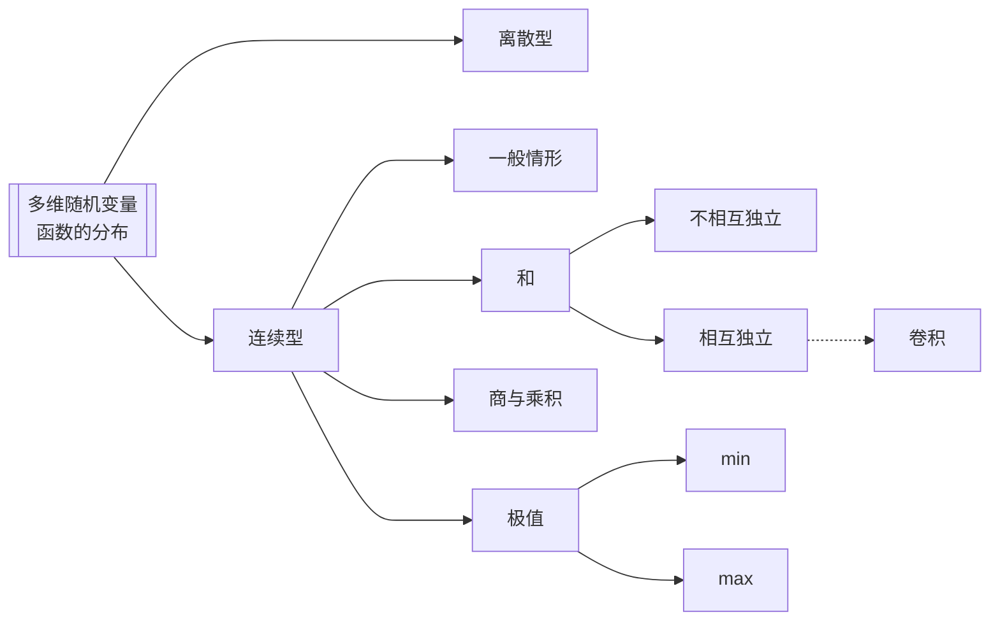

---
{"dg-publish":true,"dg-path":"数学/概率论/多维随机变量函数的分布.md","permalink":"/数学/概率论/多维随机变量函数的分布/","dgPassFrontmatter":true,"noteIcon":"","created":"2024-04-16T17:41:14.927+08:00","updated":"2024-05-07T11:25:11.325+08:00"}
---

[[随机变量函数的分布\|随机变量函数的分布]]

## 多维离散型随机变量函数的分布
多维离散型随机变量的函数**依然**是离散型随机变量

>[!important] 求法
>只需要结合题意
>熟悉基本的离散分布即可

## 多维连续型随机变量函数的分布
多维连续型随机变量的函数 **不一定**是连续型随机变量
### 一般情形
[[联合分布函数\|联合分布函数]]
已知二维随机变量 $(X,Y)$ 的联合密度函数 $f(x,y)$
求随机变量 $Z=g(X,Y)$ 的分布函数 $F_{Z}(z)$
**分布函数法**
$$\begin{align}
F_{Z}(z)&=P\left\{Z\leq z \right\} \\
&=P\left\{g(X,Y) \leq z\right\} \\
  & =\iint \limits_{g(x,y)\leq z}f(x,y)dxdy\\
f_{Z}(z)&=F'_{Z}(z)
\end{align}$$
>[!important]- 实质 
> 

4.  $G$ 为平面上的一个区域，点 $(X,Y)$ 落在 $G$ 内的概率为：
$\begin{align}
P\left\{(X,Y) \in G \right\}=\iint \limits_{G} f(x,y) \, dx dy
\end{align}$
>[!note] 
>就是求在区域上的[[二重积分\|二重积分]] 

### 和的分布
二维随机变量 $(X,Y)$ 的联合密度函数 $f(x,y)$
$Z=X+Y$，求 $f_{Z}(z)$
$$\begin{align}
F_{Z}(z)&=P\left\{Z\leq z \right\} \\
&=P\left\{X+Y\leq z \right\} \\
&=\iint \limits_{x+y\leq z}f(x,y)dxdy \\
&=\int _{-\infty}^{+\infty} \, dx \int _{-\infty}^{z-x} f(x,y)\, dy  \\
&=\int _{-\infty}^{+\infty} \, dx \int _{-\infty}^{z} f(x,u-x)\, du  \\
 & =\int _{-\infty}^{z} \, du \int _{-\infty}^{+\infty} f(x,u-x)\, dx   
\end{align}$$
所以 $Z=X+Y$ 为连续型随机变量，且密度函数为：
$$\begin{align}
f_{Z}(z)=\int _{-\infty}^{+\infty} f(x,z-x)\, dx \\
f_{Z}(z)=\int _{-\infty}^{+\infty} f(z-y,y)\, dy 
\end{align}$$
特别地：
如果随机变量 X，Y [[随机变量的独立性\|相互独立]]，则有 $f(x,y)=f_{X}(x)f_{Y}(y)$
$$\begin{align}
f_{Z}(z)&=\int _{-\infty}^{+\infty} f_{X}(x)f_{Y}(z-y)\, dx  \\
&=\int _{-\infty}^{+\infty} f_{X}(z-y)f_{Y}(y)\, dy \\
&=f_{X}(x)*f_{Y}(y)
\end{align}$$
两个随机变量相互独立，则它们和的密度函数等于 X 与 Y密度函数的[[卷积\|卷积]]
### 商和乘积的分布
二维随机变量 $(X,Y)$ 的联合密度函数 $f(x,y)$
#### 商
$Z=\dfrac{Y}{X}$
$$\begin{align}
f_{Z}(z)=\int _{-\infty}^{+\infty} |x|f(x,xz)\, dx 
\end{align}$$
#### 乘积
$Z=XY$
$$\begin{align}
f_{Z}(z)=\int _{-\infty}^{+\infty} \dfrac{1}{|x|} f(x,\dfrac{z}{x})\, dx 
\end{align}$$

### 极值分布
$$\begin{align}
X_{(1)}=min\left\{X_{1},X_{2},\cdots,X_{n} \right\} \quad 最小顺序统计量\\
X_{(n)}=max\left\{X_{1},X_{2},\cdots,X_{n} \right\} \quad 最大顺序统计量
\end{align}$$
$$\begin{align}
 & F_{(n)}(x)=\prod\limits_{i=1}^{n}F_{i}(x) \\
 & F_{(1)}(x)=1-\prod\limits_{i=1}^{n}(1-F_{i}(x))
\end{align}$$
$$\begin{align}
f_{(1)}(x)&=\dfrac{\mathrm{d} }{\mathrm{d} x} \left[F_{(1)}(x)\right] \\
&= \sum\limits_{i=1}^{n}f_{i}(x)\prod\limits_{j=1,j\neq i}^{n}\left[1-F_{j}(x)\right]
\end{align}$$
$$\begin{align}
f_{n}(x)&=\dfrac{\mathrm{d} }{\mathrm{d} x} \left[F_{n}(x)\right] \\
&=\sum\limits_{i=1}^{n}f_{i}(x)\prod\limits_{j=1,j\neq i}^{n}F_{j}(x) 
\end{align}$$

