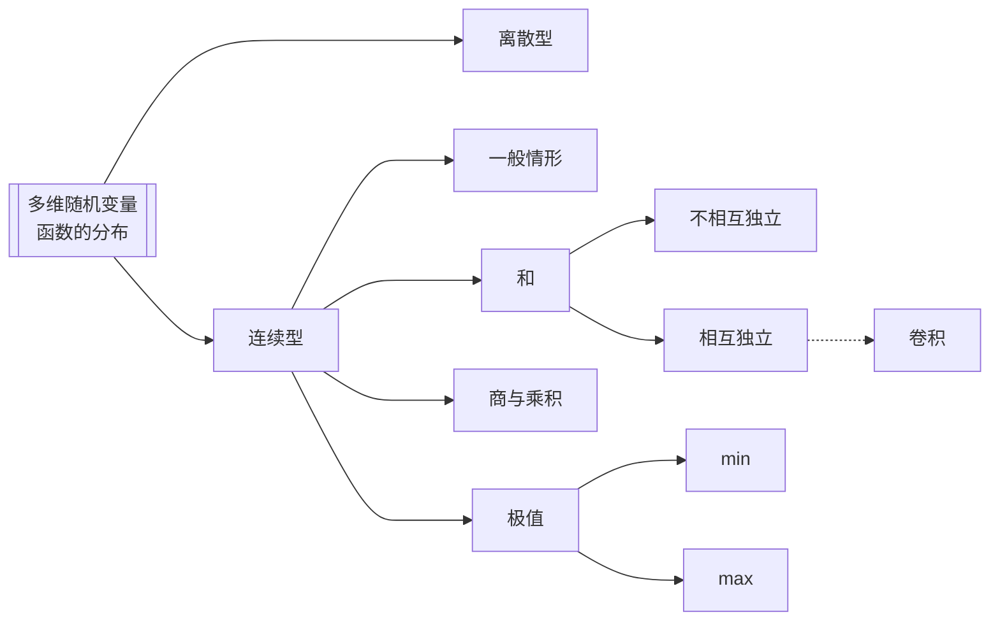

---
{"dg-publish":true,"dg-path":"数学/概率论/多维随机变量函数的分布.md","permalink":"/数学/概率论/多维随机变量函数的分布/","dgPassFrontmatter":true,"noteIcon":"","created":"2024-04-16T17:41:14.927+08:00","updated":"2024-05-14T22:02:04.447+08:00"}
---

[[随机变量函数的分布\|随机变量函数的分布]]

## 多维离散型随机变量函数的分布
多维离散型随机变量的函数**依然**是离散型随机变量

>[!important] 求法
>只需要结合题意
>熟悉基本的离散分布即可

## 多维连续型随机变量函数的分布
多维连续型随机变量的函数 **不一定**是连续型随机变量
### 一般情形
[[联合分布函数\|联合分布函数]]
已知二维随机变量 $(X,Y)$ 的联合密度函数 $f(x,y)$
求随机变量 $Z=g(X,Y)$ 的分布函数 $F_{Z}(z)$
**分布函数法**
$$\begin{align}
F_{Z}(z)&=P\left\{Z\leq z \right\} \\
&=P\left\{g(X,Y) \leq z\right\} \\
  & =\iint \limits_{g(x,y)\leq z}f(x,y)dxdy\\
f_{Z}(z)&=F'_{Z}(z)
\end{align}$$
>[!important]- 实质 
> 

4.  $G$ 为平面上的一个区域，点 $(X,Y)$ 落在 $G$ 内的概率为：
$\begin{align}
P\left\{(X,Y) \in G \right\}=\iint \limits_{G} f(x,y) \, dx dy
\end{align}$
>[!note] 
>就是求在区域上的[[二重积分\|二重积分]] 

### 和的分布
二维随机变量 $(X,Y)$ 的联合密度函数 $f(x,y)$
$Z=X+Y$，求 $f_{Z}(z)$
$$\begin{align}
F_{Z}(z)&=P\left\{Z\leq z \right\} \\
&=P\left\{X+Y\leq z \right\} \\
&=\iint \limits_{x+y\leq z}f(x,y)dxdy \\
&=\int _{-\infty}^{+\infty} \, dx \int _{-\infty}^{z-x} f(x,y)\, dy  \\
&=\int _{-\infty}^{+\infty} \, dx \int _{-\infty}^{z} f(x,u-x)\, du  \\
 & =\int _{-\infty}^{z} \, du \int _{-\infty}^{+\infty} f(x,u-x)\, dx   
\end{align}$$
所以 $Z=X+Y$ 为连续型随机变量，且密度函数为：
$$\begin{align}
f_{Z}(z)=\int _{-\infty}^{+\infty} f(x,z-x)\, dx \\
f_{Z}(z)=\int _{-\infty}^{+\infty} f(z-y,y)\, dy 
\end{align}$$

>[!important] 确定实际的积分区域！
>要充分结合题目给定的变量的范围
>将 $y=z-x$ 代换，进一步确定积分范围

>[!example]- 实例
> 当 $0\leq x\leq y\leq 1$ 时，$f(x,y)=2(x+y)$
> 求 $Z=X+Y$ 的密度函数
> 根据题意有：$0\leq x\leq z-x\leq 1\to 2x\leq z\leq 1+x$
> 积分区域：
> 
<svg version="1.1" xmlns="http://www.w3.org/2000/svg" viewBox="0 0 473.6874092166655 388.94661628251947" width="473.6874092166655" height="388.94661628251947">  <!-- svg-source:excalidraw -->    <defs>          </defs>  <rect x="0" y="0" width="473.6874092166655" height="388.94661628251947" fill="#ffffff"></rect><g stroke-linecap="round"><g transform="translate(10.828399466350675 288.5976085247855) rotate(0 225.58725569649454 -1.1429908301653313)"><path d="M-0.83 1.13 C74.12 0.64, 375.13 -1.65, 450.5 -2.07 M0.94 0.68 C76.2 -0.27, 377.89 -3.42, 452.86 -4.09" stroke="#1e1e1e" stroke-width="2" fill="none"></path></g><g transform="translate(10.828399466350675 288.5976085247855) rotate(0 225.58725569649454 -1.1429908301653313)"><path d="M429.45 4.69 C439.92 0.49, 447.04 -1.25, 452.86 -4.09 M429.45 4.69 C438.03 2.06, 447.7 -2.64, 452.86 -4.09" stroke="#1e1e1e" stroke-width="2" fill="none"></path></g><g transform="translate(10.828399466350675 288.5976085247855) rotate(0 225.58725569649454 -1.1429908301653313)"><path d="M429.28 -12.41 C439.94 -10.29, 447.12 -5.71, 452.86 -4.09 M429.28 -12.41 C438 -8.67, 447.74 -7, 452.86 -4.09" stroke="#1e1e1e" stroke-width="2" fill="none"></path></g></g><mask></mask><g stroke-linecap="round"><g transform="translate(111.34897735673133 370.1815416218019) rotate(0 -1.2318331568347958 -179.3574461766824)"><path d="M1.06 0.65 C0.59 -59.22, -1.44 -298.53, -2.08 -358.28 M0.16 -0.05 C-0.51 -60.38, -2.18 -300.23, -2.82 -360.18" stroke="#1e1e1e" stroke-width="2" fill="none"></path></g><g transform="translate(111.34897735673133 370.1815416218019) rotate(0 -1.2318331568347958 -179.3574461766824)"><path d="M5.93 -336.76 C3.64 -344.57, 0.08 -354.26, -2.82 -360.18 M5.93 -336.76 C2.32 -344.52, -1.06 -354.67, -2.82 -360.18" stroke="#1e1e1e" stroke-width="2" fill="none"></path></g><g transform="translate(111.34897735673133 370.1815416218019) rotate(0 -1.2318331568347958 -179.3574461766824)"><path d="M-11.17 -336.62 C-7.24 -344.63, -4.57 -354.37, -2.82 -360.18 M-11.17 -336.62 C-8.41 -344.55, -5.42 -354.75, -2.82 -360.18" stroke="#1e1e1e" stroke-width="2" fill="none"></path></g></g><mask></mask><g stroke-linecap="round"><g transform="translate(226.54396034714557 378.58921720741364) rotate(0 -3.2670933925332974 -168.06600033387048)"><path d="M-1.11 0.36 C-2.06 -55.69, -4.67 -281.07, -5.72 -337" stroke="#1e1e1e" stroke-width="2.5" fill="none" stroke-dasharray="1.5 8"></path></g></g><mask></mask><g stroke-linecap="round"><g transform="translate(111.69382193491595 287.40662071422867) rotate(0 54.96315137143347 -113.93308842929702)"><path d="M0.08 -0.42 C18.32 -38.41, 90.69 -190.09, 108.84 -228.11 M-1.34 -1.68 C17.32 -39.48, 92.19 -189.06, 110.99 -226.69" stroke="#1e1e1e" stroke-width="1" fill="none"></path></g></g><mask></mask><g stroke-linecap="round"><g transform="translate(109.96673376777642 172.55976657888687) rotate(0 54.70439331446278 -53.21005591191795)"><path d="M0.86 0.52 C19.13 -17.1, 90.8 -87.97, 108.93 -105.94 M-0.14 -0.25 C17.98 -18.22, 89.54 -90.11, 107.74 -107.81" stroke="#1e1e1e" stroke-width="1" fill="none"></path></g></g><mask></mask><g stroke-linecap="round"><g transform="translate(110.84351066657894 172.43639739555283) rotate(0 157.9390470336366 -1.6737272693130762)"><path d="M0.22 1 C53.07 0.67, 263.59 -1.86, 316.35 -2.58" stroke="#e03131" stroke-width="1" fill="none" stroke-dasharray="8 8.5"></path></g></g><mask></mask><g transform="translate(125.03674278447204 81.0615549284064) rotate(0 23.4375 9.600000000000023)"><text x="0" y="15.45" font-family="Cascadia, Segoe UI Emoji" font-size="16px" fill="#1e1e1e" text-anchor="start" style="white-space: pre;" direction="ltr" dominant-baseline="alphabetic">z=x+1</text></g><g transform="translate(170.06042951626262 179.67707366900254) rotate(0 18.75 9.600000000000023)"><text x="0" y="15.45" font-family="Cascadia, Segoe UI Emoji" font-size="16px" fill="#1e1e1e" text-anchor="start" style="white-space: pre;" direction="ltr" dominant-baseline="alphabetic">z=2x</text></g><g transform="translate(230.36595628011844 300.32140124447665) rotate(0 14.0625 9.600000000000023)"><text x="0" y="15.45" font-family="Cascadia, Segoe UI Emoji" font-size="16px" fill="#1e1e1e" text-anchor="start" style="white-space: pre;" direction="ltr" dominant-baseline="alphabetic">x=1</text></g><g transform="translate(227.35931728262688 54.63030606868415) rotate(0 20.39020948098596 8.351829803411817)"><text x="0" y="13.441226089865921" font-family="Cascadia, Segoe UI Emoji" font-size="13.919716339019725px" fill="#1e1e1e" text-anchor="start" style="white-space: pre;" direction="ltr" dominant-baseline="alphabetic">(2,0)</text></g><g transform="translate(91.6805191045703 219.13847348327033) rotate(0 3.8023583317094563 7.862435770713034)"><text x="0" y="12.58016429957331" font-family="Helvetica, Segoe UI Emoji" font-size="13.673801340370526px" fill="#1971c2" text-anchor="start" style="white-space: pre;" direction="ltr" dominant-baseline="alphabetic">0</text></g><g transform="translate(146.50626880145535 224.88272125053152) rotate(0 8.415057336479208 7.254444743366037)"><text x="0" y="11.607358003948917" font-family="Helvetica, Segoe UI Emoji" font-size="12.61642564063655px" fill="#1971c2" text-anchor="start" style="white-space: pre;" direction="ltr" dominant-baseline="alphabetic">z/2</text></g><g stroke-linecap="round"><g transform="translate(112.62361938754873 229.16350107424705) rotate(0 12.65090705860041 -0.3307399963994726)"><path d="M0.21 0.29 C4.47 0.19, 21.11 -0.02, 25.29 -0.2 M-0.35 -0.03 C3.86 -0.32, 20.64 -0.89, 24.86 -0.93" stroke="#1971c2" stroke-width="0.5" fill="none"></path></g><g transform="translate(112.62361938754873 229.16350107424705) rotate(0 12.65090705860041 -0.3307399963994726)"><path d="M13.07 3.69 C16.3 2.51, 19.4 1.38, 24.86 -0.93 M13.07 3.69 C15.97 2.73, 19.17 1.08, 24.86 -0.93" stroke="#1971c2" stroke-width="0.5" fill="none"></path></g><g transform="translate(112.62361938754873 229.16350107424705) rotate(0 12.65090705860041 -0.3307399963994726)"><path d="M12.86 -4.97 C16.17 -4.01, 19.32 -3, 24.86 -0.93 M12.86 -4.97 C15.79 -3.58, 19.05 -2.88, 24.86 -0.93" stroke="#1971c2" stroke-width="0.5" fill="none"></path></g></g><mask></mask><g stroke-linecap="round"><g transform="translate(144.84719932957148 140.86518828208443) rotate(0 17.945481082860283 0)"><path d="M-0.05 0.4 C6.04 0.35, 30.13 -0.01, 36.05 -0.1 M-0.74 0.13 C5.33 0.14, 29.48 0.51, 35.69 0.55" stroke="#e03131" stroke-width="0.5" fill="none"></path></g><g transform="translate(144.84719932957148 140.86518828208443) rotate(0 17.945481082860283 0)"><path d="M18.76 6.5 C23.01 5.49, 25.79 3.3, 35.69 0.55 M18.76 6.5 C23.73 4.48, 27.61 3.36, 35.69 0.55" stroke="#e03131" stroke-width="0.5" fill="none"></path></g><g transform="translate(144.84719932957148 140.86518828208443) rotate(0 17.945481082860283 0)"><path d="M18.9 -5.78 C23.14 -4.17, 25.89 -3.75, 35.69 0.55 M18.9 -5.78 C23.88 -4.45, 27.72 -2.22, 35.69 0.55" stroke="#e03131" stroke-width="0.5" fill="none"></path></g></g><mask></mask><g transform="translate(119.93775331371137 130.45062701011852) rotate(0 8.342978842856041 6.906637529242346)"><text x="0" y="11.050854647247277" font-family="Helvetica, Segoe UI Emoji" font-size="12.011543529117093px" fill="#e03131" text-anchor="start" style="white-space: pre;" direction="ltr" dominant-baseline="alphabetic">z-1</text></g><g transform="translate(191.05083855292366 134.53743595041578) rotate(0 8.205004916809685 7.073362950245269)"><text x="0" y="11.317620984079607" font-family="Helvetica, Segoe UI Emoji" font-size="12.301500783035262px" fill="#e03131" text-anchor="start" style="white-space: pre;" direction="ltr" dominant-baseline="alphabetic">z/2</text></g><g transform="translate(77.40027986542202 164.77852328665426) rotate(0 13.12109375 9.199999999999989)"><text x="0" y="14.720312499999999" font-family="Helvetica, Segoe UI Emoji" font-size="16px" fill="#1e1e1e" text-anchor="start" style="white-space: pre;" direction="ltr" dominant-baseline="alphabetic">z=1</text></g><g stroke-linecap="round"><g transform="translate(109.94812796114377 60.3035165507215) rotate(0 93.27996708975911 -0.7978842909038804)"><path d="M-1.04 -0.08 C29.81 -0.25, 154.47 -1.61, 185.71 -2.02" stroke="#1e1e1e" stroke-width="1.5" fill="none" stroke-dasharray="1.5 7"></path></g></g><mask></mask><g transform="translate(76.23357497719394 50.207639850628425) rotate(0 13.121093749999943 9.199999999999989)"><text x="0" y="14.720312499999999" font-family="Helvetica, Segoe UI Emoji" font-size="16px" fill="#1e1e1e" text-anchor="start" style="white-space: pre;" direction="ltr" dominant-baseline="alphabetic">z=2</text></g></svg>

特别地：
如果随机变量 $X,Y$ [[随机变量的独立性\|相互独立]]，则有 $f(x,y)=f_{X}(x)f_{Y}(y)$
$$\begin{align}
f_{Z}(z)&=\int _{-\infty}^{+\infty} f_{X}(x)f_{Y}(z-y)\, dx  \\
&=\int _{-\infty}^{+\infty} f_{X}(z-y)f_{Y}(y)\, dy \\
&=f_{X}(x)*f_{Y}(y)
\end{align}$$
两个随机变量相互独立，则它们和的密度函数等于 X 与 Y密度函数的[[卷积\|卷积]]

正态分布
$X\sim N(a,b^{2})$   $Y\sim N(c,d^{2})$

### 商和乘积的分布
二维随机变量 $(X,Y)$ 的联合密度函数 $f(x,y)$
#### 商
$Z=\dfrac{Y}{X}$
$$\begin{align}
f_{Z}(z)=\int _{-\infty}^{+\infty} |x|f(x,xz)\, dx 
\end{align}$$
#### 乘积
$Z=XY$
$$\begin{align}
f_{Z}(z)=\int _{-\infty}^{+\infty} \dfrac{1}{|x|} f(x,\dfrac{z}{x})\, dx 
\end{align}$$
>[!important] 同样的
>应用公式时，要经过变量代换
>找好积分区域

### 极值分布
$X_{1},X_{2},\cdots,X_{n}$ 是相互[[随机变量的独立性\|独立]]的随机变量
$X_{i}$ 的分布函数为 $F_{i}(x)$

$$\begin{align}
X_{(1)}=min\left\{X_{1},X_{2},\cdots,X_{n} \right\} \quad 最小顺序统计量\\
X_{(n)}=max\left\{X_{1},X_{2},\cdots,X_{n} \right\} \quad 最大顺序统计量
\end{align}$$

$$\begin{align}
 & F_{(n)}(x)=\prod\limits_{i=1}^{n}F_{i}(x) \\
 & F_{(1)}(x)=1-\prod\limits_{i=1}^{n}(1-F_{i}(x))
\end{align}$$
$$\begin{align}
f_{(1)}(x)&=\dfrac{\mathrm{d} }{\mathrm{d} x} \left[F_{(1)}(x)\right] \\
&= \sum\limits_{i=1}^{n}f_{i}(x)\prod\limits_{j=1,j\neq i}^{n}\left[1-F_{j}(x)\right]
\end{align}$$
$$\begin{align}
f_{n}(x)&=\dfrac{\mathrm{d} }{\mathrm{d} x} \left[F_{n}(x)\right] \\
&=\sum\limits_{i=1}^{n}f_{i}(x)\prod\limits_{j=1,j\neq i}^{n}F_{j}(x) 
\end{align}$$

$$\begin{align}
  F_{(n)}(x)&=P\left\{X_{(n)}\leq x \right\}   \\
&=P\left\{max\left\{X_{1},X_{2},\cdots,X_{n} \right\} \leq x\right\} \\
&=P\left\{X_{1}\leq x \right\}P\left\{X_{2}\leq x \right\}\cdots P\left\{X_{n}\leq x \right\}\\
&=\prod\limits_{i=1}^{n}F_{i}(x)\\
  F_{(1)}(x)&=1-\prod\limits_{i=1}^{n}(1-F_{i}(x))
\end{align}$$

