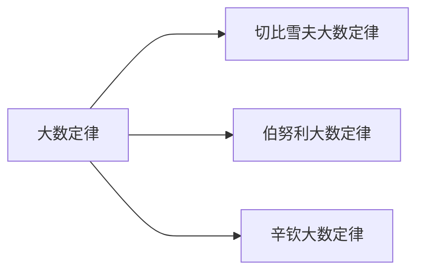

---
{"dg-publish":true,"dg-path":"数学/概率论/大数定律.md","permalink":"/数学/概率论/大数定律/","dgPassFrontmatter":true,"noteIcon":"","created":"2024-05-07T15:12:53.198+08:00","updated":"2024-05-18T22:09:24.767+08:00"}
---

**Law of Large Numbers**
大量测量值的算术平均值具有稳定性
即==频率收敛概率==
>[[频率\|频率]]的稳定性是[[概率\|概率]]存在的基础

设 $X_{1},X_{2},\cdots,X_{n},\cdots$ 为两两互不相关的[[随机变量序列\|随机变量序列]]
对于任意给定的正数 $\varepsilon$, 有 $\lim\limits_{ n \to \infty }P\left\{\left\lvert  X_{n}-X \right\rvert<\varepsilon \right\}=1$
则称序列**依概率收敛**$X$  
 $X_{n} \xrightarrow{P}X\quad(n\to \infty)$

[[统计量\|样本均值]]代替数学[[期望\|期望]]
$$\begin{align}
\bar{X}=\dfrac{1}{n} \sum\limits_{k=1}^{n} X_{k}\quad \to E(X)
\end{align}$$

结论都相同，只是变换了条件

### Chebyshev 大数定律
由[[切比雪夫不等式\|切比雪夫不等式]]得到

$$\begin{align}
\lim\limits_{ n \to \infty } P\left\{\left\lvert  \dfrac{1}{n}\sum\limits_{i=1}^{n}X_{i}-\dfrac{1}{n}\sum\limits_{i=1}^{n}E(X_{i}) \right\rvert <\varepsilon\right\}=1
\end{align}$$

### Bernoulli 大数定律
$n_{A}$ 是 [[n重伯努利试验\|n重伯努利试验]]中事件 A 发生的次数，$p$ 是事件 A 发生的概率
$$\begin{align}
\lim\limits_{ n \to \infty } P\left\{|\dfrac{n_{A}}{n}-p |<\varepsilon\right\}=1
\end{align}$$
也就是频率 $\dfrac{n_{A}}{n}$ 趋近于概率 $p$

### Khinchin 大数定律
独立同分布的随机变量的均值收敛到数学期望
$X_{1},X_{2},\cdots,X_{n},\cdots$ 相互独立，服从同一分布，且具有数学期望 $\mu$
对于任意 $\varepsilon>0$, 有：
$$\begin{align}
\lim\limits_{ n \to \infty } P\left\{|\dfrac{1}{n}\sum\limits_{i=1}^{n}X_{i}-\mu |<\varepsilon\right\}=1
\end{align}$$

