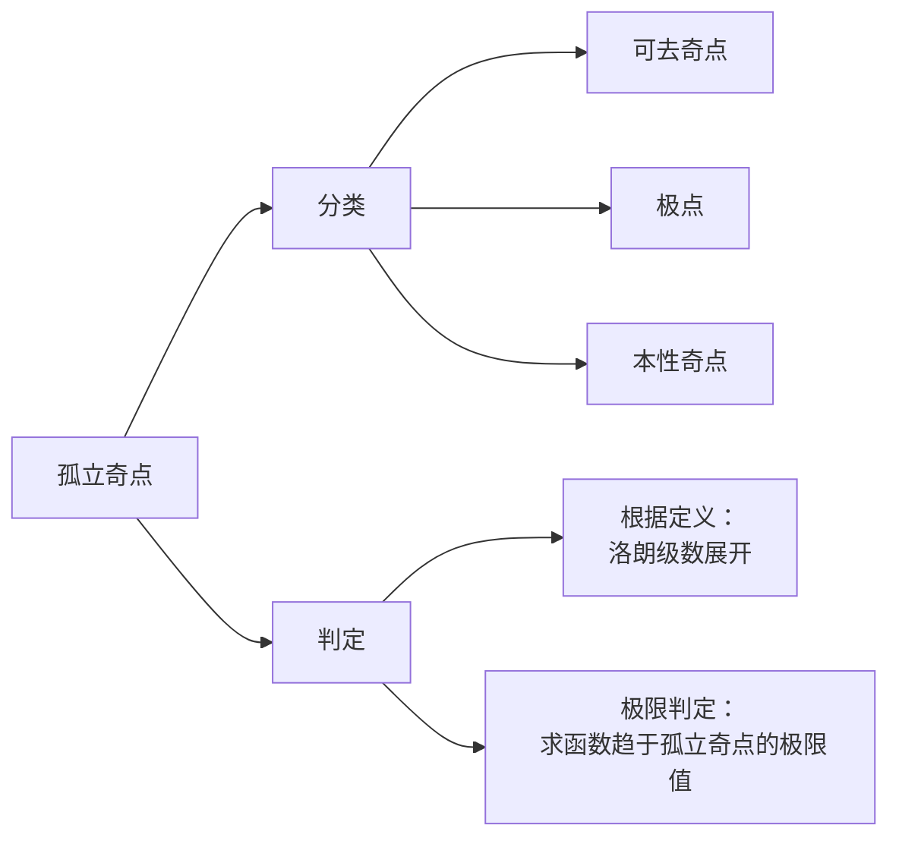

---
{"dg-publish":true,"dg-path":"数学/复变函数/孤立奇点.md","permalink":"/数学/复变函数/孤立奇点/","dgPassFrontmatter":true,"noteIcon":"","created":"2024-05-06T22:14:11.407+08:00","updated":"2024-05-11T14:03:58.119+08:00"}
---

函数 $f(z)$ 在 $z_{0}$ 处不[[解析\|解析]]，而在 $z_{0}$ 的某一[[邻域\|去心邻域]]  $0<|z-z_{0}|< \delta$ 内处处解析
则 $z_{0}$ 为 $f(z)$ 的**孤立奇点**

>[!tip]- 注意
>孤立奇点一定为[[奇点\|奇点]]，而奇点不一定为孤立奇点
> 比如：
>  $f(z)=\dfrac{z^{2}}{\sin \dfrac{1}{z}}$  的奇点 0不是孤立奇点
>  函数奇点为 $z=0\quad z= \dfrac{1}{k\pi}$
>而 $\lim\limits_{ n \to \infty } \dfrac{1}{k\pi}=0$, 在 $z=0$ 的去心邻域内，总有其他不解析的奇点存在，所以 0 不是孤立奇点

### 孤立奇点的分类
根据孤立奇点的去心邻域内的[[洛朗级数\|洛朗级数]]的情况分为三类：

#### 可去奇点
>如果洛朗级数中**不含** $z-z_{0}$ 的**负幂项**，
>则孤立奇点为==可去奇点==

通过补充定义可以使得函数处处解析

>$\lim\limits_{ z \to z_{0} }f(z)$ 如果[[极限\|极限]]存在且为有限值，则为可去奇点
#### 极点
>如果洛朗级数中只有**有限多个** $z-z_{0}$ 的**负幂项**
$f(z)=\dfrac{1}{(z-z_{0})^{m}}g(z)$，$g(z)$ 在 $z_{0}$ 处解析，且 $g(z_{0})\neq 0$
则**孤立奇点**为 m 级==极点==

>$\lim\limits_{ z \to z_{0} }f(z)=\infty$，则为==极点==

#### 本性奇点
>含有**无穷多个负幂项**
>则孤立奇点为==本性奇点==

>$\lim\limits_{ z \to z_{0} }f(z)$ 极限不存在，也不为 $\infty$，则为==本性奇点==

例如：$e^{ 1/z }$

### 零点
#### 零点定义
不恒等于 0 的解析函数如果能表示成： $f(z)=(z-z_{0})^{m}\varphi(z)$
$\varphi(z)$ 在 $z_{0}$ 解析且 $\varphi(z)\neq 0$，$m$ 为正整数，则称 $z_{0}$ 为 $f(z)$ 的 $m$ 级零点
#### 零点的判定
$f(z)$ 在 $z_{0}$ 解析
$m$ 级零点的充要条件：
$$\begin{align}
 & f^{(n)}(z_{0})=0 \quad (n=1,2,\cdots,m-1) \\
 & f^{(m)}(z_{0})\neq 0
\end{align}$$

>[!tip] 为什么有“零点的判定”
>因为有些函数形式上不为 $(z-z_{0})^{n}$ 的展开形式
>可以直接洛朗级数展开
>也可以使用充要条件，求导数判定
#### 零点与极点的关系
如果 $z_0$ 是 $f(z)$ 的 $m$ 级极点/零点，则 $z_0$ 就是的 $m$级零点/极点

可以将讨论==极点==转化为讨论==零点==

$$\begin{align} \\

\dfrac{g(z)}{f(z)}= \dfrac{(z-z_{0})^{n}\psi(z)}{(z-z_{0})^{m}\varphi(z)}=\begin{cases}
n-m级零点 \quad n>m\\
\quad 可去奇点 \,\,\,\,\quad n=m\\
m-n级极点\quad n<m
\end{cases} \\

\end{align}$$

### 无穷远点
$f(z)$ 在[[复数的几何表示\|无穷远点]] $z=\infty$ 的去心邻域内解析
则称 $\infty$ 为 $f(z)$ 的==孤立奇点==
变换： $t= \dfrac{1}{z}\to f(z)=\varphi(t)$

对于：
洛朗级数展开的幂项
极限 $\lim\limits_{ n \to \infty }f(z)$
- 可去奇点
	- 不含正幂项
	- 极限存在且为有限值
- m 级极点
	- 含有有限多个正幂项，$z^{m}$ 为最高次幂
	- 无穷大
- 本性奇点
	- 无穷多的正幂项
	- 极限不存在且不为无穷大

### 例题
1.函数 $$\begin{align}
	f(z)=\dfrac{(z^{2}-1)(z-2)^{3}}{(\sin \pi z)^{3}}
\end{align}$$在扩充复平面内有哪些类型奇点？

函数有奇点： $z=k\quad k\in Z$
对分母而言：
$(\sin \pi z)'\neq 0,z=k$    $z=k$ 为三级极点

对分子而言：
$z=\pm{1}$ 为一级零点，$z=2$ 为三级零点
 
所以对函数而言：
$z=k,k \in Z \cap k\neq\pm 1,2$ 为三级极点
$z=\pm{1}$ 为二级极点
$z=2$ 为可去奇点

扩充复平面：
$z=\infty$ 时，$z=\infty$ 的去心邻域内包含不解析的奇点
所以 $z=\infty$ 不是孤立奇点

>[!important] 基本解法
首先判断函数分母的奇点
再看分子的零点
根据零极点关系，判定孤立奇点的类型
注意孤立奇点的定义
