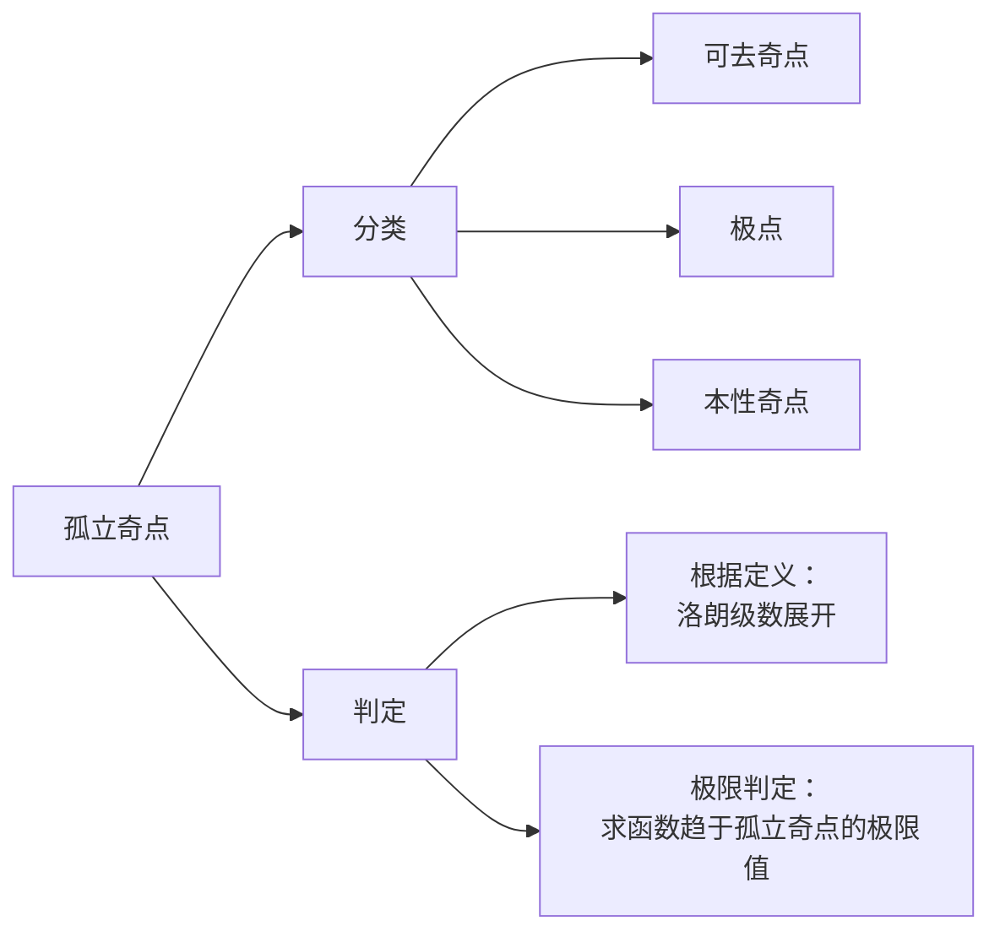

---
{"dg-publish":true,"dg-path":"复变函数/孤立奇点.md","permalink":"/复变函数/孤立奇点/","dgPassFrontmatter":true,"noteIcon":"","created":"2024-10-03T23:03:07.746+08:00","updated":"2024-10-27T14:41:22.062+08:00"}
---

(terminology::**Isolated Singularity**)

函数 $f(z)$ 在 $z_{0}$ 处不[[解析\|解析]]，而在 $z_{0}$ 的某一[[邻域\|去心邻域]]  $0<|z-z_{0}|< \delta$ 内处处解析
则 $z_{0}$ 为 $f(z)$ 的**孤立奇点**

>[!tip] 注意
>孤立奇点一定为[[奇点\|奇点]]，而奇点不一定为孤立奇点
> 比如：
>  $f(z)=\dfrac{z^{2}}{\sin \dfrac{1}{z}}$  的奇点 0不是孤立奇点：
>  函数奇点为 $\sin \dfrac{1}{z}=0$, 也即：
>   $z=0\quad z= \dfrac{1}{k\pi}$
>而 $\lim\limits_{ n \to \infty } \dfrac{1}{k\pi}=0$, 在 $z=0$ 的去心邻域内，总有其他不解析的奇点存在，所以 0 不是孤立奇点

### 孤立奇点的分类
根据孤立奇点的去心邻域内的[[洛朗级数\|洛朗级数]]的情况分为三类：

#### 可去奇点
**定义判定：**
如果洛朗级数中**不含** $z-z_{0}$ 的**负幂项**，
则孤立奇点为==可去奇点==

**极限判定：**
$\lim\limits_{ z \to z_{0} }f(z)$ 如果[[极限\|极限]]存在且为有限值，则为==可去奇点==

通过补充定义可以使得函数处处解析

#### 极点
***定义判定：***
如果洛朗级数中只有**有限多个** $z-z_{0}$ 的**负幂项**
且洛朗级数的负幂项的最高次幂为 $m$
$(z-z_{0})^{-m}$
或者写成：
$f(z)=\dfrac{1}{(z-z_{0})^{m}}g(z)$，$g(z)$ 在 $z_{0}$ 处解析，且 $g(z_{0})\neq 0$

则**孤立奇点**为 $m$ 级==极点==

***极限判定：***
$\lim\limits_{ z \to z_{0} }f(z)=\infty$，则为==极点==

>[!important] 注意
>极点阶数的判断不能 “流于表面”，
>要同时考虑分子和分母
>更要尤其注意形式不为 $(z-z_{0})$ 的幂次
>要实际地讨论，或者转为零点的判断

#### 本性奇点
***定义判定：***
含有**无穷多个负幂项**
则孤立奇点为==本性奇点==

***极限判定：***
$\lim\limits_{ z \to z_{0} }f(z)$ 极限不存在，也不为 $\infty$，则为==本性奇点==

例如：$e^{ 1/z }$

### 零点
#### 零点定义
不恒等于 0 的解析函数 $f(z)$ 如果能表示成： $f(z)=(z-z_{0})^{m}\varphi(z)$
$\varphi(z)$ 在 $z_{0}$ 解析且 $\varphi(z_{0})\neq 0$，$m$ 为正整数，则称 $z_{0}$ 为 $f(z)$ 的 $m$ 级零点
#### 零点的判定
$f(z)$ 在 $z_{0}$ 解析
$m$ 级零点的充要条件：
$$\begin{align}
 & f^{(n)}(z_{0})=0 \quad (n=1,2,\cdots,m-1) \\
 & f^{(m)}(z_{0})\neq 0
\end{align}$$

由[[高阶导数\|高阶导数]]的求导易知：[[泰勒级数（复数意义）\|幂级数展开]]的最低幂次的次数即 为零点的级数

$z=0$ 是 $\dfrac{e^{ z }}{z(1-\cos z)}$ 的？
注意到 $z=0$ 使得分母的 $z\quad(1-\cos z)$ 都为 0，
但是只能初步判断极点的级数大于等于 2，而不一定就为 2
转为零点阶数判断
$(z(1-\cos z))'=1-\cos z+z\sin z$      $z=0$ 时，一阶导数为 0
$(z(1-\cos z))''=\sin z+\sin z+z\cos z$   $z=0$ 时，二阶导数为 0
$(z(1-\cos z))'''=2\cos z+\cos z-z\sin z$   $z=0$ 时，三阶导数不为 0
所以综上，$z=0$ 是原函数的三级极点

#### 零点与极点的关系
如果 $z_0$ 是 $f(z)$ 的 $m$ 级极点/零点，则 $z_0$ 就是的 $m$级零点/极点

可以将讨论==极点==转化为讨论==零点==

$$\begin{align} \\

\dfrac{g(z)}{f(z)}= \dfrac{(z-z_{0})^{n}\psi(z)}{(z-z_{0})^{m}\varphi(z)}=\begin{cases}
n-m级零点 \quad n>m\\
\quad 可去奇点 \,\,\,\,\quad n=m\\
m-n级极点\quad n<m
\end{cases} \\

\end{align}$$

>[!tip] 为什么有“零点的判定”
>因为有些函数形式上不为 $(z-z_{0})^{n}$ 的展开形式
>可以直接洛朗级数展开
>也可以使用充要条件，求导数判定
>
>有些函数极点阶数的判断也可借助零点判断的方法
### 无穷远点
$f(z)$ 在[[复平面\|无穷远点]] $z=\infty$ 的去心邻域 $R<\left\lvert  z \right\rvert<+\infty$ 内解析
则称 $\infty$ 为 $f(z)$ 的==孤立奇点==

***变换：***
$t= \dfrac{1}{z}\to f(z)=\varphi(t)$
$R<\left\lvert  z \right\rvert<+\infty \to 0<\left\lvert  t \right\rvert< \dfrac{1}{R}$
$t=0$ 对应 $\varphi(t)$ 的极点类型**等价于** $z=\infty$ 对应 $f(z)$ 的极点类型

对于洛朗级数展开的幂项
极限 $\lim\limits_{ n \to \infty }f(z)$
- ==可去奇点==
	- **不含正幂项**
	- 极限存在且为有限值
- ==m 级极点==
	- 含有有限多个正幂项，$z^{m}$ 为最高次幂
	- 无穷大
- ==本性奇点==
	- 无穷多的正幂项
	- 极限不存在且不为无穷大

### 例题
1.函数 
$$\begin{align}  

f(z)=\dfrac{(z^{2}-1)(z-2)^{3}}{(\sin \pi z)^{3}} \\

\end{align}$$在扩充复平面内有哪些类型奇点？

函数有奇点： $z=k\quad k\in Z$
对分母而言：
$(\sin \pi z)'\neq 0,z=k$    $z=k$ 为三级极点

对分子而言：
$z=\pm{1}$ 为一级零点，$z=2$ 为三级零点
 
所以对函数而言：
$z=k,k \in Z \cap k\neq\pm 1,2$ 为三级极点
$z=\pm{1}$ 为二级极点
$z=2$ 为可去奇点

扩充复平面：
$z=\infty$ 时，$z=\infty$ 的去心邻域内包含不解析的奇点
所以 $z=\infty$ 不是孤立奇点

>[!important] 基本解法
首先判断函数分母的奇点
再看分子的零点
根据零极点关系，判定孤立奇点的类型
注意孤立奇点的定义
