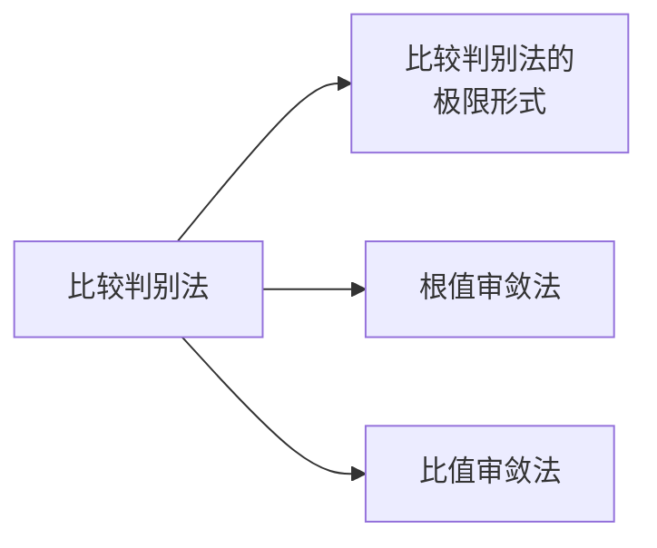

---
{"dg-publish":true,"dg-path":"数学/1. 微积分/级数/2.2 常数项级数审敛法.md","permalink":"/数学/1. 微积分/级数/2.2 常数项级数审敛法/","dgPassFrontmatter":true,"noteIcon":"","created":"2024-05-21T15:36:09.300+08:00","updated":"2025-04-12T22:56:40.120+08:00"}
---

[[常数项级数\|常数项级数]]

### 一、正项级数及其审敛法
==正项级数==：各项都是非负数的常数项级数 $x_{n}\geq 0$
显然，正项级数 $\sum\limits_{n=1}^{\infty}x_{n}$ 的部分和数列 $\left\{S_{n} \right\}$ 单调增加, 根据数列的极限知道：
正项级数收敛的**充分必要条件**：部分和数列有上界

#### 0. 比较判别法 
比较审敛法：用一个已知发散或收敛的级数与之比较
$\sum\limits_{n=1}^{\infty}x_{n}$ 与 $\sum\limits_{n=1}^{\infty}y_{n}$ 是两个正项级数，$x_{n}\leq y_{n},n=1,2,3,\cdots0$
-  $\sum\limits_{n=1}^{\infty}y_{n}$ 收敛时，$\sum\limits_{n=1}^{\infty}x_{n}$ 也收敛
-  $\sum\limits_{n=1}^{\infty}x_{n}$ 发散时，$\sum\limits_{n=1}^{\infty}y_{n}$ 也发散
#### 1. 比较审敛法的极限形式
如果 $x_{n}$ 和 $y_{n}$ 是同阶无穷小量
$$\begin{align}
\lim\limits_{ n \to \infty } \dfrac{x_{n}}{y_{n}}=l\quad (0<l<+\infty)
\end{align}$$
则 $\sum\limits_{n=1}^{\infty}x_{n}$ 和 $\sum\limits_{n=1}^{\infty}y_{n}$ 同时收敛或发散
#### 2. Cauchy 判别法（根值审敛法）
$\sum\limits_{n=1}^{\infty}x_{n}$ 是正项级数，$\rho =\lim\limits_{ n \to \infty } \sqrt[n]{ x_{n} }$
1. 当 $\rho <1$，级数收敛
2. 当 $\rho >1$,   级数发散
3. 当 $\rho =1$, 可能收敛也可能发散

#### 3. D 'Alembert 判别法（比值审敛法）
$\sum\limits_{n=1}^{\infty}x_{n}$ 是正项级数，$\rho =\lim\limits_{ n \to \infty } \dfrac{x_{n+1}}{x_{n}}$
1. 当 $\rho <1$，级数收敛
2. 当 $\rho >1$,   级数发散
3. 当 $\rho =1$, 可能收敛也可能发散
比值审敛法和根植审敛法本质都是(与几何级数相比较的) **比较审敛法**

### 二、交错级数及其审敛法
交错级数 $\sum\limits_{n=1}^{\infty}x_{n}=\sum\limits_{n=1}^{\infty}(-1)^{n+1}u_{n}\quad  u_{n}>0$
进一步，如果 $\sum\limits_{n=1}^{\infty} (-1)^{n+1}u_{n}$ 满足： $\{u_{n}\}$ **单调减少**且**收敛于 0**，则称为 **Leibniz 级数**
$$\begin{cases}
\; u_{n}\geq u_{n+1} \\ \\

\lim\limits_{ n \to \infty } u_{n}=0
\end{cases}$$
Leibniz 级数 **必定收敛**

### 三、任意项级数及其敛散性
**Cauchy 收敛原理**，级数 $\sum\limits_{n=1}^{\infty}x_{n}$ 收敛的充分必要条件是：对任意给定的 $\varepsilon>0$, 存在 $N$，使得
$$\begin{align}
|x_{n+1}+x_{x+2}+\cdots+x_{m}|=|\sum\limits_{k=n+1}^{m} x_{k}|< \varepsilon
\end{align}$$
对一切 $m>n>N$ 成立
#### 绝对收敛和条件收敛
$\sum\limits_{n=1}^{\infty} |x_{n}|$ 收敛，则 $\sum\limits_{n=1}^{\infty}x_{n}$ **绝对收敛**
$\sum\limits_{n=1}^{\infty} x_{n}$ 收敛，$\sum\limits_{n=1}^{\infty}|x_{n}|$ 发散，则 $\sum\limits_{n=1}^{\infty}x_{n}$ **条件收敛**

