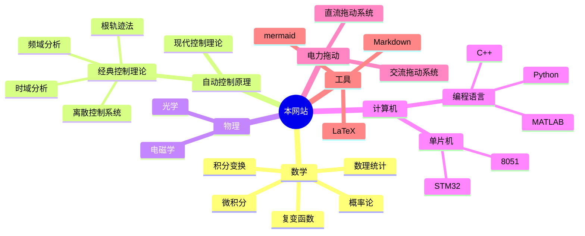

---
{"dg-publish":true,"dg-home":true,"dg-pinned":true,"permalink":"/序言/","pinned":true,"tags":["gardenEntry"],"dgPassFrontmatter":true,"noteIcon":"","created":"2024-05-21T15:20:27.767+08:00","updated":"2024-07-08T12:54:55.004+08:00"}
---

>“方存乎见少，又奚以自多！”——《[[秋水\|秋水]]》· 庄周

### 一、该网站的核心思想
本网站的由来其实也不能完全说是一种巧合，更多的是源于一种**兴致的上升**，
一种想要**传播基础知识的念头**，一个致力于**构建知识体系、惠及他人的想法**。

本网站的内容将包括**基础的数理知识**，然后在此基础上深化，不断地与某些**特定的学科**集成

期望通过构建**基础知识的网络**，不断地将看似 “毫无用处而枯燥”的数学知识与特定领域或现实世界结合起来

### 二、该网站预期覆盖的人群

#### 1. 开源项目的初学者
本项目就是基于最为基础的 **Markdown** 语法的 `.md` 文件渲染的
理论上只要会打字，会 **git**  就能参与进来

要做的工作也不用很多，可以更改几个句子
也可以增加一两篇特定的知识点
#### 2. 高校学生
由于本项目即将覆盖最为基础的通识性数理课程
也将覆盖自动化类的专业课

可以利用此网站进行简要的复习，或是了解知识点之间的联系

#### 3. 高校教师
可能谋求与高校老师合作

共同建设网站，引入新的思想来进行教学改革

#### 4. 参与实际工作的人

实际的工作与生活中，
往往需要用到最为基础的数理知识，

本项目的终极目标就是希望能建立起基础知识与真实世界的联系

### 三、目录导航

>“一切高级数学，归根结底都是**微积分**和**线性代数**的各种变化”
>——丘成桐

#### 1. 较为完善
[[自动控制原理\|自动控制原理]]  
[[概率论\|概率论]]
[[数理统计\|数理统计]]
[[复变函数与积分变换\|复变函数与积分变换]]
[[技术经济与工程管理\|技术经济与工程管理]]
[[电机及电力拖动\|电机及电力拖动]]
[[51 单片机\|微机原理及其应用]]   8051 基础

#### 2 . 即将完善
[[微积分\|微积分]]
[[线性代数\|线性代数]]
[[数字电路\|数字电路]]
[[模拟电路\|模拟电路]]
[[物理\|物理]]
[[计算机\|计算机]]
[[数学建模\|数学建模]]

