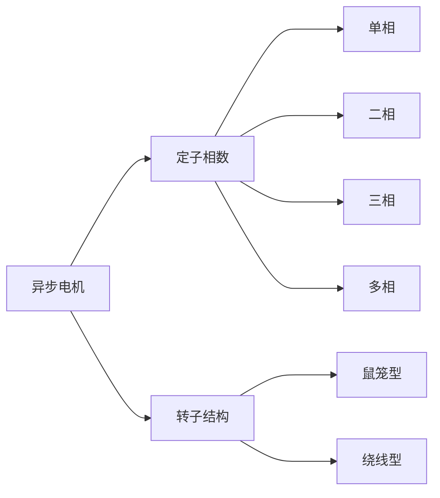

---
{"dg-publish":true,"dg-path":"电机及电力拖动/异步电机.md","permalink":"/电机及电力拖动/异步电机/","dgPassFrontmatter":true,"noteIcon":"","created":"2024-05-21T15:20:27.882+08:00","updated":"2024-06-17T20:08:48.591+08:00"}
---

定子是电动机的静止部分，通常由三组绕组组成，这些绕组在空间上相互错开120度角。
转子是电动机的旋转部分，
可以是鼠笼式（squirrel cage）或绕线式（wound type）

铁芯增加磁导率
[[电磁感应\|电磁感应]]实质：磁链的变化率
$\mu H=B \to BS=\Phi \to n\Phi=\Psi \to \dfrac{\mathrm{d}\Psi }{\mathrm{d} t}=E$

磁导率增大，输出的力矩也增大

### 基本工作原理
#### 总体概述
定子绕组连接到一个三相交流电源。当三相电源供电时，每个绕组在不同时间通过电流，产生变化的磁场

电流相位差120度，它们产生的磁场相互作用，形成旋转磁场

转子绕组的导体在旋转磁场中，根据法拉第[[电磁感应定律\|电磁感应定律]]，切割磁感线，产生感应电流和感应电动势

感应电流与旋转磁场相互作用，产生电磁力

电磁力在转子上产生电磁转矩，驱动转子旋转

$$\begin{align}
H\sin \omega te^{ j0 }+H\sin(\omega t- \dfrac{2}{3}\pi)e^{ j \frac{2}{3 }\pi }+H\sin(\omega t- \dfrac{4}{3}\pi)e^{ j \frac{4}{3}\pi }=H' e^{ j(\omega t+ \frac{\pi}{2}) }
\end{align}$$

#### 旋转磁场的产生
条件：对称三相绕组中通对称三相电流
旋转磁场的特点：旋转磁场是一种极性和大小不变并以一定转速旋转的磁场

所通三相电的频率 $f$
电转速 $\omega=2\pi n=2\pi f$

**一对磁极**时：
电流从时刻 $\omega t=0,120^{\circ},240^{\circ},360^{\circ}$
旋转磁场在空间上转过 $0,120^{\circ},240^{\circ},360^{\circ}$

**p 对磁极**时：
磁极的对数  ${p}$  
同步转速/磁场转速：$n_{0}=\dfrac{n}{{p}}$
磁角速度：$\omega_{0}=\dfrac{\omega}{{p}}=\dfrac{2\pi f}{{p}}=\dfrac{2\pi n}{p}$

磁极对数越多，同步转速越慢

>磁场矢量的合成

### 转速与运行状态
一般情况下，**转子的实际转速** $n$ 总是略低于**同步转速** $n_{0}$

**转差率**    $s= \dfrac{n_{0}-n}{n_{0}}$
- 转子实际转速 $n$
- 同步转速/磁转速  $n_{0}$
- 转差 $n_{0}-n$
	是异步电机运行的必要条件

<svg xmlns="http://www.w3.org/2000/svg" version="1.1" viewBox="0 0 917.1802585957244 327.82976787431016" width="917.1802585957244" height="327.82976787431016">  <!-- svg-source:excalidraw -->    <defs>          </defs>  <rect x="0" y="0" width="917.1802585957244" height="327.82976787431016" fill="#ffffff"></rect><g stroke-linecap="round" transform="translate(317.9451735195151 17.0297713430906) rotate(0 125.49963798138131 126.01115033945342)"><path d="M251 126.01 C251 129.67, 250.84 133.35, 250.52 136.99 C250.2 140.64, 249.73 144.29, 249.09 147.89 C248.46 151.5, 247.67 155.09, 246.72 158.63 C245.78 162.16, 244.68 165.67, 243.43 169.11 C242.18 172.55, 240.78 175.95, 239.24 179.27 C237.7 182.58, 236.01 185.85, 234.19 189.02 C232.36 192.19, 230.39 195.29, 228.3 198.29 C226.21 201.29, 223.98 204.21, 221.64 207.01 C219.29 209.81, 216.82 212.53, 214.24 215.11 C211.66 217.7, 208.96 220.19, 206.17 222.54 C203.38 224.89, 200.47 227.13, 197.48 229.23 C194.5 231.33, 191.41 233.31, 188.25 235.14 C185.09 236.97, 181.84 238.67, 178.54 240.22 C175.23 241.76, 171.85 243.17, 168.42 244.42 C165 245.67, 161.5 246.78, 157.98 247.73 C154.46 248.68, 150.88 249.47, 147.29 250.11 C143.7 250.74, 140.07 251.22, 136.44 251.54 C132.81 251.86, 129.15 252.02, 125.5 252.02 C121.85 252.02, 118.19 251.86, 114.56 251.54 C110.93 251.22, 107.3 250.74, 103.71 250.11 C100.12 249.47, 96.54 248.68, 93.02 247.73 C89.5 246.78, 86 245.67, 82.58 244.42 C79.15 243.17, 75.77 241.76, 72.46 240.22 C69.16 238.67, 65.91 236.97, 62.75 235.14 C59.59 233.31, 56.5 231.33, 53.52 229.23 C50.53 227.13, 47.62 224.89, 44.83 222.54 C42.04 220.19, 39.34 217.7, 36.76 215.11 C34.18 212.53, 31.7 209.81, 29.36 207.01 C27.02 204.21, 24.79 201.29, 22.7 198.29 C20.61 195.29, 18.64 192.19, 16.81 189.02 C14.99 185.85, 13.3 182.58, 11.76 179.27 C10.22 175.95, 8.82 172.55, 7.57 169.11 C6.32 165.67, 5.22 162.16, 4.28 158.63 C3.33 155.09, 2.54 151.5, 1.91 147.89 C1.27 144.29, 0.8 140.64, 0.48 136.99 C0.16 133.35, 0 129.67, 0 126.01 C0 122.35, 0.16 118.68, 0.48 115.03 C0.8 111.38, 1.27 107.73, 1.91 104.13 C2.54 100.52, 3.33 96.93, 4.28 93.4 C5.22 89.86, 6.32 86.35, 7.57 82.91 C8.82 79.47, 10.22 76.07, 11.76 72.76 C13.3 69.44, 14.99 66.18, 16.81 63.01 C18.64 59.84, 20.61 56.73, 22.7 53.73 C24.79 50.74, 27.02 47.82, 29.36 45.01 C31.7 42.21, 34.18 39.5, 36.76 36.91 C39.34 34.32, 42.04 31.83, 44.83 29.48 C47.62 27.13, 50.53 24.89, 53.52 22.79 C56.5 20.69, 59.59 18.71, 62.75 16.88 C65.91 15.05, 69.16 13.35, 72.46 11.81 C75.77 10.26, 79.15 8.85, 82.58 7.6 C86 6.35, 89.5 5.24, 93.02 4.29 C96.54 3.35, 100.12 2.55, 103.71 1.91 C107.3 1.28, 110.93 0.8, 114.56 0.48 C118.19 0.16, 121.85 0, 125.5 0 C129.15 0, 132.81 0.16, 136.44 0.48 C140.07 0.8, 143.7 1.28, 147.29 1.91 C150.88 2.55, 154.46 3.35, 157.98 4.29 C161.5 5.24, 165 6.35, 168.42 7.6 C171.85 8.85, 175.23 10.26, 178.54 11.81 C181.84 13.35, 185.09 15.05, 188.25 16.88 C191.41 18.71, 194.5 20.69, 197.48 22.79 C200.47 24.89, 203.38 27.13, 206.17 29.48 C208.96 31.83, 211.66 34.32, 214.24 36.91 C216.82 39.5, 219.29 42.21, 221.64 45.01 C223.98 47.82, 226.21 50.74, 228.3 53.73 C230.39 56.73, 232.36 59.84, 234.19 63.01 C236.01 66.18, 237.7 69.44, 239.24 72.76 C240.78 76.07, 242.18 79.47, 243.43 82.91 C244.68 86.35, 245.78 89.86, 246.72 93.4 C247.67 96.93, 248.46 100.52, 249.09 104.13 C249.73 107.73, 250.2 111.38, 250.52 115.03 C250.84 118.68, 250.92 124.18, 251 126.01 C251.08 127.84, 251.08 124.18, 251 126.01" stroke="#1e1e1e" stroke-width="2" fill="none"></path></g><g stroke-linecap="round" transform="translate(356.19137279269495 56.66784737278999) rotate(0 87.57382448672277 85.53356191467537)"><path d="M175.15 85.53 C175.15 88.51, 174.99 91.51, 174.67 94.47 C174.35 97.44, 173.87 100.4, 173.23 103.32 C172.6 106.23, 171.8 109.13, 170.86 111.96 C169.92 114.8, 168.82 117.6, 167.58 120.32 C166.34 123.05, 164.94 125.72, 163.41 128.3 C161.89 130.88, 160.22 133.4, 158.42 135.81 C156.63 138.22, 154.7 140.55, 152.65 142.77 C150.61 144.98, 148.44 147.1, 146.17 149.1 C143.9 151.09, 141.52 152.98, 139.05 154.73 C136.58 156.48, 134 158.12, 131.36 159.61 C128.72 161.1, 125.98 162.46, 123.19 163.67 C120.41 164.88, 117.54 165.96, 114.64 166.88 C111.73 167.8, 108.77 168.58, 105.78 169.2 C102.8 169.82, 99.76 170.29, 96.73 170.6 C93.69 170.91, 90.63 171.07, 87.57 171.07 C84.52 171.07, 81.45 170.91, 78.42 170.6 C75.39 170.29, 72.35 169.82, 69.37 169.2 C66.38 168.58, 63.41 167.8, 60.51 166.88 C57.61 165.96, 54.74 164.88, 51.95 163.67 C49.17 162.46, 46.43 161.1, 43.79 159.61 C41.14 158.12, 38.57 156.48, 36.1 154.73 C33.63 152.98, 31.24 151.09, 28.98 149.1 C26.71 147.1, 24.54 144.98, 22.49 142.77 C20.45 140.55, 18.52 138.22, 16.73 135.81 C14.93 133.4, 13.26 130.88, 11.73 128.3 C10.21 125.72, 8.81 123.05, 7.57 120.32 C6.33 117.6, 5.23 114.8, 4.29 111.96 C3.34 109.13, 2.55 106.23, 1.91 103.32 C1.28 100.4, 0.8 97.44, 0.48 94.47 C0.16 91.51, 0 88.51, 0 85.53 C0 82.55, 0.16 79.56, 0.48 76.59 C0.8 73.63, 1.28 70.67, 1.91 67.75 C2.55 64.84, 3.34 61.94, 4.29 59.1 C5.23 56.27, 6.33 53.47, 7.57 50.74 C8.81 48.02, 10.21 45.35, 11.73 42.77 C13.26 40.19, 14.93 37.67, 16.73 35.26 C18.52 32.85, 20.45 30.52, 22.49 28.3 C24.54 26.09, 26.71 23.96, 28.98 21.97 C31.24 19.98, 33.63 18.09, 36.1 16.34 C38.57 14.58, 41.14 12.95, 43.79 11.46 C46.43 9.97, 49.17 8.61, 51.95 7.39 C54.74 6.18, 57.61 5.11, 60.51 4.19 C63.41 3.27, 66.38 2.49, 69.37 1.87 C72.35 1.25, 75.39 0.78, 78.42 0.47 C81.45 0.16, 84.52 0, 87.57 0 C90.63 0, 93.69 0.16, 96.73 0.47 C99.76 0.78, 102.8 1.25, 105.78 1.87 C108.77 2.49, 111.73 3.27, 114.64 4.19 C117.54 5.11, 120.41 6.18, 123.19 7.39 C125.98 8.61, 128.72 9.97, 131.36 11.46 C134 12.95, 136.58 14.58, 139.05 16.34 C141.52 18.09, 143.9 19.98, 146.17 21.97 C148.44 23.96, 150.61 26.09, 152.65 28.3 C154.7 30.52, 156.63 32.85, 158.42 35.26 C160.22 37.67, 161.89 40.19, 163.41 42.77 C164.94 45.35, 166.34 48.02, 167.58 50.74 C168.82 53.47, 169.92 56.27, 170.86 59.1 C171.8 61.94, 172.6 64.84, 173.23 67.75 C173.87 70.67, 174.35 73.63, 174.67 76.59 C174.99 79.56, 175.07 84.04, 175.15 85.53 C175.23 87.02, 175.23 84.04, 175.15 85.53" stroke="#1e1e1e" stroke-width="2" fill="none"></path></g><g transform="translate(437.1811742090475 20.40783991008618) rotate(0 5.859375 12)"><text x="0" y="19.3125" font-family="Cascadia, Segoe UI Emoji" font-size="20px" fill="#e03131" text-anchor="start" style="white-space: pre;" direction="ltr" dominant-baseline="alphabetic">N</text></g><g transform="translate(437.5875633903859 238.02230097758365) rotate(0 5.859375 12)"><text x="0" y="19.3125" font-family="Cascadia, Segoe UI Emoji" font-size="20px" fill="#e03131" text-anchor="start" style="white-space: pre;" direction="ltr" dominant-baseline="alphabetic">S</text></g><g stroke-linecap="round" transform="translate(376.840672059144 75.37780439155199) rotate(0 66.14162466154423 66.14162466154414)"><path d="M132.28 66.14 C132.28 68.8, 132.12 71.48, 131.8 74.11 C131.48 76.75, 131 79.39, 130.36 81.97 C129.73 84.55, 128.93 87.11, 127.99 89.6 C127.04 92.08, 125.94 94.53, 124.71 96.88 C123.47 99.23, 122.08 101.53, 120.58 103.71 C119.07 105.9, 117.41 108.01, 115.65 110 C113.89 111.99, 111.99 113.89, 110 115.65 C108.01 117.41, 105.9 119.07, 103.71 120.58 C101.53 122.08, 99.23 123.47, 96.88 124.71 C94.53 125.94, 92.08 127.04, 89.6 127.99 C87.11 128.93, 84.55 129.73, 81.97 130.36 C79.39 131, 76.75 131.48, 74.11 131.8 C71.48 132.12, 68.8 132.28, 66.14 132.28 C63.48 132.28, 60.81 132.12, 58.17 131.8 C55.53 131.48, 52.89 131, 50.31 130.36 C47.73 129.73, 45.17 128.93, 42.69 127.99 C40.2 127.04, 37.76 125.94, 35.4 124.71 C33.05 123.47, 30.76 122.08, 28.57 120.58 C26.38 119.07, 24.27 117.41, 22.28 115.65 C20.29 113.89, 18.4 111.99, 16.63 110 C14.87 108.01, 13.22 105.9, 11.71 103.71 C10.2 101.53, 8.81 99.23, 7.58 96.88 C6.34 94.53, 5.24 92.08, 4.3 89.6 C3.36 87.11, 2.56 84.55, 1.92 81.97 C1.29 79.39, 0.8 76.75, 0.48 74.11 C0.16 71.48, 0 68.8, 0 66.14 C0 63.48, 0.16 60.81, 0.48 58.17 C0.8 55.53, 1.29 52.89, 1.92 50.31 C2.56 47.73, 3.36 45.17, 4.3 42.69 C5.24 40.2, 6.34 37.76, 7.58 35.4 C8.81 33.05, 10.2 30.76, 11.71 28.57 C13.22 26.38, 14.87 24.27, 16.63 22.28 C18.4 20.29, 20.29 18.4, 22.28 16.63 C24.27 14.87, 26.38 13.22, 28.57 11.71 C30.76 10.2, 33.05 8.81, 35.4 7.58 C37.76 6.34, 40.2 5.24, 42.69 4.3 C45.17 3.36, 47.73 2.56, 50.31 1.92 C52.89 1.29, 55.53 0.8, 58.17 0.48 C60.81 0.16, 63.48 0, 66.14 0 C68.8 0, 71.48 0.16, 74.11 0.48 C76.75 0.8, 79.39 1.29, 81.97 1.92 C84.55 2.56, 87.11 3.36, 89.6 4.3 C92.08 5.24, 94.53 6.34, 96.88 7.58 C99.23 8.81, 101.53 10.2, 103.71 11.71 C105.9 13.22, 108.01 14.87, 110 16.63 C111.99 18.4, 113.89 20.29, 115.65 22.28 C117.41 24.27, 119.07 26.38, 120.58 28.57 C122.08 30.76, 123.47 33.05, 124.71 35.4 C125.94 37.76, 127.04 40.2, 127.99 42.69 C128.93 45.17, 129.73 47.73, 130.36 50.31 C131 52.89, 131.48 55.53, 131.8 58.17 C132.12 60.81, 132.28 63.48, 132.28 66.14" stroke="#2f9e44" stroke-width="2" fill="none"></path></g><g stroke-linecap="round"><g transform="translate(503.39525899940065 54.02500237689583) rotate(0 22.13398324867842 24.477621358497913)"><path d="M0 0 C4.47 2.95, 19.44 9.55, 26.82 17.71 C34.2 25.87, 41.36 43.75, 44.27 48.96 M0 0 C4.47 2.95, 19.44 9.55, 26.82 17.71 C34.2 25.87, 41.36 43.75, 44.27 48.96" stroke="#e03131" stroke-width="2" fill="none"></path></g><g transform="translate(503.39525899940065 54.02500237689583) rotate(0 22.13398324867842 24.477621358497913)"><path d="M31.4 36.52 C34.57 39.59, 37.75 42.65, 44.27 48.96 M31.4 36.52 C34.99 39.99, 38.59 43.47, 44.27 48.96" stroke="#e03131" stroke-width="2" fill="none"></path></g><g transform="translate(503.39525899940065 54.02500237689583) rotate(0 22.13398324867842 24.477621358497913)"><path d="M42.4 31.16 C42.86 35.55, 43.32 39.93, 44.27 48.96 M42.4 31.16 C42.92 36.13, 43.45 41.1, 44.27 48.96" stroke="#e03131" stroke-width="2" fill="none"></path></g></g><mask></mask><g stroke-linecap="round"><g transform="translate(419.5462760884557 246.46070007870185) rotate(0 -29.815787532070203 -16.925996782397306)"><path d="M0 0 C-4.51 -0.74, -17.14 1.22, -27.08 -4.43 C-37.02 -10.07, -54.21 -28.95, -59.63 -33.85 M0 0 C-4.51 -0.74, -17.14 1.22, -27.08 -4.43 C-37.02 -10.07, -54.21 -28.95, -59.63 -33.85" stroke="#e03131" stroke-width="2" fill="none"></path></g><g transform="translate(419.5462760884557 246.46070007870185) rotate(0 -29.815787532070203 -16.925996782397306)"><path d="M-39.69 -24.7 C-45.4 -27.32, -51.11 -29.94, -59.63 -33.85 M-39.69 -24.7 C-47.37 -28.23, -55.05 -31.75, -59.63 -33.85" stroke="#e03131" stroke-width="2" fill="none"></path></g><g transform="translate(419.5462760884557 246.46070007870185) rotate(0 -29.815787532070203 -16.925996782397306)"><path d="M-50.24 -14.03 C-52.93 -19.7, -55.62 -25.38, -59.63 -33.85 M-50.24 -14.03 C-53.86 -21.66, -57.47 -29.3, -59.63 -33.85" stroke="#e03131" stroke-width="2" fill="none"></path></g></g><mask></mask><g transform="translate(566.4759922978874 64.83146670812494) rotate(0 16.6845703125 11.5)"><text x="0" y="18.400390625" font-family="Helvetica, Segoe UI Emoji" font-size="20px" fill="#e03131" text-anchor="start" style="white-space: pre;" direction="ltr" dominant-baseline="alphabetic">n_0</text></g><g stroke-linecap="round" transform="translate(430.85832307290696 83.47917045912118) rotate(0 12.281464784266234 12.120926634315083)"><path d="M24.56 12.12 C24.56 12.82, 24.5 13.53, 24.38 14.23 C24.25 14.92, 24.07 15.61, 23.82 16.27 C23.58 16.93, 23.27 17.57, 22.92 18.18 C22.56 18.79, 22.15 19.37, 21.69 19.91 C21.23 20.45, 20.72 20.96, 20.18 21.41 C19.63 21.86, 19.04 22.27, 18.42 22.62 C17.81 22.97, 17.15 23.27, 16.48 23.51 C15.81 23.75, 15.11 23.94, 14.41 24.06 C13.71 24.18, 12.99 24.24, 12.28 24.24 C11.57 24.24, 10.85 24.18, 10.15 24.06 C9.45 23.94, 8.75 23.75, 8.08 23.51 C7.41 23.27, 6.76 22.97, 6.14 22.62 C5.53 22.27, 4.93 21.86, 4.39 21.41 C3.84 20.96, 3.33 20.45, 2.87 19.91 C2.42 19.37, 2 18.79, 1.65 18.18 C1.29 17.57, 0.98 16.93, 0.74 16.27 C0.5 15.61, 0.31 14.92, 0.19 14.23 C0.06 13.53, 0 12.82, 0 12.12 C0 11.42, 0.06 10.71, 0.19 10.02 C0.31 9.33, 0.5 8.63, 0.74 7.98 C0.98 7.32, 1.29 6.67, 1.65 6.06 C2 5.45, 2.42 4.87, 2.87 4.33 C3.33 3.79, 3.84 3.29, 4.39 2.84 C4.93 2.38, 5.53 1.97, 6.14 1.62 C6.76 1.27, 7.41 0.97, 8.08 0.73 C8.75 0.49, 9.45 0.31, 10.15 0.18 C10.85 0.06, 11.57 0, 12.28 0 C12.99 0, 13.71 0.06, 14.41 0.18 C15.11 0.31, 15.81 0.49, 16.48 0.73 C17.15 0.97, 17.81 1.27, 18.42 1.62 C19.04 1.97, 19.63 2.38, 20.18 2.84 C20.72 3.29, 21.23 3.79, 21.69 4.33 C22.15 4.87, 22.56 5.45, 22.92 6.06 C23.27 6.67, 23.58 7.32, 23.82 7.98 C24.07 8.63, 24.25 9.33, 24.38 10.02 C24.5 10.71, 24.53 11.77, 24.56 12.12 C24.59 12.47, 24.59 11.77, 24.56 12.12" stroke="#2f9e44" stroke-width="2" fill="none"></path></g><g stroke-linecap="round" transform="translate(430.4218629685912 175.26821421678233) rotate(0 12.281464784266234 12.120926634315083)"><path d="M24.56 12.12 C24.56 12.82, 24.5 13.53, 24.38 14.23 C24.25 14.92, 24.07 15.61, 23.82 16.27 C23.58 16.93, 23.27 17.57, 22.92 18.18 C22.56 18.79, 22.15 19.37, 21.69 19.91 C21.23 20.45, 20.72 20.96, 20.18 21.41 C19.63 21.86, 19.04 22.27, 18.42 22.62 C17.81 22.97, 17.15 23.27, 16.48 23.51 C15.81 23.75, 15.11 23.94, 14.41 24.06 C13.71 24.18, 12.99 24.24, 12.28 24.24 C11.57 24.24, 10.85 24.18, 10.15 24.06 C9.45 23.94, 8.75 23.75, 8.08 23.51 C7.41 23.27, 6.76 22.97, 6.14 22.62 C5.53 22.27, 4.93 21.86, 4.39 21.41 C3.84 20.96, 3.33 20.45, 2.87 19.91 C2.42 19.37, 2 18.79, 1.65 18.18 C1.29 17.57, 0.98 16.93, 0.74 16.27 C0.5 15.61, 0.31 14.92, 0.19 14.23 C0.06 13.53, 0 12.82, 0 12.12 C0 11.42, 0.06 10.71, 0.19 10.02 C0.31 9.33, 0.5 8.63, 0.74 7.98 C0.98 7.32, 1.29 6.67, 1.65 6.06 C2 5.45, 2.42 4.87, 2.87 4.33 C3.33 3.79, 3.84 3.29, 4.39 2.84 C4.93 2.38, 5.53 1.97, 6.14 1.62 C6.76 1.27, 7.41 0.97, 8.08 0.73 C8.75 0.49, 9.45 0.31, 10.15 0.18 C10.85 0.06, 11.57 0, 12.28 0 C12.99 0, 13.71 0.06, 14.41 0.18 C15.11 0.31, 15.81 0.49, 16.48 0.73 C17.15 0.97, 17.81 1.27, 18.42 1.62 C19.04 1.97, 19.63 2.38, 20.18 2.84 C20.72 3.29, 21.23 3.79, 21.69 4.33 C22.15 4.87, 22.56 5.45, 22.92 6.06 C23.27 6.67, 23.58 7.32, 23.82 7.98 C24.07 8.63, 24.25 9.33, 24.38 10.02 C24.5 10.71, 24.53 11.77, 24.56 12.12 C24.59 12.47, 24.59 11.77, 24.56 12.12" stroke="#2f9e44" stroke-width="2" fill="none"></path></g><g stroke-linecap="round"><g transform="translate(476.0738315865657 105.87080311832233) rotate(0 6.638242203057189 17.085572954087183)"><path d="M0 0 C2.21 2.4, 11.18 8.72, 13.28 14.42 C15.37 20.11, 12.69 30.88, 12.57 34.17 M0 0 C2.21 2.4, 11.18 8.72, 13.28 14.42 C15.37 20.11, 12.69 30.88, 12.57 34.17" stroke="#2f9e44" stroke-width="2" fill="none"></path></g><g transform="translate(476.0738315865657 105.87080311832233) rotate(0 6.638242203057189 17.085572954087183)"><path d="M10.41 24.53 C11.23 28.17, 12.04 31.81, 12.57 34.17 M10.41 24.53 C11.15 27.83, 11.89 31.13, 12.57 34.17" stroke="#2f9e44" stroke-width="2" fill="none"></path></g><g transform="translate(476.0738315865657 105.87080311832233) rotate(0 6.638242203057189 17.085572954087183)"><path d="M17.11 25.39 C15.4 28.71, 13.69 32.02, 12.57 34.17 M17.11 25.39 C15.56 28.4, 14 31.41, 12.57 34.17" stroke="#2f9e44" stroke-width="2" fill="none"></path></g></g><mask></mask><g transform="translate(463.6805804393819 123.71870492388234) rotate(0 4.166298464226287 8.614983444201698)"><text x="0" y="13.78426613923649" font-family="Helvetica, Segoe UI Emoji" font-size="14.982579902959522px" fill="#2f9e44" text-anchor="start" style="white-space: pre;" direction="ltr" dominant-baseline="alphabetic">n</text></g><g stroke-linecap="round"><g transform="translate(443.00831341570813 42.934326029079784) rotate(0 -0.4433592165651987 96.98531135566486)"><path d="M0 0 C-0.15 32.33, -0.74 161.64, -0.89 193.97" stroke="#e03131" stroke-width="2.5" fill="none" stroke-dasharray="8 10"></path></g><g transform="translate(443.00831341570813 42.934326029079784) rotate(0 -0.4433592165651987 96.98531135566486)"><path d="M-9.33 170.44 C-7.14 176.54, -4.95 182.64, -0.89 193.97" stroke="#e03131" stroke-width="2.5" fill="none"></path></g><g transform="translate(443.00831341570813 42.934326029079784) rotate(0 -0.4433592165651987 96.98531135566486)"><path d="M7.77 170.52 C5.53 176.6, 3.28 182.68, -0.89 193.97" stroke="#e03131" stroke-width="2.5" fill="none"></path></g></g><mask></mask><g transform="translate(443.552615405223 95.07836637365358) rotate(0 0.00004999999998744897 0.00004999999998744897)" stroke="none"><path fill="#2f9e44" d="M 3.14,-3.14 Q 3.14,-3.14 3.55,-2.55 3.97,-1.97 4.18,-1.28 4.40,-0.59 4.38,0.11 4.36,0.83 4.11,1.51 3.86,2.18 3.41,2.74 2.96,3.30 2.36,3.69 1.75,4.08 1.05,4.25 0.36,4.42 -0.35,4.36 -1.07,4.31 -1.73,4.02 -2.39,3.74 -2.92,3.26 -3.46,2.78 -3.81,2.15 -4.16,1.53 -4.30,0.82 -4.43,0.11 -4.34,-0.59 -4.24,-1.30 -3.92,-1.94 -3.60,-2.59 -3.09,-3.09 -2.59,-3.60 -1.94,-3.92 -1.30,-4.24 -0.59,-4.34 0.12,-4.43 0.82,-4.30 1.53,-4.16 2.15,-3.81 2.78,-3.46 3.26,-2.92 3.74,-2.39 4.02,-1.73 4.31,-1.07 4.36,-0.35 4.42,0.36 4.25,1.05 4.07,1.75 3.69,2.36 3.30,2.96 2.74,3.41 2.18,3.86 1.51,4.11 0.83,4.36 0.11,4.38 -0.60,4.40 -1.28,4.18 -1.97,3.97 -2.55,3.55 -3.14,3.13 -3.14,3.14 -3.14,3.14 -3.47,2.71 -3.80,2.29 -4.02,1.80 -4.24,1.32 -4.33,0.79 -4.43,0.26 -4.40,-0.26 -4.36,-0.80 -4.20,-1.31 -4.04,-1.82 -3.77,-2.28 -3.49,-2.73 -3.11,-3.11 -2.73,-3.49 -2.28,-3.77 -1.82,-4.05 -1.31,-4.20 -0.80,-4.36 -0.26,-4.40 0.26,-4.43 0.79,-4.33 1.32,-4.24 1.80,-4.02 2.29,-3.80 2.71,-3.47 3.14,-3.14 3.14,-3.14 L 3.14,-3.14 Z"></path></g><g stroke-linecap="round"><g transform="translate(435.53783297066224 178.97676168923863) rotate(0 7.878529104998478 7.800515517038434)"><path d="M0 0 C2.63 2.6, 13.13 13, 15.76 15.6 M0 0 C2.63 2.6, 13.13 13, 15.76 15.6" stroke="#2f9e44" stroke-width="2" fill="none"></path></g></g><mask></mask><g stroke-linecap="round"><g transform="translate(450.20282435589655 180.22482483825206) rotate(0 -7.332485408727365 7.332490550672219)"><path d="M0 0 C-2.44 2.44, -12.22 12.22, -14.66 14.66 M0 0 C-2.44 2.44, -12.22 12.22, -14.66 14.66" stroke="#2f9e44" stroke-width="2" fill="none"></path></g></g><mask></mask><g stroke-linecap="round" transform="translate(625.280299192352 17.029771875125448) rotate(0 125.49963798138131 126.01115033945342)"><path d="M251 126.01 C251 129.67, 250.84 133.35, 250.52 136.99 C250.2 140.64, 249.73 144.29, 249.09 147.89 C248.46 151.5, 247.67 155.09, 246.72 158.63 C245.78 162.16, 244.68 165.67, 243.43 169.11 C242.18 172.55, 240.78 175.95, 239.24 179.27 C237.7 182.58, 236.01 185.85, 234.19 189.02 C232.36 192.19, 230.39 195.29, 228.3 198.29 C226.21 201.29, 223.98 204.21, 221.64 207.01 C219.29 209.81, 216.82 212.53, 214.24 215.11 C211.66 217.7, 208.96 220.19, 206.17 222.54 C203.38 224.89, 200.47 227.13, 197.48 229.23 C194.5 231.33, 191.41 233.31, 188.25 235.14 C185.09 236.97, 181.84 238.67, 178.54 240.22 C175.23 241.76, 171.85 243.17, 168.42 244.42 C165 245.67, 161.5 246.78, 157.98 247.73 C154.46 248.68, 150.88 249.47, 147.29 250.11 C143.7 250.74, 140.07 251.22, 136.44 251.54 C132.81 251.86, 129.15 252.02, 125.5 252.02 C121.85 252.02, 118.19 251.86, 114.56 251.54 C110.93 251.22, 107.3 250.74, 103.71 250.11 C100.12 249.47, 96.54 248.68, 93.02 247.73 C89.5 246.78, 86 245.67, 82.58 244.42 C79.15 243.17, 75.77 241.76, 72.46 240.22 C69.16 238.67, 65.91 236.97, 62.75 235.14 C59.59 233.31, 56.5 231.33, 53.52 229.23 C50.53 227.13, 47.62 224.89, 44.83 222.54 C42.04 220.19, 39.34 217.7, 36.76 215.11 C34.18 212.53, 31.7 209.81, 29.36 207.01 C27.02 204.21, 24.79 201.29, 22.7 198.29 C20.61 195.29, 18.64 192.19, 16.81 189.02 C14.99 185.85, 13.3 182.58, 11.76 179.27 C10.22 175.95, 8.82 172.55, 7.57 169.11 C6.32 165.67, 5.22 162.16, 4.28 158.63 C3.33 155.09, 2.54 151.5, 1.91 147.89 C1.27 144.29, 0.8 140.64, 0.48 136.99 C0.16 133.35, 0 129.67, 0 126.01 C0 122.35, 0.16 118.68, 0.48 115.03 C0.8 111.38, 1.27 107.73, 1.91 104.13 C2.54 100.52, 3.33 96.93, 4.28 93.4 C5.22 89.86, 6.32 86.35, 7.57 82.91 C8.82 79.47, 10.22 76.07, 11.76 72.76 C13.3 69.44, 14.99 66.18, 16.81 63.01 C18.64 59.84, 20.61 56.73, 22.7 53.73 C24.79 50.74, 27.02 47.82, 29.36 45.01 C31.7 42.21, 34.18 39.5, 36.76 36.91 C39.34 34.32, 42.04 31.83, 44.83 29.48 C47.62 27.13, 50.53 24.89, 53.52 22.79 C56.5 20.69, 59.59 18.71, 62.75 16.88 C65.91 15.05, 69.16 13.35, 72.46 11.81 C75.77 10.26, 79.15 8.85, 82.58 7.6 C86 6.35, 89.5 5.24, 93.02 4.29 C96.54 3.35, 100.12 2.55, 103.71 1.91 C107.3 1.28, 110.93 0.8, 114.56 0.48 C118.19 0.16, 121.85 0, 125.5 0 C129.15 0, 132.81 0.16, 136.44 0.48 C140.07 0.8, 143.7 1.28, 147.29 1.91 C150.88 2.55, 154.46 3.35, 157.98 4.29 C161.5 5.24, 165 6.35, 168.42 7.6 C171.85 8.85, 175.23 10.26, 178.54 11.81 C181.84 13.35, 185.09 15.05, 188.25 16.88 C191.41 18.71, 194.5 20.69, 197.48 22.79 C200.47 24.89, 203.38 27.13, 206.17 29.48 C208.96 31.83, 211.66 34.32, 214.24 36.91 C216.82 39.5, 219.29 42.21, 221.64 45.01 C223.98 47.82, 226.21 50.74, 228.3 53.73 C230.39 56.73, 232.36 59.84, 234.19 63.01 C236.01 66.18, 237.7 69.44, 239.24 72.76 C240.78 76.07, 242.18 79.47, 243.43 82.91 C244.68 86.35, 245.78 89.86, 246.72 93.4 C247.67 96.93, 248.46 100.52, 249.09 104.13 C249.73 107.73, 250.2 111.38, 250.52 115.03 C250.84 118.68, 250.92 124.18, 251 126.01 C251.08 127.84, 251.08 124.18, 251 126.01" stroke="#1e1e1e" stroke-width="2" fill="none"></path></g><g stroke-linecap="round" transform="translate(663.5264984655319 56.66784790482495) rotate(0 87.57382448672277 85.53356191467532)"><path d="M175.15 85.53 C175.15 88.51, 174.99 91.51, 174.67 94.47 C174.35 97.44, 173.87 100.4, 173.23 103.32 C172.6 106.23, 171.8 109.13, 170.86 111.96 C169.92 114.8, 168.82 117.6, 167.58 120.32 C166.34 123.05, 164.94 125.72, 163.41 128.3 C161.89 130.88, 160.22 133.4, 158.42 135.81 C156.63 138.22, 154.7 140.55, 152.65 142.77 C150.61 144.98, 148.44 147.1, 146.17 149.1 C143.9 151.09, 141.52 152.98, 139.05 154.73 C136.58 156.48, 134 158.12, 131.36 159.61 C128.72 161.1, 125.98 162.46, 123.19 163.67 C120.41 164.88, 117.54 165.96, 114.64 166.88 C111.73 167.8, 108.77 168.58, 105.78 169.2 C102.8 169.82, 99.76 170.29, 96.73 170.6 C93.69 170.91, 90.63 171.07, 87.57 171.07 C84.52 171.07, 81.45 170.91, 78.42 170.6 C75.39 170.29, 72.35 169.82, 69.37 169.2 C66.38 168.58, 63.41 167.8, 60.51 166.88 C57.61 165.96, 54.74 164.88, 51.95 163.67 C49.17 162.46, 46.43 161.1, 43.79 159.61 C41.14 158.12, 38.57 156.48, 36.1 154.73 C33.63 152.98, 31.24 151.09, 28.98 149.1 C26.71 147.1, 24.54 144.98, 22.49 142.77 C20.45 140.55, 18.52 138.22, 16.73 135.81 C14.93 133.4, 13.26 130.88, 11.73 128.3 C10.21 125.72, 8.81 123.05, 7.57 120.32 C6.33 117.6, 5.23 114.8, 4.29 111.96 C3.34 109.13, 2.55 106.23, 1.91 103.32 C1.28 100.4, 0.8 97.44, 0.48 94.47 C0.16 91.51, 0 88.51, 0 85.53 C0 82.55, 0.16 79.56, 0.48 76.59 C0.8 73.63, 1.28 70.67, 1.91 67.75 C2.55 64.84, 3.34 61.94, 4.29 59.1 C5.23 56.27, 6.33 53.47, 7.57 50.74 C8.81 48.02, 10.21 45.35, 11.73 42.77 C13.26 40.19, 14.93 37.67, 16.73 35.26 C18.52 32.85, 20.45 30.52, 22.49 28.3 C24.54 26.09, 26.71 23.96, 28.98 21.97 C31.24 19.98, 33.63 18.09, 36.1 16.34 C38.57 14.58, 41.14 12.95, 43.79 11.46 C46.43 9.97, 49.17 8.61, 51.95 7.39 C54.74 6.18, 57.61 5.11, 60.51 4.19 C63.41 3.27, 66.38 2.49, 69.37 1.87 C72.35 1.25, 75.39 0.78, 78.42 0.47 C81.45 0.16, 84.52 0, 87.57 0 C90.63 0, 93.69 0.16, 96.73 0.47 C99.76 0.78, 102.8 1.25, 105.78 1.87 C108.77 2.49, 111.73 3.27, 114.64 4.19 C117.54 5.11, 120.41 6.18, 123.19 7.39 C125.98 8.61, 128.72 9.97, 131.36 11.46 C134 12.95, 136.58 14.58, 139.05 16.34 C141.52 18.09, 143.9 19.98, 146.17 21.97 C148.44 23.96, 150.61 26.09, 152.65 28.3 C154.7 30.52, 156.63 32.85, 158.42 35.26 C160.22 37.67, 161.89 40.19, 163.41 42.77 C164.94 45.35, 166.34 48.02, 167.58 50.74 C168.82 53.47, 169.92 56.27, 170.86 59.1 C171.8 61.94, 172.6 64.84, 173.23 67.75 C173.87 70.67, 174.35 73.63, 174.67 76.59 C174.99 79.56, 175.07 84.04, 175.15 85.53 C175.23 87.02, 175.23 84.04, 175.15 85.53" stroke="#1e1e1e" stroke-width="2" fill="none"></path></g><g transform="translate(744.5162998818844 20.407840442121255) rotate(0 5.859375 12)"><text x="0" y="19.3125" font-family="Cascadia, Segoe UI Emoji" font-size="20px" fill="#e03131" text-anchor="start" style="white-space: pre;" direction="ltr" dominant-baseline="alphabetic">N</text></g><g transform="translate(744.9226890632228 238.02230150961873) rotate(0 5.859375 12)"><text x="0" y="19.3125" font-family="Cascadia, Segoe UI Emoji" font-size="20px" fill="#e03131" text-anchor="start" style="white-space: pre;" direction="ltr" dominant-baseline="alphabetic">S</text></g><g stroke-linecap="round" transform="translate(684.1757977319809 75.37780492358684) rotate(0 66.14162466154423 66.14162466154414)"><path d="M132.28 66.14 C132.28 68.8, 132.12 71.48, 131.8 74.11 C131.48 76.75, 131 79.39, 130.36 81.97 C129.73 84.55, 128.93 87.11, 127.99 89.6 C127.04 92.08, 125.94 94.53, 124.71 96.88 C123.47 99.23, 122.08 101.53, 120.58 103.71 C119.07 105.9, 117.41 108.01, 115.65 110 C113.89 111.99, 111.99 113.89, 110 115.65 C108.01 117.41, 105.9 119.07, 103.71 120.58 C101.53 122.08, 99.23 123.47, 96.88 124.71 C94.53 125.94, 92.08 127.04, 89.6 127.99 C87.11 128.93, 84.55 129.73, 81.97 130.36 C79.39 131, 76.75 131.48, 74.11 131.8 C71.48 132.12, 68.8 132.28, 66.14 132.28 C63.48 132.28, 60.81 132.12, 58.17 131.8 C55.53 131.48, 52.89 131, 50.31 130.36 C47.73 129.73, 45.17 128.93, 42.69 127.99 C40.2 127.04, 37.76 125.94, 35.4 124.71 C33.05 123.47, 30.76 122.08, 28.57 120.58 C26.38 119.07, 24.27 117.41, 22.28 115.65 C20.29 113.89, 18.4 111.99, 16.63 110 C14.87 108.01, 13.22 105.9, 11.71 103.71 C10.2 101.53, 8.81 99.23, 7.58 96.88 C6.34 94.53, 5.24 92.08, 4.3 89.6 C3.36 87.11, 2.56 84.55, 1.92 81.97 C1.29 79.39, 0.8 76.75, 0.48 74.11 C0.16 71.48, 0 68.8, 0 66.14 C0 63.48, 0.16 60.81, 0.48 58.17 C0.8 55.53, 1.29 52.89, 1.92 50.31 C2.56 47.73, 3.36 45.17, 4.3 42.69 C5.24 40.2, 6.34 37.76, 7.58 35.4 C8.81 33.05, 10.2 30.76, 11.71 28.57 C13.22 26.38, 14.87 24.27, 16.63 22.28 C18.4 20.29, 20.29 18.4, 22.28 16.63 C24.27 14.87, 26.38 13.22, 28.57 11.71 C30.76 10.2, 33.05 8.81, 35.4 7.58 C37.76 6.34, 40.2 5.24, 42.69 4.3 C45.17 3.36, 47.73 2.56, 50.31 1.92 C52.89 1.29, 55.53 0.8, 58.17 0.48 C60.81 0.16, 63.48 0, 66.14 0 C68.8 0, 71.48 0.16, 74.11 0.48 C76.75 0.8, 79.39 1.29, 81.97 1.92 C84.55 2.56, 87.11 3.36, 89.6 4.3 C92.08 5.24, 94.53 6.34, 96.88 7.58 C99.23 8.81, 101.53 10.2, 103.71 11.71 C105.9 13.22, 108.01 14.87, 110 16.63 C111.99 18.4, 113.89 20.29, 115.65 22.28 C117.41 24.27, 119.07 26.38, 120.58 28.57 C122.08 30.76, 123.47 33.05, 124.71 35.4 C125.94 37.76, 127.04 40.2, 127.99 42.69 C128.93 45.17, 129.73 47.73, 130.36 50.31 C131 52.89, 131.48 55.53, 131.8 58.17 C132.12 60.81, 132.28 63.48, 132.28 66.14" stroke="#2f9e44" stroke-width="2" fill="none"></path></g><g stroke-linecap="round"><g transform="translate(765.3215092308659 31.85692426473952) rotate(0 25.71128184333874 16.792270761198893)"><path d="M0 0 C4.71 1.22, 19.68 1.74, 28.25 7.34 C36.82 12.94, 47.56 29.21, 51.42 33.58 M0 0 C4.71 1.22, 19.68 1.74, 28.25 7.34 C36.82 12.94, 47.56 29.21, 51.42 33.58" stroke="#e03131" stroke-width="2" fill="none"></path></g><g transform="translate(765.3215092308659 31.85692426473952) rotate(0 25.71128184333874 16.792270761198893)"><path d="M36.6 24.28 C40.85 26.95, 45.11 29.62, 51.42 33.58 M36.6 24.28 C41.13 27.13, 45.67 29.97, 51.42 33.58" stroke="#e03131" stroke-width="2" fill="none"></path></g><g transform="translate(765.3215092308659 31.85692426473952) rotate(0 25.71128184333874 16.792270761198893)"><path d="M46.05 16.92 C47.59 21.71, 49.13 26.49, 51.42 33.58 M46.05 16.92 C47.69 22.02, 49.34 27.12, 51.42 33.58" stroke="#e03131" stroke-width="2" fill="none"></path></g></g><mask></mask><g stroke-linecap="round"><g transform="translate(726.8814017612926 251.1088316874077) rotate(0 -29.815787532070203 -16.925996782397306)"><path d="M0 0 C-4.51 -0.74, -17.14 1.22, -27.08 -4.43 C-37.02 -10.07, -54.21 -28.95, -59.63 -33.85 M0 0 C-4.51 -0.74, -17.14 1.22, -27.08 -4.43 C-37.02 -10.07, -54.21 -28.95, -59.63 -33.85" stroke="#e03131" stroke-width="2" fill="none"></path></g><g transform="translate(726.8814017612926 251.1088316874077) rotate(0 -29.815787532070203 -16.925996782397306)"><path d="M-39.69 -24.7 C-43.88 -26.62, -48.07 -28.55, -59.63 -33.85 M-39.69 -24.7 C-44.05 -26.7, -48.41 -28.7, -59.63 -33.85" stroke="#e03131" stroke-width="2" fill="none"></path></g><g transform="translate(726.8814017612926 251.1088316874077) rotate(0 -29.815787532070203 -16.925996782397306)"><path d="M-50.24 -14.03 C-52.21 -18.19, -54.18 -22.35, -59.63 -33.85 M-50.24 -14.03 C-52.29 -18.36, -54.35 -22.7, -59.63 -33.85" stroke="#e03131" stroke-width="2" fill="none"></path></g></g><mask></mask><g transform="translate(873.8111179707244 64.8314672401599) rotate(0 16.6845703125 11.500000000000057)"><text x="0" y="18.400390625" font-family="Helvetica, Segoe UI Emoji" font-size="20px" fill="#e03131" text-anchor="start" style="white-space: pre;" direction="ltr" dominant-baseline="alphabetic">n_0</text></g><g stroke-linecap="round" transform="translate(738.1934487457438 83.47917099115625) rotate(0 12.281464784266234 12.120926634315083)"><path d="M24.56 12.12 C24.56 12.82, 24.5 13.53, 24.38 14.23 C24.25 14.92, 24.07 15.61, 23.82 16.27 C23.58 16.93, 23.27 17.57, 22.92 18.18 C22.56 18.79, 22.15 19.37, 21.69 19.91 C21.23 20.45, 20.72 20.96, 20.18 21.41 C19.63 21.86, 19.04 22.27, 18.42 22.62 C17.81 22.97, 17.15 23.27, 16.48 23.51 C15.81 23.75, 15.11 23.94, 14.41 24.06 C13.71 24.18, 12.99 24.24, 12.28 24.24 C11.57 24.24, 10.85 24.18, 10.15 24.06 C9.45 23.94, 8.75 23.75, 8.08 23.51 C7.41 23.27, 6.76 22.97, 6.14 22.62 C5.53 22.27, 4.93 21.86, 4.39 21.41 C3.84 20.96, 3.33 20.45, 2.87 19.91 C2.42 19.37, 2 18.79, 1.65 18.18 C1.29 17.57, 0.98 16.93, 0.74 16.27 C0.5 15.61, 0.31 14.92, 0.19 14.23 C0.06 13.53, 0 12.82, 0 12.12 C0 11.42, 0.06 10.71, 0.19 10.02 C0.31 9.33, 0.5 8.63, 0.74 7.98 C0.98 7.32, 1.29 6.67, 1.65 6.06 C2 5.45, 2.42 4.87, 2.87 4.33 C3.33 3.79, 3.84 3.29, 4.39 2.84 C4.93 2.38, 5.53 1.97, 6.14 1.62 C6.76 1.27, 7.41 0.97, 8.08 0.73 C8.75 0.49, 9.45 0.31, 10.15 0.18 C10.85 0.06, 11.57 0, 12.28 0 C12.99 0, 13.71 0.06, 14.41 0.18 C15.11 0.31, 15.81 0.49, 16.48 0.73 C17.15 0.97, 17.81 1.27, 18.42 1.62 C19.04 1.97, 19.63 2.38, 20.18 2.84 C20.72 3.29, 21.23 3.79, 21.69 4.33 C22.15 4.87, 22.56 5.45, 22.92 6.06 C23.27 6.67, 23.58 7.32, 23.82 7.98 C24.07 8.63, 24.25 9.33, 24.38 10.02 C24.5 10.71, 24.53 11.77, 24.56 12.12 C24.59 12.47, 24.59 11.77, 24.56 12.12" stroke="#2f9e44" stroke-width="2" fill="none"></path></g><g stroke-linecap="round" transform="translate(737.756988641428 175.2682147488174) rotate(0 12.281464784266234 12.120926634315083)"><path d="M24.56 12.12 C24.56 12.82, 24.5 13.53, 24.38 14.23 C24.25 14.92, 24.07 15.61, 23.82 16.27 C23.58 16.93, 23.27 17.57, 22.92 18.18 C22.56 18.79, 22.15 19.37, 21.69 19.91 C21.23 20.45, 20.72 20.96, 20.18 21.41 C19.63 21.86, 19.04 22.27, 18.42 22.62 C17.81 22.97, 17.15 23.27, 16.48 23.51 C15.81 23.75, 15.11 23.94, 14.41 24.06 C13.71 24.18, 12.99 24.24, 12.28 24.24 C11.57 24.24, 10.85 24.18, 10.15 24.06 C9.45 23.94, 8.75 23.75, 8.08 23.51 C7.41 23.27, 6.76 22.97, 6.14 22.62 C5.53 22.27, 4.93 21.86, 4.39 21.41 C3.84 20.96, 3.33 20.45, 2.87 19.91 C2.42 19.37, 2 18.79, 1.65 18.18 C1.29 17.57, 0.98 16.93, 0.74 16.27 C0.5 15.61, 0.31 14.92, 0.19 14.23 C0.06 13.53, 0 12.82, 0 12.12 C0 11.42, 0.06 10.71, 0.19 10.02 C0.31 9.33, 0.5 8.63, 0.74 7.98 C0.98 7.32, 1.29 6.67, 1.65 6.06 C2 5.45, 2.42 4.87, 2.87 4.33 C3.33 3.79, 3.84 3.29, 4.39 2.84 C4.93 2.38, 5.53 1.97, 6.14 1.62 C6.76 1.27, 7.41 0.97, 8.08 0.73 C8.75 0.49, 9.45 0.31, 10.15 0.18 C10.85 0.06, 11.57 0, 12.28 0 C12.99 0, 13.71 0.06, 14.41 0.18 C15.11 0.31, 15.81 0.49, 16.48 0.73 C17.15 0.97, 17.81 1.27, 18.42 1.62 C19.04 1.97, 19.63 2.38, 20.18 2.84 C20.72 3.29, 21.23 3.79, 21.69 4.33 C22.15 4.87, 22.56 5.45, 22.92 6.06 C23.27 6.67, 23.58 7.32, 23.82 7.98 C24.07 8.63, 24.25 9.33, 24.38 10.02 C24.5 10.71, 24.53 11.77, 24.56 12.12 C24.59 12.47, 24.59 11.77, 24.56 12.12" stroke="#2f9e44" stroke-width="2" fill="none"></path></g><g stroke-linecap="round"><g transform="translate(784.9070550268975 108.11405686412468) rotate(0 6.808660066955554 22.486774829666842)"><path d="M0 0 C2.27 3.54, 12.49 13.74, 13.62 21.23 C14.75 28.73, 7.91 41.02, 6.77 44.97 M0 0 C2.27 3.54, 12.49 13.74, 13.62 21.23 C14.75 28.73, 7.91 41.02, 6.77 44.97" stroke="#2f9e44" stroke-width="2" fill="none"></path></g><g transform="translate(784.9070550268975 108.11405686412468) rotate(0 6.808660066955554 22.486774829666842)"><path d="M7.18 32.63 C7.08 35.63, 6.98 38.64, 6.77 44.97 M7.18 32.63 C7.09 35.36, 7 38.09, 6.77 44.97" stroke="#2f9e44" stroke-width="2" fill="none"></path></g><g transform="translate(784.9070550268975 108.11405686412468) rotate(0 6.808660066955554 22.486774829666842)"><path d="M15.02 35.78 C13.01 38.02, 11 40.26, 6.77 44.97 M15.02 35.78 C13.2 37.82, 11.37 39.85, 6.77 44.97" stroke="#2f9e44" stroke-width="2" fill="none"></path></g></g><mask></mask><g transform="translate(771.0157061122188 123.71870545591742) rotate(0 4.166298464226293 8.614983444201698)"><text x="0" y="13.78426613923649" font-family="Helvetica, Segoe UI Emoji" font-size="14.982579902959522px" fill="#2f9e44" text-anchor="start" style="white-space: pre;" direction="ltr" dominant-baseline="alphabetic">n</text></g><g stroke-linecap="round"><g transform="translate(750.343439088545 42.934326561114744) rotate(0 -0.4433592165651987 96.98531135566492)"><path d="M0 0 C-0.15 32.33, -0.74 161.64, -0.89 193.97" stroke="#e03131" stroke-width="2.5" fill="none" stroke-dasharray="8 10"></path></g><g transform="translate(750.343439088545 42.934326561114744) rotate(0 -0.4433592165651987 96.98531135566492)"><path d="M-9.33 170.44 C-7.22 176.32, -5.11 182.19, -0.89 193.97" stroke="#e03131" stroke-width="2.5" fill="none"></path></g><g transform="translate(750.343439088545 42.934326561114744) rotate(0 -0.4433592165651987 96.98531135566492)"><path d="M7.77 170.52 C5.61 176.38, 3.45 182.23, -0.89 193.97" stroke="#e03131" stroke-width="2.5" fill="none"></path></g></g><mask></mask><g stroke-linecap="round"><g transform="translate(742.295363370923 88.01578965731505) rotate(0 8.246179690688649 7.963045608209541)"><path d="M0 0 C2.75 2.65, 13.74 13.27, 16.49 15.93 M0 0 C2.75 2.65, 13.74 13.27, 16.49 15.93" stroke="#2f9e44" stroke-width="2" fill="none"></path></g></g><mask></mask><g stroke-linecap="round"><g transform="translate(758.7169325245258 88.15735378240038) rotate(0 -7.892265878590351 7.290609598515175)"><path d="M0 0 C-2.63 2.43, -13.15 12.15, -15.78 14.58 M0 0 C-2.63 2.43, -13.15 12.15, -15.78 14.58" stroke="#2f9e44" stroke-width="2" fill="none"></path></g></g><mask></mask><g transform="translate(750.1655312221482 187.38076250369022) rotate(0 0.00005000000000165983 0.00004999999998744897)" stroke="none"><path fill="#2f9e44" d="M 3.14,-3.14 Q 3.14,-3.14 3.55,-2.55 3.97,-1.97 4.18,-1.28 4.40,-0.59 4.38,0.11 4.36,0.83 4.11,1.51 3.86,2.18 3.41,2.74 2.96,3.30 2.36,3.69 1.75,4.08 1.05,4.25 0.36,4.42 -0.35,4.36 -1.07,4.31 -1.73,4.02 -2.39,3.74 -2.92,3.26 -3.46,2.78 -3.81,2.15 -4.16,1.53 -4.30,0.82 -4.43,0.11 -4.34,-0.59 -4.24,-1.30 -3.92,-1.94 -3.60,-2.59 -3.09,-3.09 -2.59,-3.60 -1.94,-3.92 -1.30,-4.24 -0.59,-4.34 0.12,-4.43 0.82,-4.30 1.53,-4.16 2.15,-3.81 2.78,-3.46 3.26,-2.92 3.74,-2.39 4.02,-1.73 4.31,-1.07 4.36,-0.35 4.42,0.36 4.25,1.05 4.07,1.75 3.69,2.36 3.30,2.96 2.74,3.41 2.18,3.86 1.51,4.11 0.83,4.36 0.11,4.38 -0.60,4.40 -1.28,4.18 -1.97,3.97 -2.55,3.55 -3.14,3.13 -3.14,3.14 -3.14,3.14 -3.47,2.71 -3.80,2.29 -4.02,1.80 -4.24,1.32 -4.33,0.79 -4.43,0.26 -4.40,-0.26 -4.36,-0.80 -4.20,-1.31 -4.04,-1.82 -3.77,-2.28 -3.49,-2.73 -3.11,-3.11 -2.73,-3.49 -2.28,-3.77 -1.82,-4.05 -1.31,-4.20 -0.80,-4.36 -0.26,-4.40 0.26,-4.43 0.79,-4.33 1.32,-4.24 1.80,-4.02 2.29,-3.80 2.71,-3.47 3.14,-3.14 3.14,-3.14 L 3.14,-3.14 Z"></path></g><g stroke-linecap="round"><g transform="translate(442.88285969633796 74.60566269301489) rotate(0 38.882236924899786 0)"><path d="M0 0 C12.96 0, 64.8 0, 77.76 0 M0 0 C12.96 0, 64.8 0, 77.76 0" stroke="#1971c2" stroke-width="2" fill="none"></path></g><g transform="translate(442.88285969633796 74.60566269301489) rotate(0 38.882236924899786 0)"><path d="M54.27 8.55 C59.85 6.52, 65.43 4.49, 77.76 0 M54.27 8.55 C63.09 5.34, 71.91 2.13, 77.76 0" stroke="#1971c2" stroke-width="2" fill="none"></path></g><g transform="translate(442.88285969633796 74.60566269301489) rotate(0 38.882236924899786 0)"><path d="M54.27 -8.55 C59.85 -6.52, 65.43 -4.49, 77.76 0 M54.27 -8.55 C63.09 -5.34, 71.91 -2.13, 77.76 0" stroke="#1971c2" stroke-width="2" fill="none"></path></g></g><mask></mask><g stroke-linecap="round"><g transform="translate(444.29949323907954 227.71770927965008) rotate(0 -29.75470069151723 0)"><path d="M0 0 C-9.92 0, -49.59 0, -59.51 0 M0 0 C-9.92 0, -49.59 0, -59.51 0" stroke="#1971c2" stroke-width="2" fill="none"></path></g><g transform="translate(444.29949323907954 227.71770927965008) rotate(0 -29.75470069151723 0)"><path d="M-36.02 -8.55 C-41.49 -6.56, -46.96 -4.57, -59.51 0 M-36.02 -8.55 C-41.82 -6.44, -47.63 -4.33, -59.51 0" stroke="#1971c2" stroke-width="2" fill="none"></path></g><g transform="translate(444.29949323907954 227.71770927965008) rotate(0 -29.75470069151723 0)"><path d="M-36.02 8.55 C-41.49 6.56, -46.96 4.57, -59.51 0 M-36.02 8.55 C-41.82 6.44, -47.63 4.33, -59.51 0" stroke="#1971c2" stroke-width="2" fill="none"></path></g></g><mask></mask><g stroke-linecap="round"><g transform="translate(751.4637136842475 75.07887947443419) rotate(0 -35.76864684504858 0)"><path d="M0 0 C-11.92 0, -59.61 0, -71.54 0 M0 0 C-11.92 0, -59.61 0, -71.54 0" stroke="#1971c2" stroke-width="2" fill="none"></path></g><g transform="translate(751.4637136842475 75.07887947443419) rotate(0 -35.76864684504858 0)"><path d="M-48.04 -8.55 C-56.48 -5.48, -64.91 -2.41, -71.54 0 M-48.04 -8.55 C-56.61 -5.43, -65.18 -2.31, -71.54 0" stroke="#1971c2" stroke-width="2" fill="none"></path></g><g transform="translate(751.4637136842475 75.07887947443419) rotate(0 -35.76864684504858 0)"><path d="M-48.04 8.55 C-56.48 5.48, -64.91 2.41, -71.54 0 M-48.04 8.55 C-56.61 5.43, -65.18 2.31, -71.54 0" stroke="#1971c2" stroke-width="2" fill="none"></path></g></g><mask></mask><g stroke-linecap="round"><g transform="translate(750.4608785217916 227.84783757082118) rotate(0 37.60722204719832 0)"><path d="M0 0 C12.54 0, 62.68 0, 75.21 0 M0 0 C12.54 0, 62.68 0, 75.21 0" stroke="#1971c2" stroke-width="2" fill="none"></path></g><g transform="translate(750.4608785217916 227.84783757082118) rotate(0 37.60722204719832 0)"><path d="M51.72 8.55 C59.98 5.54, 68.24 2.54, 75.21 0 M51.72 8.55 C58.94 5.92, 66.15 3.3, 75.21 0" stroke="#1971c2" stroke-width="2" fill="none"></path></g><g transform="translate(750.4608785217916 227.84783757082118) rotate(0 37.60722204719832 0)"><path d="M51.72 -8.55 C59.98 -5.54, 68.24 -2.54, 75.21 0 M51.72 -8.55 C58.94 -5.92, 66.15 -3.3, 75.21 0" stroke="#1971c2" stroke-width="2" fill="none"></path></g></g><mask></mask><g stroke-linecap="round" transform="translate(10.000000000000114 10.000000000000114) rotate(0 125.49963798138134 126.01115033945342)"><path d="M251 126.01 C251 129.67, 250.84 133.35, 250.52 136.99 C250.2 140.64, 249.73 144.29, 249.09 147.89 C248.46 151.5, 247.67 155.09, 246.72 158.63 C245.78 162.16, 244.68 165.67, 243.43 169.11 C242.18 172.55, 240.78 175.95, 239.24 179.27 C237.7 182.58, 236.01 185.85, 234.19 189.02 C232.36 192.19, 230.39 195.29, 228.3 198.29 C226.21 201.29, 223.98 204.21, 221.64 207.01 C219.29 209.81, 216.82 212.53, 214.24 215.11 C211.66 217.7, 208.96 220.19, 206.17 222.54 C203.38 224.89, 200.47 227.13, 197.48 229.23 C194.5 231.33, 191.41 233.31, 188.25 235.14 C185.09 236.97, 181.84 238.67, 178.54 240.22 C175.23 241.76, 171.85 243.17, 168.42 244.42 C165 245.67, 161.5 246.78, 157.98 247.73 C154.46 248.68, 150.88 249.47, 147.29 250.11 C143.7 250.74, 140.07 251.22, 136.44 251.54 C132.81 251.86, 129.15 252.02, 125.5 252.02 C121.85 252.02, 118.19 251.86, 114.56 251.54 C110.93 251.22, 107.3 250.74, 103.71 250.11 C100.12 249.47, 96.54 248.68, 93.02 247.73 C89.5 246.78, 86 245.67, 82.58 244.42 C79.15 243.17, 75.77 241.76, 72.46 240.22 C69.16 238.67, 65.91 236.97, 62.75 235.14 C59.59 233.31, 56.5 231.33, 53.52 229.23 C50.53 227.13, 47.62 224.89, 44.83 222.54 C42.04 220.19, 39.34 217.7, 36.76 215.11 C34.18 212.53, 31.7 209.81, 29.36 207.01 C27.02 204.21, 24.79 201.29, 22.7 198.29 C20.61 195.29, 18.64 192.19, 16.81 189.02 C14.99 185.85, 13.3 182.58, 11.76 179.27 C10.22 175.95, 8.82 172.55, 7.57 169.11 C6.32 165.67, 5.22 162.16, 4.28 158.63 C3.33 155.09, 2.54 151.5, 1.91 147.89 C1.27 144.29, 0.8 140.64, 0.48 136.99 C0.16 133.35, 0 129.67, 0 126.01 C0 122.35, 0.16 118.68, 0.48 115.03 C0.8 111.38, 1.27 107.73, 1.91 104.13 C2.54 100.52, 3.33 96.93, 4.28 93.4 C5.22 89.86, 6.32 86.35, 7.57 82.91 C8.82 79.47, 10.22 76.07, 11.76 72.76 C13.3 69.44, 14.99 66.18, 16.81 63.01 C18.64 59.84, 20.61 56.73, 22.7 53.73 C24.79 50.74, 27.02 47.82, 29.36 45.01 C31.7 42.21, 34.18 39.5, 36.76 36.91 C39.34 34.32, 42.04 31.83, 44.83 29.48 C47.62 27.13, 50.53 24.89, 53.52 22.79 C56.5 20.69, 59.59 18.71, 62.75 16.88 C65.91 15.05, 69.16 13.35, 72.46 11.81 C75.77 10.26, 79.15 8.85, 82.58 7.6 C86 6.35, 89.5 5.24, 93.02 4.29 C96.54 3.35, 100.12 2.55, 103.71 1.91 C107.3 1.28, 110.93 0.8, 114.56 0.48 C118.19 0.16, 121.85 0, 125.5 0 C129.15 0, 132.81 0.16, 136.44 0.48 C140.07 0.8, 143.7 1.28, 147.29 1.91 C150.88 2.55, 154.46 3.35, 157.98 4.29 C161.5 5.24, 165 6.35, 168.42 7.6 C171.85 8.85, 175.23 10.26, 178.54 11.81 C181.84 13.35, 185.09 15.05, 188.25 16.88 C191.41 18.71, 194.5 20.69, 197.48 22.79 C200.47 24.89, 203.38 27.13, 206.17 29.48 C208.96 31.83, 211.66 34.32, 214.24 36.91 C216.82 39.5, 219.29 42.21, 221.64 45.01 C223.98 47.82, 226.21 50.74, 228.3 53.73 C230.39 56.73, 232.36 59.84, 234.19 63.01 C236.01 66.18, 237.7 69.44, 239.24 72.76 C240.78 76.07, 242.18 79.47, 243.43 82.91 C244.68 86.35, 245.78 89.86, 246.72 93.4 C247.67 96.93, 248.46 100.52, 249.09 104.13 C249.73 107.73, 250.2 111.38, 250.52 115.03 C250.84 118.68, 250.92 124.18, 251 126.01 C251.08 127.84, 251.08 124.18, 251 126.01" stroke="#1e1e1e" stroke-width="2" fill="none"></path></g><g stroke-linecap="round" transform="translate(48.24619927317997 49.63807602969939) rotate(0 87.5738244867228 85.53356191467543)"><path d="M175.15 85.53 C175.15 88.51, 174.99 91.51, 174.67 94.47 C174.35 97.44, 173.87 100.4, 173.23 103.32 C172.6 106.23, 171.8 109.13, 170.86 111.96 C169.92 114.8, 168.82 117.6, 167.58 120.32 C166.34 123.05, 164.94 125.72, 163.41 128.3 C161.89 130.88, 160.22 133.4, 158.42 135.81 C156.63 138.22, 154.7 140.55, 152.65 142.77 C150.61 144.98, 148.44 147.1, 146.17 149.1 C143.9 151.09, 141.52 152.98, 139.05 154.73 C136.58 156.48, 134 158.12, 131.36 159.61 C128.72 161.1, 125.98 162.46, 123.19 163.67 C120.41 164.88, 117.54 165.96, 114.64 166.88 C111.73 167.8, 108.77 168.58, 105.78 169.2 C102.8 169.82, 99.76 170.29, 96.73 170.6 C93.69 170.91, 90.63 171.07, 87.57 171.07 C84.52 171.07, 81.45 170.91, 78.42 170.6 C75.39 170.29, 72.35 169.82, 69.37 169.2 C66.38 168.58, 63.41 167.8, 60.51 166.88 C57.61 165.96, 54.74 164.88, 51.95 163.67 C49.17 162.46, 46.43 161.1, 43.79 159.61 C41.14 158.12, 38.57 156.48, 36.1 154.73 C33.63 152.98, 31.24 151.09, 28.98 149.1 C26.71 147.1, 24.54 144.98, 22.49 142.77 C20.45 140.55, 18.52 138.22, 16.73 135.81 C14.93 133.4, 13.26 130.88, 11.73 128.3 C10.21 125.72, 8.81 123.05, 7.57 120.32 C6.33 117.6, 5.23 114.8, 4.29 111.96 C3.34 109.13, 2.55 106.23, 1.91 103.32 C1.28 100.4, 0.8 97.44, 0.48 94.47 C0.16 91.51, 0 88.51, 0 85.53 C0 82.55, 0.16 79.56, 0.48 76.59 C0.8 73.63, 1.28 70.67, 1.91 67.75 C2.55 64.84, 3.34 61.94, 4.29 59.1 C5.23 56.27, 6.33 53.47, 7.57 50.74 C8.81 48.02, 10.21 45.35, 11.73 42.77 C13.26 40.19, 14.93 37.67, 16.73 35.26 C18.52 32.85, 20.45 30.52, 22.49 28.3 C24.54 26.09, 26.71 23.96, 28.98 21.97 C31.24 19.98, 33.63 18.09, 36.1 16.34 C38.57 14.58, 41.14 12.95, 43.79 11.46 C46.43 9.97, 49.17 8.61, 51.95 7.39 C54.74 6.18, 57.61 5.11, 60.51 4.19 C63.41 3.27, 66.38 2.49, 69.37 1.87 C72.35 1.25, 75.39 0.78, 78.42 0.47 C81.45 0.16, 84.52 0, 87.57 0 C90.63 0, 93.69 0.16, 96.73 0.47 C99.76 0.78, 102.8 1.25, 105.78 1.87 C108.77 2.49, 111.73 3.27, 114.64 4.19 C117.54 5.11, 120.41 6.18, 123.19 7.39 C125.98 8.61, 128.72 9.97, 131.36 11.46 C134 12.95, 136.58 14.58, 139.05 16.34 C141.52 18.09, 143.9 19.98, 146.17 21.97 C148.44 23.96, 150.61 26.09, 152.65 28.3 C154.7 30.52, 156.63 32.85, 158.42 35.26 C160.22 37.67, 161.89 40.19, 163.41 42.77 C164.94 45.35, 166.34 48.02, 167.58 50.74 C168.82 53.47, 169.92 56.27, 170.86 59.1 C171.8 61.94, 172.6 64.84, 173.23 67.75 C173.87 70.67, 174.35 73.63, 174.67 76.59 C174.99 79.56, 175.07 84.04, 175.15 85.53 C175.23 87.02, 175.23 84.04, 175.15 85.53" stroke="#1e1e1e" stroke-width="2" fill="none"></path></g><g transform="translate(129.2360006895325 13.378068566995694) rotate(0 5.859375 12)"><text x="0" y="19.3125" font-family="Cascadia, Segoe UI Emoji" font-size="20px" fill="#e03131" text-anchor="start" style="white-space: pre;" direction="ltr" dominant-baseline="alphabetic">N</text></g><g transform="translate(129.64238987087094 230.9925296344934) rotate(0 5.859375 12)"><text x="0" y="19.3125" font-family="Cascadia, Segoe UI Emoji" font-size="20px" fill="#e03131" text-anchor="start" style="white-space: pre;" direction="ltr" dominant-baseline="alphabetic">S</text></g><g stroke-linecap="round" transform="translate(68.8954985396291 68.34803304846139) rotate(0 66.1416246615442 66.1416246615442)"><path d="M132.28 66.14 C132.28 68.8, 132.12 71.48, 131.8 74.11 C131.48 76.75, 131 79.39, 130.36 81.97 C129.73 84.55, 128.93 87.11, 127.99 89.6 C127.04 92.08, 125.94 94.53, 124.71 96.88 C123.47 99.23, 122.08 101.53, 120.58 103.71 C119.07 105.9, 117.41 108.01, 115.65 110 C113.89 111.99, 111.99 113.89, 110 115.65 C108.01 117.41, 105.9 119.07, 103.71 120.58 C101.53 122.08, 99.23 123.47, 96.88 124.71 C94.53 125.94, 92.08 127.04, 89.6 127.99 C87.11 128.93, 84.55 129.73, 81.97 130.36 C79.39 131, 76.75 131.48, 74.11 131.8 C71.48 132.12, 68.8 132.28, 66.14 132.28 C63.48 132.28, 60.81 132.12, 58.17 131.8 C55.53 131.48, 52.89 131, 50.31 130.36 C47.73 129.73, 45.17 128.93, 42.69 127.99 C40.2 127.04, 37.76 125.94, 35.4 124.71 C33.05 123.47, 30.76 122.08, 28.57 120.58 C26.38 119.07, 24.27 117.41, 22.28 115.65 C20.29 113.89, 18.4 111.99, 16.63 110 C14.87 108.01, 13.22 105.9, 11.71 103.71 C10.2 101.53, 8.81 99.23, 7.58 96.88 C6.34 94.53, 5.24 92.08, 4.3 89.6 C3.36 87.11, 2.56 84.55, 1.92 81.97 C1.29 79.39, 0.8 76.75, 0.48 74.11 C0.16 71.48, 0 68.8, 0 66.14 C0 63.48, 0.16 60.81, 0.48 58.17 C0.8 55.53, 1.29 52.89, 1.92 50.31 C2.56 47.73, 3.36 45.17, 4.3 42.69 C5.24 40.2, 6.34 37.76, 7.58 35.4 C8.81 33.05, 10.2 30.76, 11.71 28.57 C13.22 26.38, 14.87 24.27, 16.63 22.28 C18.4 20.29, 20.29 18.4, 22.28 16.63 C24.27 14.87, 26.38 13.22, 28.57 11.71 C30.76 10.2, 33.05 8.81, 35.4 7.58 C37.76 6.34, 40.2 5.24, 42.69 4.3 C45.17 3.36, 47.73 2.56, 50.31 1.92 C52.89 1.29, 55.53 0.8, 58.17 0.48 C60.81 0.16, 63.48 0, 66.14 0 C68.8 0, 71.48 0.16, 74.11 0.48 C76.75 0.8, 79.39 1.29, 81.97 1.92 C84.55 2.56, 87.11 3.36, 89.6 4.3 C92.08 5.24, 94.53 6.34, 96.88 7.58 C99.23 8.81, 101.53 10.2, 103.71 11.71 C105.9 13.22, 108.01 14.87, 110 16.63 C111.99 18.4, 113.89 20.29, 115.65 22.28 C117.41 24.27, 119.07 26.38, 120.58 28.57 C122.08 30.76, 123.47 33.05, 124.71 35.4 C125.94 37.76, 127.04 40.2, 127.99 42.69 C128.93 45.17, 129.73 47.73, 130.36 50.31 C131 52.89, 131.48 55.53, 131.8 58.17 C132.12 60.81, 132.28 63.48, 132.28 66.14" stroke="#2f9e44" stroke-width="2" fill="none"></path></g><g stroke-linecap="round"><g transform="translate(195.45008547988584 46.99523103380545) rotate(0 22.13398324867842 24.477621358497856)"><path d="M0 0 C4.47 2.95, 19.44 9.55, 26.82 17.71 C34.2 25.87, 41.36 43.75, 44.27 48.96 M0 0 C4.47 2.95, 19.44 9.55, 26.82 17.71 C34.2 25.87, 41.36 43.75, 44.27 48.96" stroke="#e03131" stroke-width="2" fill="none"></path></g><g transform="translate(195.45008547988584 46.99523103380545) rotate(0 22.13398324867842 24.477621358497856)"><path d="M31.4 36.52 C36.13 41.1, 40.87 45.67, 44.27 48.96 M31.4 36.52 C36.05 41.01, 40.7 45.51, 44.27 48.96" stroke="#e03131" stroke-width="2" fill="none"></path></g><g transform="translate(195.45008547988584 46.99523103380545) rotate(0 22.13398324867842 24.477621358497856)"><path d="M42.4 31.16 C43.09 37.71, 43.78 44.25, 44.27 48.96 M42.4 31.16 C43.08 37.59, 43.75 44.02, 44.27 48.96" stroke="#e03131" stroke-width="2" fill="none"></path></g></g><mask></mask><g stroke-linecap="round"><g transform="translate(111.60110256894075 239.4309287356116) rotate(0 -29.815787532070203 -16.925996782397306)"><path d="M0 0 C-4.51 -0.74, -17.14 1.22, -27.08 -4.43 C-37.02 -10.07, -54.21 -28.95, -59.63 -33.85 M0 0 C-4.51 -0.74, -17.14 1.22, -27.08 -4.43 C-37.02 -10.07, -54.21 -28.95, -59.63 -33.85" stroke="#e03131" stroke-width="2" fill="none"></path></g><g transform="translate(111.60110256894075 239.4309287356116) rotate(0 -29.815787532070203 -16.925996782397306)"><path d="M-39.69 -24.7 C-46.17 -27.67, -52.64 -30.65, -59.63 -33.85 M-39.69 -24.7 C-45.19 -27.22, -50.68 -29.75, -59.63 -33.85" stroke="#e03131" stroke-width="2" fill="none"></path></g><g transform="translate(111.60110256894075 239.4309287356116) rotate(0 -29.815787532070203 -16.925996782397306)"><path d="M-50.24 -14.03 C-53.29 -20.46, -56.34 -26.9, -59.63 -33.85 M-50.24 -14.03 C-52.83 -19.49, -55.41 -24.95, -59.63 -33.85" stroke="#e03131" stroke-width="2" fill="none"></path></g></g><mask></mask><g transform="translate(258.53081877837246 57.80169536503456) rotate(0 16.6845703125 11.500000000000057)"><text x="0" y="18.400390625" font-family="Helvetica, Segoe UI Emoji" font-size="20px" fill="#e03131" text-anchor="start" style="white-space: pre;" direction="ltr" dominant-baseline="alphabetic">n_0</text></g><g stroke-linecap="round" transform="translate(122.91314955339215 76.4493991160308) rotate(0 12.281464784266234 12.12092663431514)"><path d="M24.56 12.12 C24.56 12.82, 24.5 13.53, 24.38 14.23 C24.25 14.92, 24.07 15.61, 23.82 16.27 C23.58 16.93, 23.27 17.57, 22.92 18.18 C22.56 18.79, 22.15 19.37, 21.69 19.91 C21.23 20.45, 20.72 20.96, 20.18 21.41 C19.63 21.86, 19.04 22.27, 18.42 22.62 C17.81 22.97, 17.15 23.27, 16.48 23.51 C15.81 23.75, 15.11 23.94, 14.41 24.06 C13.71 24.18, 12.99 24.24, 12.28 24.24 C11.57 24.24, 10.85 24.18, 10.15 24.06 C9.45 23.94, 8.75 23.75, 8.08 23.51 C7.41 23.27, 6.76 22.97, 6.14 22.62 C5.53 22.27, 4.93 21.86, 4.39 21.41 C3.84 20.96, 3.33 20.45, 2.87 19.91 C2.42 19.37, 2 18.79, 1.65 18.18 C1.29 17.57, 0.98 16.93, 0.74 16.27 C0.5 15.61, 0.31 14.92, 0.19 14.23 C0.06 13.53, 0 12.82, 0 12.12 C0 11.42, 0.06 10.71, 0.19 10.02 C0.31 9.33, 0.5 8.63, 0.74 7.98 C0.98 7.32, 1.29 6.67, 1.65 6.06 C2 5.45, 2.42 4.87, 2.87 4.33 C3.33 3.79, 3.84 3.29, 4.39 2.84 C4.93 2.38, 5.53 1.97, 6.14 1.62 C6.76 1.27, 7.41 0.97, 8.08 0.73 C8.75 0.49, 9.45 0.31, 10.15 0.18 C10.85 0.06, 11.57 0, 12.28 0 C12.99 0, 13.71 0.06, 14.41 0.18 C15.11 0.31, 15.81 0.49, 16.48 0.73 C17.15 0.97, 17.81 1.27, 18.42 1.62 C19.04 1.97, 19.63 2.38, 20.18 2.84 C20.72 3.29, 21.23 3.79, 21.69 4.33 C22.15 4.87, 22.56 5.45, 22.92 6.06 C23.27 6.67, 23.58 7.32, 23.82 7.98 C24.07 8.63, 24.25 9.33, 24.38 10.02 C24.5 10.71, 24.53 11.77, 24.56 12.12 C24.59 12.47, 24.59 11.77, 24.56 12.12" stroke="#2f9e44" stroke-width="2" fill="none"></path></g><g stroke-linecap="round" transform="translate(122.47668944907639 168.23844287369207) rotate(0 12.281464784266234 12.120926634315083)"><path d="M24.56 12.12 C24.56 12.82, 24.5 13.53, 24.38 14.23 C24.25 14.92, 24.07 15.61, 23.82 16.27 C23.58 16.93, 23.27 17.57, 22.92 18.18 C22.56 18.79, 22.15 19.37, 21.69 19.91 C21.23 20.45, 20.72 20.96, 20.18 21.41 C19.63 21.86, 19.04 22.27, 18.42 22.62 C17.81 22.97, 17.15 23.27, 16.48 23.51 C15.81 23.75, 15.11 23.94, 14.41 24.06 C13.71 24.18, 12.99 24.24, 12.28 24.24 C11.57 24.24, 10.85 24.18, 10.15 24.06 C9.45 23.94, 8.75 23.75, 8.08 23.51 C7.41 23.27, 6.76 22.97, 6.14 22.62 C5.53 22.27, 4.93 21.86, 4.39 21.41 C3.84 20.96, 3.33 20.45, 2.87 19.91 C2.42 19.37, 2 18.79, 1.65 18.18 C1.29 17.57, 0.98 16.93, 0.74 16.27 C0.5 15.61, 0.31 14.92, 0.19 14.23 C0.06 13.53, 0 12.82, 0 12.12 C0 11.42, 0.06 10.71, 0.19 10.02 C0.31 9.33, 0.5 8.63, 0.74 7.98 C0.98 7.32, 1.29 6.67, 1.65 6.06 C2 5.45, 2.42 4.87, 2.87 4.33 C3.33 3.79, 3.84 3.29, 4.39 2.84 C4.93 2.38, 5.53 1.97, 6.14 1.62 C6.76 1.27, 7.41 0.97, 8.08 0.73 C8.75 0.49, 9.45 0.31, 10.15 0.18 C10.85 0.06, 11.57 0, 12.28 0 C12.99 0, 13.71 0.06, 14.41 0.18 C15.11 0.31, 15.81 0.49, 16.48 0.73 C17.15 0.97, 17.81 1.27, 18.42 1.62 C19.04 1.97, 19.63 2.38, 20.18 2.84 C20.72 3.29, 21.23 3.79, 21.69 4.33 C22.15 4.87, 22.56 5.45, 22.92 6.06 C23.27 6.67, 23.58 7.32, 23.82 7.98 C24.07 8.63, 24.25 9.33, 24.38 10.02 C24.5 10.71, 24.53 11.77, 24.56 12.12 C24.59 12.47, 24.59 11.77, 24.56 12.12" stroke="#2f9e44" stroke-width="2" fill="none"></path></g><g stroke-linecap="round"><g transform="translate(177.8390815335148 133.6105719443999) rotate(0 -0.5452797811939831 -16.11777887368862)"><path d="M0 0 C1.01 -2.66, 7.27 -10.59, 6.07 -15.97 C4.88 -21.34, -4.96 -29.52, -7.16 -32.24 M0 0 C1.01 -2.66, 7.27 -10.59, 6.07 -15.97 C4.88 -21.34, -4.96 -29.52, -7.16 -32.24" stroke="#2f9e44" stroke-width="2" fill="none"></path></g><g transform="translate(177.8390815335148 133.6105719443999) rotate(0 -0.5452797811939831 -16.11777887368862)"><path d="M2.29 -27.69 C0.35 -28.62, -1.58 -29.55, -7.16 -32.24 M2.29 -27.69 C-0.73 -29.14, -3.74 -30.59, -7.16 -32.24" stroke="#2f9e44" stroke-width="2" fill="none"></path></g><g transform="translate(177.8390815335148 133.6105719443999) rotate(0 -0.5452797811939831 -16.11777887368862)"><path d="M-2.85 -22.68 C-3.73 -24.64, -4.61 -26.59, -7.16 -32.24 M-2.85 -22.68 C-4.22 -25.73, -5.6 -28.78, -7.16 -32.24" stroke="#2f9e44" stroke-width="2" fill="none"></path></g></g><mask></mask><g transform="translate(155.73540691986693 116.68893358079208) rotate(0 4.1662984642263154 8.614983444201698)"><text x="0" y="13.78426613923649" font-family="Helvetica, Segoe UI Emoji" font-size="14.982579902959522px" fill="#2f9e44" text-anchor="start" style="white-space: pre;" direction="ltr" dominant-baseline="alphabetic">n</text></g><g stroke-linecap="round"><g transform="translate(135.06313989619332 35.90455468598941) rotate(0 -0.4433592165651703 96.98531135566492)"><path d="M0 0 C-0.15 32.33, -0.74 161.64, -0.89 193.97" stroke="#e03131" stroke-width="2.5" fill="none" stroke-dasharray="8 10"></path></g><g transform="translate(135.06313989619332 35.90455468598941) rotate(0 -0.4433592165651703 96.98531135566492)"><path d="M-9.33 170.44 C-6.38 178.67, -3.42 186.9, -0.89 193.97" stroke="#e03131" stroke-width="2.5" fill="none"></path></g><g transform="translate(135.06313989619332 35.90455468598941) rotate(0 -0.4433592165651703 96.98531135566492)"><path d="M7.77 170.52 C4.74 178.72, 1.71 186.92, -0.89 193.97" stroke="#e03131" stroke-width="2.5" fill="none"></path></g></g><mask></mask><g transform="translate(135.607441885708 88.04859503056309) rotate(0 0.00004999999998744897 0.00004999999998744897)" stroke="none"><path fill="#2f9e44" d="M 3.14,-3.14 Q 3.14,-3.14 3.55,-2.55 3.97,-1.97 4.18,-1.28 4.40,-0.59 4.38,0.11 4.36,0.83 4.11,1.51 3.86,2.18 3.41,2.74 2.96,3.30 2.36,3.69 1.75,4.07 1.05,4.25 0.36,4.42 -0.35,4.36 -1.07,4.30 -1.73,4.02 -2.39,3.74 -2.92,3.26 -3.46,2.78 -3.81,2.15 -4.16,1.53 -4.30,0.82 -4.43,0.11 -4.34,-0.59 -4.24,-1.30 -3.92,-1.94 -3.60,-2.59 -3.09,-3.09 -2.59,-3.60 -1.94,-3.92 -1.30,-4.24 -0.59,-4.34 0.12,-4.43 0.82,-4.30 1.53,-4.16 2.15,-3.81 2.78,-3.46 3.26,-2.92 3.74,-2.39 4.02,-1.73 4.31,-1.07 4.36,-0.35 4.42,0.36 4.25,1.05 4.07,1.75 3.69,2.36 3.30,2.96 2.74,3.41 2.18,3.86 1.51,4.11 0.83,4.36 0.11,4.38 -0.60,4.40 -1.28,4.18 -1.97,3.97 -2.55,3.55 -3.14,3.13 -3.14,3.14 -3.14,3.14 -3.47,2.71 -3.80,2.29 -4.02,1.80 -4.24,1.32 -4.33,0.79 -4.43,0.26 -4.40,-0.26 -4.36,-0.80 -4.20,-1.31 -4.04,-1.82 -3.77,-2.28 -3.49,-2.73 -3.11,-3.11 -2.73,-3.49 -2.28,-3.77 -1.82,-4.05 -1.31,-4.20 -0.80,-4.36 -0.26,-4.40 0.26,-4.43 0.79,-4.33 1.32,-4.24 1.80,-4.02 2.29,-3.80 2.71,-3.47 3.14,-3.14 3.14,-3.14 L 3.14,-3.14 Z"></path></g><g stroke-linecap="round"><g transform="translate(127.59265945114737 171.94699034614837) rotate(0 7.878529104998449 7.800515517038434)"><path d="M0 0 C2.63 2.6, 13.13 13, 15.76 15.6 M0 0 C2.63 2.6, 13.13 13, 15.76 15.6" stroke="#2f9e44" stroke-width="2" fill="none"></path></g></g><mask></mask><g stroke-linecap="round"><g transform="translate(142.25765083638169 173.1950534951618) rotate(0 -7.332485408727337 7.332490550672219)"><path d="M0 0 C-2.44 2.44, -12.22 12.22, -14.66 14.66 M0 0 C-2.44 2.44, -12.22 12.22, -14.66 14.66" stroke="#2f9e44" stroke-width="2" fill="none"></path></g></g><mask></mask><g stroke-linecap="round"><g transform="translate(134.93768617682292 67.57589134992452) rotate(0 38.882236924899814 0)"><path d="M0 0 C12.96 0, 64.8 0, 77.76 0 M0 0 C12.96 0, 64.8 0, 77.76 0" stroke="#1971c2" stroke-width="2" fill="none"></path></g><g transform="translate(134.93768617682292 67.57589134992452) rotate(0 38.882236924899814 0)"><path d="M54.27 8.55 C59.87 6.51, 65.48 4.47, 77.76 0 M54.27 8.55 C61.62 5.88, 68.97 3.2, 77.76 0" stroke="#1971c2" stroke-width="2" fill="none"></path></g><g transform="translate(134.93768617682292 67.57589134992452) rotate(0 38.882236924899814 0)"><path d="M54.27 -8.55 C59.87 -6.51, 65.48 -4.47, 77.76 0 M54.27 -8.55 C61.62 -5.88, 68.97 -3.2, 77.76 0" stroke="#1971c2" stroke-width="2" fill="none"></path></g></g><mask></mask><g stroke-linecap="round"><g transform="translate(136.35431971956461 220.68793793655982) rotate(0 -29.754700691517257 0)"><path d="M0 0 C-9.92 0, -49.59 0, -59.51 0 M0 0 C-9.92 0, -49.59 0, -59.51 0" stroke="#1971c2" stroke-width="2" fill="none"></path></g><g transform="translate(136.35431971956461 220.68793793655982) rotate(0 -29.754700691517257 0)"><path d="M-36.02 -8.55 C-42.75 -6.1, -49.49 -3.65, -59.51 0 M-36.02 -8.55 C-43.01 -6, -50.01 -3.46, -59.51 0" stroke="#1971c2" stroke-width="2" fill="none"></path></g><g transform="translate(136.35431971956461 220.68793793655982) rotate(0 -29.754700691517257 0)"><path d="M-36.02 8.55 C-42.75 6.1, -49.49 3.65, -59.51 0 M-36.02 8.55 C-43.01 6, -50.01 3.46, -59.51 0" stroke="#1971c2" stroke-width="2" fill="none"></path></g></g><mask></mask><g transform="translate(412.01317767543713 294.8297670819245) rotate(0 30 11.5)"><text x="0" y="18.400390625" font-family="Helvetica, Segoe UI Emoji" font-size="20px" fill="#1e1e1e" text-anchor="start" style="white-space: pre;" direction="ltr" dominant-baseline="alphabetic">电动机</text></g><g transform="translate(715.6950660251107 291.4517000418184) rotate(0 30 11.5)"><text x="0" y="18.400390625" font-family="Helvetica, Segoe UI Emoji" font-size="20px" fill="#1e1e1e" text-anchor="start" style="white-space: pre;" direction="ltr" dominant-baseline="alphabetic">发电机</text></g><g transform="translate(96.354319223576 294.82976787431016) rotate(0 40 11.5)"><text x="0" y="18.400390625" font-family="Helvetica, Segoe UI Emoji" font-size="20px" fill="#1e1e1e" text-anchor="start" style="white-space: pre;" direction="ltr" dominant-baseline="alphabetic">电磁制动</text></g></svg>

磁场与转子的相对方向和相对速度
产生力矩，力矩与转子的方向
加速度方向
最终的状态
#### 反接制动/电磁制动
接逆相序电源
$n<0$
$s>1$
#### 电动机
$n<n_{0}$
$0<s<1$
#### 发电机 （制动）
$n>n_{0}$
$s<0$
磁场与转子同向运动，但是磁场的转速小于转子的转速

### 三相异步电机的基本结构
#### 气隙

#### 定子
定子铁心、定子绕组和机座
#### 转子
- 笼型绕组是一个自己短路的绕组。在转子的每个槽里放上一根导条，在铁心的两端用端环连接起来，形成一个短路的绕组

- 三相绕线型转子结构是绕组的三个出线端子接到固定在转轴上的三铜环上，通过电刷引出
	转子绕组不是短路的，而是通过滑环和外部电阻或变频器连接。
	可以串入附加电阻，从而改变电机的起动性能和运行特性

### 异步电机分类

$T_{e}=f(C_{m},I_{d})$
#### 按定子相数分类
##### 单相异步电机
引出垂直相 $\dfrac{\pi}{2}$ 的交流电，转为双相发电机
产生旋转磁场
50Hz     $\omega t=\dfrac{\pi}{2}\quad 2\pi\cdot 50t= \dfrac{\pi}{2}$

##### 两相异步发电机
$$\begin{align}
\sin \omega te^{ j 0 }+\sin(\omega t- \dfrac{\pi}{2})e^{ j \frac{\pi}{2} }
\end{align}$$

##### 三相异步发电机
工业上常用

##### 多相异步发电机
一次基波、高次谐波
$I_{1}\sin(\omega t),I_{2}\sin(n\omega t),I_{2}\ll I_{1}$
n 次谐波
发电机的相数越多，产生的磁场越圆  （圆度）
每一相可能有谐波，矢量叠加产生的磁场不圆
（频率较高，幅值较小）

转子上的铁芯和绕组发热
[[涡旋电流\|涡旋电流]]

一般情况：
平衡：
三相电代数相加为 0

#### 按转子结构分类
##### 鼠笼型异步电机

##### 绕线型异步电机

