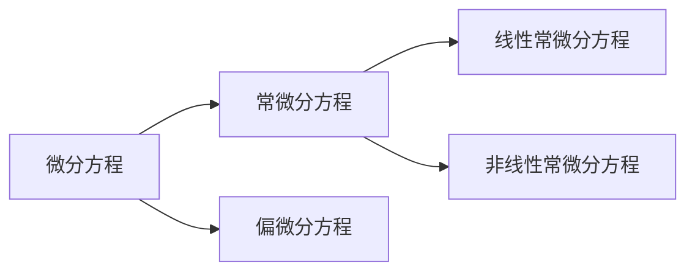
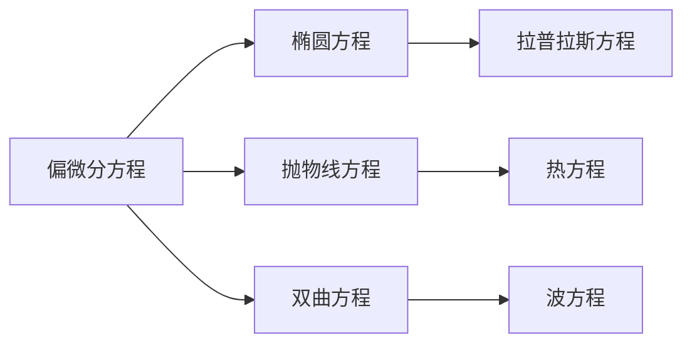

#数学 
表示未知函数、未知函数的导数与自变量之间关系的方程

### 常微分方程
未知函数的所有[[导数\|导数]]都是关于同一变量的微分方程

[[线性微分方程\|线性微分方程]]
[[非线性微分方程\|非线性微分方程]]

### 偏微分方程
Partial Differential Equations
未知函数是多个变量的函数，并且包含多个变量的[[偏导数\|偏导数]]的微分方程

[[拉普拉斯方程\|拉普拉斯方程]]
[[热方程\|热方程]]
[[波方程\|波方程]]

