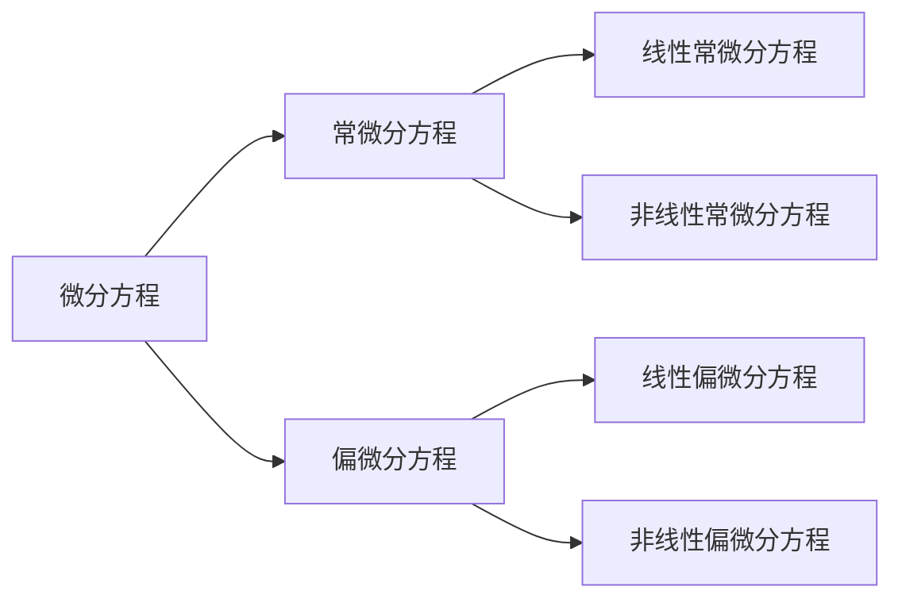
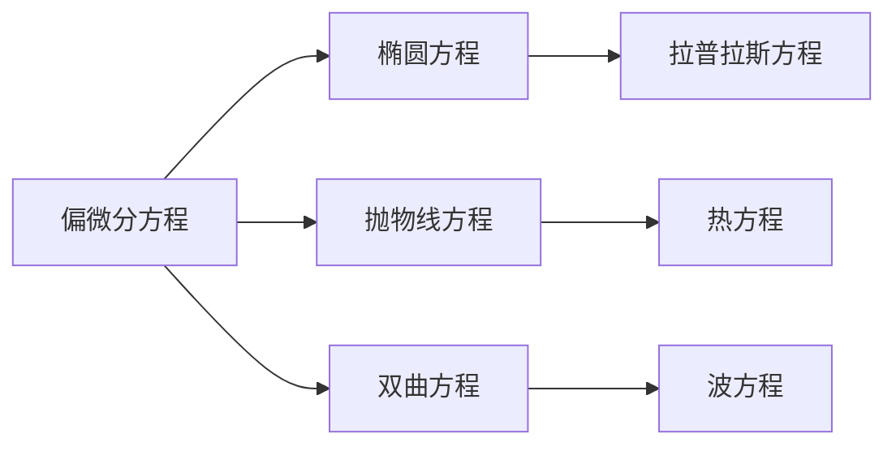

(terminology::**Differential Equation**)
表示未知函数、未知函数的导数与自变量之间关系的方程
描述系统从一个时刻到另一个时刻的变化情况

==微分方程的阶==：所出现的未知函数的最高阶导数的阶数
==微分方程的解==：满足微分方程的函数，将此函数代入微分方程可以使得方程成为恒等式。
==初值条件==：用来确定任意常数的条件

[[线性微分方程\|线性微分方程]]
[[非线性微分方程\|非线性微分方程]]
### 常微分方程
(terminology::**Ordinary Differential Equation** )  **ODE**  
未知函数的所有[[导数\|导数]]都是关于同一变量的微分方程
#### 一阶线性微分方程
[[一阶微分方程\|一阶微分方程]]
[[一阶线性微分方程\|一阶线性微分方程]]
[[可降阶的高阶微分方程\|可降阶的高阶微分方程]]
#### 高阶线性微分方程
[[常系数线性微分方程\|常系数线性微分方程]]

### 偏微分方程
(terminology::**Partial Differential Equations** )  **PDE**
未知函数是多个变量的函数，并且包含多个变量的[[偏导数\|偏导数]]的微分方程

-  [[拉普拉斯方程\|拉普拉斯方程]]
-  [[热方程\|热方程]]
-  [[波方程\|波方程]]

### 微分方程建模
从不同领域抽象出共性数学模型，使用微分方程解决实际问题
实际系统多是非线性系统，线性化方法“非线性 $\to$ 线性化” ，能够解决大量的实际问题

### 基本思路
[[数值计算\|数值计算]]
- 当描述相对变化量比绝对量更容易时，使用微分方程
- 微分方程一般不能直接求解，但是可以单从方程本身直接**建立理解**与**计算**
	与其考虑单个变量的高阶导数，不如考虑**高维向量的一阶导数**
