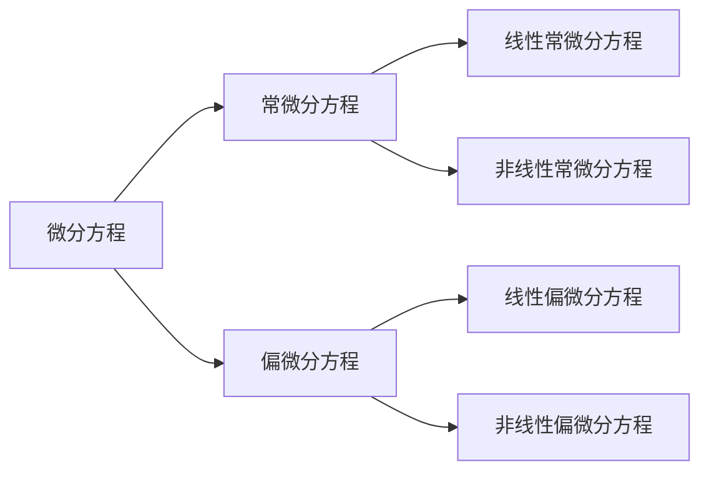
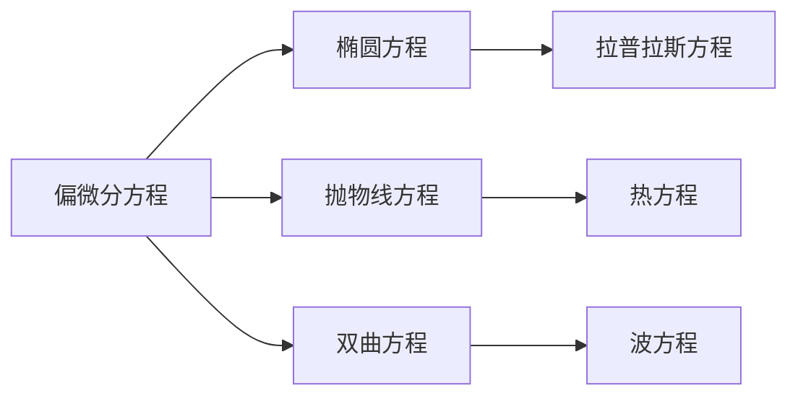

---
{"dg-publish":true,"dg-path":"数学/微分方程/微分方程.md","dg-pinned":true,"tags":["Continuous","Equation"],"permalink":"/数学/微分方程/微分方程/","pinned":true,"dgPassFrontmatter":true,"noteIcon":"","created":"2024-05-21T15:20:28.217+08:00","updated":"2024-08-24T13:24:12.078+08:00"}
---

(terminology::**Differential Equation**)
表示未知函数、未知函数的导数与自变量之间关系的方程
描述系统从一个时刻到另一个时刻的变化情况
>当描述相对变化量比绝对量更容易时，使用微分方程

微分方程一般不能直接求解
单从方程本身直接**建立理解**与**计算**

与其考虑单个变量的高阶导数，不如考虑高维向量的一阶导数
正是[[自动控制原理\|现代控制理论]]的思想
### 常微分方程
(terminology::**Ordinary Differential Equation** )  **ODE**  
未知函数的所有[[导数\|导数]]都是关于同一变量的微分方程
[[线性微分方程\|线性微分方程]]
[[非线性微分方程\|非线性微分方程]]
#### 一阶线性微分方程
[[一阶线性微分方程\|一阶线性微分方程]]
[[可降阶的高阶微分方程\|可降阶的高阶微分方程]]
#### 高阶线性微分方程
[[常系数线性微分方程\|常系数线性微分方程]]
[[常数变易法\|常数变易法]]

### 偏微分方程
(terminology::**Partial Differential Equations** )  **PDE**
未知函数是多个变量的函数，并且包含多个变量的[[偏导数\|偏导数]]的微分方程

-  [[拉普拉斯方程\|拉普拉斯方程]]
-  [[热方程\|热方程]]
-  [[波方程\|波方程]]

