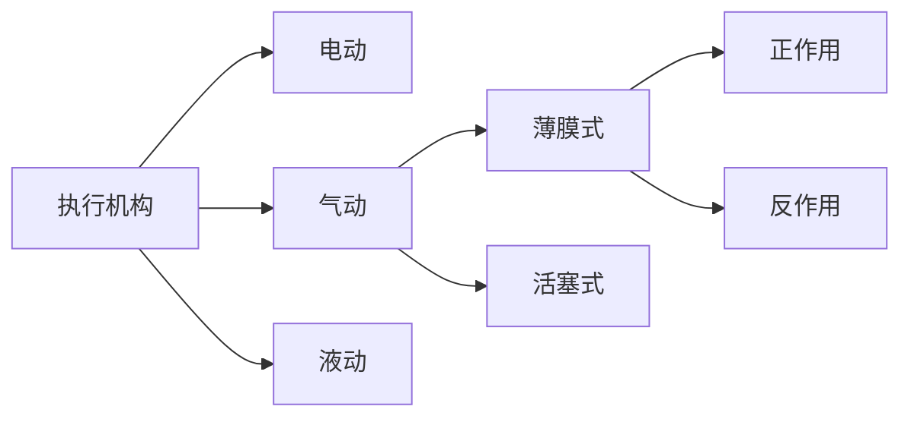

---
{"dg-publish":true,"dg-path":"A4- 过程控制系统/调节器与执行器/执行机构md","permalink":"/A4- 过程控制系统/调节器与执行器/执行机构md/","dgPassFrontmatter":true,"noteIcon":"","created":"2024-10-17T12:42:27.901+08:00","updated":"2025-04-14T18:40:09.628+08:00"}
---

执行机构接受调节器的控制信号，转换信号为输出力、力矩、位移，推动[[调节机构\|调节机构]]动作

### 一、电动执行机构（粗略）
基本原理：两相交流电机，将输入的直流电流信号线性地转换为位移量。
防爆要求不高、无合适气源使用
种类：直行程、角行程、多转式
组成部分：伺服放大器、减速器、位置发送器

### 二、气动执行机构（重点）
接收电/气转换器（或阀门定位器）输出的气压信号，转换为相应的输出力和推杆直线位移，来推动调节机构动作。
#### 活塞式
输出推力大，行程长。较为昂贵，特殊情况下使用。
有弹簧、无弹簧
#### 薄膜式（常用）
结构简单、价格低廉、使用较为广泛。虽然行程小，但可以满足一般情形。

基本原理[[胡克定律\|胡克定律]]：
$$\begin{align}
l= \dfrac{A_{e}}{C_{s}}\cdot P_{l}
\end{align}$$
-  $l$ 为推杆的位移量
-  $A_{e}$ 为波纹膜片的有效面积
-  $C_{s}$ 为弹簧刚度
-  $P_{l}$ 为气室气体压力

引压导管存在一定阻力，执行机构相当于[[经典环节的传递函数#9.延迟环节\|一阶滞后环节]]：
$$\begin{align}
\dfrac{P_{l}}{P_{0}}=\dfrac{1}{RCs+1}= \dfrac{1}{Ts+1} \Rightarrow  \dfrac{l}{P_{0}}=\dfrac{K}{Ts+1}
\end{align}$$

### 阀门定位器
和气动执行机构配套使用，接收控制器的输出的 $4\sim 20mA$ 直流电流信号，成比例地输出大功率气动信号给启动执行机构。

增大执行器的输出效率，克服阀杆的摩擦力和消除不平衡力的影响。使用闭环负[[反馈\|反馈]]，使用偏差信号进行控制。

应用场合：
**改善静态特性、改善动态特性、用于分程控制**（主要的三个使用场景）、改变流量特性、用于反向动作

**分程控制**：一个控制器控制两个阀门（实例：化工反应中，生产化工原料如果为剧烈放热反应，可以同时通蒸汽和冷却水，一边升温使得反应开始，一方面通冷却水降温防止过热焦化。使用阀门定位器实现，在两个阀门前分别加装阀门定位器，利用阀门定位器输入和输出的线性关系，设置输入输出范围，使得同一个控制器的信号分段作用于两个阀门）

