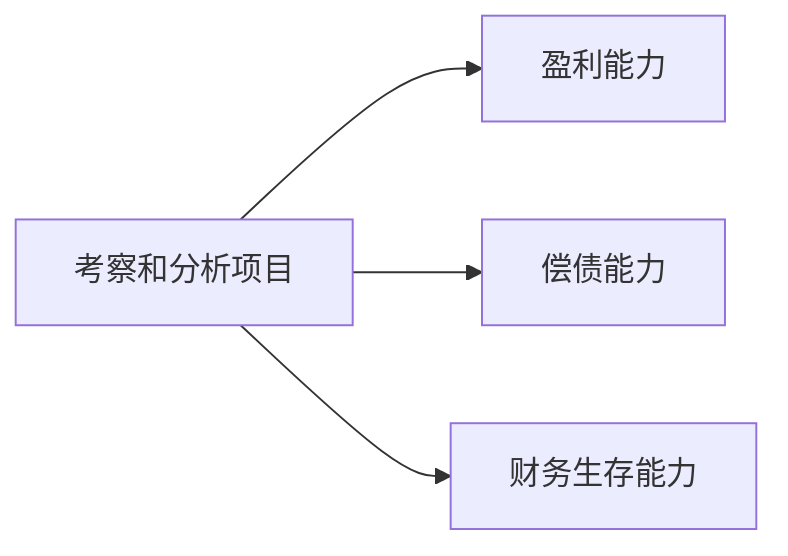

---
{"dg-publish":true,"dg-path":"技术经济与工程管理/技术经济与工程管理.md","dg-pinned":true,"permalink":"/技术经济与工程管理/技术经济与工程管理/","pinned":true,"dgPassFrontmatter":true,"noteIcon":"","created":"2024-04-16T13:01:27.387+08:00","updated":"2024-04-25T20:59:30.847+08:00"}
---

技术科学与经济科学交叉的边缘科学
- 宏观目标：资源达到最有效利用
- 微观目标：投资是否具有可行性

技术与经济的关系：
相互**依赖/发展/制约**
### 概述
*项目 Project*
国际项目管理协会（IPMA）：项目是受时间和成本**约束**的、用以实现一系列既定的可交付物（达到项目目标的范围）、同时满足质量标准和需求的**一次性**活动。
*项目可行性研究*
Feasibility Study
项目可行性研究是对项目在投资决策前进行技术经济论证的一门综合性技术。

它的任务是**以市场为前提，以技术为手段，以经济效益为最终目标**，对拟建的项目从必要性、可能性、有效性和合理性等方面进行全面、系统地论证，做出项目可行或不可行的评价。

可行性研究是投资决策的核心环节

*财务评价*
根据国家现行的财税制度和价格体系，在财务效益与费用的估算以及编制财务辅助报表的基础上，编制财务报表，计算财务分析指标，

>考察和分析项目的**盈利能力**、**偿债能力**和**财务生存能力**

{ #791eee}

判断项目的财务可行性，明确项目对财务主体的价值以及对投资者的贡献，为投资决策、融资决策以及银行贷款等提供依据。

### 章节
[[现金流量\|现金流量]]
[[资金的等值计算\|资金的等值计算]]
[[经济效果评价指标\|经济效果评价指标]]
[[经济效果评价方法\|经济效果评价方法]]
[[不确定性分析和风险分析\|不确定性分析和风险分析]]
[[财务评价\|财务评价]] 

[[复利\|复利]]
[[技术经济上机\|技术经济上机]]
[[技术经济出现的问题\|技术经济出现的问题]]
