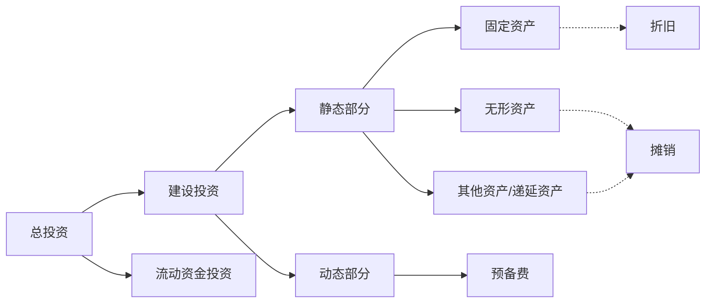

广义：人们的一种有目的的经济行为，即以一定的资源投入某项计划，以获取所期望的报酬。 
**狭义**：人们在社会经济活动中为实现某种预定的生产目标而预**先垫支的资金**

## 建设投资

[[折旧和摊销\|折旧和摊销]]
### 固定资产
企业为为生产商品、提供劳务、出租或经营管理而持有的；使用年限超过一个会计年度单位价值较高，并在使用过程中保持原有实物形态的资产（包括房屋、建筑物、机器、设备等）。

### 无形资产
企业拥有或者控制的没有实物形态的可辨认非货币性资产
无形资产的价值在服务期内通过摊销的形式计入费用（直线法）

### 其他资产 (递延资产)
除应计入固定资产和无形资产外的，均计入其他资产
其他资产应在项目投入运营后的一定年限内平均摊销，摊销费计 入费用

## 流动资金投资

整个项目寿命期内，流动资金始终被占用且周而复始地流动，到项目寿命期结束时，**全部流动资金**退出生产和流通，以货币资金形式**回收（现金流入）**

项目评价时流动资金可从投产**第一年**作为**现金流出**
到项目**寿命期结束**时以货币资金形式回收作为**现金流入**

