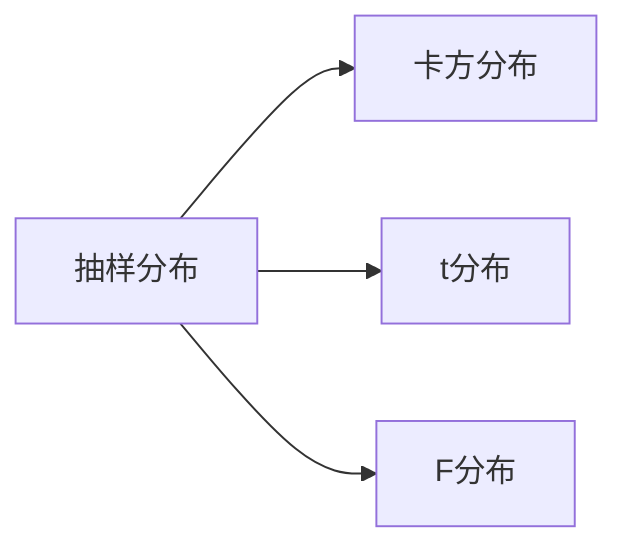

---
{"dg-publish":true,"dg-path":"数学/数理统计/抽样分布.md","permalink":"/数学/数理统计/抽样分布/","dgPassFrontmatter":true,"noteIcon":"","created":"2024-05-21T15:20:28.246+08:00","updated":"2024-05-31T14:39:24.262+08:00"}
---

**Sampling Distribution**
>[[统计量\|统计量]]的分布称为样本分布

抽样分布是统计推断的基础，它使我们能够根据样本数据对总体参数进行估计和假设检验

***常用抽样分布：***
[[正态总体\|正态总体]]的**样本均值**与**样本方差**的分布

[[卡方分布\|卡方分布]]
[[t分布\|t分布]]
[[F分布\|F分布]]

[[上分位点\|上分位点]]

