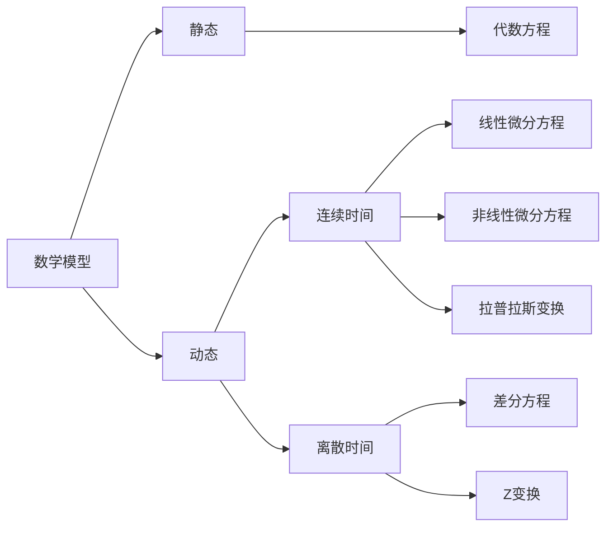

---
{"dg-publish":true,"dg-path":"A2- 自动控制原理/1. 经典控制理论/控制系统的数学模型.md","permalink":"/A2- 自动控制原理/1. 经典控制理论/控制系统的数学模型/","dgPassFrontmatter":true,"noteIcon":"","created":"2024-06-22T12:47:22.501+08:00","updated":"2025-04-14T17:46:24.452+08:00"}
---

### 建模方法
数学模型: 指过程在各输入量的作用下，其相应输出量变化的函数关系数学表达式。
通道: 输入量与输出量间的信号联系

==**机理分析**== ：基于**内部机理**和**物理原理**
- 真实性和可解释性：基于系统的内部机理和物理原理
- 预测和设计能力：便于设计、优化和控制，达到性能指标 
- 传递能力：从某系统中获取的知识和理解转移到其他类似系统
建模实例：[[容量过程建模实例\|容量过程建模实例]]

==**系统辨识**== ： 基于**观测数据**的建模方法，实验统计方法 
- 通过测取系统在输入作用下的输出响应, 或正常运行的输入和输出数据记录, 估计系统数学模型 
- 建立的数学模型一般是系统输入输出特性在某种准则意义下的一种近似

### 模型类别

