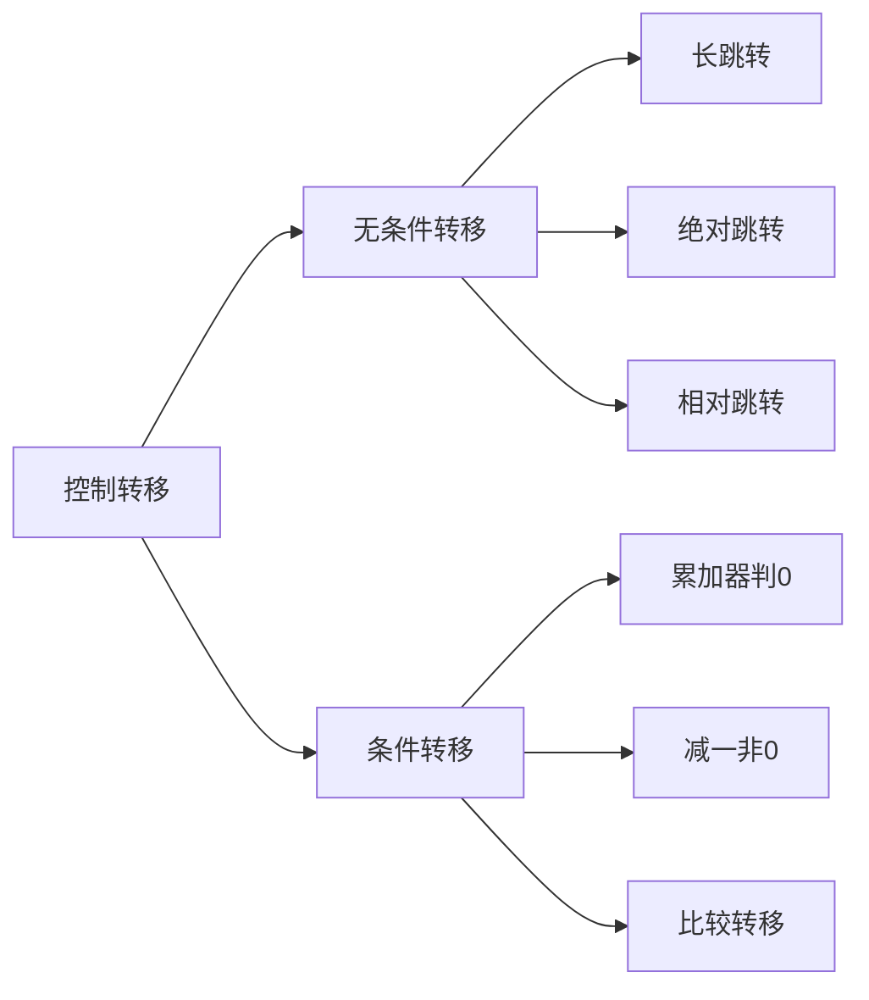

---
{"dg-publish":true,"dg-path":"51单片机/8051指令集/控制转移.md","permalink":"/51单片机/8051指令集/控制转移/","dgPassFrontmatter":true,"noteIcon":"","created":"2024-05-21T15:20:28.277+08:00","updated":"2024-06-03T16:25:41.138+08:00"}
---

### 无条件转移

`LJMP address`
长跳转，可以转移到 64K 程序储存器的任意位置

`AJMP addr11`
绝对跳转

`SJMP address`  相对跳转

### 条件转移

`JZ rel`  A 为 0，PC+rel-->PC
`JNZ rel`  A 不为 0，PC+rel-->PC

`DJNZ register,relative_address`  
Decrement and Jump if Not Zero
如果非零则减一并跳转
register 寄存器

首先将指定的寄存器的值减一，然后检查结果是否为零。
如果结果不为零，程序将跳转到指定的标签位置；如果结果为零，则不跳转

`CJNE source,#immediate, relative`
Compare and Jump if Not Equal

