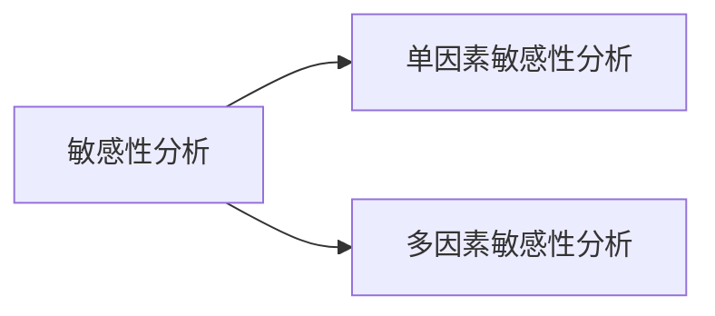
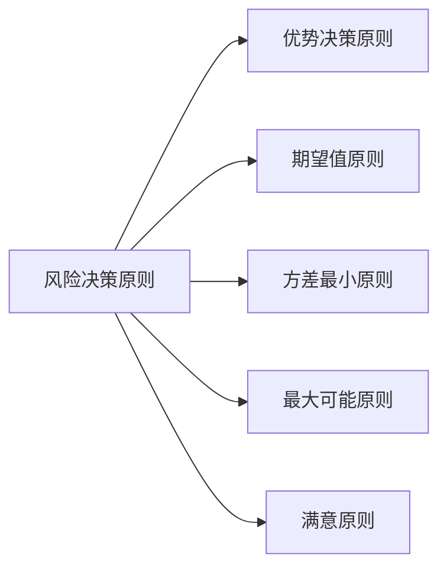

---
{"dg-publish":true,"dg-path":"技术经济与工程管理/敏感性分析.md","permalink":"/技术经济与工程管理/敏感性分析/","dgPassFrontmatter":true,"noteIcon":"","created":"2024-04-16T13:01:27.394+08:00","updated":"2024-04-25T10:19:50.524+08:00"}
---

通过测定一个或多个不确定因素的变化所导致的决策评价指标的变化幅度，了解各种因素的变化对实现预期目标的影响程度，从而对外部条件发生不利变化时投资方案的承受能力作出判断

单因素敏感性分析的基本步骤：
1. 选择需要分析的不确定因素，并设定这些因素的变动范围
2. 确定分析指标
3. 进行敏感性计算，建立敏感性分析表和分析图
4. 确定敏感因素，即其数值变动能显著影响方案经济效果的因素

判定敏感因素：
- 相对测定法
	比较在**同一变动幅度**下各因素的变动，对经济效果指标产生的影响，据此判断方案经济效果对各因素变动的敏感程度。 
- 绝对测定法 
	测定使经济效果**指标达到临界值**时各因素的变动幅度，变动幅度越小，则方案的经济效果对该因素越敏感。

优势原则
	能够减少备选方案的数目
期望值原则
	选择净现值的期望值最大的方案，或费用现值的期望值最小 的方案
方差最小原则
	选经济效果指标的方差最小的方案
最大可能原则
	如果一种状态发生的概率显著大于其他状态，那么就把这种状态视作 肯定状态，根据这种状态下各方案的经济效果指标来进行决策。 
	按照最大可能原则决策实际上将风险决策问题转化为确定性决策问题
满意原则
	定出一个足够满意的目标值，将各备选方案在不同 状态下的经济效果指标与此目标值进行比较，选择 经济效果指标优于或等于目标值的概率最大的方案