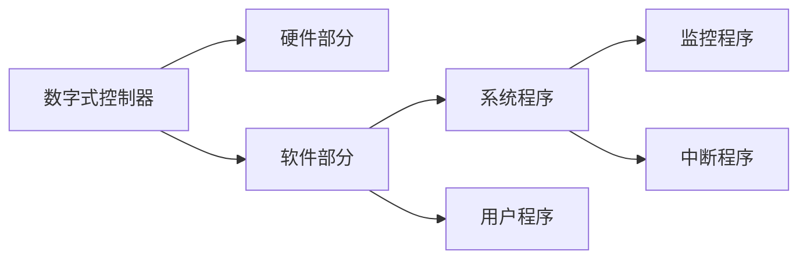

---
{"dg-publish":true,"dg-path":"过程控制系统/调节器与执行器/数字控制器.md","permalink":"/过程控制系统/调节器与执行器/数字控制器/","dgPassFrontmatter":true,"noteIcon":"","created":"2024-10-08T10:26:32.288+08:00","updated":"2024-11-02T18:03:33.506+08:00"}
---

以[[微控制器\|微控制器]]为核心，具有数据[[通信\|通信]]功能，广泛应用于[[集散控制系统\|集散控制系统]]
输入缓冲器，输出锁存器

### 组合部分

#### 硬件系统
主机电路，过程输入通道，过程输出通道，人机联系部件、通信部件

#### 软件系统
系统程序：监控程序、中断处理程序
用户系统：完成组态工作

### 数字式 PID 

