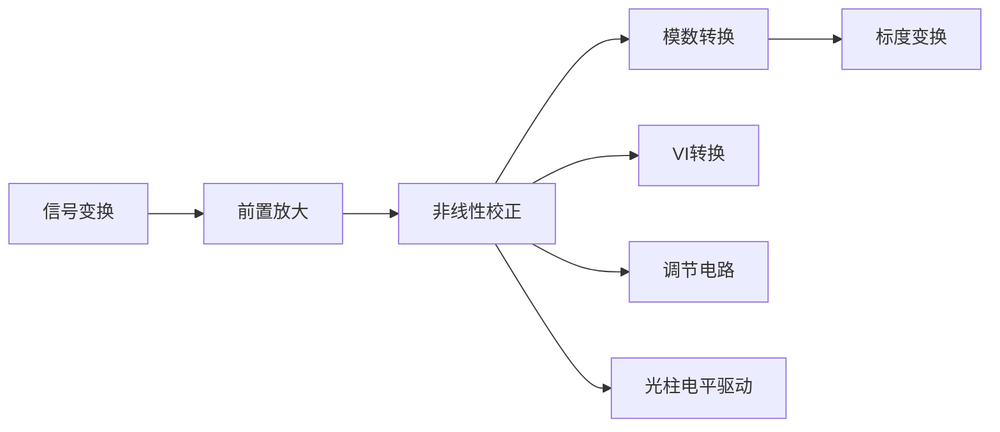

---
{"dg-publish":true,"dg-path":"A4- 过程控制系统/检测仪表/显示仪表.md","permalink":"/A4- 过程控制系统/检测仪表/显示仪表/","dgPassFrontmatter":true,"noteIcon":"","created":"2024-10-24T18:08:01.587+08:00","updated":"2025-04-14T18:40:09.516+08:00"}
---

(terminology::**Display Instrument**)
>接受传感器、[[变送器\|变送器]]等检测元件的输出信号，将测量值显示出来以供观察。

模拟式：指针或记录笔的偏转角或位移量来显示参数的连续变化。易于反映被测参数的变化趋势。
数字式：直接数字量显示或以数字形式记录打印被测变量值。
图像式：屏幕显示。
### 一、模拟式显示仪表~~（逐渐被淘汰）~~
自动平衡式显示仪表：在标尺上**看分度号**来区分电阻还是电偶，进一步区分是电子电位差计还是电子自动平衡电桥。精度等级也在标尺上看，一般精度等级较高
#### 1. 电子电位差计
输入**电压信号**，**不平衡电桥**。可以测量电势来和 [[温度检测#三、热电偶温度计\|热电偶温度计]] 配套使用来测量温度
使用电压补偿原理，测量微电势，标准电压和被测电压相等时，无电流流过。

热电偶输入未知的被测电压 $U_{x}$，不平衡电桥输出相反电压使得检流计流过电流为零。
（如果热电偶不慎短路，则只有参比端温度产生的电势，也即显示参比端温度）
#### 2. 电子自动平衡电桥
输入**电阻信号**，**平衡电桥**。可以测量电阻来和[[温度检测#四、热电阻温度计\|热电阻温度计]]配套使用测量温度
热电阻 $R_{t}$ 最小时，指针指向量程起点；最大时，指针指向量程终点。
热电阻采用三线制接法，每根导线电阻 2.5 $\Omega$

### 二、数字式显示仪表
直接用数字量显示被测定的物理量  

**信号变换**：将**工艺变量**经过检测变送后的信号转换为相应的**电压值或电流值**
**前置放大**：将输入信号放大为伏级
**标度变换**：使仪表能以工程量值显示被测参数大小

#### 模数转换
逐位逼近型：二分法

**双积分型模数转换**：
- 采样积分：在固定时间内对输入电压积分。$K_{1}$ 接通，$K_{2},K_{3}$ 断开
$$\begin{align}
V_{A}= - \dfrac{1}{RC} \int _{0}^{t_{1}} V_{i}\, dt \quad  \bar{V}_{i}= \dfrac{1}{t_{1}} \int _{0}^{t_{1}} V_{i}\, dt\quad   V_{A}= - \dfrac{1}{RC} \bar{V}_{i}t_{1}
\end{align}$$

- 比较测量：输入电压平均值和计数器显示数字量成正比，实现电压-数字量转换
$K_{2}$ 接通，$K_{1},K_{3}$ 断开；当 $V_{o}$ 为零时，$K_{3}$ 接通，$K_{1},K_{2}$ 断开
$$\begin{align}
- \dfrac{1}{RC} \bar{V}_{i}t_{1} + -\dfrac{1}{RC} \int _{t_{1}}^{t_{1}+t_{2}} (- V_{S})\, dt=0\quad  \Rightarrow \quad \bar{V}_{i}=\dfrac{t_{2}}{t_{1}}V_{S}
\end{align}$$
时钟脉冲固定频率为 $f$，$t_{2}$ 时间内计数器计数为 $N=f\cdot t_{2}$
**输入电压的平均值** $\bar{V}_{i}$ 和**计数器显示数字量** $N$ 成正比，实现**电压-数字量转换**。

