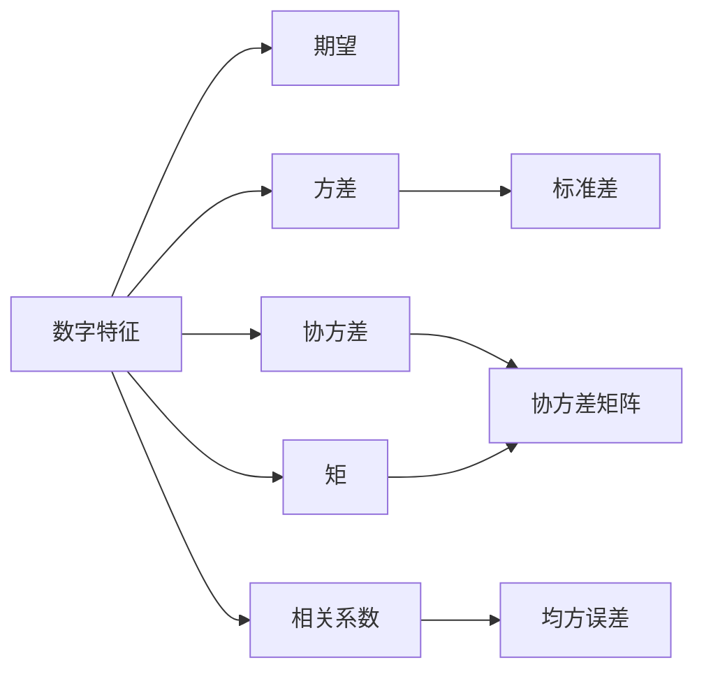

---
{"dg-publish":true,"dg-path":"数学/概率论.md","permalink":"/数学/概率论/","dgPassFrontmatter":true,"noteIcon":"","created":"2024-05-21T15:20:28.415+08:00","updated":"2024-05-31T13:11:32.423+08:00"}
---

**研究随机现象统计规律性的数学学科**
主线：研究随机变量及其概率分布和数字特征
进而全面刻画某些随机变量所服从的统计规律性
### 随机事件与概率
[[随机事件\|随机事件]]
[[概率\|概率]]
[[概率的性质\|概率的性质]]
[[条件概率\|条件概率]]
[[统计独立性\|统计独立性]]

### 随机变量及其分布
***随机变量函数的分布***
对随机变量的概率性质进行了**最完整的刻画，包含了全部信息**
研究对象： [[随机变量\|随机变量]]
离散：[[概率分布律\|概率分布律]]
连续：[[概率密度函数\|概率密度函数]]
累加/积分：[[分布函数\|分布函数]]  
一般化：[[随机变量函数的分布\|随机变量函数的分布]]
### 多维随机变量及其分布
研究对象：[[多维随机变量\|多维随机变量]]
离散：[[二维离散联合分布律\|二维离散联合分布律]]
连续：[[二维连续概率密度\|二维连续概率密度]]
累加/积分：[[联合分布函数\|联合分布函数]]、[[边缘分布函数\|边缘分布函数]]、[[条件分布\|条件分布]]
一般化：[[多维随机变量函数的分布\|多维随机变量函数的分布]]
[[随机变量的独立性\|随机变量的独立性]]

### 随机变量的数字特征
***随机变量的数字特征***
**更集中、更概括**地反映随机变量的特征

[[期望\|期望]]
[[方差\|方差]]
[[协方差\|协方差]]
[[相关系数\|相关系数]]
[[矩\|矩]]
[[协方差矩阵\|协方差矩阵]]

### 大数定理与中心极限定理
依**概率**收敛：
[[大数定律\|大数定律]] 
依**分布**收敛：
[[中心极限定理\|中心极限定理]]   

### 参考资料
严彦文.*概率论与数理统计*. 中国铁道出版社有限公司

