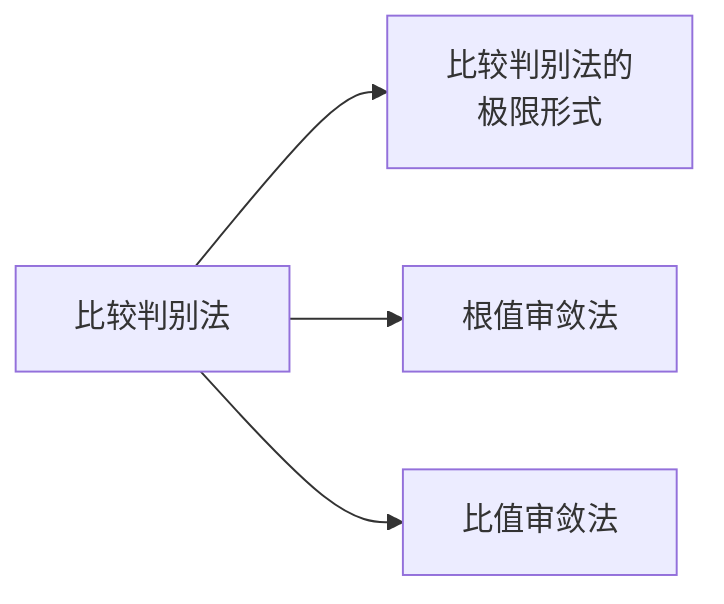

---
{"dg-publish":true,"dg-path":"数学/微积分/正项级数.md","permalink":"/数学/微积分/正项级数/","dgPassFrontmatter":true,"noteIcon":"","created":"2024-05-21T15:20:28.433+08:00","updated":"2024-07-16T18:30:30.268+08:00"}
---

[[数项级数\|数项级数]]的各项都是非负数
$$x_{n}\geq 0,n=1,2,3,\cdots$$

显然，正项级数 $\sum\limits_{n=1}^{\infty}x_{n}$ 的部分和数列 $\left\{S_{n} \right\}$ 单调增加

### 正项级数收敛原理
正项级数收敛的**充分必要条件**：部分和数列有上界

***P 级数：***
$$\begin{align}
\sum\limits_{n=1}^{\infty} \dfrac{1}{n^{p}}
\end{align}$$
- 当 $p>1$ 时，$\sum\limits_{n=1}^{\infty} \dfrac{1}{n^{p}}$ ==收敛==
- 当 $p\leq1$ 时，$\sum\limits_{n=1}^{\infty} \dfrac{1}{n^{p}}$ ==发散==

当 $p=1$ 时，为**调和级数** $\sum\limits_{n=1}^{\infty} \dfrac{1}{n}$   发散

### 比较判别法 
比较审敛法
用一个已知发散或收敛的级数与之比较

$\sum\limits_{n=1}^{\infty}x_{n}$ 与 $\sum\limits_{n=1}^{\infty}y_{n}$ 是两个正项级数
$x_{n}\leq Ay_{n},n=1,2,3,\cdots$
$\sum\limits_{n=1}^{\infty}y_{n}$ 收敛时，$\sum\limits_{n=1}^{\infty}x_{n}$ 也收敛
$\sum\limits_{n=1}^{\infty}x_{n}$ 发散时，$\sum\limits_{n=1}^{\infty}y_{n}$ 也发散
### 比较判别法的极限形式
如果 $x_{n}$ 和 $y_{n}$ 是同阶无穷小量
$$\begin{align}
\lim\limits_{ n \to \infty } \dfrac{x_{n}}{y_{n}}=l\quad (0<l<+\infty)
\end{align}$$
则 $\sum\limits_{n=1}^{\infty}x_{n}$ 和 $\sum\limits_{n=1}^{\infty}y_{n}$ 同时收敛或发散

### Cauchy 判别法
根值审敛法
$\sum\limits_{n=1}^{\infty}x_{n}$ 是正项级数，$r=\lim\limits_{ n \to \infty } \sqrt[n]{ x_{n} }$
1. 当 $r<1$，级数收敛
2. 当 $r>1$,   级数发散
3. 当 $r=1$, 可能收敛也可能发散

### D 'Alembert 判别法
比值审敛法
$\sum\limits_{n=1}^{\infty}x_{n}$ 是正项级数，$r=\lim\limits_{ n \to \infty } \dfrac{x_{n+1}}{x_{n}}$
1. 当 $r<1$，级数收敛
2. 当 $r>1$,   级数发散
3. 当 $r=1$, 可能收敛也可能发散

比值审敛法和根植审敛法本质都是(与[[几何级数\|几何级数]]相比较的) **比较审敛法**
