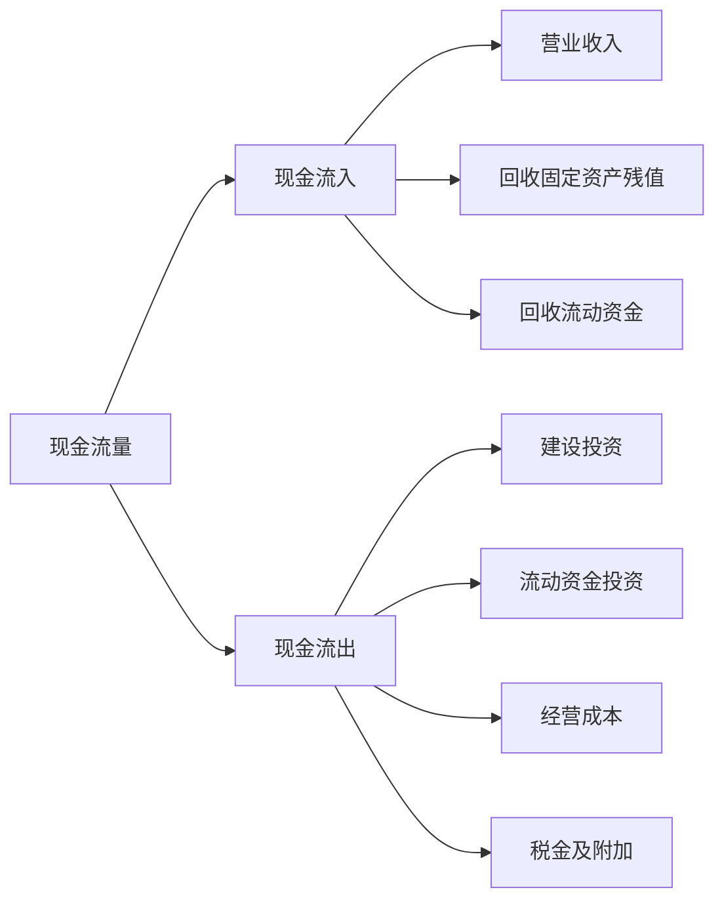
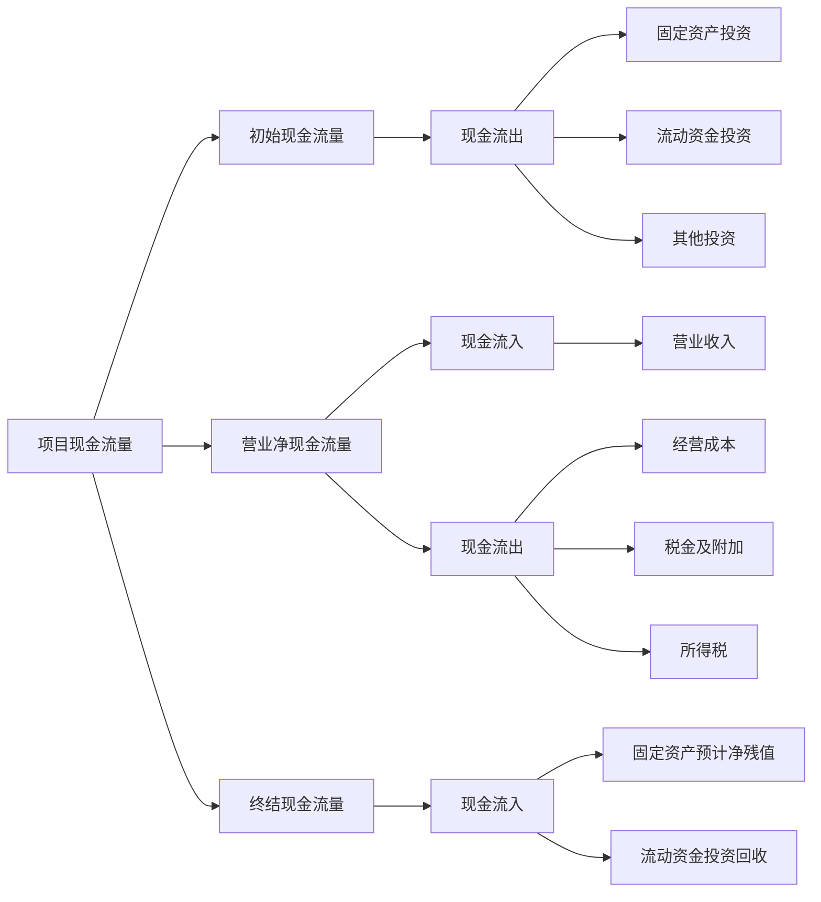

---
{"dg-publish":true,"dg-path":"技术经济与工程管理/现金流量.md","permalink":"/技术经济与工程管理/现金流量/","dgPassFrontmatter":true,"noteIcon":"","created":"2024-05-21T15:20:28.487+08:00","updated":"2024-05-31T18:59:30.214+08:00"}
---

**Cash Flow**

工业生产活动的考察两个方面：
- 物质形态  (工具、设备、能耗产品) 
- 货币形态  (资金投入、成本收入)

技术经济分析中，把各时点上实际发生的以**货币形式**体现的**资金流出或资金流入**称为现金流量
### 基本概念
***现金流出***  $CO$
流出系统的现金  
***现金流入***  $CI$
流入系统的现金
***净现金流量*** $NCF$
现金流入－现金流出 ＝净现金流量

[[贴现现金流法\|贴现现金流法]]
- 现金流量确定原则：收付实现制 
- 会计记账原则：权责发生制

### 现金流量的构成
[[投资\|投资]]
[[成本费用\|成本费用]]
[[营业收入\|营业收入]]
[[税金\|税金]]
[[利润\|利润]]

### 按期间构成的项目现金流量

营业净现金流量=营业收入-经营成本-税金及附加-所得税
经营成本＝总成本费用-折旧费-摊销费-借款利息支出

营业净现金流量=（营业收入-总成本费用）（1-所得税税率）+折旧、摊销
总成本费用=经营成本+折旧、摊销
### 现金流量图
[[现金流量图\|现金流量图]]

