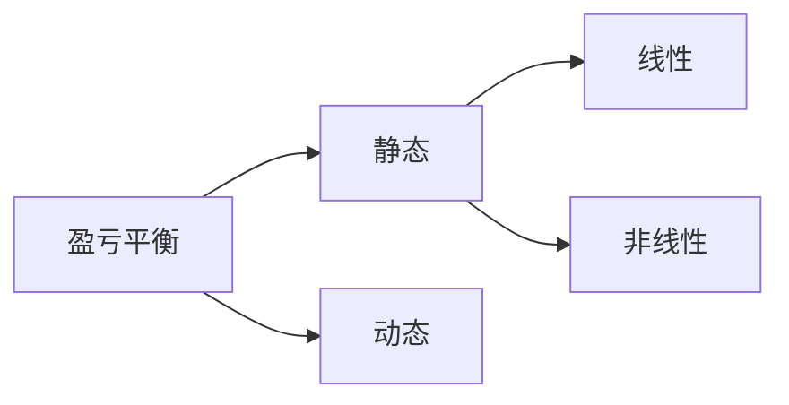
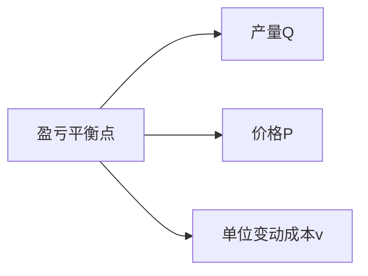

**Break-Even Analysis**
找出各种不确定性因素变化的临界值（会影响方案取舍的数值），判断方案对不确定性因素变化的风险承受能力，为决策提供依据。

### 线性静态盈亏平衡分析 
***量本利分析***
分析**产量**、**成本**与**利润**之间的关系，
找出投资方案盈利或亏损在产量、产品价格、单位产品成本等方面的**界限值**，以判断在各种不确定因素作用下方案的**风险状况**（承受能力）

***固定成本 Fixed costs FC***   
不随产量变动而变动的成本
***变动成本 Variable costs VC***  
随产量变动而变动的成本
变动成本=单位变动成本×产量

单位变动成本 v
产量=销售量（假设） Q
销售价格  P

年销售收入  $P\times Q$
年成本   $FC+v\times Q$
年利润=收入-成本
$P\times Q-(FC+v\times Q)$
>[!note] 
>都是挺直观的东西

**盈亏平衡**
$$P\times Q-(FC+v\times Q)=0$$

#### 产量
在一定的价格、固定成本和单位变动成本下，使年利润为零的年产量

**盈亏平衡产量**
$Q^{*}= \dfrac{FC}{P-v}$  
**盈亏平衡生产能力利用率**
$E^{*}= \dfrac{Q^{*}}{Q_{C}}\times 100\%$
$Q_{C}$ 设计生产产量/ 能力
#### 价格
在固定成本和单位变动成本不变、按设计生产能力生产的情况下，使年利润为零的**盈亏平衡产品价格**
$P^{*}= \dfrac{FC}{Q_{C}}+v$
#### 单位变动成本
在产品价格和固定成本不变、按设计生产力生产的情况下，使年利润为零的单位变动成本
**盈亏平衡单位变动成本
$v^{*}=P- \dfrac{FC}{Q_{C}}$

>[!important] 
$Q^{*} \uparrow\quad P^{*}\uparrow\quad v^{*} \downarrow$ 风险越大，抗风险能力越弱
注意题目问的是什么

### 动态
以项目的**净现值为零**，分析产量、价格、单位变动成本的变动临界点，从而判断项目在各种不确定因素作用下的风险状况

