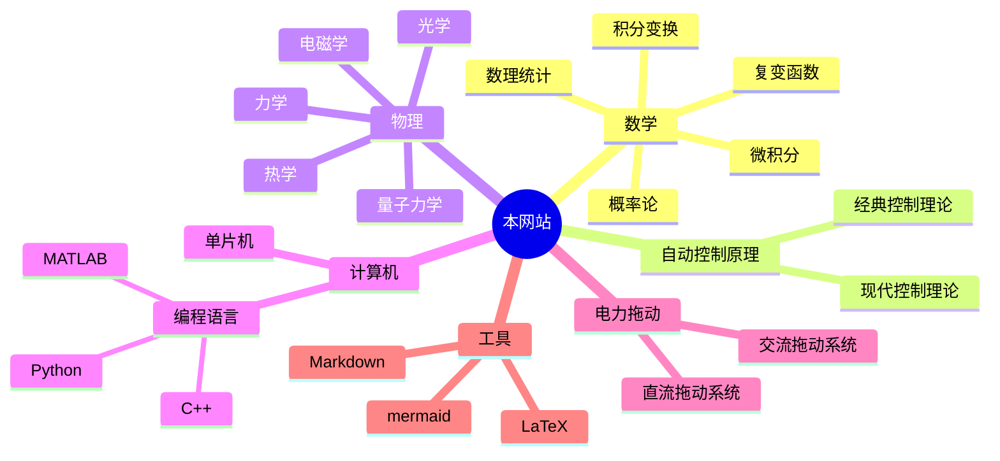

---
{"dg-publish":true,"dg-pinned":true,"permalink":"/目录导航/","pinned":true,"dgPassFrontmatter":true,"noteIcon":"","created":"2024-07-08T11:30:27.039+08:00","updated":"2024-07-08T11:41:07.736+08:00"}
---

>“一切高级数学，归根结底都是**微积分**和**线性代数**的各种变化”
>——丘成桐

### 一. 较为完善
[[自动控制原理\|自动控制原理]]  
[[概率论\|概率论]]
[[数理统计\|数理统计]]
[[复变函数与积分变换\|复变函数与积分变换]]
[[技术经济与工程管理\|技术经济与工程管理]]
[[电机及电力拖动\|电机及电力拖动]]
[[51 单片机\|微机原理及其应用]]   8051 基础

### 二. 即将完善
[[微积分\|微积分]]
[[线性代数\|线性代数]]

### 三. 之后完善

[[数字电路\|数字电路]]
[[模拟电路\|模拟电路]]
[[物理\|物理]]
[[计算机\|计算机]]
[[数学建模\|数学建模]]

