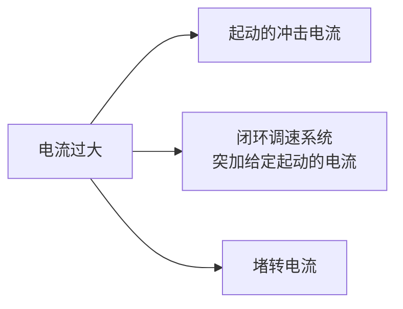

---
{"dg-publish":true,"dg-path":"电机及电力拖动/直流电机的电流截止负反馈.md","permalink":"/电机及电力拖动/直流电机的电流截止负反馈/","dgPassFrontmatter":true,"noteIcon":"","created":"2024-05-08T22:17:35.388+08:00","updated":"2024-06-17T11:23:54.900+08:00"}
---

电流截止[[反馈\|负反馈]] /限流保护
### 提出的背景
电机最怕电流过大和发热 (会损耗设备)

#### 起动的冲击电流
全电压起动时，如果没有限流措施，会产生很大的冲击电流，
- 对电机换向不利
- 对过载能力低的电力电子器件来说，不能允许
#### 闭环调速系统突加给定起动的冲击电流

$$\begin{align}
\Delta U_{n}=U_{n}^{*} \\
K_{p}K_{s}U_{n}^{*}
\end{align}$$

#### 堵转电流
闭环系统的[[直流电机的闭环调速系统\|静特性]]很硬，
如果没有限流环节，继续下去，电流将远远超过允许值
机械特性越硬，堵转电流越大，损害越大

### 基本原理
为了解决反馈闭环调速系统的起动和堵转时电流过大的问题，
系统中必须有自动**限制**==电枢电流==的环节

如果仅采用电流负反馈，
静特性很抖
仅对启动有利，对稳态运行不利
>同时采用转速和电流负反馈

### 电流负反馈

<?xml version="1.0" encoding="UTF-8"?><!-- Do not edit this file with editors other than draw.io --><!DOCTYPE svg PUBLIC "-//W3C//DTD SVG 1.1//EN" "http://www.w3.org/Graphics/SVG/1.1/DTD/svg11.dtd"><svg xmlns="http://www.w3.org/2000/svg" xmlns:xlink="http://www.w3.org/1999/xlink" version="1.1" width="499px" height="229px" viewBox="-0.5 -0.5 499 229" style="background-color: rgb(255, 255, 255);" content="&lt;mxfile host=&quot;Electron&quot; modified=&quot;2024-06-17T02:29:10.794Z&quot; agent=&quot;Mozilla/5.0 (Windows NT 10.0; Win64; x64) AppleWebKit/537.36 (KHTML, like Gecko) draw.io/22.1.18 Chrome/120.0.6099.199 Electron/28.1.2 Safari/537.36&quot; version=&quot;22.1.18&quot; etag=&quot;vJqdtJsLTxOgU70Sh60o&quot; type=&quot;device&quot;&gt;&lt;diagram name=&quot;第 1 页&quot; id=&quot;BdVnti9TZFdzRA9WzwzP&quot;&gt;7Vtbc6s2EP41fulMPCCZ2+OJk7Sdns5kTibT0yePYmSsFiMKcuKcX18JJG6CGCdgu3HzYrQIgb5vd7W7UiZwvtn9nKB4/Tv1cTgBhr+bwJsJAKZtG/xHSF6VxLVzSZAQX8pKwQP5gevCLfFxWhMxSkNG4rpwSaMIL1lNhpKEvtS7rWhYf2mMAqwJHpYo1KV/EJ+tc6kLnFL+CybBWr3ZtL38zgapznKIdI18+pKLMlDg7QTOE0pZfrXZzXEowFOw5MjdddwtPizBEevzAJCfwV7V3LDPpyqbNGFrGtAIhbel9Dqh28jHYgCDt8o+XymNudDkwr8wY6+SNrRllIvWbBPKu3hH2Hfx+NSTrT+zliVbNzs5dtZ4rTTucUI2mOFEySKWvH6vNiojiWY5VNZSY+WzFlOts0G3yVKKZlKvUBLggkcdXrMgjWs7pvzjklfeJcEhYuS5PjySahcU/Upm+IUkp50omA/xjMKtHPQUzKUcDvZFWBAXLEOUpmSpxHckLAiOfNUpohHOJfL+YfAPCbV89J4SPiIwlDcClsn1JXtKuiPHtuuj5EogH2xwVnxJLxpn+2l8xgkj3Nd8RU84vKcpYYRG/NYTZYxuBNrKZwgofZSuC0ZRSALRdckxEzZSpU4N+0X2YYJyMVYs3rvZBcJVT3HI/WUi+k1DGpDlIkAMp1MSZY9HwYK7VIaES5UkCjneTbq8TwdnBfYzu4G9a4CpI0UvpW815YqxrrpV4+NmZZ3S/5mHeL/xPJ2tezqnN5ODOzq7xUK41cx+W8T5hcZYnY+XNWH4IUbZ7F64UtexX3EvNKchTUrfNIQiG+6s6URcqGnxrEWLZ4568COoOZ2opWeMmuk4J0XN/d/6geno5m8fbfE1Zk27cQ27WADUQPn3DrH+ev89xqfmYZxnrWag3EMRWvRghCCsr2mqxf24TPWxlxGSgA7jmJl6dORoxjFccKqmpq0iE2u+StBy4lybE+eG/8wXWFyc78oCvCZ0jjs74spiniax3pN39Uzf+ljB8fIz6ELdCkYzAXga3gpnb1WdvbnH1R9AVK2OMUJ437W+Q219V180Anlt2bX0XyiM1+iMHZapOSzXOqrDslqwa+AUcKDizsnKYit6Ut2Ng0EwgKuXAzQQxqoFmPbn89k18FWxQ4v+B7f7K8ur0TheyNKW+DZJDEMSp3i/aaM0zncLVmQnKO1p2FY7hMfQWLfH7DX9qsy4rr1teYq6Pigvfd+y1U9X25ayN8G3WsBXsg+quVa9aHrijsRVGwg0BgLNgQa0GG9YnVEaYB6iAcUOUG9N+zQ606T63TrTVL4RdUYt5RWdudKUhvtI1vCnze2I5h7Ehvh+vorilPyQkYNgOxYfnU3Dup5YN2IsvnCm+Rqab0Ql9G/ciMPGqu0CS4thHS0qUTt0VZUBTrd29PXxoC0pt0MB9Ypm+lByYP+zperGVY7WF97Bi3cZFOo2vwryXxkc3+CQ8eDYeFzw3D6qZPb5e/gn5q9Sj10M86Ze1Tc15l13JOZBC/OCl8fFsiOT+bRMmGafnQLbGYmJtt33nAluML7RXQv7vIS4zVTNcTzdNMBIhHRl+reXxgOwtICixUWpUsLgPOhVg+hysIeuXmTWsVe7aYNjr++UX1BQVil7Ff7HOF5Q1lZ2uKDACABP03z90M5omt9W9rgg9A3DOCX6bQUEseh+O+PyOoDNHM6BrgYZbHMX3schg3r+rKF0HrvbUH5YtV6iEDjJsVfzFEB1FLX2Hr2oO4EJgHd33FbfKF9VYYbH21I1tOKR7TXK0R3Fo17HZ1VZevjjO0o9Nd/z68K/uMgfNIG3WzIwe6QMDJ5mo7ylbnzASara5vq+GnWLMUP+19OPnnrbHTbiA9DLvN9jkm2peK0+uSwgLAuQcLXKPGNHTfJbeWy1XwnyoBhjn5v+YGWksffpGPo+/miBRtsu/nvI2F9UNo03q8qPC3LGReQheDbUMqd4tnTva40Ug8OuU/JlBd+65Vc/XV5l0gN9ijLeSAUx2HUQX9tauRA6uJk09s5met7ljGUmeqHggkpk+mkqxwEa9gOVyHiz/K/VPIwo//cX3v4L&lt;/diagram&gt;&lt;/mxfile&gt;"><defs></defs><g><path d="M 328.5 133.75 L 363.13 133.75" fill="none" stroke="rgb(0, 0, 0)" stroke-miterlimit="10" pointer-events="stroke"/><path d="M 368.38 133.75 L 361.38 137.25 L 363.13 133.75 L 361.38 130.25 Z" fill="rgb(0, 0, 0)" stroke="rgb(0, 0, 0)" stroke-miterlimit="10" pointer-events="all"/><path d="M 324.52 122.38 L 324.52 108.83 L 324.5 92" fill="none" stroke="rgb(0, 0, 0)" stroke-miterlimit="10" pointer-events="stroke"/><path d="M 324.52 127.63 L 321.02 120.63 L 324.52 122.38 L 328.02 120.63 Z" fill="rgb(0, 0, 0)" stroke="rgb(0, 0, 0)" stroke-miterlimit="10" pointer-events="all"/><ellipse cx="324.5" cy="133.75" rx="4" ry="4" fill="rgb(255, 255, 255)" stroke="rgb(0, 0, 0)" pointer-events="all"/><path d="M 197.5 132.75 L 244.13 132.75" fill="none" stroke="rgb(0, 0, 0)" stroke-miterlimit="10" pointer-events="stroke"/><path d="M 249.38 132.75 L 242.38 136.25 L 244.13 132.75 L 242.38 129.25 Z" fill="rgb(0, 0, 0)" stroke="rgb(0, 0, 0)" stroke-miterlimit="10" pointer-events="all"/><rect x="157.5" y="109" width="40" height="47.5" fill="none" stroke="rgb(0, 0, 0)" pointer-events="all"/><g transform="translate(-0.5 -0.5)"><switch><foreignObject pointer-events="none" width="100%" height="100%" requiredFeatures="http://www.w3.org/TR/SVG11/feature#Extensibility" style="overflow: visible; text-align: left;">

<mjx-container class="MathJax" jax="SVG" display="true"><svg xmlns="http://www.w3.org/2000/svg" width="2.913ex" height="2.195ex" role="img" focusable="false" viewBox="0 -683 1287.7 970.2" xmlns:xlink="http://www.w3.org/1999/xlink" style="vertical-align: -0.65ex;"><defs><path id="MJX-114-TEX-I-1D43E" d="M285 628Q285 635 228 637Q205 637 198 638T191 647Q191 649 193 661Q199 681 203 682Q205 683 214 683H219Q260 681 355 681Q389 681 418 681T463 682T483 682Q500 682 500 674Q500 669 497 660Q496 658 496 654T495 648T493 644T490 641T486 639T479 638T470 637T456 637Q416 636 405 634T387 623L306 305Q307 305 490 449T678 597Q692 611 692 620Q692 635 667 637Q651 637 651 648Q651 650 654 662T659 677Q662 682 676 682Q680 682 711 681T791 680Q814 680 839 681T869 682Q889 682 889 672Q889 650 881 642Q878 637 862 637Q787 632 726 586Q710 576 656 534T556 455L509 418L518 396Q527 374 546 329T581 244Q656 67 661 61Q663 59 666 57Q680 47 717 46H738Q744 38 744 37T741 19Q737 6 731 0H720Q680 3 625 3Q503 3 488 0H478Q472 6 472 9T474 27Q478 40 480 43T491 46H494Q544 46 544 71Q544 75 517 141T485 216L427 354L359 301L291 248L268 155Q245 63 245 58Q245 51 253 49T303 46H334Q340 37 340 35Q340 19 333 5Q328 0 317 0Q314 0 280 1T180 2Q118 2 85 2T49 1Q31 1 31 11Q31 13 34 25Q38 41 42 43T65 46Q92 46 125 49Q139 52 144 61Q147 65 216 339T285 628Z"/><path id="MJX-114-TEX-I-1D45D" d="M23 287Q24 290 25 295T30 317T40 348T55 381T75 411T101 433T134 442Q209 442 230 378L240 387Q302 442 358 442Q423 442 460 395T497 281Q497 173 421 82T249 -10Q227 -10 210 -4Q199 1 187 11T168 28L161 36Q160 35 139 -51T118 -138Q118 -144 126 -145T163 -148H188Q194 -155 194 -157T191 -175Q188 -187 185 -190T172 -194Q170 -194 161 -194T127 -193T65 -192Q-5 -192 -24 -194H-32Q-39 -187 -39 -183Q-37 -156 -26 -148H-6Q28 -147 33 -136Q36 -130 94 103T155 350Q156 355 156 364Q156 405 131 405Q109 405 94 377T71 316T59 280Q57 278 43 278H29Q23 284 23 287ZM178 102Q200 26 252 26Q282 26 310 49T356 107Q374 141 392 215T411 325V331Q411 405 350 405Q339 405 328 402T306 393T286 380T269 365T254 350T243 336T235 326L232 322Q232 321 229 308T218 264T204 212Q178 106 178 102Z"/></defs><g stroke="currentColor" fill="currentColor" stroke-width="0" transform="scale(1,-1)"><g data-mml-node="math"><g data-mml-node="msub"><g data-mml-node="mi"><use data-c="1D43E" xlink:href="#MJX-114-TEX-I-1D43E"/></g><g data-mml-node="mi" transform="translate(882,-150) scale(0.707)"><use data-c="1D45D" xlink:href="#MJX-114-TEX-I-1D45D"/></g></g></g></g></svg></mjx-container>

</foreignObject><text x="178" y="136" fill="rgb(0, 0, 0)" font-family="Helvetica" font-size="12px" text-anchor="middle">$K_p$</text></switch></g><rect x="250.5" y="109" width="40" height="47.5" fill="none" stroke="rgb(0, 0, 0)" pointer-events="all"/><g transform="translate(-0.5 -0.5)"><switch><foreignObject pointer-events="none" width="100%" height="100%" requiredFeatures="http://www.w3.org/TR/SVG11/feature#Extensibility" style="overflow: visible; text-align: left;">

<mjx-container class="MathJax" jax="SVG" display="true"><svg xmlns="http://www.w3.org/2000/svg" width="2.859ex" height="1.901ex" role="img" focusable="false" viewBox="0 -683 1263.6 840.1" xmlns:xlink="http://www.w3.org/1999/xlink" style="vertical-align: -0.355ex;"><defs><path id="MJX-115-TEX-I-1D43E" d="M285 628Q285 635 228 637Q205 637 198 638T191 647Q191 649 193 661Q199 681 203 682Q205 683 214 683H219Q260 681 355 681Q389 681 418 681T463 682T483 682Q500 682 500 674Q500 669 497 660Q496 658 496 654T495 648T493 644T490 641T486 639T479 638T470 637T456 637Q416 636 405 634T387 623L306 305Q307 305 490 449T678 597Q692 611 692 620Q692 635 667 637Q651 637 651 648Q651 650 654 662T659 677Q662 682 676 682Q680 682 711 681T791 680Q814 680 839 681T869 682Q889 682 889 672Q889 650 881 642Q878 637 862 637Q787 632 726 586Q710 576 656 534T556 455L509 418L518 396Q527 374 546 329T581 244Q656 67 661 61Q663 59 666 57Q680 47 717 46H738Q744 38 744 37T741 19Q737 6 731 0H720Q680 3 625 3Q503 3 488 0H478Q472 6 472 9T474 27Q478 40 480 43T491 46H494Q544 46 544 71Q544 75 517 141T485 216L427 354L359 301L291 248L268 155Q245 63 245 58Q245 51 253 49T303 46H334Q340 37 340 35Q340 19 333 5Q328 0 317 0Q314 0 280 1T180 2Q118 2 85 2T49 1Q31 1 31 11Q31 13 34 25Q38 41 42 43T65 46Q92 46 125 49Q139 52 144 61Q147 65 216 339T285 628Z"/><path id="MJX-115-TEX-I-1D460" d="M131 289Q131 321 147 354T203 415T300 442Q362 442 390 415T419 355Q419 323 402 308T364 292Q351 292 340 300T328 326Q328 342 337 354T354 372T367 378Q368 378 368 379Q368 382 361 388T336 399T297 405Q249 405 227 379T204 326Q204 301 223 291T278 274T330 259Q396 230 396 163Q396 135 385 107T352 51T289 7T195 -10Q118 -10 86 19T53 87Q53 126 74 143T118 160Q133 160 146 151T160 120Q160 94 142 76T111 58Q109 57 108 57T107 55Q108 52 115 47T146 34T201 27Q237 27 263 38T301 66T318 97T323 122Q323 150 302 164T254 181T195 196T148 231Q131 256 131 289Z"/></defs><g stroke="currentColor" fill="currentColor" stroke-width="0" transform="scale(1,-1)"><g data-mml-node="math"><g data-mml-node="msub"><g data-mml-node="mi"><use data-c="1D43E" xlink:href="#MJX-115-TEX-I-1D43E"/></g><g data-mml-node="mi" transform="translate(882,-150) scale(0.707)"><use data-c="1D460" xlink:href="#MJX-115-TEX-I-1D460"/></g></g></g></g></svg></mjx-container>

</foreignObject><text x="271" y="136" fill="rgb(0, 0, 0)" font-family="Helvetica" font-size="12px" text-anchor="middle">$K_s$</text></switch></g><path d="M 111.5 133 L 134.52 133.03 L 151.13 132.83" fill="none" stroke="rgb(0, 0, 0)" stroke-miterlimit="10" pointer-events="stroke"/><path d="M 156.38 132.76 L 149.43 136.35 L 151.13 132.83 L 149.34 129.35 Z" fill="rgb(0, 0, 0)" stroke="rgb(0, 0, 0)" stroke-miterlimit="10" pointer-events="all"/><path d="M 290.5 132.75 L 314.15 132.81" fill="none" stroke="rgb(0, 0, 0)" stroke-miterlimit="10" pointer-events="stroke"/><path d="M 319.4 132.82 L 312.39 136.31 L 314.15 132.81 L 312.41 129.31 Z" fill="rgb(0, 0, 0)" stroke="rgb(0, 0, 0)" stroke-miterlimit="10" pointer-events="all"/><path d="M 409.5 133.72 L 449.48 133.72 L 483.13 133.75" fill="none" stroke="rgb(0, 0, 0)" stroke-miterlimit="10" pointer-events="stroke"/><path d="M 488.38 133.75 L 481.38 137.24 L 483.13 133.75 L 481.38 130.24 Z" fill="rgb(0, 0, 0)" stroke="rgb(0, 0, 0)" stroke-miterlimit="10" pointer-events="all"/><rect x="369.5" y="110" width="40" height="47.5" fill="none" stroke="rgb(0, 0, 0)" pointer-events="all"/><g transform="translate(-0.5 -0.5)"><switch><foreignObject pointer-events="none" width="100%" height="100%" requiredFeatures="http://www.w3.org/TR/SVG11/feature#Extensibility" style="overflow: visible; text-align: left;">

<mjx-container class="MathJax" jax="SVG" display="true"><svg xmlns="http://www.w3.org/2000/svg" width="3.546ex" height="4.945ex" role="img" focusable="false" viewBox="0 -1342 1567.5 2185.8" xmlns:xlink="http://www.w3.org/1999/xlink" style="vertical-align: -1.909ex;"><defs><path id="MJX-116-TEX-N-31" d="M213 578L200 573Q186 568 160 563T102 556H83V602H102Q149 604 189 617T245 641T273 663Q275 666 285 666Q294 666 302 660V361L303 61Q310 54 315 52T339 48T401 46H427V0H416Q395 3 257 3Q121 3 100 0H88V46H114Q136 46 152 46T177 47T193 50T201 52T207 57T213 61V578Z"/><path id="MJX-116-TEX-I-1D436" d="M50 252Q50 367 117 473T286 641T490 704Q580 704 633 653Q642 643 648 636T656 626L657 623Q660 623 684 649Q691 655 699 663T715 679T725 690L740 705H746Q760 705 760 698Q760 694 728 561Q692 422 692 421Q690 416 687 415T669 413H653Q647 419 647 422Q647 423 648 429T650 449T651 481Q651 552 619 605T510 659Q484 659 454 652T382 628T299 572T226 479Q194 422 175 346T156 222Q156 108 232 58Q280 24 350 24Q441 24 512 92T606 240Q610 253 612 255T628 257Q648 257 648 248Q648 243 647 239Q618 132 523 55T319 -22Q206 -22 128 53T50 252Z"/><path id="MJX-116-TEX-I-1D452" d="M39 168Q39 225 58 272T107 350T174 402T244 433T307 442H310Q355 442 388 420T421 355Q421 265 310 237Q261 224 176 223Q139 223 138 221Q138 219 132 186T125 128Q125 81 146 54T209 26T302 45T394 111Q403 121 406 121Q410 121 419 112T429 98T420 82T390 55T344 24T281 -1T205 -11Q126 -11 83 42T39 168ZM373 353Q367 405 305 405Q272 405 244 391T199 357T170 316T154 280T149 261Q149 260 169 260Q282 260 327 284T373 353Z"/></defs><g stroke="currentColor" fill="currentColor" stroke-width="0" transform="scale(1,-1)"><g data-mml-node="math"><g data-mml-node="mfrac"><g data-mml-node="mn" transform="translate(533.8,676)"><use data-c="31" xlink:href="#MJX-116-TEX-N-31"/></g><g data-mml-node="msub" transform="translate(220,-686)"><g data-mml-node="mi"><use data-c="1D436" xlink:href="#MJX-116-TEX-I-1D436"/></g><g data-mml-node="mi" transform="translate(748,-150) scale(0.707)"><use data-c="1D452" xlink:href="#MJX-116-TEX-I-1D452"/></g></g><rect width="1327.5" height="60" x="120" y="220"/></g></g></g></svg></mjx-container>

</foreignObject><text x="390" y="137" fill="rgb(0, 0, 0)" font-family="Helvetica" font-size="12px" text-anchor="middle">$\fra...</text></switch></g><path d="M 315.87 203.72 L 457 203.72 L 456.5 133" fill="none" stroke="rgb(0, 0, 0)" stroke-miterlimit="10" pointer-events="stroke"/><path d="M 310.62 203.72 L 317.62 200.22 L 315.87 203.72 L 317.62 207.22 Z" fill="rgb(0, 0, 0)" stroke="rgb(0, 0, 0)" stroke-miterlimit="10" pointer-events="all"/><path d="M 269.5 203.72 L 106.52 203.72 L 106.5 144.37" fill="none" stroke="rgb(0, 0, 0)" stroke-miterlimit="10" pointer-events="stroke"/><path d="M 106.5 139.12 L 110 146.12 L 106.5 144.37 L 103 146.12 Z" fill="rgb(0, 0, 0)" stroke="rgb(0, 0, 0)" stroke-miterlimit="10" pointer-events="all"/><rect x="269.5" y="180" width="40" height="47.5" fill="none" stroke="rgb(0, 0, 0)" pointer-events="all"/><g transform="translate(-0.5 -0.5)"><switch><foreignObject pointer-events="none" width="100%" height="100%" requiredFeatures="http://www.w3.org/TR/SVG11/feature#Extensibility" style="overflow: visible; text-align: left;">

<mjx-container class="MathJax" jax="SVG" display="true"><svg xmlns="http://www.w3.org/2000/svg" width="1.448ex" height="1.025ex" role="img" focusable="false" viewBox="0 -442 640 453" xmlns:xlink="http://www.w3.org/1999/xlink" style="vertical-align: -0.025ex;"><defs><path id="MJX-117-TEX-I-1D6FC" d="M34 156Q34 270 120 356T309 442Q379 442 421 402T478 304Q484 275 485 237V208Q534 282 560 374Q564 388 566 390T582 393Q603 393 603 385Q603 376 594 346T558 261T497 161L486 147L487 123Q489 67 495 47T514 26Q528 28 540 37T557 60Q559 67 562 68T577 70Q597 70 597 62Q597 56 591 43Q579 19 556 5T512 -10H505Q438 -10 414 62L411 69L400 61Q390 53 370 41T325 18T267 -2T203 -11Q124 -11 79 39T34 156ZM208 26Q257 26 306 47T379 90L403 112Q401 255 396 290Q382 405 304 405Q235 405 183 332Q156 292 139 224T121 120Q121 71 146 49T208 26Z"/></defs><g stroke="currentColor" fill="currentColor" stroke-width="0" transform="scale(1,-1)"><g data-mml-node="math"><g data-mml-node="mi"><use data-c="1D6FC" xlink:href="#MJX-117-TEX-I-1D6FC"/></g></g></g></svg></mjx-container>

</foreignObject><text x="290" y="207" fill="rgb(0, 0, 0)" font-family="Helvetica" font-size="12px" text-anchor="middle">$\alp...</text></switch></g><path d="M 95.13 133.03 L 72.52 133.03 L 42.5 133" fill="none" stroke="rgb(0, 0, 0)" stroke-miterlimit="10" pointer-events="stroke"/><path d="M 100.38 133.03 L 93.38 136.53 L 95.13 133.03 L 93.38 129.53 Z" fill="rgb(0, 0, 0)" stroke="rgb(0, 0, 0)" stroke-miterlimit="10" pointer-events="all"/><ellipse cx="106.5" cy="133" rx="5" ry="5" fill="rgb(255, 255, 255)" stroke="rgb(0, 0, 0)" pointer-events="all"/><path d="M 110.04 136.54 L 102.96 129.46" fill="none" stroke="rgb(0, 0, 0)" stroke-miterlimit="10" pointer-events="stroke"/><path d="M 102.96 136.54 L 110.04 129.46" fill="none" stroke="rgb(0, 0, 0)" stroke-miterlimit="10" pointer-events="stroke"/><rect x="98.5" y="143" width="23" height="27" fill="none" stroke="none" pointer-events="all"/><g transform="translate(-0.5 -0.5)"><switch><foreignObject pointer-events="none" width="100%" height="100%" requiredFeatures="http://www.w3.org/TR/SVG11/feature#Extensibility" style="overflow: visible; text-align: left;">

-

</foreignObject><text x="110" y="160" fill="rgb(0, 0, 0)" font-family="Helvetica" font-size="12px" text-anchor="middle">-</text></switch></g><rect x="87.5" y="107" width="88" height="27" fill="none" stroke="none" pointer-events="all"/><g transform="translate(-0.5 -0.5)"><switch><foreignObject pointer-events="none" width="100%" height="100%" requiredFeatures="http://www.w3.org/TR/SVG11/feature#Extensibility" style="overflow: visible; text-align: left;">

<mjx-container class="MathJax" jax="SVG" display="true"><svg xmlns="http://www.w3.org/2000/svg" width="4.646ex" height="1.978ex" role="img" focusable="false" viewBox="0 -716 2053.6 874.3" xmlns:xlink="http://www.w3.org/1999/xlink" style="vertical-align: -0.358ex;"><defs><path id="MJX-118-TEX-N-394" d="M51 0Q46 4 46 7Q46 9 215 357T388 709Q391 716 416 716Q439 716 444 709Q447 705 616 357T786 7Q786 4 781 0H51ZM507 344L384 596L137 92L383 91H630Q630 93 507 344Z"/><path id="MJX-118-TEX-I-1D448" d="M107 637Q73 637 71 641Q70 643 70 649Q70 673 81 682Q83 683 98 683Q139 681 234 681Q268 681 297 681T342 682T362 682Q378 682 378 672Q378 670 376 658Q371 641 366 638H364Q362 638 359 638T352 638T343 637T334 637Q295 636 284 634T266 623Q265 621 238 518T184 302T154 169Q152 155 152 140Q152 86 183 55T269 24Q336 24 403 69T501 205L552 406Q599 598 599 606Q599 633 535 637Q511 637 511 648Q511 650 513 660Q517 676 519 679T529 683Q532 683 561 682T645 680Q696 680 723 681T752 682Q767 682 767 672Q767 650 759 642Q756 637 737 637Q666 633 648 597Q646 592 598 404Q557 235 548 205Q515 105 433 42T263 -22Q171 -22 116 34T60 167V183Q60 201 115 421Q164 622 164 628Q164 635 107 637Z"/><path id="MJX-118-TEX-I-1D45B" d="M21 287Q22 293 24 303T36 341T56 388T89 425T135 442Q171 442 195 424T225 390T231 369Q231 367 232 367L243 378Q304 442 382 442Q436 442 469 415T503 336T465 179T427 52Q427 26 444 26Q450 26 453 27Q482 32 505 65T540 145Q542 153 560 153Q580 153 580 145Q580 144 576 130Q568 101 554 73T508 17T439 -10Q392 -10 371 17T350 73Q350 92 386 193T423 345Q423 404 379 404H374Q288 404 229 303L222 291L189 157Q156 26 151 16Q138 -11 108 -11Q95 -11 87 -5T76 7T74 17Q74 30 112 180T152 343Q153 348 153 366Q153 405 129 405Q91 405 66 305Q60 285 60 284Q58 278 41 278H27Q21 284 21 287Z"/></defs><g stroke="currentColor" fill="currentColor" stroke-width="0" transform="scale(1,-1)"><g data-mml-node="math"><g data-mml-node="mi"><use data-c="394" xlink:href="#MJX-118-TEX-N-394"/></g><g data-mml-node="msub" transform="translate(833,0)"><g data-mml-node="mi"><use data-c="1D448" xlink:href="#MJX-118-TEX-I-1D448"/></g><g data-mml-node="TeXAtom" transform="translate(716,-150) scale(0.758)" data-mjx-texclass="ORD"><g data-mml-node="mi"><use data-c="1D45B" xlink:href="#MJX-118-TEX-I-1D45B"/></g></g></g></g></g></svg></mjx-container>

</foreignObject><text x="132" y="124" fill="rgb(0, 0, 0)" font-family="Helvetica" font-size="12px" text-anchor="middle">$\Delta U_{n}...</text></switch></g><rect x="190.5" y="109" width="67" height="27" fill="none" stroke="none" pointer-events="all"/><g transform="translate(-0.5 -0.5)"><switch><foreignObject pointer-events="none" width="100%" height="100%" requiredFeatures="http://www.w3.org/TR/SVG11/feature#Extensibility" style="overflow: visible; text-align: left;">

<mjx-container class="MathJax" jax="SVG" display="true"><svg xmlns="http://www.w3.org/2000/svg" width="2.426ex" height="1.902ex" role="img" focusable="false" viewBox="0 -683 1072.2 840.8" xmlns:xlink="http://www.w3.org/1999/xlink" style="vertical-align: -0.357ex;"><defs><path id="MJX-119-TEX-I-1D448" d="M107 637Q73 637 71 641Q70 643 70 649Q70 673 81 682Q83 683 98 683Q139 681 234 681Q268 681 297 681T342 682T362 682Q378 682 378 672Q378 670 376 658Q371 641 366 638H364Q362 638 359 638T352 638T343 637T334 637Q295 636 284 634T266 623Q265 621 238 518T184 302T154 169Q152 155 152 140Q152 86 183 55T269 24Q336 24 403 69T501 205L552 406Q599 598 599 606Q599 633 535 637Q511 637 511 648Q511 650 513 660Q517 676 519 679T529 683Q532 683 561 682T645 680Q696 680 723 681T752 682Q767 682 767 672Q767 650 759 642Q756 637 737 637Q666 633 648 597Q646 592 598 404Q557 235 548 205Q515 105 433 42T263 -22Q171 -22 116 34T60 167V183Q60 201 115 421Q164 622 164 628Q164 635 107 637Z"/><path id="MJX-119-TEX-I-1D450" d="M34 159Q34 268 120 355T306 442Q362 442 394 418T427 355Q427 326 408 306T360 285Q341 285 330 295T319 325T330 359T352 380T366 386H367Q367 388 361 392T340 400T306 404Q276 404 249 390Q228 381 206 359Q162 315 142 235T121 119Q121 73 147 50Q169 26 205 26H209Q321 26 394 111Q403 121 406 121Q410 121 419 112T429 98T420 83T391 55T346 25T282 0T202 -11Q127 -11 81 37T34 159Z"/></defs><g stroke="currentColor" fill="currentColor" stroke-width="0" transform="scale(1,-1)"><g data-mml-node="math"><g data-mml-node="msub"><g data-mml-node="mi"><use data-c="1D448" xlink:href="#MJX-119-TEX-I-1D448"/></g><g data-mml-node="mi" transform="translate(716,-150) scale(0.707)"><use data-c="1D450" xlink:href="#MJX-119-TEX-I-1D450"/></g></g></g></g></svg></mjx-container>

</foreignObject><text x="224" y="126" fill="rgb(0, 0, 0)" font-family="Helvetica" font-size="12px" text-anchor="middle">$U_c$</text></switch></g><rect x="261.5" y="105" width="82" height="27" fill="none" stroke="none" pointer-events="all"/><g transform="translate(-0.5 -0.5)"><switch><foreignObject pointer-events="none" width="100%" height="100%" requiredFeatures="http://www.w3.org/TR/SVG11/feature#Extensibility" style="overflow: visible; text-align: left;">

<mjx-container class="MathJax" jax="SVG" display="true"><svg xmlns="http://www.w3.org/2000/svg" width="3.365ex" height="1.92ex" role="img" focusable="false" viewBox="0 -683 1487.2 848.6" xmlns:xlink="http://www.w3.org/1999/xlink" style="vertical-align: -0.375ex;"><defs><path id="MJX-120-TEX-I-1D448" d="M107 637Q73 637 71 641Q70 643 70 649Q70 673 81 682Q83 683 98 683Q139 681 234 681Q268 681 297 681T342 682T362 682Q378 682 378 672Q378 670 376 658Q371 641 366 638H364Q362 638 359 638T352 638T343 637T334 637Q295 636 284 634T266 623Q265 621 238 518T184 302T154 169Q152 155 152 140Q152 86 183 55T269 24Q336 24 403 69T501 205L552 406Q599 598 599 606Q599 633 535 637Q511 637 511 648Q511 650 513 660Q517 676 519 679T529 683Q532 683 561 682T645 680Q696 680 723 681T752 682Q767 682 767 672Q767 650 759 642Q756 637 737 637Q666 633 648 597Q646 592 598 404Q557 235 548 205Q515 105 433 42T263 -22Q171 -22 116 34T60 167V183Q60 201 115 421Q164 622 164 628Q164 635 107 637Z"/><path id="MJX-120-TEX-I-1D451" d="M366 683Q367 683 438 688T511 694Q523 694 523 686Q523 679 450 384T375 83T374 68Q374 26 402 26Q411 27 422 35Q443 55 463 131Q469 151 473 152Q475 153 483 153H487H491Q506 153 506 145Q506 140 503 129Q490 79 473 48T445 8T417 -8Q409 -10 393 -10Q359 -10 336 5T306 36L300 51Q299 52 296 50Q294 48 292 46Q233 -10 172 -10Q117 -10 75 30T33 157Q33 205 53 255T101 341Q148 398 195 420T280 442Q336 442 364 400Q369 394 369 396Q370 400 396 505T424 616Q424 629 417 632T378 637H357Q351 643 351 645T353 664Q358 683 366 683ZM352 326Q329 405 277 405Q242 405 210 374T160 293Q131 214 119 129Q119 126 119 118T118 106Q118 61 136 44T179 26Q233 26 290 98L298 109L352 326Z"/><path id="MJX-120-TEX-N-30" d="M96 585Q152 666 249 666Q297 666 345 640T423 548Q460 465 460 320Q460 165 417 83Q397 41 362 16T301 -15T250 -22Q224 -22 198 -16T137 16T82 83Q39 165 39 320Q39 494 96 585ZM321 597Q291 629 250 629Q208 629 178 597Q153 571 145 525T137 333Q137 175 145 125T181 46Q209 16 250 16Q290 16 318 46Q347 76 354 130T362 333Q362 478 354 524T321 597Z"/></defs><g stroke="currentColor" fill="currentColor" stroke-width="0" transform="scale(1,-1)"><g data-mml-node="math"><g data-mml-node="msub"><g data-mml-node="mi"><use data-c="1D448" xlink:href="#MJX-120-TEX-I-1D448"/></g><g data-mml-node="TeXAtom" transform="translate(716,-150) scale(0.707)" data-mjx-texclass="ORD"><g data-mml-node="mi"><use data-c="1D451" xlink:href="#MJX-120-TEX-I-1D451"/></g><g data-mml-node="mn" transform="translate(520,0)"><use data-c="30" xlink:href="#MJX-120-TEX-N-30"/></g></g></g></g></g></svg></mjx-container>

</foreignObject><text x="303" y="122" fill="rgb(0, 0, 0)" font-family="Helvetica" font-size="12px" text-anchor="middle">$U_{d0}$</text></switch></g><rect x="325.5" y="107" width="54" height="27" fill="none" stroke="none" pointer-events="all"/><g transform="translate(-0.5 -0.5)"><switch><foreignObject pointer-events="none" width="100%" height="100%" requiredFeatures="http://www.w3.org/TR/SVG11/feature#Extensibility" style="overflow: visible; text-align: left;">

<mjx-container class="MathJax" jax="SVG" display="true"><svg xmlns="http://www.w3.org/2000/svg" width="1.729ex" height="1.538ex" role="img" focusable="false" viewBox="0 -680 764 680" xmlns:xlink="http://www.w3.org/1999/xlink" style="vertical-align: 0px;"><defs><path id="MJX-121-TEX-I-1D438" d="M492 213Q472 213 472 226Q472 230 477 250T482 285Q482 316 461 323T364 330H312Q311 328 277 192T243 52Q243 48 254 48T334 46Q428 46 458 48T518 61Q567 77 599 117T670 248Q680 270 683 272Q690 274 698 274Q718 274 718 261Q613 7 608 2Q605 0 322 0H133Q31 0 31 11Q31 13 34 25Q38 41 42 43T65 46Q92 46 125 49Q139 52 144 61Q146 66 215 342T285 622Q285 629 281 629Q273 632 228 634H197Q191 640 191 642T193 659Q197 676 203 680H757Q764 676 764 669Q764 664 751 557T737 447Q735 440 717 440H705Q698 445 698 453L701 476Q704 500 704 528Q704 558 697 578T678 609T643 625T596 632T532 634H485Q397 633 392 631Q388 629 386 622Q385 619 355 499T324 377Q347 376 372 376H398Q464 376 489 391T534 472Q538 488 540 490T557 493Q562 493 565 493T570 492T572 491T574 487T577 483L544 351Q511 218 508 216Q505 213 492 213Z"/></defs><g stroke="currentColor" fill="currentColor" stroke-width="0" transform="scale(1,-1)"><g data-mml-node="math"><g data-mml-node="mi"><use data-c="1D438" xlink:href="#MJX-121-TEX-I-1D438"/></g></g></g></svg></mjx-container>

</foreignObject><text x="353" y="124" fill="rgb(0, 0, 0)" font-family="Helvetica" font-size="12px" text-anchor="middle">$E$</text></switch></g><rect x="459.5" y="107" width="26" height="27" fill="none" stroke="none" pointer-events="all"/><g transform="translate(-0.5 -0.5)"><switch><foreignObject pointer-events="none" width="100%" height="100%" requiredFeatures="http://www.w3.org/TR/SVG11/feature#Extensibility" style="overflow: visible; text-align: left;">

n

</foreignObject><text x="473" y="124" fill="rgb(0, 0, 0)" font-family="Helvetica" font-size="12px" text-anchor="middle">n</text></switch></g><rect x="320.5" y="96" width="23" height="27" fill="none" stroke="none" pointer-events="all"/><g transform="translate(-0.5 -0.5)"><switch><foreignObject pointer-events="none" width="100%" height="100%" requiredFeatures="http://www.w3.org/TR/SVG11/feature#Extensibility" style="overflow: visible; text-align: left;">

-

</foreignObject><text x="332" y="113" fill="rgb(0, 0, 0)" font-family="Helvetica" font-size="12px" text-anchor="middle">-</text></switch></g><rect x="302.5" y="111" width="26" height="27" fill="none" stroke="none" pointer-events="all"/><g transform="translate(-0.5 -0.5)"><switch><foreignObject pointer-events="none" width="100%" height="100%" requiredFeatures="http://www.w3.org/TR/SVG11/feature#Extensibility" style="overflow: visible; text-align: left;">

+

</foreignObject><text x="316" y="128" fill="rgb(0, 0, 0)" font-family="Helvetica" font-size="12px" text-anchor="middle">+</text></switch></g><rect x="73.5" y="111" width="26" height="27" fill="none" stroke="none" pointer-events="all"/><g transform="translate(-0.5 -0.5)"><switch><foreignObject pointer-events="none" width="100%" height="100%" requiredFeatures="http://www.w3.org/TR/SVG11/feature#Extensibility" style="overflow: visible; text-align: left;">

+

</foreignObject><text x="87" y="128" fill="rgb(0, 0, 0)" font-family="Helvetica" font-size="12px" text-anchor="middle">+</text></switch></g><rect x="308.5" y="64" width="33" height="29" fill="none" stroke="rgb(0, 0, 0)" pointer-events="all"/><g transform="translate(-0.5 -0.5)"><switch><foreignObject pointer-events="none" width="100%" height="100%" requiredFeatures="http://www.w3.org/TR/SVG11/feature#Extensibility" style="overflow: visible; text-align: left;">

<mjx-container class="MathJax" jax="SVG" display="true"><svg xmlns="http://www.w3.org/2000/svg" width="1.717ex" height="1.593ex" role="img" focusable="false" viewBox="0 -683 759 704" xmlns:xlink="http://www.w3.org/1999/xlink" style="vertical-align: -0.048ex;"><defs><path id="MJX-122-TEX-I-1D445" d="M230 637Q203 637 198 638T193 649Q193 676 204 682Q206 683 378 683Q550 682 564 680Q620 672 658 652T712 606T733 563T739 529Q739 484 710 445T643 385T576 351T538 338L545 333Q612 295 612 223Q612 212 607 162T602 80V71Q602 53 603 43T614 25T640 16Q668 16 686 38T712 85Q717 99 720 102T735 105Q755 105 755 93Q755 75 731 36Q693 -21 641 -21H632Q571 -21 531 4T487 82Q487 109 502 166T517 239Q517 290 474 313Q459 320 449 321T378 323H309L277 193Q244 61 244 59Q244 55 245 54T252 50T269 48T302 46H333Q339 38 339 37T336 19Q332 6 326 0H311Q275 2 180 2Q146 2 117 2T71 2T50 1Q33 1 33 10Q33 12 36 24Q41 43 46 45Q50 46 61 46H67Q94 46 127 49Q141 52 146 61Q149 65 218 339T287 628Q287 635 230 637ZM630 554Q630 586 609 608T523 636Q521 636 500 636T462 637H440Q393 637 386 627Q385 624 352 494T319 361Q319 360 388 360Q466 361 492 367Q556 377 592 426Q608 449 619 486T630 554Z"/></defs><g stroke="currentColor" fill="currentColor" stroke-width="0" transform="scale(1,-1)"><g data-mml-node="math"><g data-mml-node="mi"><use data-c="1D445" xlink:href="#MJX-122-TEX-I-1D445"/></g></g></g></svg></mjx-container>

</foreignObject><text x="325" y="82" fill="rgb(0, 0, 0)" font-family="Helvetica" font-size="12px" text-anchor="middle">$R$</text></switch></g><path d="M 325.48 32 L 325.48 52 L 325.26 57.64" fill="none" stroke="rgb(0, 0, 0)" stroke-miterlimit="10" pointer-events="stroke"/><path d="M 325.04 62.88 L 321.83 55.75 L 325.26 57.64 L 328.82 56.03 Z" fill="rgb(0, 0, 0)" stroke="rgb(0, 0, 0)" stroke-miterlimit="10" pointer-events="all"/><path d="M 324.5 44 L 271.37 44.45" fill="none" stroke="#ff0000" stroke-miterlimit="10" pointer-events="stroke"/><path d="M 266.12 44.49 L 273.09 40.93 L 271.37 44.45 L 273.15 47.93 Z" fill="#ff0000" stroke="#ff0000" stroke-miterlimit="10" pointer-events="all"/><rect x="294.5" y="5" width="62" height="27" fill="none" stroke="none" pointer-events="all"/><g transform="translate(-0.5 -0.5)"><switch><foreignObject pointer-events="none" width="100%" height="100%" requiredFeatures="http://www.w3.org/TR/SVG11/feature#Extensibility" style="overflow: visible; text-align: left;">

<mjx-container class="MathJax" jax="SVG" display="true"><svg xmlns="http://www.w3.org/2000/svg" width="2.015ex" height="1.901ex" role="img" focusable="false" viewBox="0 -683 890.7 840.1" xmlns:xlink="http://www.w3.org/1999/xlink" style="vertical-align: -0.355ex;"><defs><path id="MJX-123-TEX-I-1D43C" d="M43 1Q26 1 26 10Q26 12 29 24Q34 43 39 45Q42 46 54 46H60Q120 46 136 53Q137 53 138 54Q143 56 149 77T198 273Q210 318 216 344Q286 624 286 626Q284 630 284 631Q274 637 213 637H193Q184 643 189 662Q193 677 195 680T209 683H213Q285 681 359 681Q481 681 487 683H497Q504 676 504 672T501 655T494 639Q491 637 471 637Q440 637 407 634Q393 631 388 623Q381 609 337 432Q326 385 315 341Q245 65 245 59Q245 52 255 50T307 46H339Q345 38 345 37T342 19Q338 6 332 0H316Q279 2 179 2Q143 2 113 2T65 2T43 1Z"/><path id="MJX-123-TEX-I-1D451" d="M366 683Q367 683 438 688T511 694Q523 694 523 686Q523 679 450 384T375 83T374 68Q374 26 402 26Q411 27 422 35Q443 55 463 131Q469 151 473 152Q475 153 483 153H487H491Q506 153 506 145Q506 140 503 129Q490 79 473 48T445 8T417 -8Q409 -10 393 -10Q359 -10 336 5T306 36L300 51Q299 52 296 50Q294 48 292 46Q233 -10 172 -10Q117 -10 75 30T33 157Q33 205 53 255T101 341Q148 398 195 420T280 442Q336 442 364 400Q369 394 369 396Q370 400 396 505T424 616Q424 629 417 632T378 637H357Q351 643 351 645T353 664Q358 683 366 683ZM352 326Q329 405 277 405Q242 405 210 374T160 293Q131 214 119 129Q119 126 119 118T118 106Q118 61 136 44T179 26Q233 26 290 98L298 109L352 326Z"/></defs><g stroke="currentColor" fill="currentColor" stroke-width="0" transform="scale(1,-1)"><g data-mml-node="math"><g data-mml-node="msub"><g data-mml-node="mi"><use data-c="1D43C" xlink:href="#MJX-123-TEX-I-1D43C"/></g><g data-mml-node="mi" transform="translate(473,-150) scale(0.707)"><use data-c="1D451" xlink:href="#MJX-123-TEX-I-1D451"/></g></g></g></g></svg></mjx-container>

</foreignObject><text x="326" y="22" fill="rgb(0, 0, 0)" font-family="Helvetica" font-size="12px" text-anchor="middle">$I_d$</text></switch></g><path d="M 232 44.5 L 106.52 44.48 L 106.5 121.63" fill="none" stroke="#ff3333" stroke-miterlimit="10" pointer-events="stroke"/><path d="M 106.5 126.88 L 103 119.88 L 106.5 121.63 L 110 119.88 Z" fill="#ff3333" stroke="#ff3333" stroke-miterlimit="10" pointer-events="all"/><rect x="232" y="30" width="33" height="29" fill="rgb(255, 255, 255)" stroke="#ff0000" pointer-events="all"/><g transform="translate(-0.5 -0.5)"><switch><foreignObject pointer-events="none" width="100%" height="100%" requiredFeatures="http://www.w3.org/TR/SVG11/feature#Extensibility" style="overflow: visible; text-align: left;">

<mjx-container class="MathJax" jax="SVG" display="true"><svg xmlns="http://www.w3.org/2000/svg" width="2.655ex" height="1.901ex" role="img" focusable="false" viewBox="0 -683 1173.6 840.1" xmlns:xlink="http://www.w3.org/1999/xlink" style="vertical-align: -0.355ex;"><defs><path id="MJX-124-TEX-I-1D445" d="M230 637Q203 637 198 638T193 649Q193 676 204 682Q206 683 378 683Q550 682 564 680Q620 672 658 652T712 606T733 563T739 529Q739 484 710 445T643 385T576 351T538 338L545 333Q612 295 612 223Q612 212 607 162T602 80V71Q602 53 603 43T614 25T640 16Q668 16 686 38T712 85Q717 99 720 102T735 105Q755 105 755 93Q755 75 731 36Q693 -21 641 -21H632Q571 -21 531 4T487 82Q487 109 502 166T517 239Q517 290 474 313Q459 320 449 321T378 323H309L277 193Q244 61 244 59Q244 55 245 54T252 50T269 48T302 46H333Q339 38 339 37T336 19Q332 6 326 0H311Q275 2 180 2Q146 2 117 2T71 2T50 1Q33 1 33 10Q33 12 36 24Q41 43 46 45Q50 46 61 46H67Q94 46 127 49Q141 52 146 61Q149 65 218 339T287 628Q287 635 230 637ZM630 554Q630 586 609 608T523 636Q521 636 500 636T462 637H440Q393 637 386 627Q385 624 352 494T319 361Q319 360 388 360Q466 361 492 367Q556 377 592 426Q608 449 619 486T630 554Z"/><path id="MJX-124-TEX-I-1D460" d="M131 289Q131 321 147 354T203 415T300 442Q362 442 390 415T419 355Q419 323 402 308T364 292Q351 292 340 300T328 326Q328 342 337 354T354 372T367 378Q368 378 368 379Q368 382 361 388T336 399T297 405Q249 405 227 379T204 326Q204 301 223 291T278 274T330 259Q396 230 396 163Q396 135 385 107T352 51T289 7T195 -10Q118 -10 86 19T53 87Q53 126 74 143T118 160Q133 160 146 151T160 120Q160 94 142 76T111 58Q109 57 108 57T107 55Q108 52 115 47T146 34T201 27Q237 27 263 38T301 66T318 97T323 122Q323 150 302 164T254 181T195 196T148 231Q131 256 131 289Z"/></defs><g stroke="currentColor" fill="currentColor" stroke-width="0" transform="scale(1,-1)"><g data-mml-node="math"><g data-mml-node="msub"><g data-mml-node="mi"><use data-c="1D445" xlink:href="#MJX-124-TEX-I-1D445"/></g><g data-mml-node="mi" transform="translate(792,-150) scale(0.707)"><use data-c="1D460" xlink:href="#MJX-124-TEX-I-1D460"/></g></g></g></g></svg></mjx-container>

</foreignObject><text x="248" y="48" fill="rgb(0, 0, 0)" font-family="Helvetica" font-size="12px" text-anchor="middle">$R_s...</text></switch></g><rect x="91" y="85" width="56" height="27" fill="none" stroke="none" pointer-events="all"/><g transform="translate(-0.5 -0.5)"><switch><foreignObject pointer-events="none" width="100%" height="100%" requiredFeatures="http://www.w3.org/TR/SVG11/feature#Extensibility" style="overflow: visible; text-align: left;">

<mjx-container class="MathJax" jax="SVG" display="true"><svg xmlns="http://www.w3.org/2000/svg" width="2.285ex" height="1.902ex" role="img" focusable="false" viewBox="0 -683 1010 840.8" xmlns:xlink="http://www.w3.org/1999/xlink" style="vertical-align: -0.357ex;"><defs><path id="MJX-125-TEX-I-1D448" d="M107 637Q73 637 71 641Q70 643 70 649Q70 673 81 682Q83 683 98 683Q139 681 234 681Q268 681 297 681T342 682T362 682Q378 682 378 672Q378 670 376 658Q371 641 366 638H364Q362 638 359 638T352 638T343 637T334 637Q295 636 284 634T266 623Q265 621 238 518T184 302T154 169Q152 155 152 140Q152 86 183 55T269 24Q336 24 403 69T501 205L552 406Q599 598 599 606Q599 633 535 637Q511 637 511 648Q511 650 513 660Q517 676 519 679T529 683Q532 683 561 682T645 680Q696 680 723 681T752 682Q767 682 767 672Q767 650 759 642Q756 637 737 637Q666 633 648 597Q646 592 598 404Q557 235 548 205Q515 105 433 42T263 -22Q171 -22 116 34T60 167V183Q60 201 115 421Q164 622 164 628Q164 635 107 637Z"/><path id="MJX-125-TEX-I-1D456" d="M184 600Q184 624 203 642T247 661Q265 661 277 649T290 619Q290 596 270 577T226 557Q211 557 198 567T184 600ZM21 287Q21 295 30 318T54 369T98 420T158 442Q197 442 223 419T250 357Q250 340 236 301T196 196T154 83Q149 61 149 51Q149 26 166 26Q175 26 185 29T208 43T235 78T260 137Q263 149 265 151T282 153Q302 153 302 143Q302 135 293 112T268 61T223 11T161 -11Q129 -11 102 10T74 74Q74 91 79 106T122 220Q160 321 166 341T173 380Q173 404 156 404H154Q124 404 99 371T61 287Q60 286 59 284T58 281T56 279T53 278T49 278T41 278H27Q21 284 21 287Z"/></defs><g stroke="currentColor" fill="currentColor" stroke-width="0" transform="scale(1,-1)"><g data-mml-node="math"><g data-mml-node="msub"><g data-mml-node="mi"><use data-c="1D448" xlink:href="#MJX-125-TEX-I-1D448"/></g><g data-mml-node="mi" transform="translate(716,-150) scale(0.707)"><use data-c="1D456" xlink:href="#MJX-125-TEX-I-1D456"/></g></g></g></g></svg></mjx-container>

</foreignObject><text x="119" y="102" fill="rgb(0, 0, 0)" font-family="Helvetica" font-size="12px" text-anchor="middle">$U_i$</text></switch></g><rect x="-0.5" y="107" width="94" height="27" fill="none" stroke="none" pointer-events="all"/><g transform="translate(-0.5 -0.5)"><switch><foreignObject pointer-events="none" width="100%" height="100%" requiredFeatures="http://www.w3.org/TR/SVG11/feature#Extensibility" style="overflow: visible; text-align: left;">

<mjx-container class="MathJax" jax="SVG" display="true"><svg xmlns="http://www.w3.org/2000/svg" width="2.846ex" height="2.255ex" role="img" focusable="false" viewBox="0 -741.8 1257.8 996.6" xmlns:xlink="http://www.w3.org/1999/xlink" style="vertical-align: -0.576ex;"><defs><path id="MJX-126-TEX-I-1D448" d="M107 637Q73 637 71 641Q70 643 70 649Q70 673 81 682Q83 683 98 683Q139 681 234 681Q268 681 297 681T342 682T362 682Q378 682 378 672Q378 670 376 658Q371 641 366 638H364Q362 638 359 638T352 638T343 637T334 637Q295 636 284 634T266 623Q265 621 238 518T184 302T154 169Q152 155 152 140Q152 86 183 55T269 24Q336 24 403 69T501 205L552 406Q599 598 599 606Q599 633 535 637Q511 637 511 648Q511 650 513 660Q517 676 519 679T529 683Q532 683 561 682T645 680Q696 680 723 681T752 682Q767 682 767 672Q767 650 759 642Q756 637 737 637Q666 633 648 597Q646 592 598 404Q557 235 548 205Q515 105 433 42T263 -22Q171 -22 116 34T60 167V183Q60 201 115 421Q164 622 164 628Q164 635 107 637Z"/><path id="MJX-126-TEX-N-2217" d="M229 286Q216 420 216 436Q216 454 240 464Q241 464 245 464T251 465Q263 464 273 456T283 436Q283 419 277 356T270 286L328 328Q384 369 389 372T399 375Q412 375 423 365T435 338Q435 325 425 315Q420 312 357 282T289 250L355 219L425 184Q434 175 434 161Q434 146 425 136T401 125Q393 125 383 131T328 171L270 213Q283 79 283 63Q283 53 276 44T250 35Q231 35 224 44T216 63Q216 80 222 143T229 213L171 171Q115 130 110 127Q106 124 100 124Q87 124 76 134T64 161Q64 166 64 169T67 175T72 181T81 188T94 195T113 204T138 215T170 230T210 250L74 315Q65 324 65 338Q65 353 74 363T98 374Q106 374 116 368T171 328L229 286Z"/><path id="MJX-126-TEX-I-1D45B" d="M21 287Q22 293 24 303T36 341T56 388T89 425T135 442Q171 442 195 424T225 390T231 369Q231 367 232 367L243 378Q304 442 382 442Q436 442 469 415T503 336T465 179T427 52Q427 26 444 26Q450 26 453 27Q482 32 505 65T540 145Q542 153 560 153Q580 153 580 145Q580 144 576 130Q568 101 554 73T508 17T439 -10Q392 -10 371 17T350 73Q350 92 386 193T423 345Q423 404 379 404H374Q288 404 229 303L222 291L189 157Q156 26 151 16Q138 -11 108 -11Q95 -11 87 -5T76 7T74 17Q74 30 112 180T152 343Q153 348 153 366Q153 405 129 405Q91 405 66 305Q60 285 60 284Q58 278 41 278H27Q21 284 21 287Z"/></defs><g stroke="currentColor" fill="currentColor" stroke-width="0" transform="scale(1,-1)"><g data-mml-node="math"><g data-mml-node="msubsup"><g data-mml-node="mi"><use data-c="1D448" xlink:href="#MJX-126-TEX-I-1D448"/></g><g data-mml-node="TeXAtom" transform="translate(854.2,413) scale(0.707)" data-mjx-texclass="ORD"><g data-mml-node="mo"><use data-c="2217" xlink:href="#MJX-126-TEX-N-2217"/></g></g><g data-mml-node="TeXAtom" transform="translate(716,-247) scale(0.707)" data-mjx-texclass="ORD"><g data-mml-node="mi"><use data-c="1D45B" xlink:href="#MJX-126-TEX-I-1D45B"/></g></g></g></g></g></svg></mjx-container>

</foreignObject><text x="47" y="124" fill="rgb(0, 0, 0)" font-family="Helvetica" font-size="12px" text-anchor="middle">$U_{n}^{*}$</text></switch></g><rect x="88" y="174" width="76" height="27" fill="none" stroke="none" pointer-events="all"/><g transform="translate(-0.5 -0.5)"><switch><foreignObject pointer-events="none" width="100%" height="100%" requiredFeatures="http://www.w3.org/TR/SVG11/feature#Extensibility" style="overflow: visible; text-align: left;">

<mjx-container class="MathJax" jax="SVG" display="true"><svg xmlns="http://www.w3.org/2000/svg" width="2.693ex" height="1.902ex" role="img" focusable="false" viewBox="0 -683 1190.3 840.8" xmlns:xlink="http://www.w3.org/1999/xlink" style="vertical-align: -0.357ex;"><defs><path id="MJX-127-TEX-I-1D448" d="M107 637Q73 637 71 641Q70 643 70 649Q70 673 81 682Q83 683 98 683Q139 681 234 681Q268 681 297 681T342 682T362 682Q378 682 378 672Q378 670 376 658Q371 641 366 638H364Q362 638 359 638T352 638T343 637T334 637Q295 636 284 634T266 623Q265 621 238 518T184 302T154 169Q152 155 152 140Q152 86 183 55T269 24Q336 24 403 69T501 205L552 406Q599 598 599 606Q599 633 535 637Q511 637 511 648Q511 650 513 660Q517 676 519 679T529 683Q532 683 561 682T645 680Q696 680 723 681T752 682Q767 682 767 672Q767 650 759 642Q756 637 737 637Q666 633 648 597Q646 592 598 404Q557 235 548 205Q515 105 433 42T263 -22Q171 -22 116 34T60 167V183Q60 201 115 421Q164 622 164 628Q164 635 107 637Z"/><path id="MJX-127-TEX-I-1D45B" d="M21 287Q22 293 24 303T36 341T56 388T89 425T135 442Q171 442 195 424T225 390T231 369Q231 367 232 367L243 378Q304 442 382 442Q436 442 469 415T503 336T465 179T427 52Q427 26 444 26Q450 26 453 27Q482 32 505 65T540 145Q542 153 560 153Q580 153 580 145Q580 144 576 130Q568 101 554 73T508 17T439 -10Q392 -10 371 17T350 73Q350 92 386 193T423 345Q423 404 379 404H374Q288 404 229 303L222 291L189 157Q156 26 151 16Q138 -11 108 -11Q95 -11 87 -5T76 7T74 17Q74 30 112 180T152 343Q153 348 153 366Q153 405 129 405Q91 405 66 305Q60 285 60 284Q58 278 41 278H27Q21 284 21 287Z"/></defs><g stroke="currentColor" fill="currentColor" stroke-width="0" transform="scale(1,-1)"><g data-mml-node="math"><g data-mml-node="msub"><g data-mml-node="mi"><use data-c="1D448" xlink:href="#MJX-127-TEX-I-1D448"/></g><g data-mml-node="TeXAtom" transform="translate(716,-150) scale(0.707)" data-mjx-texclass="ORD"><g data-mml-node="mi"><use data-c="1D45B" xlink:href="#MJX-127-TEX-I-1D45B"/></g></g></g></g></g></svg></mjx-container>

</foreignObject><text x="126" y="191" fill="rgb(0, 0, 0)" font-family="Helvetica" font-size="12px" text-anchor="middle">$U_{n}$</text></switch></g><rect x="101.5" y="98" width="23" height="27" fill="none" stroke="none" pointer-events="all"/><g transform="translate(-0.5 -0.5)"><switch><foreignObject pointer-events="none" width="100%" height="100%" requiredFeatures="http://www.w3.org/TR/SVG11/feature#Extensibility" style="overflow: visible; text-align: left;">

-

</foreignObject><text x="113" y="115" fill="rgb(0, 0, 0)" font-family="Helvetica" font-size="12px" text-anchor="middle">-</text></switch></g></g><switch><g requiredFeatures="http://www.w3.org/TR/SVG11/feature#Extensibility"/><a transform="translate(0,-5)" xlink:href="https://www.drawio.com/doc/faq/svg-export-text-problems" target="_blank"><text text-anchor="middle" font-size="10px" x="50%" y="100%">Text is not SVG - cannot display</text></a></switch></svg>

与转速[[直流电机的开环调速\|闭环控制调速系统]]特性方程相比，
多了一项由电流反馈引起的转速降落

$$\begin{align}
n=\dfrac{K_{p}K_{s}U_{n}^{*}}{C_{e}(1+K)}- \dfrac{RI_{d}}{C_{e}(1+K)}- \dfrac{K_{p}K_{s}R_{s}I_{d}}{C_{e}(1+K)}
\end{align}$$

<svg xmlns="http://www.w3.org/2000/svg" version="1.1" viewBox="0 0 874.9106152684888 366.11264935345724" width="874.9106152684888" height="366.11264935345724">  <!-- svg-source:excalidraw -->    <defs>          </defs>  <rect x="0" y="0" width="874.9106152684888" height="366.11264935345724" fill="#ffffff"></rect><g stroke-linecap="round"><g transform="translate(45.862890165087265 310.4991104401928) rotate(0 0 -143.9353075108864)"><path d="M0 0 C0 -47.98, 0 -239.89, 0 -287.87 M0 0 C0 -47.98, 0 -239.89, 0 -287.87" stroke="#1e1e1e" stroke-width="2" fill="none"></path></g><g transform="translate(45.862890165087265 310.4991104401928) rotate(0 0 -143.9353075108864)"><path d="M8.55 -264.38 C6.79 -269.21, 5.03 -274.04, 0 -287.87 M8.55 -264.38 C6.46 -270.11, 4.38 -275.84, 0 -287.87" stroke="#1e1e1e" stroke-width="2" fill="none"></path></g><g transform="translate(45.862890165087265 310.4991104401928) rotate(0 0 -143.9353075108864)"><path d="M-8.55 -264.38 C-6.79 -269.21, -5.03 -274.04, 0 -287.87 M-8.55 -264.38 C-6.46 -270.11, -4.38 -275.84, 0 -287.87" stroke="#1e1e1e" stroke-width="2" fill="none"></path></g></g><mask></mask><g stroke-linecap="round"><g transform="translate(44.47400466704039 310.81567030257224) rotate(0 209.29583342259912 0)"><path d="M0 0 C69.77 0, 348.83 0, 418.59 0 M0 0 C69.77 0, 348.83 0, 418.59 0" stroke="#1e1e1e" stroke-width="2" fill="none"></path></g><g transform="translate(44.47400466704039 310.81567030257224) rotate(0 209.29583342259912 0)"><path d="M395.1 8.55 C402.11 6, 409.11 3.45, 418.59 0 M395.1 8.55 C403.89 5.35, 412.68 2.15, 418.59 0" stroke="#1e1e1e" stroke-width="2" fill="none"></path></g><g transform="translate(44.47400466704039 310.81567030257224) rotate(0 209.29583342259912 0)"><path d="M395.1 -8.55 C402.11 -6, 409.11 -3.45, 418.59 0 M395.1 -8.55 C403.89 -5.35, 412.68 -2.15, 418.59 0" stroke="#1e1e1e" stroke-width="2" fill="none"></path></g></g><mask></mask><g transform="translate(15.276718621998498 155.2948023738092) rotate(0 11.123046875 11.5)"><text x="0" y="18.400390625" font-family="Helvetica, Segoe UI Emoji" font-size="20px" fill="#1e1e1e" text-anchor="start" style="white-space: pre;" direction="ltr" dominant-baseline="alphabetic">n0</text></g><g transform="translate(13.764438753955574 10.000000092586234) rotate(0 6.521069715358749 13.484129406156995)"><text x="0" y="21.57506507055113" font-family="Helvetica, Segoe UI Emoji" font-size="23.450659836794777px" fill="#1e1e1e" text-anchor="start" style="white-space: pre;" direction="ltr" dominant-baseline="alphabetic">n</text></g><g transform="translate(445.7380074385785 332.11264935345724) rotate(0 5.859375 12)"><text x="0" y="19.3125" font-family="Cascadia, Segoe UI Emoji" font-size="20px" fill="#1e1e1e" text-anchor="start" style="white-space: pre;" direction="ltr" dominant-baseline="alphabetic">I</text></g><g stroke-linecap="round"><g transform="translate(46.34228353029653 61.83256986726742) rotate(0 96.05452651320843 124.26757433631361)"><path d="M0 0 C32.02 41.42, 160.09 207.11, 192.11 248.54 M0 0 C32.02 41.42, 160.09 207.11, 192.11 248.54" stroke="#e03131" stroke-width="2" fill="none"></path></g></g><mask></mask><g stroke-linecap="round"><g transform="translate(45.56110229627416 162.08661616837207) rotate(0 194.74746504455481 44.42590759511518)"><path d="M0 0 C64.92 14.81, 324.58 74.04, 389.49 88.85 M0 0 C64.92 14.81, 324.58 74.04, 389.49 88.85" stroke="#1971c2" stroke-width="2" fill="none"></path></g></g><mask></mask><g stroke-linecap="round"><g transform="translate(45.56110229627416 162.08661616837207) rotate(0 96.8560003770234 74.64401228658403)"><path d="M0 0 C32.29 24.88, 161.43 124.41, 193.71 149.29 M0 0 C32.29 24.88, 161.43 124.41, 193.71 149.29" stroke="#2f9e44" stroke-width="2" fill="none"></path></g></g><mask></mask><g stroke-linecap="round"><g transform="translate(115.1788733480928 264.7108022151531) rotate(0 5.360628462523778 -12.061396372625921)"><path d="M0 0 C1.79 -4.02, 8.93 -20.1, 10.72 -24.12 M0 0 C1.79 -4.02, 8.93 -20.1, 10.72 -24.12" stroke="#2f9e44" stroke-width="2" fill="none"></path></g><g transform="translate(115.1788733480928 264.7108022151531) rotate(0 5.360628462523778 -12.061396372625921)"><path d="M9.81 -10.96 C10.03 -14.19, 10.26 -17.42, 10.72 -24.12 M9.81 -10.96 C10.12 -15.47, 10.43 -19.98, 10.72 -24.12" stroke="#2f9e44" stroke-width="2" fill="none"></path></g><g transform="translate(115.1788733480928 264.7108022151531) rotate(0 5.360628462523778 -12.061396372625921)"><path d="M1.56 -14.62 C3.81 -16.95, 6.06 -19.29, 10.72 -24.12 M1.56 -14.62 C4.7 -17.88, 7.84 -21.13, 10.72 -24.12" stroke="#2f9e44" stroke-width="2" fill="none"></path></g></g><mask></mask><g transform="translate(73.27726919068232 272.990254982758) rotate(0 41.9946408663792 7.1990812913792865)"><text x="0" y="11.586021453313549" font-family="Cascadia, Segoe UI Emoji" font-size="11.998468818965488px" fill="#2f9e44" text-anchor="start" style="white-space: pre;" direction="ltr" dominant-baseline="alphabetic">转速电流负反馈</text></g><g stroke-linecap="round"><g transform="translate(112.90512772011061 87.04001289675894) rotate(0 -5.638659503580925 13.344827078820359)"><path d="M0 0 C-1.88 4.45, -9.4 22.24, -11.28 26.69 M0 0 C-1.88 4.45, -9.4 22.24, -11.28 26.69" stroke="#e03131" stroke-width="2" fill="none"></path></g><g transform="translate(112.90512772011061 87.04001289675894) rotate(0 -5.638659503580925 13.344827078820359)"><path d="M-10.54 12.22 C-10.76 16.56, -10.98 20.91, -11.28 26.69 M-10.54 12.22 C-10.76 16.49, -10.98 20.75, -11.28 26.69" stroke="#e03131" stroke-width="2" fill="none"></path></g><g transform="translate(112.90512772011061 87.04001289675894) rotate(0 -5.638659503580925 13.344827078820359)"><path d="M-1.41 16.08 C-4.38 19.26, -7.34 22.45, -11.28 26.69 M-1.41 16.08 C-4.32 19.21, -7.23 22.33, -11.28 26.69" stroke="#e03131" stroke-width="2" fill="none"></path></g></g><mask></mask><g transform="translate(106.31991724658133 58.020540917843434) rotate(0 37.34646785641337 8.963152285539195)"><text x="0" y="14.425073209539642" font-family="Cascadia, Segoe UI Emoji" font-size="14.938587142565325px" fill="#e03131" text-anchor="start" style="white-space: pre;" direction="ltr" dominant-baseline="alphabetic">电流负反馈</text></g><g stroke-linecap="round"><g transform="translate(236.94466127493365 166.80707722754028) rotate(0 -4.386534331571852 15.352914645521253)"><path d="M0 0 C-1.46 5.12, -7.31 25.59, -8.77 30.71 M0 0 C-1.46 5.12, -7.31 25.59, -8.77 30.71" stroke="#1971c2" stroke-width="2" fill="none"></path></g><g transform="translate(236.94466127493365 166.80707722754028) rotate(0 -4.386534331571852 15.352914645521253)"><path d="M-9.9 14.78 C-9.56 19.59, -9.22 24.39, -8.77 30.71 M-9.9 14.78 C-9.6 19.07, -9.29 23.36, -8.77 30.71" stroke="#1971c2" stroke-width="2" fill="none"></path></g><g transform="translate(236.94466127493365 166.80707722754028) rotate(0 -4.386534331571852 15.352914645521253)"><path d="M0.6 17.78 C-2.23 21.68, -5.06 25.58, -8.77 30.71 M0.6 17.78 C-1.92 21.26, -4.45 24.74, -8.77 30.71" stroke="#1971c2" stroke-width="2" fill="none"></path></g></g><mask></mask><g transform="translate(209.88308927776166 135.6287725429089) rotate(0 40.72075854089053 9.77298204981372)"><text x="0" y="15.72839298641896" font-family="Cascadia, Segoe UI Emoji" font-size="16.288303416356207px" fill="#1971c2" text-anchor="start" style="white-space: pre;" direction="ltr" dominant-baseline="alphabetic">转速负反馈</text></g><g transform="translate(10 56.610722000471796) rotate(0 13.3447265625 11.5)"><text x="0" y="18.400390625" font-family="Helvetica, Segoe UI Emoji" font-size="20px" fill="#1e1e1e" text-anchor="start" style="white-space: pre;" direction="ltr" dominant-baseline="alphabetic">n0’</text></g><g stroke-linecap="round"><g transform="translate(487.4602721649196 310.4991103476065) rotate(0 0 -143.9353075108864)"><path d="M0 0 C0 -47.98, 0 -239.89, 0 -287.87 M0 0 C0 -47.98, 0 -239.89, 0 -287.87" stroke="#1e1e1e" stroke-width="2" fill="none"></path></g><g transform="translate(487.4602721649196 310.4991103476065) rotate(0 0 -143.9353075108864)"><path d="M8.55 -264.38 C6.48 -270.08, 4.4 -275.78, 0 -287.87 M8.55 -264.38 C5.49 -272.78, 2.44 -281.18, 0 -287.87" stroke="#1e1e1e" stroke-width="2" fill="none"></path></g><g transform="translate(487.4602721649196 310.4991103476065) rotate(0 0 -143.9353075108864)"><path d="M-8.55 -264.38 C-6.48 -270.08, -4.4 -275.78, 0 -287.87 M-8.55 -264.38 C-5.49 -272.78, -2.44 -281.18, 0 -287.87" stroke="#1e1e1e" stroke-width="2" fill="none"></path></g></g><mask></mask><g stroke-linecap="round"><g transform="translate(486.07138666687274 310.81567020998597) rotate(0 186.76464676180126 0)"><path d="M0 0 C62.25 0, 311.27 0, 373.53 0 M0 0 C62.25 0, 311.27 0, 373.53 0" stroke="#1e1e1e" stroke-width="2" fill="none"></path></g><g transform="translate(486.07138666687274 310.81567020998597) rotate(0 186.76464676180126 0)"><path d="M350.04 8.55 C357.3 5.91, 364.56 3.27, 373.53 0 M350.04 8.55 C355.38 6.61, 360.72 4.66, 373.53 0" stroke="#1e1e1e" stroke-width="2" fill="none"></path></g><g transform="translate(486.07138666687274 310.81567020998597) rotate(0 186.76464676180126 0)"><path d="M350.04 -8.55 C357.3 -5.91, 364.56 -3.27, 373.53 0 M350.04 -8.55 C355.38 -6.61, 360.72 -4.66, 373.53 0" stroke="#1e1e1e" stroke-width="2" fill="none"></path></g></g><mask></mask><g transform="translate(452.6653936793591 151.92779788669174) rotate(0 11.123046875 11.5)"><text x="0" y="18.400390625" font-family="Helvetica, Segoe UI Emoji" font-size="20px" fill="#1e1e1e" text-anchor="start" style="white-space: pre;" direction="ltr" dominant-baseline="alphabetic">n0</text></g><g transform="translate(455.36182075378815 10) rotate(0 6.521069715358749 13.484129406156995)"><text x="0" y="21.57506507055113" font-family="Helvetica, Segoe UI Emoji" font-size="23.450659836794777px" fill="#1e1e1e" text-anchor="start" style="white-space: pre;" direction="ltr" dominant-baseline="alphabetic">n</text></g><g transform="translate(853.1918652684888 330.9551938165351) rotate(0 5.859375 12)"><text x="0" y="19.3125" font-family="Cascadia, Segoe UI Emoji" font-size="20px" fill="#1e1e1e" text-anchor="start" style="white-space: pre;" direction="ltr" dominant-baseline="alphabetic">I</text></g><g stroke-linecap="round"><g transform="translate(573.7048806031152 182.7911540432977) rotate(0 53.171918976715176 63.78828220200538)"><path d="M0 0 C17.72 21.26, 88.62 106.31, 106.34 127.58 M0 0 C17.72 21.26, 88.62 106.31, 106.34 127.58" stroke="#e03131" stroke-width="2" fill="none"></path></g></g><mask></mask><g stroke-linecap="round"><g transform="translate(486.8579226860563 162.0866160757858) rotate(0 42.94241002542509 10.09807222354172)"><path d="M0 0 C14.31 3.37, 71.57 16.83, 85.88 20.2 M0 0 C14.31 3.37, 71.57 16.83, 85.88 20.2" stroke="#1971c2" stroke-width="2" fill="none"></path></g></g><mask></mask><g stroke-linecap="round"><g transform="translate(554.502509719943 87.04001280417269) rotate(0 -5.638659503580925 13.344827078820359)"><path d="M0 0 C-1.88 4.45, -9.4 22.24, -11.28 26.69 M0 0 C-1.88 4.45, -9.4 22.24, -11.28 26.69" stroke="#e03131" stroke-width="2" fill="none"></path></g><g transform="translate(554.502509719943 87.04001280417269) rotate(0 -5.638659503580925 13.344827078820359)"><path d="M-10.54 12.22 C-10.81 17.52, -11.08 22.81, -11.28 26.69 M-10.54 12.22 C-10.81 17.57, -11.09 22.93, -11.28 26.69" stroke="#e03131" stroke-width="2" fill="none"></path></g><g transform="translate(554.502509719943 87.04001280417269) rotate(0 -5.638659503580925 13.344827078820359)"><path d="M-1.41 16.08 C-5.02 19.96, -8.63 23.85, -11.28 26.69 M-1.41 16.08 C-5.06 20, -8.71 23.93, -11.28 26.69" stroke="#e03131" stroke-width="2" fill="none"></path></g></g><mask></mask><g transform="translate(533.6363683551604 57.06846830614862) rotate(0 37.34646785641331 8.963152285539202)"><text x="0" y="14.425073209539642" font-family="Cascadia, Segoe UI Emoji" font-size="14.938587142565325px" fill="#e03131" text-anchor="start" style="white-space: pre;" direction="ltr" dominant-baseline="alphabetic">电流负反馈</text></g><g stroke-linecap="round"><g transform="translate(678.5420432747658 166.807077134954) rotate(0 -4.386534331571852 15.352914645521253)"><path d="M0 0 C-1.46 5.12, -7.31 25.59, -8.77 30.71 M0 0 C-1.46 5.12, -7.31 25.59, -8.77 30.71" stroke="#1971c2" stroke-width="2" fill="none"></path></g><g transform="translate(678.5420432747658 166.807077134954) rotate(0 -4.386534331571852 15.352914645521253)"><path d="M-9.9 14.78 C-9.5 20.44, -9.1 26.1, -8.77 30.71 M-9.9 14.78 C-9.57 19.48, -9.24 24.18, -8.77 30.71" stroke="#1971c2" stroke-width="2" fill="none"></path></g><g transform="translate(678.5420432747658 166.807077134954) rotate(0 -4.386534331571852 15.352914645521253)"><path d="M0.6 17.78 C-2.73 22.37, -6.06 26.97, -8.77 30.71 M0.6 17.78 C-2.17 21.59, -4.93 25.41, -8.77 30.71" stroke="#1971c2" stroke-width="2" fill="none"></path></g></g><mask></mask><g transform="translate(651.4804712775938 135.62877245032269) rotate(0 40.72075854089053 9.77298204981372)"><text x="0" y="15.72839298641896" font-family="Cascadia, Segoe UI Emoji" font-size="16.288303416356207px" fill="#1971c2" text-anchor="start" style="white-space: pre;" direction="ltr" dominant-baseline="alphabetic">转速负反馈</text></g><g transform="translate(451.59738199983235 56.61072190788556) rotate(0 13.3447265625 11.500000000000007)"><text x="0" y="18.400390625" font-family="Helvetica, Segoe UI Emoji" font-size="20px" fill="#1e1e1e" text-anchor="start" style="white-space: pre;" direction="ltr" dominant-baseline="alphabetic">n0’</text></g><g stroke-linecap="round"><g transform="translate(578.2076693473958 183.54198640631978) rotate(0 123.22010551044065 27.368232536889735)"><path d="M0 0 C41.07 9.12, 205.37 45.61, 246.44 54.74" stroke="#1971c2" stroke-width="2.5" fill="none" stroke-dasharray="8 10"></path></g></g><mask></mask><g stroke-linecap="round"><g transform="translate(486.9101732224881 70.00112651640545) rotate(0 43.922560492854245 56.78251612671562)"><path d="M0 0 C14.64 18.93, 73.2 94.64, 87.85 113.57" stroke="#e03131" stroke-width="2.5" fill="none" stroke-dasharray="8 10"></path></g></g><mask></mask><g stroke-linecap="round"><g transform="translate(573.1039550861765 184.16730759944323) rotate(0 0 63.40742168228225)"><path d="M0 0 C0 21.14, 0 105.68, 0 126.81" stroke="#1e1e1e" stroke-width="2.5" fill="none" stroke-dasharray="8 10"></path></g></g><mask></mask><g transform="translate(568.5625989208208 330.89755204398904) rotate(0 29.296875 12)"><text x="0" y="19.3125" font-family="Cascadia, Segoe UI Emoji" font-size="20px" fill="#1e1e1e" text-anchor="start" style="white-space: pre;" direction="ltr" dominant-baseline="alphabetic">i_dcr</text></g></svg>
### 电流截止负反馈
限流作用只需在起动和堵转时起作用，正常运行时应让电流自由地随着负载增减
- 当电流大到一定程度时才接入电流负反馈以限制电流，
- 而电流正常时仅有转速负反馈起作用控制转速

这种方法叫做==**电流截止负反馈**==，简称截流反馈

<?xml version="1.0" encoding="UTF-8"?><!-- Do not edit this file with editors other than draw.io --><!DOCTYPE svg PUBLIC "-//W3C//DTD SVG 1.1//EN" "http://www.w3.org/Graphics/SVG/1.1/DTD/svg11.dtd"><svg xmlns="http://www.w3.org/2000/svg" xmlns:xlink="http://www.w3.org/1999/xlink" version="1.1" width="463px" height="249px" viewBox="-0.5 -0.5 463 249" style="background-color: rgb(255, 255, 255);" content="&lt;mxfile host=&quot;Electron&quot; modified=&quot;2024-06-17T02:30:25.550Z&quot; agent=&quot;Mozilla/5.0 (Windows NT 10.0; Win64; x64) AppleWebKit/537.36 (KHTML, like Gecko) draw.io/22.1.18 Chrome/120.0.6099.199 Electron/28.1.2 Safari/537.36&quot; version=&quot;22.1.18&quot; etag=&quot;rlOolR6EppkDPBWaYbAw&quot; type=&quot;device&quot;&gt;&lt;diagram name=&quot;第 1 页&quot; id=&quot;Co8fnkRE5EATWcoPTwiB&quot;&gt;7Vxtk6I4EP41ftRKCK8fd16827q9qq3d27rdTxYrUblD4gHu6P76C5IAIWGMI6AzrjVVIy0E8zzdne5O4wjdr3e/Jf5m9ScJcDQyQLAboYeRYUATuPRfLtkziYVQIVkmYcBkleBz+BOLwm0Y4FQQZYREWbgRhXMSx3ieCTI/SciTeNqCROJNN/4SS4LPcz+SpX+HQbYqpK7hVPLfcbhc8TtD2ys+Wfv8ZDZEuvID8lSIQC5CjyN0nxCSFe/Wu3sc5eBxWA4nGdOWT8svluA407nAKC744UdbNreRYdK/L7ORczcn65HzUAjY1832HIMM7+gd7lbZOqICSN/6UbiM6fs5vTdOqOAHTrKQovaOfbAOgyC//C7BafjT/34YCtDjDQnj7MCJdTeyHvKxthlJC9rzodMsIf/iexIROu5DTOJ8lEUYRQ0Rmw29L961IgJLnKmCYrLGWbKnp7ALPJdhwnTTcBmrTxXTHjtlVSOZk+8z3VqWI1fw0zeMATUbSEIZB1Tx2CFJshVZktiPHivpXUK2cYADhmR1zgdCNgy9f3CW7ZkR5cCKtOFdmH3NL5947Ojb4chiRw87NvbhYF87+IiTkM4x57qQxXS+X+sHtZHyw2qowxEfq5h1PlXRNsg2mTORxazcT5aY02hoU5vgyM/CH+Lw5xBlKsxmeOZSCkf2LvdnudVFfpqGcy6ehlFJcBzwk5iZUAn7/DT4u4SaXfoxN/3K+iBExsQSDBB5pjhKoQTswgZn5TfRotE6TiP3YR/87zj6SH1SFpLcl30nWUbdI0Wbe/AcysBPVyWjkj+sUdd0jVlOeT7WJr/verfMF84JjujqleTnTSKyDOezpZ/hdBLGh8vj5YwucJmfL3BdeD4IDaeBvYnAxLEk/weB7P+47Byzsi/p/+Ap3q8/T+fIns69nKNzWuKDP2ablrhA5ONpFWb488Y/zO6JKrWIfU9LuG019RhCSYlNhRKbpQGcA5rbClp6vaBBYLkXRc37ZfwGdGXrd7SZPHPt9QzJbJBZun8+TvF1u1h9+YrxmhifwNM4Pxw142QNRVDoQQ8xmK5pcj8wLFM69tJDDtASmBqeHBxZknV0F5vyqUmryMi6XyT+nObnMM/Onbv7GW5P069hZYGOBB2f3SArC7xMXn0k7dLM3nSsYLj0zLBN2Qp6MwFZnQfhrXT2Vt3ZwyOu/gSihDJGD9F9y/oOpfXdNHrjTpVbM/flR5uVf8X+Csj+yh3UX9kK7Bo4LSlQm9bJssI3K7GOeBX4lBwKeHItQMKgr0IAdN6exxaw55UOKfbv3OrHlifQ2J+3VqW9TRKjKNyk+Lhl++mm2LhZhLucUk27ttUQDqGxnsbsJf2qzVjUXlWWwt+flJW+bNHS01XVQvYs+JYCfC47U82bHltyxC15qzRQs/xsNAfqzmK4V+5KZ7gGwFM0oNz+0da0N6MzTapfrDNN5etTZ6CkM2NJad7s3iywpQhW3p3g26hd785y6xTM1Y5ypBfkoA4VBfZ/W8I/GBdgvaMneJvdAQn+MX23LP6z0PgBRxkNjcFh/z2upfXFfehXLG7FL7sZ4g2RdkX9wHV7oh0paC96JOa31hvh6WwR2E5PRKh23ctmlQDcXq8KBLaUpQG5XYUnr50T0pbjP94aDxAhiQdP4sEye+JBrhfEt4M99Tca2HOMOsde3iG/nXgMQqO5ICDPHS4gU1UcbicoghACaTlGw2m+quJxO+i7Lrwg+EhVOsjX3E9XXFeHsJm+IduWIEMqb+F1AJmcOUsoXceuNkegXilB+hX8zrf/0UWAailnHW25EH3AyEDTKaCvdugFmAfbSvWAtHTyCtmRqpFW06xpi2N117aD2vLh97Pg5uJ+IAGvyL/snvIvdJn9cUXB+FgDlY7TG66JAUBzAmovsbaEzAY13RVvkSphFiqI89JtVSVCtFgcHFhL1fBT1VWqVyQ8KRQ45k3PrF/wTXSOPV9qhogHVLvsLyHjeNkXgmfrvl9m4RWXeTvg2XWaCbrcSmD1FSmrWthfbnPjt8qRx7OXMpFXFFF6SuSRRutA3w0vEIAGAKbsi/rqHkAXaX6XfDsAznQ6bV+v62hyzupruNnPgj023IlXezmOyFRvm63mRTvUq6Cq3MdvDbBUrUl/rcJ4dPrjgK9FK6wJsF3Ptizo0FvY3GUwnRiboDet0Ckk9NvohI73TfTlqrhXfHuNTu26K9YI2vT5V6NTq86oSgZn6Mz1NDq9Dp15jY1OpsYz9kVM2FyyArzwt9GzD0V30B+NGtGiIRf/uasUOsRRBy5Y47n1k5J8rTWnIORZFe5twtoN8Wdy3jZHNlLz2Rc5Q+KbDEKG1AUCqiz25R5Uw7OZx3up+/BYezVmug4KASFT8Dxb9FeNYTt0Vzrd72+BIG5UaOLarpk/Nm7YCFqO9yzQuvy1DdsDYd027N8qYYY3QfVhXWFUc2JYXv2vt3DBukiqfnKuLMSJw+01wkb9Feklx1T5/X3tNFaH1L4PYkFcRWsx4otJvuXmdyhtVCmaoPuq0FqqrP+03vcjmyDvZ8GnWTpW/PDcFdbbh+wz8sQtMsOTn3iA3O46p729973xfMLNsCEGlKYjNzA53exk0cPqdyALZ1n9miZ6/B8=&lt;/diagram&gt;&lt;/mxfile&gt;"><defs></defs><g><rect x="139" y="5" width="92" height="27" fill="none" stroke="none" pointer-events="all"/><g transform="translate(-0.5 -0.5)"><switch><foreignObject pointer-events="none" width="100%" height="100%" requiredFeatures="http://www.w3.org/TR/SVG11/feature#Extensibility" style="overflow: visible; text-align: left;">

<mjx-container class="MathJax" jax="SVG" display="true"><svg xmlns="http://www.w3.org/2000/svg" width="4.606ex" height="1.902ex" role="img" focusable="false" viewBox="0 -683 2036 840.8" xmlns:xlink="http://www.w3.org/1999/xlink" style="vertical-align: -0.357ex;"><defs><path id="MJX-128-TEX-I-1D448" d="M107 637Q73 637 71 641Q70 643 70 649Q70 673 81 682Q83 683 98 683Q139 681 234 681Q268 681 297 681T342 682T362 682Q378 682 378 672Q378 670 376 658Q371 641 366 638H364Q362 638 359 638T352 638T343 637T334 637Q295 636 284 634T266 623Q265 621 238 518T184 302T154 169Q152 155 152 140Q152 86 183 55T269 24Q336 24 403 69T501 205L552 406Q599 598 599 606Q599 633 535 637Q511 637 511 648Q511 650 513 660Q517 676 519 679T529 683Q532 683 561 682T645 680Q696 680 723 681T752 682Q767 682 767 672Q767 650 759 642Q756 637 737 637Q666 633 648 597Q646 592 598 404Q557 235 548 205Q515 105 433 42T263 -22Q171 -22 116 34T60 167V183Q60 201 115 421Q164 622 164 628Q164 635 107 637Z"/><path id="MJX-128-TEX-I-1D450" d="M34 159Q34 268 120 355T306 442Q362 442 394 418T427 355Q427 326 408 306T360 285Q341 285 330 295T319 325T330 359T352 380T366 386H367Q367 388 361 392T340 400T306 404Q276 404 249 390Q228 381 206 359Q162 315 142 235T121 119Q121 73 147 50Q169 26 205 26H209Q321 26 394 111Q403 121 406 121Q410 121 419 112T429 98T420 83T391 55T346 25T282 0T202 -11Q127 -11 81 37T34 159Z"/><path id="MJX-128-TEX-I-1D45C" d="M201 -11Q126 -11 80 38T34 156Q34 221 64 279T146 380Q222 441 301 441Q333 441 341 440Q354 437 367 433T402 417T438 387T464 338T476 268Q476 161 390 75T201 -11ZM121 120Q121 70 147 48T206 26Q250 26 289 58T351 142Q360 163 374 216T388 308Q388 352 370 375Q346 405 306 405Q243 405 195 347Q158 303 140 230T121 120Z"/><path id="MJX-128-TEX-I-1D45A" d="M21 287Q22 293 24 303T36 341T56 388T88 425T132 442T175 435T205 417T221 395T229 376L231 369Q231 367 232 367L243 378Q303 442 384 442Q401 442 415 440T441 433T460 423T475 411T485 398T493 385T497 373T500 364T502 357L510 367Q573 442 659 442Q713 442 746 415T780 336Q780 285 742 178T704 50Q705 36 709 31T724 26Q752 26 776 56T815 138Q818 149 821 151T837 153Q857 153 857 145Q857 144 853 130Q845 101 831 73T785 17T716 -10Q669 -10 648 17T627 73Q627 92 663 193T700 345Q700 404 656 404H651Q565 404 506 303L499 291L466 157Q433 26 428 16Q415 -11 385 -11Q372 -11 364 -4T353 8T350 18Q350 29 384 161L420 307Q423 322 423 345Q423 404 379 404H374Q288 404 229 303L222 291L189 157Q156 26 151 16Q138 -11 108 -11Q95 -11 87 -5T76 7T74 17Q74 30 112 181Q151 335 151 342Q154 357 154 369Q154 405 129 405Q107 405 92 377T69 316T57 280Q55 278 41 278H27Q21 284 21 287Z"/></defs><g stroke="currentColor" fill="currentColor" stroke-width="0" transform="scale(1,-1)"><g data-mml-node="math"><g data-mml-node="msub"><g data-mml-node="mi"><use data-c="1D448" xlink:href="#MJX-128-TEX-I-1D448"/></g><g data-mml-node="TeXAtom" transform="translate(716,-150) scale(0.707)" data-mjx-texclass="ORD"><g data-mml-node="mi"><use data-c="1D450" xlink:href="#MJX-128-TEX-I-1D450"/></g><g data-mml-node="mi" transform="translate(433,0)"><use data-c="1D45C" xlink:href="#MJX-128-TEX-I-1D45C"/></g><g data-mml-node="mi" transform="translate(918,0)"><use data-c="1D45A" xlink:href="#MJX-128-TEX-I-1D45A"/></g></g></g></g></g></svg></mjx-container>

</foreignObject><text x="185" y="22" fill="rgb(0, 0, 0)" font-family="Helvetica" font-size="12px" text-anchor="middle">$U_{com}$</text></switch></g><path d="M 293.5 153.75 L 328.13 153.75" fill="none" stroke="rgb(0, 0, 0)" stroke-miterlimit="10" pointer-events="stroke"/><path d="M 333.38 153.75 L 326.38 157.25 L 328.13 153.75 L 326.38 150.25 Z" fill="rgb(0, 0, 0)" stroke="rgb(0, 0, 0)" stroke-miterlimit="10" pointer-events="all"/><path d="M 289.52 142.38 L 289.52 128.81 L 289.5 112" fill="none" stroke="rgb(0, 0, 0)" stroke-miterlimit="10" pointer-events="stroke"/><path d="M 289.52 147.63 L 286.02 140.63 L 289.52 142.38 L 293.02 140.63 Z" fill="rgb(0, 0, 0)" stroke="rgb(0, 0, 0)" stroke-miterlimit="10" pointer-events="all"/><ellipse cx="289.5" cy="153.75" rx="4" ry="4" fill="rgb(255, 255, 255)" stroke="rgb(0, 0, 0)" pointer-events="all"/><path d="M 162.5 152.75 L 209.13 152.75" fill="none" stroke="rgb(0, 0, 0)" stroke-miterlimit="10" pointer-events="stroke"/><path d="M 214.38 152.75 L 207.38 156.25 L 209.13 152.75 L 207.38 149.25 Z" fill="rgb(0, 0, 0)" stroke="rgb(0, 0, 0)" stroke-miterlimit="10" pointer-events="all"/><rect x="122.5" y="129" width="40" height="47.5" fill="none" stroke="rgb(0, 0, 0)" pointer-events="all"/><g transform="translate(-0.5 -0.5)"><switch><foreignObject pointer-events="none" width="100%" height="100%" requiredFeatures="http://www.w3.org/TR/SVG11/feature#Extensibility" style="overflow: visible; text-align: left;">

<mjx-container class="MathJax" jax="SVG" display="true"><svg xmlns="http://www.w3.org/2000/svg" width="2.913ex" height="2.195ex" role="img" focusable="false" viewBox="0 -683 1287.7 970.2" xmlns:xlink="http://www.w3.org/1999/xlink" style="vertical-align: -0.65ex;"><defs><path id="MJX-129-TEX-I-1D43E" d="M285 628Q285 635 228 637Q205 637 198 638T191 647Q191 649 193 661Q199 681 203 682Q205 683 214 683H219Q260 681 355 681Q389 681 418 681T463 682T483 682Q500 682 500 674Q500 669 497 660Q496 658 496 654T495 648T493 644T490 641T486 639T479 638T470 637T456 637Q416 636 405 634T387 623L306 305Q307 305 490 449T678 597Q692 611 692 620Q692 635 667 637Q651 637 651 648Q651 650 654 662T659 677Q662 682 676 682Q680 682 711 681T791 680Q814 680 839 681T869 682Q889 682 889 672Q889 650 881 642Q878 637 862 637Q787 632 726 586Q710 576 656 534T556 455L509 418L518 396Q527 374 546 329T581 244Q656 67 661 61Q663 59 666 57Q680 47 717 46H738Q744 38 744 37T741 19Q737 6 731 0H720Q680 3 625 3Q503 3 488 0H478Q472 6 472 9T474 27Q478 40 480 43T491 46H494Q544 46 544 71Q544 75 517 141T485 216L427 354L359 301L291 248L268 155Q245 63 245 58Q245 51 253 49T303 46H334Q340 37 340 35Q340 19 333 5Q328 0 317 0Q314 0 280 1T180 2Q118 2 85 2T49 1Q31 1 31 11Q31 13 34 25Q38 41 42 43T65 46Q92 46 125 49Q139 52 144 61Q147 65 216 339T285 628Z"/><path id="MJX-129-TEX-I-1D45D" d="M23 287Q24 290 25 295T30 317T40 348T55 381T75 411T101 433T134 442Q209 442 230 378L240 387Q302 442 358 442Q423 442 460 395T497 281Q497 173 421 82T249 -10Q227 -10 210 -4Q199 1 187 11T168 28L161 36Q160 35 139 -51T118 -138Q118 -144 126 -145T163 -148H188Q194 -155 194 -157T191 -175Q188 -187 185 -190T172 -194Q170 -194 161 -194T127 -193T65 -192Q-5 -192 -24 -194H-32Q-39 -187 -39 -183Q-37 -156 -26 -148H-6Q28 -147 33 -136Q36 -130 94 103T155 350Q156 355 156 364Q156 405 131 405Q109 405 94 377T71 316T59 280Q57 278 43 278H29Q23 284 23 287ZM178 102Q200 26 252 26Q282 26 310 49T356 107Q374 141 392 215T411 325V331Q411 405 350 405Q339 405 328 402T306 393T286 380T269 365T254 350T243 336T235 326L232 322Q232 321 229 308T218 264T204 212Q178 106 178 102Z"/></defs><g stroke="currentColor" fill="currentColor" stroke-width="0" transform="scale(1,-1)"><g data-mml-node="math"><g data-mml-node="msub"><g data-mml-node="mi"><use data-c="1D43E" xlink:href="#MJX-129-TEX-I-1D43E"/></g><g data-mml-node="mi" transform="translate(882,-150) scale(0.707)"><use data-c="1D45D" xlink:href="#MJX-129-TEX-I-1D45D"/></g></g></g></g></svg></mjx-container>

</foreignObject><text x="143" y="156" fill="rgb(0, 0, 0)" font-family="Helvetica" font-size="12px" text-anchor="middle">$K_p$</text></switch></g><rect x="215.5" y="129" width="40" height="47.5" fill="none" stroke="rgb(0, 0, 0)" pointer-events="all"/><g transform="translate(-0.5 -0.5)"><switch><foreignObject pointer-events="none" width="100%" height="100%" requiredFeatures="http://www.w3.org/TR/SVG11/feature#Extensibility" style="overflow: visible; text-align: left;">

<mjx-container class="MathJax" jax="SVG" display="true"><svg xmlns="http://www.w3.org/2000/svg" width="2.859ex" height="1.901ex" role="img" focusable="false" viewBox="0 -683 1263.6 840.1" xmlns:xlink="http://www.w3.org/1999/xlink" style="vertical-align: -0.355ex;"><defs><path id="MJX-130-TEX-I-1D43E" d="M285 628Q285 635 228 637Q205 637 198 638T191 647Q191 649 193 661Q199 681 203 682Q205 683 214 683H219Q260 681 355 681Q389 681 418 681T463 682T483 682Q500 682 500 674Q500 669 497 660Q496 658 496 654T495 648T493 644T490 641T486 639T479 638T470 637T456 637Q416 636 405 634T387 623L306 305Q307 305 490 449T678 597Q692 611 692 620Q692 635 667 637Q651 637 651 648Q651 650 654 662T659 677Q662 682 676 682Q680 682 711 681T791 680Q814 680 839 681T869 682Q889 682 889 672Q889 650 881 642Q878 637 862 637Q787 632 726 586Q710 576 656 534T556 455L509 418L518 396Q527 374 546 329T581 244Q656 67 661 61Q663 59 666 57Q680 47 717 46H738Q744 38 744 37T741 19Q737 6 731 0H720Q680 3 625 3Q503 3 488 0H478Q472 6 472 9T474 27Q478 40 480 43T491 46H494Q544 46 544 71Q544 75 517 141T485 216L427 354L359 301L291 248L268 155Q245 63 245 58Q245 51 253 49T303 46H334Q340 37 340 35Q340 19 333 5Q328 0 317 0Q314 0 280 1T180 2Q118 2 85 2T49 1Q31 1 31 11Q31 13 34 25Q38 41 42 43T65 46Q92 46 125 49Q139 52 144 61Q147 65 216 339T285 628Z"/><path id="MJX-130-TEX-I-1D460" d="M131 289Q131 321 147 354T203 415T300 442Q362 442 390 415T419 355Q419 323 402 308T364 292Q351 292 340 300T328 326Q328 342 337 354T354 372T367 378Q368 378 368 379Q368 382 361 388T336 399T297 405Q249 405 227 379T204 326Q204 301 223 291T278 274T330 259Q396 230 396 163Q396 135 385 107T352 51T289 7T195 -10Q118 -10 86 19T53 87Q53 126 74 143T118 160Q133 160 146 151T160 120Q160 94 142 76T111 58Q109 57 108 57T107 55Q108 52 115 47T146 34T201 27Q237 27 263 38T301 66T318 97T323 122Q323 150 302 164T254 181T195 196T148 231Q131 256 131 289Z"/></defs><g stroke="currentColor" fill="currentColor" stroke-width="0" transform="scale(1,-1)"><g data-mml-node="math"><g data-mml-node="msub"><g data-mml-node="mi"><use data-c="1D43E" xlink:href="#MJX-130-TEX-I-1D43E"/></g><g data-mml-node="mi" transform="translate(882,-150) scale(0.707)"><use data-c="1D460" xlink:href="#MJX-130-TEX-I-1D460"/></g></g></g></g></svg></mjx-container>

</foreignObject><text x="236" y="156" fill="rgb(0, 0, 0)" font-family="Helvetica" font-size="12px" text-anchor="middle">$K_s$</text></switch></g><path d="M 76.5 153 L 99.52 153 L 116.13 152.82" fill="none" stroke="rgb(0, 0, 0)" stroke-miterlimit="10" pointer-events="stroke"/><path d="M 121.38 152.76 L 114.42 156.34 L 116.13 152.82 L 114.34 149.34 Z" fill="rgb(0, 0, 0)" stroke="rgb(0, 0, 0)" stroke-miterlimit="10" pointer-events="all"/><path d="M 255.5 152.75 L 285.52 152.71 L 285.65 147.38" fill="none" stroke="rgb(0, 0, 0)" stroke-miterlimit="10" pointer-events="stroke"/><path d="M 285.53 152.63 L 282.19 145.55 L 285.65 147.38 L 289.19 145.71 Z" fill="rgb(0, 0, 0)" stroke="rgb(0, 0, 0)" stroke-miterlimit="10" pointer-events="all"/><path d="M 374.5 153.76 L 414.52 153.76 L 448.13 153.75" fill="none" stroke="rgb(0, 0, 0)" stroke-miterlimit="10" pointer-events="stroke"/><path d="M 453.38 153.75 L 446.38 157.25 L 448.13 153.75 L 446.38 150.25 Z" fill="rgb(0, 0, 0)" stroke="rgb(0, 0, 0)" stroke-miterlimit="10" pointer-events="all"/><rect x="334.5" y="130" width="40" height="47.5" fill="none" stroke="rgb(0, 0, 0)" pointer-events="all"/><g transform="translate(-0.5 -0.5)"><switch><foreignObject pointer-events="none" width="100%" height="100%" requiredFeatures="http://www.w3.org/TR/SVG11/feature#Extensibility" style="overflow: visible; text-align: left;">

<mjx-container class="MathJax" jax="SVG" display="true"><svg xmlns="http://www.w3.org/2000/svg" width="3.546ex" height="4.945ex" role="img" focusable="false" viewBox="0 -1342 1567.5 2185.8" xmlns:xlink="http://www.w3.org/1999/xlink" style="vertical-align: -1.909ex;"><defs><path id="MJX-131-TEX-N-31" d="M213 578L200 573Q186 568 160 563T102 556H83V602H102Q149 604 189 617T245 641T273 663Q275 666 285 666Q294 666 302 660V361L303 61Q310 54 315 52T339 48T401 46H427V0H416Q395 3 257 3Q121 3 100 0H88V46H114Q136 46 152 46T177 47T193 50T201 52T207 57T213 61V578Z"/><path id="MJX-131-TEX-I-1D436" d="M50 252Q50 367 117 473T286 641T490 704Q580 704 633 653Q642 643 648 636T656 626L657 623Q660 623 684 649Q691 655 699 663T715 679T725 690L740 705H746Q760 705 760 698Q760 694 728 561Q692 422 692 421Q690 416 687 415T669 413H653Q647 419 647 422Q647 423 648 429T650 449T651 481Q651 552 619 605T510 659Q484 659 454 652T382 628T299 572T226 479Q194 422 175 346T156 222Q156 108 232 58Q280 24 350 24Q441 24 512 92T606 240Q610 253 612 255T628 257Q648 257 648 248Q648 243 647 239Q618 132 523 55T319 -22Q206 -22 128 53T50 252Z"/><path id="MJX-131-TEX-I-1D452" d="M39 168Q39 225 58 272T107 350T174 402T244 433T307 442H310Q355 442 388 420T421 355Q421 265 310 237Q261 224 176 223Q139 223 138 221Q138 219 132 186T125 128Q125 81 146 54T209 26T302 45T394 111Q403 121 406 121Q410 121 419 112T429 98T420 82T390 55T344 24T281 -1T205 -11Q126 -11 83 42T39 168ZM373 353Q367 405 305 405Q272 405 244 391T199 357T170 316T154 280T149 261Q149 260 169 260Q282 260 327 284T373 353Z"/></defs><g stroke="currentColor" fill="currentColor" stroke-width="0" transform="scale(1,-1)"><g data-mml-node="math"><g data-mml-node="mfrac"><g data-mml-node="mn" transform="translate(533.8,676)"><use data-c="31" xlink:href="#MJX-131-TEX-N-31"/></g><g data-mml-node="msub" transform="translate(220,-686)"><g data-mml-node="mi"><use data-c="1D436" xlink:href="#MJX-131-TEX-I-1D436"/></g><g data-mml-node="mi" transform="translate(748,-150) scale(0.707)"><use data-c="1D452" xlink:href="#MJX-131-TEX-I-1D452"/></g></g><rect width="1327.5" height="60" x="120" y="220"/></g></g></g></svg></mjx-container>

</foreignObject><text x="355" y="157" fill="rgb(0, 0, 0)" font-family="Helvetica" font-size="12px" text-anchor="middle">$\fra...</text></switch></g><path d="M 280.87 223.76 L 422 223.76 L 421.5 153" fill="none" stroke="rgb(0, 0, 0)" stroke-miterlimit="10" pointer-events="stroke"/><path d="M 275.62 223.76 L 282.62 220.26 L 280.87 223.76 L 282.62 227.26 Z" fill="rgb(0, 0, 0)" stroke="rgb(0, 0, 0)" stroke-miterlimit="10" pointer-events="all"/><path d="M 234.5 223.76 L 71.52 223.76 L 71.5 164.37" fill="none" stroke="rgb(0, 0, 0)" stroke-miterlimit="10" pointer-events="stroke"/><path d="M 71.5 159.12 L 75 166.12 L 71.5 164.37 L 68 166.12 Z" fill="rgb(0, 0, 0)" stroke="rgb(0, 0, 0)" stroke-miterlimit="10" pointer-events="all"/><rect x="234.5" y="200" width="40" height="47.5" fill="none" stroke="rgb(0, 0, 0)" pointer-events="all"/><g transform="translate(-0.5 -0.5)"><switch><foreignObject pointer-events="none" width="100%" height="100%" requiredFeatures="http://www.w3.org/TR/SVG11/feature#Extensibility" style="overflow: visible; text-align: left;">

<mjx-container class="MathJax" jax="SVG" display="true"><svg xmlns="http://www.w3.org/2000/svg" width="1.448ex" height="1.025ex" role="img" focusable="false" viewBox="0 -442 640 453" xmlns:xlink="http://www.w3.org/1999/xlink" style="vertical-align: -0.025ex;"><defs><path id="MJX-132-TEX-I-1D6FC" d="M34 156Q34 270 120 356T309 442Q379 442 421 402T478 304Q484 275 485 237V208Q534 282 560 374Q564 388 566 390T582 393Q603 393 603 385Q603 376 594 346T558 261T497 161L486 147L487 123Q489 67 495 47T514 26Q528 28 540 37T557 60Q559 67 562 68T577 70Q597 70 597 62Q597 56 591 43Q579 19 556 5T512 -10H505Q438 -10 414 62L411 69L400 61Q390 53 370 41T325 18T267 -2T203 -11Q124 -11 79 39T34 156ZM208 26Q257 26 306 47T379 90L403 112Q401 255 396 290Q382 405 304 405Q235 405 183 332Q156 292 139 224T121 120Q121 71 146 49T208 26Z"/></defs><g stroke="currentColor" fill="currentColor" stroke-width="0" transform="scale(1,-1)"><g data-mml-node="math"><g data-mml-node="mi"><use data-c="1D6FC" xlink:href="#MJX-132-TEX-I-1D6FC"/></g></g></g></svg></mjx-container>

</foreignObject><text x="255" y="227" fill="rgb(0, 0, 0)" font-family="Helvetica" font-size="12px" text-anchor="middle">$\alp...</text></switch></g><path d="M 60.13 153 L 37.52 153 L 7.5 153" fill="none" stroke="rgb(0, 0, 0)" stroke-miterlimit="10" pointer-events="stroke"/><path d="M 65.38 153 L 58.38 156.5 L 60.13 153 L 58.38 149.5 Z" fill="rgb(0, 0, 0)" stroke="rgb(0, 0, 0)" stroke-miterlimit="10" pointer-events="all"/><ellipse cx="71.5" cy="153" rx="5" ry="5" fill="rgb(255, 255, 255)" stroke="rgb(0, 0, 0)" pointer-events="all"/><path d="M 75.04 156.54 L 67.96 149.46" fill="none" stroke="rgb(0, 0, 0)" stroke-miterlimit="10" pointer-events="stroke"/><path d="M 67.96 156.54 L 75.04 149.46" fill="none" stroke="rgb(0, 0, 0)" stroke-miterlimit="10" pointer-events="stroke"/><rect x="63.5" y="163" width="23" height="27" fill="none" stroke="none" pointer-events="all"/><g transform="translate(-0.5 -0.5)"><switch><foreignObject pointer-events="none" width="100%" height="100%" requiredFeatures="http://www.w3.org/TR/SVG11/feature#Extensibility" style="overflow: visible; text-align: left;">

-

</foreignObject><text x="75" y="180" fill="rgb(0, 0, 0)" font-family="Helvetica" font-size="12px" text-anchor="middle">-</text></switch></g><rect x="59" y="130" width="88" height="27" fill="none" stroke="none" pointer-events="all"/><g transform="translate(-0.5 -0.5)"><switch><foreignObject pointer-events="none" width="100%" height="100%" requiredFeatures="http://www.w3.org/TR/SVG11/feature#Extensibility" style="overflow: visible; text-align: left;">

<mjx-container class="MathJax" jax="SVG" display="true"><svg xmlns="http://www.w3.org/2000/svg" width="4.646ex" height="1.978ex" role="img" focusable="false" viewBox="0 -716 2053.6 874.3" xmlns:xlink="http://www.w3.org/1999/xlink" style="vertical-align: -0.358ex;"><defs><path id="MJX-133-TEX-N-394" d="M51 0Q46 4 46 7Q46 9 215 357T388 709Q391 716 416 716Q439 716 444 709Q447 705 616 357T786 7Q786 4 781 0H51ZM507 344L384 596L137 92L383 91H630Q630 93 507 344Z"/><path id="MJX-133-TEX-I-1D448" d="M107 637Q73 637 71 641Q70 643 70 649Q70 673 81 682Q83 683 98 683Q139 681 234 681Q268 681 297 681T342 682T362 682Q378 682 378 672Q378 670 376 658Q371 641 366 638H364Q362 638 359 638T352 638T343 637T334 637Q295 636 284 634T266 623Q265 621 238 518T184 302T154 169Q152 155 152 140Q152 86 183 55T269 24Q336 24 403 69T501 205L552 406Q599 598 599 606Q599 633 535 637Q511 637 511 648Q511 650 513 660Q517 676 519 679T529 683Q532 683 561 682T645 680Q696 680 723 681T752 682Q767 682 767 672Q767 650 759 642Q756 637 737 637Q666 633 648 597Q646 592 598 404Q557 235 548 205Q515 105 433 42T263 -22Q171 -22 116 34T60 167V183Q60 201 115 421Q164 622 164 628Q164 635 107 637Z"/><path id="MJX-133-TEX-I-1D45B" d="M21 287Q22 293 24 303T36 341T56 388T89 425T135 442Q171 442 195 424T225 390T231 369Q231 367 232 367L243 378Q304 442 382 442Q436 442 469 415T503 336T465 179T427 52Q427 26 444 26Q450 26 453 27Q482 32 505 65T540 145Q542 153 560 153Q580 153 580 145Q580 144 576 130Q568 101 554 73T508 17T439 -10Q392 -10 371 17T350 73Q350 92 386 193T423 345Q423 404 379 404H374Q288 404 229 303L222 291L189 157Q156 26 151 16Q138 -11 108 -11Q95 -11 87 -5T76 7T74 17Q74 30 112 180T152 343Q153 348 153 366Q153 405 129 405Q91 405 66 305Q60 285 60 284Q58 278 41 278H27Q21 284 21 287Z"/></defs><g stroke="currentColor" fill="currentColor" stroke-width="0" transform="scale(1,-1)"><g data-mml-node="math"><g data-mml-node="mi"><use data-c="394" xlink:href="#MJX-133-TEX-N-394"/></g><g data-mml-node="msub" transform="translate(833,0)"><g data-mml-node="mi"><use data-c="1D448" xlink:href="#MJX-133-TEX-I-1D448"/></g><g data-mml-node="TeXAtom" transform="translate(716,-150) scale(0.758)" data-mjx-texclass="ORD"><g data-mml-node="mi"><use data-c="1D45B" xlink:href="#MJX-133-TEX-I-1D45B"/></g></g></g></g></g></svg></mjx-container>

</foreignObject><text x="103" y="147" fill="rgb(0, 0, 0)" font-family="Helvetica" font-size="12px" text-anchor="middle">$\Delta U_{n}...</text></switch></g><rect x="155.5" y="129" width="67" height="27" fill="none" stroke="none" pointer-events="all"/><g transform="translate(-0.5 -0.5)"><switch><foreignObject pointer-events="none" width="100%" height="100%" requiredFeatures="http://www.w3.org/TR/SVG11/feature#Extensibility" style="overflow: visible; text-align: left;">

<mjx-container class="MathJax" jax="SVG" display="true"><svg xmlns="http://www.w3.org/2000/svg" width="2.426ex" height="1.902ex" role="img" focusable="false" viewBox="0 -683 1072.2 840.8" xmlns:xlink="http://www.w3.org/1999/xlink" style="vertical-align: -0.357ex;"><defs><path id="MJX-134-TEX-I-1D448" d="M107 637Q73 637 71 641Q70 643 70 649Q70 673 81 682Q83 683 98 683Q139 681 234 681Q268 681 297 681T342 682T362 682Q378 682 378 672Q378 670 376 658Q371 641 366 638H364Q362 638 359 638T352 638T343 637T334 637Q295 636 284 634T266 623Q265 621 238 518T184 302T154 169Q152 155 152 140Q152 86 183 55T269 24Q336 24 403 69T501 205L552 406Q599 598 599 606Q599 633 535 637Q511 637 511 648Q511 650 513 660Q517 676 519 679T529 683Q532 683 561 682T645 680Q696 680 723 681T752 682Q767 682 767 672Q767 650 759 642Q756 637 737 637Q666 633 648 597Q646 592 598 404Q557 235 548 205Q515 105 433 42T263 -22Q171 -22 116 34T60 167V183Q60 201 115 421Q164 622 164 628Q164 635 107 637Z"/><path id="MJX-134-TEX-I-1D450" d="M34 159Q34 268 120 355T306 442Q362 442 394 418T427 355Q427 326 408 306T360 285Q341 285 330 295T319 325T330 359T352 380T366 386H367Q367 388 361 392T340 400T306 404Q276 404 249 390Q228 381 206 359Q162 315 142 235T121 119Q121 73 147 50Q169 26 205 26H209Q321 26 394 111Q403 121 406 121Q410 121 419 112T429 98T420 83T391 55T346 25T282 0T202 -11Q127 -11 81 37T34 159Z"/></defs><g stroke="currentColor" fill="currentColor" stroke-width="0" transform="scale(1,-1)"><g data-mml-node="math"><g data-mml-node="msub"><g data-mml-node="mi"><use data-c="1D448" xlink:href="#MJX-134-TEX-I-1D448"/></g><g data-mml-node="mi" transform="translate(716,-150) scale(0.707)"><use data-c="1D450" xlink:href="#MJX-134-TEX-I-1D450"/></g></g></g></g></svg></mjx-container>

</foreignObject><text x="189" y="146" fill="rgb(0, 0, 0)" font-family="Helvetica" font-size="12px" text-anchor="middle">$U_c$</text></switch></g><rect x="226.5" y="125" width="82" height="27" fill="none" stroke="none" pointer-events="all"/><g transform="translate(-0.5 -0.5)"><switch><foreignObject pointer-events="none" width="100%" height="100%" requiredFeatures="http://www.w3.org/TR/SVG11/feature#Extensibility" style="overflow: visible; text-align: left;">

<mjx-container class="MathJax" jax="SVG" display="true"><svg xmlns="http://www.w3.org/2000/svg" width="3.365ex" height="1.92ex" role="img" focusable="false" viewBox="0 -683 1487.2 848.6" xmlns:xlink="http://www.w3.org/1999/xlink" style="vertical-align: -0.375ex;"><defs><path id="MJX-135-TEX-I-1D448" d="M107 637Q73 637 71 641Q70 643 70 649Q70 673 81 682Q83 683 98 683Q139 681 234 681Q268 681 297 681T342 682T362 682Q378 682 378 672Q378 670 376 658Q371 641 366 638H364Q362 638 359 638T352 638T343 637T334 637Q295 636 284 634T266 623Q265 621 238 518T184 302T154 169Q152 155 152 140Q152 86 183 55T269 24Q336 24 403 69T501 205L552 406Q599 598 599 606Q599 633 535 637Q511 637 511 648Q511 650 513 660Q517 676 519 679T529 683Q532 683 561 682T645 680Q696 680 723 681T752 682Q767 682 767 672Q767 650 759 642Q756 637 737 637Q666 633 648 597Q646 592 598 404Q557 235 548 205Q515 105 433 42T263 -22Q171 -22 116 34T60 167V183Q60 201 115 421Q164 622 164 628Q164 635 107 637Z"/><path id="MJX-135-TEX-I-1D451" d="M366 683Q367 683 438 688T511 694Q523 694 523 686Q523 679 450 384T375 83T374 68Q374 26 402 26Q411 27 422 35Q443 55 463 131Q469 151 473 152Q475 153 483 153H487H491Q506 153 506 145Q506 140 503 129Q490 79 473 48T445 8T417 -8Q409 -10 393 -10Q359 -10 336 5T306 36L300 51Q299 52 296 50Q294 48 292 46Q233 -10 172 -10Q117 -10 75 30T33 157Q33 205 53 255T101 341Q148 398 195 420T280 442Q336 442 364 400Q369 394 369 396Q370 400 396 505T424 616Q424 629 417 632T378 637H357Q351 643 351 645T353 664Q358 683 366 683ZM352 326Q329 405 277 405Q242 405 210 374T160 293Q131 214 119 129Q119 126 119 118T118 106Q118 61 136 44T179 26Q233 26 290 98L298 109L352 326Z"/><path id="MJX-135-TEX-N-30" d="M96 585Q152 666 249 666Q297 666 345 640T423 548Q460 465 460 320Q460 165 417 83Q397 41 362 16T301 -15T250 -22Q224 -22 198 -16T137 16T82 83Q39 165 39 320Q39 494 96 585ZM321 597Q291 629 250 629Q208 629 178 597Q153 571 145 525T137 333Q137 175 145 125T181 46Q209 16 250 16Q290 16 318 46Q347 76 354 130T362 333Q362 478 354 524T321 597Z"/></defs><g stroke="currentColor" fill="currentColor" stroke-width="0" transform="scale(1,-1)"><g data-mml-node="math"><g data-mml-node="msub"><g data-mml-node="mi"><use data-c="1D448" xlink:href="#MJX-135-TEX-I-1D448"/></g><g data-mml-node="TeXAtom" transform="translate(716,-150) scale(0.707)" data-mjx-texclass="ORD"><g data-mml-node="mi"><use data-c="1D451" xlink:href="#MJX-135-TEX-I-1D451"/></g><g data-mml-node="mn" transform="translate(520,0)"><use data-c="30" xlink:href="#MJX-135-TEX-N-30"/></g></g></g></g></g></svg></mjx-container>

</foreignObject><text x="268" y="142" fill="rgb(0, 0, 0)" font-family="Helvetica" font-size="12px" text-anchor="middle">$U_{d0}$</text></switch></g><rect x="290.5" y="127" width="54" height="27" fill="none" stroke="none" pointer-events="all"/><g transform="translate(-0.5 -0.5)"><switch><foreignObject pointer-events="none" width="100%" height="100%" requiredFeatures="http://www.w3.org/TR/SVG11/feature#Extensibility" style="overflow: visible; text-align: left;">

<mjx-container class="MathJax" jax="SVG" display="true"><svg xmlns="http://www.w3.org/2000/svg" width="1.729ex" height="1.538ex" role="img" focusable="false" viewBox="0 -680 764 680" xmlns:xlink="http://www.w3.org/1999/xlink" style="vertical-align: 0px;"><defs><path id="MJX-136-TEX-I-1D438" d="M492 213Q472 213 472 226Q472 230 477 250T482 285Q482 316 461 323T364 330H312Q311 328 277 192T243 52Q243 48 254 48T334 46Q428 46 458 48T518 61Q567 77 599 117T670 248Q680 270 683 272Q690 274 698 274Q718 274 718 261Q613 7 608 2Q605 0 322 0H133Q31 0 31 11Q31 13 34 25Q38 41 42 43T65 46Q92 46 125 49Q139 52 144 61Q146 66 215 342T285 622Q285 629 281 629Q273 632 228 634H197Q191 640 191 642T193 659Q197 676 203 680H757Q764 676 764 669Q764 664 751 557T737 447Q735 440 717 440H705Q698 445 698 453L701 476Q704 500 704 528Q704 558 697 578T678 609T643 625T596 632T532 634H485Q397 633 392 631Q388 629 386 622Q385 619 355 499T324 377Q347 376 372 376H398Q464 376 489 391T534 472Q538 488 540 490T557 493Q562 493 565 493T570 492T572 491T574 487T577 483L544 351Q511 218 508 216Q505 213 492 213Z"/></defs><g stroke="currentColor" fill="currentColor" stroke-width="0" transform="scale(1,-1)"><g data-mml-node="math"><g data-mml-node="mi"><use data-c="1D438" xlink:href="#MJX-136-TEX-I-1D438"/></g></g></g></svg></mjx-container>

</foreignObject><text x="318" y="144" fill="rgb(0, 0, 0)" font-family="Helvetica" font-size="12px" text-anchor="middle">$E$</text></switch></g><rect x="424.5" y="127" width="26" height="27" fill="none" stroke="none" pointer-events="all"/><g transform="translate(-0.5 -0.5)"><switch><foreignObject pointer-events="none" width="100%" height="100%" requiredFeatures="http://www.w3.org/TR/SVG11/feature#Extensibility" style="overflow: visible; text-align: left;">

n

</foreignObject><text x="438" y="144" fill="rgb(0, 0, 0)" font-family="Helvetica" font-size="12px" text-anchor="middle">n</text></switch></g><rect x="285.5" y="116" width="23" height="27" fill="none" stroke="none" pointer-events="all"/><g transform="translate(-0.5 -0.5)"><switch><foreignObject pointer-events="none" width="100%" height="100%" requiredFeatures="http://www.w3.org/TR/SVG11/feature#Extensibility" style="overflow: visible; text-align: left;">

-

</foreignObject><text x="297" y="133" fill="rgb(0, 0, 0)" font-family="Helvetica" font-size="12px" text-anchor="middle">-</text></switch></g><rect x="267.5" y="131" width="26" height="27" fill="none" stroke="none" pointer-events="all"/><g transform="translate(-0.5 -0.5)"><switch><foreignObject pointer-events="none" width="100%" height="100%" requiredFeatures="http://www.w3.org/TR/SVG11/feature#Extensibility" style="overflow: visible; text-align: left;">

+

</foreignObject><text x="281" y="148" fill="rgb(0, 0, 0)" font-family="Helvetica" font-size="12px" text-anchor="middle">+</text></switch></g><rect x="38.5" y="131" width="26" height="27" fill="none" stroke="none" pointer-events="all"/><g transform="translate(-0.5 -0.5)"><switch><foreignObject pointer-events="none" width="100%" height="100%" requiredFeatures="http://www.w3.org/TR/SVG11/feature#Extensibility" style="overflow: visible; text-align: left;">

+

</foreignObject><text x="52" y="148" fill="rgb(0, 0, 0)" font-family="Helvetica" font-size="12px" text-anchor="middle">+</text></switch></g><rect x="273.5" y="84" width="33" height="29" fill="none" stroke="rgb(0, 0, 0)" pointer-events="all"/><g transform="translate(-0.5 -0.5)"><switch><foreignObject pointer-events="none" width="100%" height="100%" requiredFeatures="http://www.w3.org/TR/SVG11/feature#Extensibility" style="overflow: visible; text-align: left;">

<mjx-container class="MathJax" jax="SVG" display="true"><svg xmlns="http://www.w3.org/2000/svg" width="1.717ex" height="1.593ex" role="img" focusable="false" viewBox="0 -683 759 704" xmlns:xlink="http://www.w3.org/1999/xlink" style="vertical-align: -0.048ex;"><defs><path id="MJX-137-TEX-I-1D445" d="M230 637Q203 637 198 638T193 649Q193 676 204 682Q206 683 378 683Q550 682 564 680Q620 672 658 652T712 606T733 563T739 529Q739 484 710 445T643 385T576 351T538 338L545 333Q612 295 612 223Q612 212 607 162T602 80V71Q602 53 603 43T614 25T640 16Q668 16 686 38T712 85Q717 99 720 102T735 105Q755 105 755 93Q755 75 731 36Q693 -21 641 -21H632Q571 -21 531 4T487 82Q487 109 502 166T517 239Q517 290 474 313Q459 320 449 321T378 323H309L277 193Q244 61 244 59Q244 55 245 54T252 50T269 48T302 46H333Q339 38 339 37T336 19Q332 6 326 0H311Q275 2 180 2Q146 2 117 2T71 2T50 1Q33 1 33 10Q33 12 36 24Q41 43 46 45Q50 46 61 46H67Q94 46 127 49Q141 52 146 61Q149 65 218 339T287 628Q287 635 230 637ZM630 554Q630 586 609 608T523 636Q521 636 500 636T462 637H440Q393 637 386 627Q385 624 352 494T319 361Q319 360 388 360Q466 361 492 367Q556 377 592 426Q608 449 619 486T630 554Z"/></defs><g stroke="currentColor" fill="currentColor" stroke-width="0" transform="scale(1,-1)"><g data-mml-node="math"><g data-mml-node="mi"><use data-c="1D445" xlink:href="#MJX-137-TEX-I-1D445"/></g></g></g></svg></mjx-container>

</foreignObject><text x="290" y="102" fill="rgb(0, 0, 0)" font-family="Helvetica" font-size="12px" text-anchor="middle">$R$</text></switch></g><path d="M 290.52 52 L 290.52 72 L 290.28 77.64" fill="none" stroke="rgb(0, 0, 0)" stroke-miterlimit="10" pointer-events="stroke"/><path d="M 290.05 82.88 L 286.86 75.74 L 290.28 77.64 L 293.85 76.04 Z" fill="rgb(0, 0, 0)" stroke="rgb(0, 0, 0)" stroke-miterlimit="10" pointer-events="all"/><path d="M 289.5 64 L 236.37 64.45" fill="none" stroke="#ff0000" stroke-miterlimit="10" pointer-events="stroke"/><path d="M 231.12 64.49 L 238.09 60.93 L 236.37 64.45 L 238.15 67.93 Z" fill="#ff0000" stroke="#ff0000" stroke-miterlimit="10" pointer-events="all"/><rect x="259.5" y="25" width="62" height="27" fill="none" stroke="none" pointer-events="all"/><g transform="translate(-0.5 -0.5)"><switch><foreignObject pointer-events="none" width="100%" height="100%" requiredFeatures="http://www.w3.org/TR/SVG11/feature#Extensibility" style="overflow: visible; text-align: left;">

<mjx-container class="MathJax" jax="SVG" display="true"><svg xmlns="http://www.w3.org/2000/svg" width="2.015ex" height="1.901ex" role="img" focusable="false" viewBox="0 -683 890.7 840.1" xmlns:xlink="http://www.w3.org/1999/xlink" style="vertical-align: -0.355ex;"><defs><path id="MJX-138-TEX-I-1D43C" d="M43 1Q26 1 26 10Q26 12 29 24Q34 43 39 45Q42 46 54 46H60Q120 46 136 53Q137 53 138 54Q143 56 149 77T198 273Q210 318 216 344Q286 624 286 626Q284 630 284 631Q274 637 213 637H193Q184 643 189 662Q193 677 195 680T209 683H213Q285 681 359 681Q481 681 487 683H497Q504 676 504 672T501 655T494 639Q491 637 471 637Q440 637 407 634Q393 631 388 623Q381 609 337 432Q326 385 315 341Q245 65 245 59Q245 52 255 50T307 46H339Q345 38 345 37T342 19Q338 6 332 0H316Q279 2 179 2Q143 2 113 2T65 2T43 1Z"/><path id="MJX-138-TEX-I-1D451" d="M366 683Q367 683 438 688T511 694Q523 694 523 686Q523 679 450 384T375 83T374 68Q374 26 402 26Q411 27 422 35Q443 55 463 131Q469 151 473 152Q475 153 483 153H487H491Q506 153 506 145Q506 140 503 129Q490 79 473 48T445 8T417 -8Q409 -10 393 -10Q359 -10 336 5T306 36L300 51Q299 52 296 50Q294 48 292 46Q233 -10 172 -10Q117 -10 75 30T33 157Q33 205 53 255T101 341Q148 398 195 420T280 442Q336 442 364 400Q369 394 369 396Q370 400 396 505T424 616Q424 629 417 632T378 637H357Q351 643 351 645T353 664Q358 683 366 683ZM352 326Q329 405 277 405Q242 405 210 374T160 293Q131 214 119 129Q119 126 119 118T118 106Q118 61 136 44T179 26Q233 26 290 98L298 109L352 326Z"/></defs><g stroke="currentColor" fill="currentColor" stroke-width="0" transform="scale(1,-1)"><g data-mml-node="math"><g data-mml-node="msub"><g data-mml-node="mi"><use data-c="1D43C" xlink:href="#MJX-138-TEX-I-1D43C"/></g><g data-mml-node="mi" transform="translate(473,-150) scale(0.707)"><use data-c="1D451" xlink:href="#MJX-138-TEX-I-1D451"/></g></g></g></g></svg></mjx-container>

</foreignObject><text x="291" y="42" fill="rgb(0, 0, 0)" font-family="Helvetica" font-size="12px" text-anchor="middle">$I_d$</text></switch></g><path d="M 197 64.5 L 177.37 64.52" fill="none" stroke="rgb(0, 0, 0)" stroke-miterlimit="10" pointer-events="stroke"/><path d="M 172.12 64.52 L 179.11 61.02 L 177.37 64.52 L 179.12 68.02 Z" fill="rgb(0, 0, 0)" stroke="rgb(0, 0, 0)" stroke-miterlimit="10" pointer-events="all"/><rect x="197" y="50" width="33" height="29" fill="rgb(255, 255, 255)" stroke="#ff0000" pointer-events="all"/><g transform="translate(-0.5 -0.5)"><switch><foreignObject pointer-events="none" width="100%" height="100%" requiredFeatures="http://www.w3.org/TR/SVG11/feature#Extensibility" style="overflow: visible; text-align: left;">

<mjx-container class="MathJax" jax="SVG" display="true"><svg xmlns="http://www.w3.org/2000/svg" width="2.655ex" height="1.901ex" role="img" focusable="false" viewBox="0 -683 1173.6 840.1" xmlns:xlink="http://www.w3.org/1999/xlink" style="vertical-align: -0.355ex;"><defs><path id="MJX-139-TEX-I-1D445" d="M230 637Q203 637 198 638T193 649Q193 676 204 682Q206 683 378 683Q550 682 564 680Q620 672 658 652T712 606T733 563T739 529Q739 484 710 445T643 385T576 351T538 338L545 333Q612 295 612 223Q612 212 607 162T602 80V71Q602 53 603 43T614 25T640 16Q668 16 686 38T712 85Q717 99 720 102T735 105Q755 105 755 93Q755 75 731 36Q693 -21 641 -21H632Q571 -21 531 4T487 82Q487 109 502 166T517 239Q517 290 474 313Q459 320 449 321T378 323H309L277 193Q244 61 244 59Q244 55 245 54T252 50T269 48T302 46H333Q339 38 339 37T336 19Q332 6 326 0H311Q275 2 180 2Q146 2 117 2T71 2T50 1Q33 1 33 10Q33 12 36 24Q41 43 46 45Q50 46 61 46H67Q94 46 127 49Q141 52 146 61Q149 65 218 339T287 628Q287 635 230 637ZM630 554Q630 586 609 608T523 636Q521 636 500 636T462 637H440Q393 637 386 627Q385 624 352 494T319 361Q319 360 388 360Q466 361 492 367Q556 377 592 426Q608 449 619 486T630 554Z"/><path id="MJX-139-TEX-I-1D460" d="M131 289Q131 321 147 354T203 415T300 442Q362 442 390 415T419 355Q419 323 402 308T364 292Q351 292 340 300T328 326Q328 342 337 354T354 372T367 378Q368 378 368 379Q368 382 361 388T336 399T297 405Q249 405 227 379T204 326Q204 301 223 291T278 274T330 259Q396 230 396 163Q396 135 385 107T352 51T289 7T195 -10Q118 -10 86 19T53 87Q53 126 74 143T118 160Q133 160 146 151T160 120Q160 94 142 76T111 58Q109 57 108 57T107 55Q108 52 115 47T146 34T201 27Q237 27 263 38T301 66T318 97T323 122Q323 150 302 164T254 181T195 196T148 231Q131 256 131 289Z"/></defs><g stroke="currentColor" fill="currentColor" stroke-width="0" transform="scale(1,-1)"><g data-mml-node="math"><g data-mml-node="msub"><g data-mml-node="mi"><use data-c="1D445" xlink:href="#MJX-139-TEX-I-1D445"/></g><g data-mml-node="mi" transform="translate(792,-150) scale(0.707)"><use data-c="1D460" xlink:href="#MJX-139-TEX-I-1D460"/></g></g></g></g></svg></mjx-container>

</foreignObject><text x="214" y="68" fill="rgb(0, 0, 0)" font-family="Helvetica" font-size="12px" text-anchor="middle">$R_s...</text></switch></g><rect x="32" y="118" width="56" height="27" fill="none" stroke="none" pointer-events="all"/><g transform="translate(-0.5 -0.5)"><switch><foreignObject pointer-events="none" width="100%" height="100%" requiredFeatures="http://www.w3.org/TR/SVG11/feature#Extensibility" style="overflow: visible; text-align: left;">

<mjx-container class="MathJax" jax="SVG" display="true"><svg xmlns="http://www.w3.org/2000/svg" width="2.285ex" height="1.902ex" role="img" focusable="false" viewBox="0 -683 1010 840.8" xmlns:xlink="http://www.w3.org/1999/xlink" style="vertical-align: -0.357ex;"><defs><path id="MJX-140-TEX-I-1D448" d="M107 637Q73 637 71 641Q70 643 70 649Q70 673 81 682Q83 683 98 683Q139 681 234 681Q268 681 297 681T342 682T362 682Q378 682 378 672Q378 670 376 658Q371 641 366 638H364Q362 638 359 638T352 638T343 637T334 637Q295 636 284 634T266 623Q265 621 238 518T184 302T154 169Q152 155 152 140Q152 86 183 55T269 24Q336 24 403 69T501 205L552 406Q599 598 599 606Q599 633 535 637Q511 637 511 648Q511 650 513 660Q517 676 519 679T529 683Q532 683 561 682T645 680Q696 680 723 681T752 682Q767 682 767 672Q767 650 759 642Q756 637 737 637Q666 633 648 597Q646 592 598 404Q557 235 548 205Q515 105 433 42T263 -22Q171 -22 116 34T60 167V183Q60 201 115 421Q164 622 164 628Q164 635 107 637Z"/><path id="MJX-140-TEX-I-1D456" d="M184 600Q184 624 203 642T247 661Q265 661 277 649T290 619Q290 596 270 577T226 557Q211 557 198 567T184 600ZM21 287Q21 295 30 318T54 369T98 420T158 442Q197 442 223 419T250 357Q250 340 236 301T196 196T154 83Q149 61 149 51Q149 26 166 26Q175 26 185 29T208 43T235 78T260 137Q263 149 265 151T282 153Q302 153 302 143Q302 135 293 112T268 61T223 11T161 -11Q129 -11 102 10T74 74Q74 91 79 106T122 220Q160 321 166 341T173 380Q173 404 156 404H154Q124 404 99 371T61 287Q60 286 59 284T58 281T56 279T53 278T49 278T41 278H27Q21 284 21 287Z"/></defs><g stroke="currentColor" fill="currentColor" stroke-width="0" transform="scale(1,-1)"><g data-mml-node="math"><g data-mml-node="msub"><g data-mml-node="mi"><use data-c="1D448" xlink:href="#MJX-140-TEX-I-1D448"/></g><g data-mml-node="mi" transform="translate(716,-150) scale(0.707)"><use data-c="1D456" xlink:href="#MJX-140-TEX-I-1D456"/></g></g></g></g></svg></mjx-container>

</foreignObject><text x="60" y="135" fill="rgb(0, 0, 0)" font-family="Helvetica" font-size="12px" text-anchor="middle">$U_i$</text></switch></g><rect x="70" y="117" width="23" height="27" fill="none" stroke="none" pointer-events="all"/><g transform="translate(-0.5 -0.5)"><switch><foreignObject pointer-events="none" width="100%" height="100%" requiredFeatures="http://www.w3.org/TR/SVG11/feature#Extensibility" style="overflow: visible; text-align: left;">

-

</foreignObject><text x="82" y="134" fill="rgb(0, 0, 0)" font-family="Helvetica" font-size="12px" text-anchor="middle">-</text></switch></g><path d="M 160 65 L 140 65 L 137.37 65" fill="none" stroke="#007fff" stroke-miterlimit="10" pointer-events="stroke"/><path d="M 132.12 65 L 139.12 61.5 L 137.37 65 L 139.12 68.5 Z" fill="#007fff" stroke="#007fff" stroke-miterlimit="10" pointer-events="all"/><path d="M 165 53.63 L 165 40 L 165.07 20" fill="none" stroke="#007fff" stroke-miterlimit="10" pointer-events="stroke"/><path d="M 165 58.88 L 162.67 51.88 L 165 53.63 L 167.33 51.88 Z" fill="#007fff" stroke="#007fff" stroke-miterlimit="10" pointer-events="all"/><ellipse cx="165" cy="65" rx="5" ry="5" fill="rgb(255, 255, 255)" stroke="rgb(0, 0, 0)" pointer-events="all"/><path d="M 168.54 68.54 L 161.46 61.46" fill="none" stroke="rgb(0, 0, 0)" stroke-miterlimit="10" pointer-events="stroke"/><path d="M 161.46 68.54 L 168.54 61.46" fill="none" stroke="rgb(0, 0, 0)" stroke-miterlimit="10" pointer-events="stroke"/><rect x="90" y="41" width="42" height="43" fill="none" stroke="rgb(0, 0, 0)" pointer-events="none"/><rect x="90" y="41" width="42" height="43" fill="rgb(255, 255, 255)" stroke="rgb(0, 0, 0)" pointer-events="all"/><path d="M 94.5 73 L 125.5 73" fill="none" stroke="rgb(0, 0, 0)" stroke-miterlimit="10" pointer-events="stroke"/><path d="M 108.37 73 L 108.37 50" fill="none" stroke="rgb(0, 0, 0)" stroke-miterlimit="10" pointer-events="stroke"/><path d="M 108.37 73 L 123.87 54.26" fill="none" stroke="rgb(0, 0, 0)" stroke-miterlimit="10" pointer-events="stroke"/><path d="M 90 62.52 L 72 62.52 L 72 141.63" fill="none" stroke="#007fff" stroke-miterlimit="10" pointer-events="stroke"/><path d="M 72 146.88 L 68.5 139.88 L 72 141.63 L 75.5 139.88 Z" fill="#007fff" stroke="#007fff" stroke-miterlimit="10" pointer-events="all"/><rect x="159" y="30" width="23" height="27" fill="none" stroke="none" pointer-events="all"/><g transform="translate(-0.5 -0.5)"><switch><foreignObject pointer-events="none" width="100%" height="100%" requiredFeatures="http://www.w3.org/TR/SVG11/feature#Extensibility" style="overflow: visible; text-align: left;">

-

</foreignObject><text x="170" y="47" fill="rgb(0, 0, 0)" font-family="Helvetica" font-size="12px" text-anchor="middle">-</text></switch></g><rect x="47" y="13" width="115" height="27" fill="none" stroke="none" pointer-events="all"/><g transform="translate(-0.5 -0.5)"><switch><foreignObject pointer-events="none" width="100%" height="100%" requiredFeatures="http://www.w3.org/TR/SVG11/feature#Extensibility" style="overflow: visible; text-align: left;">

<mjx-container class="MathJax" jax="SVG" display="true"><svg xmlns="http://www.w3.org/2000/svg" width="12.042ex" height="1.902ex" role="img" focusable="false" viewBox="0 -683 5322.7 840.8" xmlns:xlink="http://www.w3.org/1999/xlink" style="vertical-align: -0.357ex;"><defs><path id="MJX-141-TEX-I-1D43C" d="M43 1Q26 1 26 10Q26 12 29 24Q34 43 39 45Q42 46 54 46H60Q120 46 136 53Q137 53 138 54Q143 56 149 77T198 273Q210 318 216 344Q286 624 286 626Q284 630 284 631Q274 637 213 637H193Q184 643 189 662Q193 677 195 680T209 683H213Q285 681 359 681Q481 681 487 683H497Q504 676 504 672T501 655T494 639Q491 637 471 637Q440 637 407 634Q393 631 388 623Q381 609 337 432Q326 385 315 341Q245 65 245 59Q245 52 255 50T307 46H339Q345 38 345 37T342 19Q338 6 332 0H316Q279 2 179 2Q143 2 113 2T65 2T43 1Z"/><path id="MJX-141-TEX-I-1D451" d="M366 683Q367 683 438 688T511 694Q523 694 523 686Q523 679 450 384T375 83T374 68Q374 26 402 26Q411 27 422 35Q443 55 463 131Q469 151 473 152Q475 153 483 153H487H491Q506 153 506 145Q506 140 503 129Q490 79 473 48T445 8T417 -8Q409 -10 393 -10Q359 -10 336 5T306 36L300 51Q299 52 296 50Q294 48 292 46Q233 -10 172 -10Q117 -10 75 30T33 157Q33 205 53 255T101 341Q148 398 195 420T280 442Q336 442 364 400Q369 394 369 396Q370 400 396 505T424 616Q424 629 417 632T378 637H357Q351 643 351 645T353 664Q358 683 366 683ZM352 326Q329 405 277 405Q242 405 210 374T160 293Q131 214 119 129Q119 126 119 118T118 106Q118 61 136 44T179 26Q233 26 290 98L298 109L352 326Z"/><path id="MJX-141-TEX-I-1D445" d="M230 637Q203 637 198 638T193 649Q193 676 204 682Q206 683 378 683Q550 682 564 680Q620 672 658 652T712 606T733 563T739 529Q739 484 710 445T643 385T576 351T538 338L545 333Q612 295 612 223Q612 212 607 162T602 80V71Q602 53 603 43T614 25T640 16Q668 16 686 38T712 85Q717 99 720 102T735 105Q755 105 755 93Q755 75 731 36Q693 -21 641 -21H632Q571 -21 531 4T487 82Q487 109 502 166T517 239Q517 290 474 313Q459 320 449 321T378 323H309L277 193Q244 61 244 59Q244 55 245 54T252 50T269 48T302 46H333Q339 38 339 37T336 19Q332 6 326 0H311Q275 2 180 2Q146 2 117 2T71 2T50 1Q33 1 33 10Q33 12 36 24Q41 43 46 45Q50 46 61 46H67Q94 46 127 49Q141 52 146 61Q149 65 218 339T287 628Q287 635 230 637ZM630 554Q630 586 609 608T523 636Q521 636 500 636T462 637H440Q393 637 386 627Q385 624 352 494T319 361Q319 360 388 360Q466 361 492 367Q556 377 592 426Q608 449 619 486T630 554Z"/><path id="MJX-141-TEX-I-1D460" d="M131 289Q131 321 147 354T203 415T300 442Q362 442 390 415T419 355Q419 323 402 308T364 292Q351 292 340 300T328 326Q328 342 337 354T354 372T367 378Q368 378 368 379Q368 382 361 388T336 399T297 405Q249 405 227 379T204 326Q204 301 223 291T278 274T330 259Q396 230 396 163Q396 135 385 107T352 51T289 7T195 -10Q118 -10 86 19T53 87Q53 126 74 143T118 160Q133 160 146 151T160 120Q160 94 142 76T111 58Q109 57 108 57T107 55Q108 52 115 47T146 34T201 27Q237 27 263 38T301 66T318 97T323 122Q323 150 302 164T254 181T195 196T148 231Q131 256 131 289Z"/><path id="MJX-141-TEX-N-2212" d="M84 237T84 250T98 270H679Q694 262 694 250T679 230H98Q84 237 84 250Z"/><path id="MJX-141-TEX-I-1D448" d="M107 637Q73 637 71 641Q70 643 70 649Q70 673 81 682Q83 683 98 683Q139 681 234 681Q268 681 297 681T342 682T362 682Q378 682 378 672Q378 670 376 658Q371 641 366 638H364Q362 638 359 638T352 638T343 637T334 637Q295 636 284 634T266 623Q265 621 238 518T184 302T154 169Q152 155 152 140Q152 86 183 55T269 24Q336 24 403 69T501 205L552 406Q599 598 599 606Q599 633 535 637Q511 637 511 648Q511 650 513 660Q517 676 519 679T529 683Q532 683 561 682T645 680Q696 680 723 681T752 682Q767 682 767 672Q767 650 759 642Q756 637 737 637Q666 633 648 597Q646 592 598 404Q557 235 548 205Q515 105 433 42T263 -22Q171 -22 116 34T60 167V183Q60 201 115 421Q164 622 164 628Q164 635 107 637Z"/><path id="MJX-141-TEX-I-1D450" d="M34 159Q34 268 120 355T306 442Q362 442 394 418T427 355Q427 326 408 306T360 285Q341 285 330 295T319 325T330 359T352 380T366 386H367Q367 388 361 392T340 400T306 404Q276 404 249 390Q228 381 206 359Q162 315 142 235T121 119Q121 73 147 50Q169 26 205 26H209Q321 26 394 111Q403 121 406 121Q410 121 419 112T429 98T420 83T391 55T346 25T282 0T202 -11Q127 -11 81 37T34 159Z"/><path id="MJX-141-TEX-I-1D45C" d="M201 -11Q126 -11 80 38T34 156Q34 221 64 279T146 380Q222 441 301 441Q333 441 341 440Q354 437 367 433T402 417T438 387T464 338T476 268Q476 161 390 75T201 -11ZM121 120Q121 70 147 48T206 26Q250 26 289 58T351 142Q360 163 374 216T388 308Q388 352 370 375Q346 405 306 405Q243 405 195 347Q158 303 140 230T121 120Z"/><path id="MJX-141-TEX-I-1D45A" d="M21 287Q22 293 24 303T36 341T56 388T88 425T132 442T175 435T205 417T221 395T229 376L231 369Q231 367 232 367L243 378Q303 442 384 442Q401 442 415 440T441 433T460 423T475 411T485 398T493 385T497 373T500 364T502 357L510 367Q573 442 659 442Q713 442 746 415T780 336Q780 285 742 178T704 50Q705 36 709 31T724 26Q752 26 776 56T815 138Q818 149 821 151T837 153Q857 153 857 145Q857 144 853 130Q845 101 831 73T785 17T716 -10Q669 -10 648 17T627 73Q627 92 663 193T700 345Q700 404 656 404H651Q565 404 506 303L499 291L466 157Q433 26 428 16Q415 -11 385 -11Q372 -11 364 -4T353 8T350 18Q350 29 384 161L420 307Q423 322 423 345Q423 404 379 404H374Q288 404 229 303L222 291L189 157Q156 26 151 16Q138 -11 108 -11Q95 -11 87 -5T76 7T74 17Q74 30 112 181Q151 335 151 342Q154 357 154 369Q154 405 129 405Q107 405 92 377T69 316T57 280Q55 278 41 278H27Q21 284 21 287Z"/></defs><g stroke="currentColor" fill="currentColor" stroke-width="0" transform="scale(1,-1)"><g data-mml-node="math"><g data-mml-node="msub"><g data-mml-node="mi"><use data-c="1D43C" xlink:href="#MJX-141-TEX-I-1D43C"/></g><g data-mml-node="mi" transform="translate(473,-150) scale(0.707)"><use data-c="1D451" xlink:href="#MJX-141-TEX-I-1D451"/></g></g><g data-mml-node="msub" transform="translate(890.7,0)"><g data-mml-node="mi"><use data-c="1D445" xlink:href="#MJX-141-TEX-I-1D445"/></g><g data-mml-node="mi" transform="translate(792,-150) scale(0.707)"><use data-c="1D460" xlink:href="#MJX-141-TEX-I-1D460"/></g></g><g data-mml-node="mo" transform="translate(2286.6,0)"><use data-c="2212" xlink:href="#MJX-141-TEX-N-2212"/></g><g data-mml-node="msub" transform="translate(3286.8,0)"><g data-mml-node="mi"><use data-c="1D448" xlink:href="#MJX-141-TEX-I-1D448"/></g><g data-mml-node="TeXAtom" transform="translate(716,-150) scale(0.707)" data-mjx-texclass="ORD"><g data-mml-node="mi"><use data-c="1D450" xlink:href="#MJX-141-TEX-I-1D450"/></g><g data-mml-node="mi" transform="translate(433,0)"><use data-c="1D45C" xlink:href="#MJX-141-TEX-I-1D45C"/></g><g data-mml-node="mi" transform="translate(918,0)"><use data-c="1D45A" xlink:href="#MJX-141-TEX-I-1D45A"/></g></g></g></g></g></svg></mjx-container>

</foreignObject><text x="105" y="30" fill="rgb(0, 0, 0)" font-family="Helvetica" font-size="12px" text-anchor="middle">$I_dR_s-U_{com}$</text></switch></g><rect x="53" y="194" width="76" height="27" fill="none" stroke="none" pointer-events="all"/><g transform="translate(-0.5 -0.5)"><switch><foreignObject pointer-events="none" width="100%" height="100%" requiredFeatures="http://www.w3.org/TR/SVG11/feature#Extensibility" style="overflow: visible; text-align: left;">

<mjx-container class="MathJax" jax="SVG" display="true"><svg xmlns="http://www.w3.org/2000/svg" width="2.693ex" height="1.902ex" role="img" focusable="false" viewBox="0 -683 1190.3 840.8" xmlns:xlink="http://www.w3.org/1999/xlink" style="vertical-align: -0.357ex;"><defs><path id="MJX-142-TEX-I-1D448" d="M107 637Q73 637 71 641Q70 643 70 649Q70 673 81 682Q83 683 98 683Q139 681 234 681Q268 681 297 681T342 682T362 682Q378 682 378 672Q378 670 376 658Q371 641 366 638H364Q362 638 359 638T352 638T343 637T334 637Q295 636 284 634T266 623Q265 621 238 518T184 302T154 169Q152 155 152 140Q152 86 183 55T269 24Q336 24 403 69T501 205L552 406Q599 598 599 606Q599 633 535 637Q511 637 511 648Q511 650 513 660Q517 676 519 679T529 683Q532 683 561 682T645 680Q696 680 723 681T752 682Q767 682 767 672Q767 650 759 642Q756 637 737 637Q666 633 648 597Q646 592 598 404Q557 235 548 205Q515 105 433 42T263 -22Q171 -22 116 34T60 167V183Q60 201 115 421Q164 622 164 628Q164 635 107 637Z"/><path id="MJX-142-TEX-I-1D45B" d="M21 287Q22 293 24 303T36 341T56 388T89 425T135 442Q171 442 195 424T225 390T231 369Q231 367 232 367L243 378Q304 442 382 442Q436 442 469 415T503 336T465 179T427 52Q427 26 444 26Q450 26 453 27Q482 32 505 65T540 145Q542 153 560 153Q580 153 580 145Q580 144 576 130Q568 101 554 73T508 17T439 -10Q392 -10 371 17T350 73Q350 92 386 193T423 345Q423 404 379 404H374Q288 404 229 303L222 291L189 157Q156 26 151 16Q138 -11 108 -11Q95 -11 87 -5T76 7T74 17Q74 30 112 180T152 343Q153 348 153 366Q153 405 129 405Q91 405 66 305Q60 285 60 284Q58 278 41 278H27Q21 284 21 287Z"/></defs><g stroke="currentColor" fill="currentColor" stroke-width="0" transform="scale(1,-1)"><g data-mml-node="math"><g data-mml-node="msub"><g data-mml-node="mi"><use data-c="1D448" xlink:href="#MJX-142-TEX-I-1D448"/></g><g data-mml-node="TeXAtom" transform="translate(716,-150) scale(0.707)" data-mjx-texclass="ORD"><g data-mml-node="mi"><use data-c="1D45B" xlink:href="#MJX-142-TEX-I-1D45B"/></g></g></g></g></g></svg></mjx-container>

</foreignObject><text x="91" y="211" fill="rgb(0, 0, 0)" font-family="Helvetica" font-size="12px" text-anchor="middle">$U_{n}$</text></switch></g></g><switch><g requiredFeatures="http://www.w3.org/TR/SVG11/feature#Extensibility"/><a transform="translate(0,-5)" xlink:href="https://www.drawio.com/doc/faq/svg-export-text-problems" target="_blank"><text text-anchor="middle" font-size="10px" x="50%" y="100%">Text is not SVG - cannot display</text></a></switch></svg>

比较电压或[[二极管\|稳压管]]  创造[[条件判断\|条件判断]]语句
$$\begin{align}
if & \quad I_{d}R_{s}\geq U_{com} \\
 & \quad \dfrac{I_{d}R_{s}-U_{com}}{R_{0}}+ \dfrac{U_{n}}{R_{0}}- \dfrac{U_{n}^{*}}{R_{0}}=- \dfrac{U_{c}}{R_{1}} \\
else   & \\
 & \quad \dfrac{U_{n}}{R_{0}}- \dfrac{U_{n}^{*}}{R_{0}}=- \dfrac{U_{c}}{R_{1}}
\end{align}$$
- $I_{d}$ 电枢电流
- $R$  电枢回路总电阻
- $U_{com}$ 为比较电压
	也可替换为稳压管的电压 $U_{br}$

### 静特性方程
也称：**下垂特性**或**挖土机特性**

1. 当 $I_{d}\leq I_{dcr}$ 时
电流负反馈被截止
与[[直流电机的闭环调速系统\|转速负反馈]]静特性方程一致：
$$\begin{align}
n=\dfrac{K_{p}K_{s}U_{n}^{*}}{C_{e}(1+K)}- \dfrac{RI_{d}}{C_{e}(1+K)}
\end{align}$$
 $K=K_{p}K_{s} \dfrac{1}{C_{e}}\alpha$     开环传递函数

2. 当 $I_{d}\geq I_{dcr}$ 时
引入了电流负反馈
$$\begin{align}
n &=\dfrac{K_{p}K_{s}U_{n}^{*}}{C_{e}(1+K)}- \dfrac{RI_{d}}{C_{e}(1+K)} - \dfrac{(I_{d}R_{s}-U_{com})K_{p}K_{s}}{C_{e}(1+K)}\\
 &= \dfrac{K_{p}K_{s}(U_{n}^{*}+U_{com})}{C_{e}(1+K)}- \dfrac{(R+K_{p}K_{s}R_{s})I_{d}}{C_{e}(1+K)}
\end{align}$$

当转速 $n=0$ 堵转时
堵转电流：$I_{dbl}$

$$\begin{align}
I_{dbl}&= \dfrac{K_{P}K_{s}(U_{n}^{*}+U_{com})}{R+K_{p}K_{s}R_{s}} \\
& \approx \dfrac{U_{n}^{*}+U_{com}}{R_{s}}
\end{align}$$

***参数设计：***
- $I_{N}$   为电机的额定电流
- $I_{dcr}$   截止电流
	稳态性能上看，希望稳态运行范围足够大
	$I_{dcr}\geq (1.1\sim 1.2)I_{N}$
- $I_{dbl}$   堵转电流
	小于电机允许的最大电流
	$I_{d bl}= (1.5\sim 2)I_{N}$

