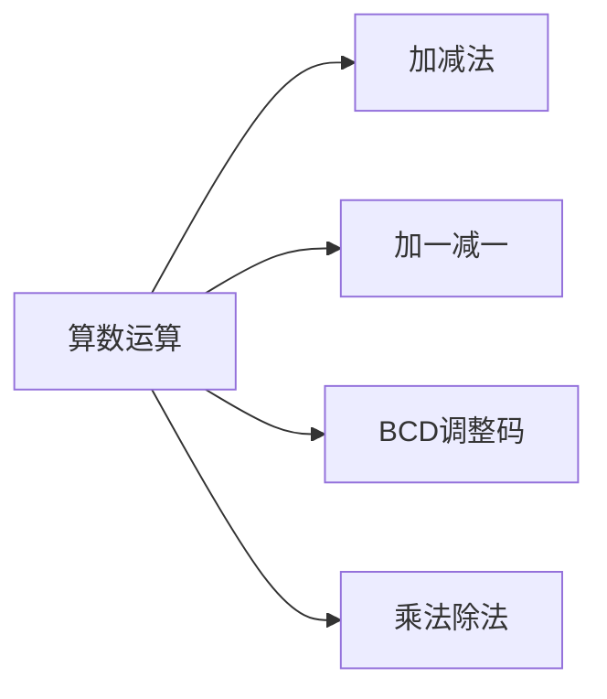

`ADD A source`    不带进位的加法操作
`ADDC A source`  带进位的加法操作
`SUBB A source`

>[!note]- 
> `ADDC A,B`  A+B+CY --> A
> `SUBB A,B`  A-B-CY --> A

`INC source`  $source\leftarrow  source+1$
`DEC source`   $source\leftarrow  source-1$

source：`R0~R7`  `@R0~R1`  `direct`  `#data`

`DA A` BCD 调整码，跟在 ADD、ADDC 加法指令之后

>[!tip]- BCD 码的调整
>假设有十进制计算：
>18+16=34  对应结果的 BCD码： 0011 0100
>而如果直接二进制计算：
>0001 1000  +  0001 0110= 0010 1110
>结果差：0011 0100 - 0010 1110=0000 0110
>即差 6

`MUL A,B`   无符号乘法，高位存 B，低位存 A
`DIV A B`   无符号除法，商存 A，余数存 B

