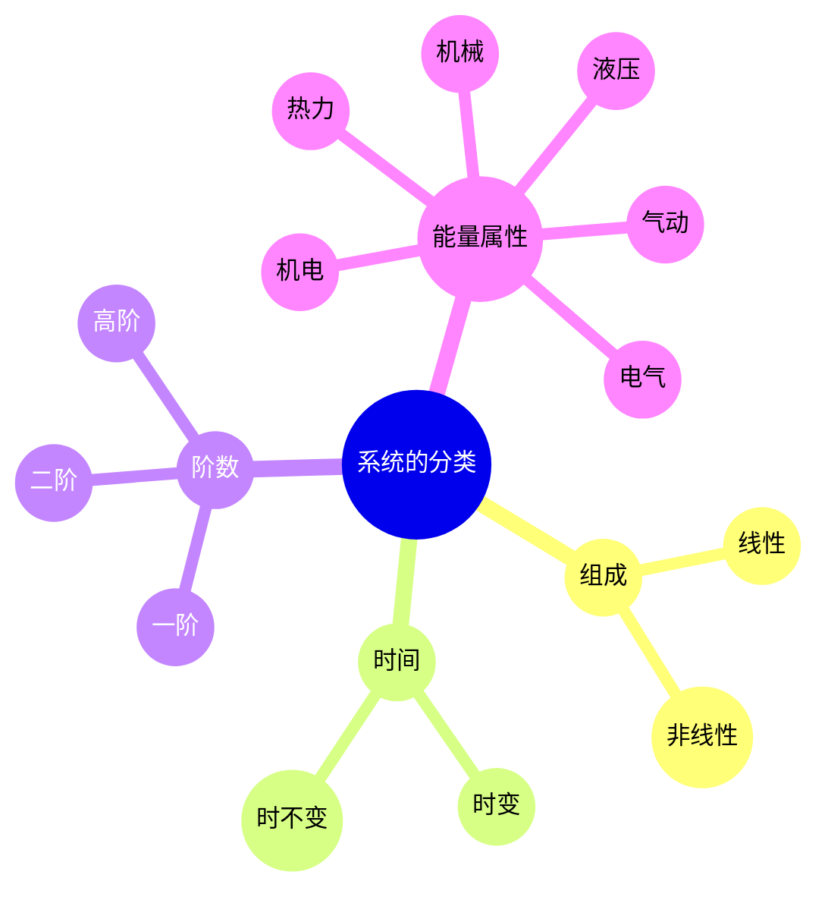

---
{"tags":["Transform","System","Mindset"],"dg-path":"自动控制原理/系统科学/系统.md","dg-publish":true,"permalink":"/自动控制原理/系统科学/系统/","dgPassFrontmatter":true,"noteIcon":"","created":"2024-09-02T09:43:03.000+08:00","updated":"2025-04-12T18:11:00.708+08:00"}
---

(terminology::**System**)  
本质上是对象在给定初始条件下，输入到输出的一个变换
>“由一些**相互关联、相互作用、相互影响**的组织部分构成并具有某些功能的**整体**”
>——钱学森
### 系统的数学描述
假定研究的系统有多个输入和输出
- **系统的外部变量**
	环境对系统的输入：$\mathbf{u}=\begin{bmatrix}{u}_{1} , {u}_{2} , \cdots ,  {u}_{p}\end{bmatrix}^{T}$
	环境对系统的输出： $\mathbf{y}=\begin{bmatrix}{y}_{1} , {y}_{2} , \cdots ,  {y}_{q}\end{bmatrix}^{T}$
- **系统的内部变量**
	描述系统内部每个时刻所处状态的变量 $\mathbf{x}=\begin{bmatrix}{x}_{1} , {x}_{2} , \cdots ,  {x}_{n}\end{bmatrix}^{T}$

#### 1. 外部描述
[[传递函数\|传递函数]]描述，也称输入-输出描述
将系统看作“黑箱”，只是反映系统外部变量（输入-输入）的因果关系

#### 2. 内部描述
[[状态空间\|状态空间]]描述，通常由两个方程表示
- **状态方程**
	微分方程或差分方程的形式
	输入变量和内部变量的因果关系
- **输出方程**
	代数方程的形式
	表征系统内部变量、输入变量、输出变量之间的转换关系

### 系统的分类

白箱
黑箱
灰箱

理论学习中，一般从[[线性时不变系统\|线性时不变系统]]的简单情况入手
### 系统的哲学

