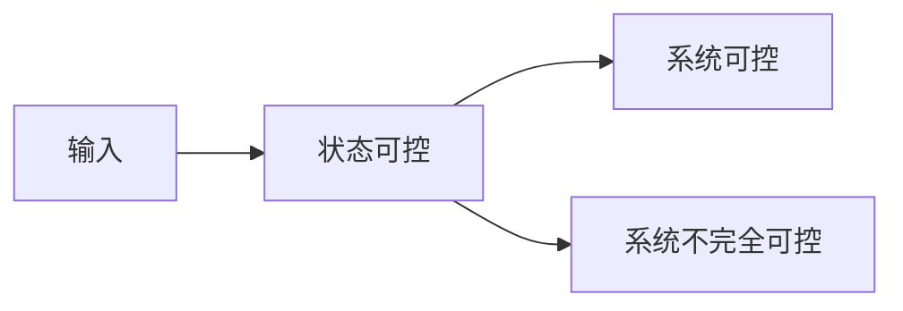

---
{"aliases":["线性系统的可控性","能控性"],"dg-publish":true,"dg-path":"A2- 自动控制原理/2. 现代控制理论/线性定常系统的能控性.md","permalink":"/A2- 自动控制原理/2. 现代控制理论/线性定常系统的能控性/","dgPassFrontmatter":true,"noteIcon":"","created":"2024-10-09T11:28:58.438+08:00","updated":"2025-04-14T17:55:50.876+08:00"}
---

(terminology::**Controllability**)
### 基本定义
**状态变量**可以由**输入**来影响和控制，而由任意的初态达到原点。
系统的可控性是从**状态方程**的角度看的，系统的可控建立在**状态的可控**。

**状态可控**：对于一个初始条件下的非零初始状态 $\mathbf{x}(t_{0})=\mathbf{x}_{0}$，存在一个无约束的容许控制，在有限时间内，使得状态由 $\mathbf{x}(t_{0})=\mathbf{x}_{0}$ 转移到 $\mathbf{x}(t_{1})=\mathbf{0}$
- **系统可控**：状态空间中的所有非零状态都是可控的
- **系统不完全可控**：存在一个或一些非零状态在时刻 $t_{0}$ 是不可控的
### 一、线性定常系统的可控性判据
考虑线性定常系统的状态方程
$$\begin{align}
\dot{\mathbf{x}}(t)={\color{red}{A} } \mathbf{x}(t)+{\color{#7496ff}B}\mathbf{u}(t)
\end{align}$$
系统的能控性取决于系统矩阵 $A$ 和控制矩阵 $B$。

#### 1. 对角线规范型判据
利用[[状态向量的线性变换\|状态空间表达式Jordan标准化]]将系统矩阵进行线性变换
$$\dot{\mathbf{z}}=T^{-1}AT\mathbf{z}+T^{-1}B\mathbf{u}  =\begin{cases} 
\mathbf{\dot{z}}=\Lambda \mathbf{z}+T^{-1}B\mathbf{u} \quad \text{特征值无重根，化为对角阵}\\ \\
\mathbf{\dot{z}}=J \mathbf{z} +T^{-1}B\mathbf{u} \quad \text{特征值有重根，化为约旦标准型}
\end{cases}$$

1. 如果化为对角阵，只要控制矩阵元素全不为零，则系统能控。
2. 如果化为 Jordan 标准型
	不同特征值对应的不同约旦块的**最后一行元素不为零向量**
	相同特征值产生的约旦块的**最后一行元素不仅不为零向量**，且要满足**线性独立**的条件

$$\begin{align}
A=\begin{pmatrix}
\lambda_{1} & 1 & 0\\0 & \lambda_{1} & 1\\ 0 & 0 &  \color{#00b7d3}{\lambda_{1}} \\
 &  &  & \lambda_{2} & 1 \\
 &  &  &  & \color{#11cabb}{\lambda_{2}}  \\
 &  &  &  &  & \color{red}{\lambda_{3} }
\end{pmatrix}\quad B=\begin{pmatrix}
\\ \\ \color{#00b7d3}{b_{1} }  & \color{#00b7d3}{b_{2}} \\\ \\ \color{#11cabb}{b_{3} }  & \color{#11cabb}{b_{4}} \\ \color{red}{b_{5} }  & \color{red}{b_{6}}
\end{pmatrix}
\end{align}$$
如果 $\lambda_{1}\neq\lambda_{2} \neq\lambda_{3}$，只要 $(b_{1},b_{2}),(b_{3},b_{4}),(b_{5},b_{6})$ 不为零向量即可
如果 $\lambda_{1}=\lambda_{2}\neq\lambda_{3}$ ，不仅要 $(b_{1},b_{2}),(b_{3},b_{4})$ 不为零向量，且要线性独立

#### 2. 构造能控性矩阵判断（秩判据）（主要使用）
由[[凯莱-哈密顿定理\|凯莱-哈密顿定理]]得到能控的充分必要条件：
$$\begin{align}
rank\; M =rank \; \begin{pmatrix}
B & AB & \cdots & A^{{\color{red}{n-1} } }B
\end{pmatrix}=n
\end{align}$$

 
#### ~~3. 传递函数判断能控性~~
$$\begin{align}
W_{ux}(s)=(sI-A)^{-1}B
\end{align}$$
计算[[传递函数矩阵\|传递函数矩阵]]，如果不存在[[零极点\|零极点]]对消，则系统能控
传递函数分子和分母约掉一个相同的公因子后，就相当于状态变量减少了一维，系统出现低维能控子空间和不能控子空间，则系统不能控。

