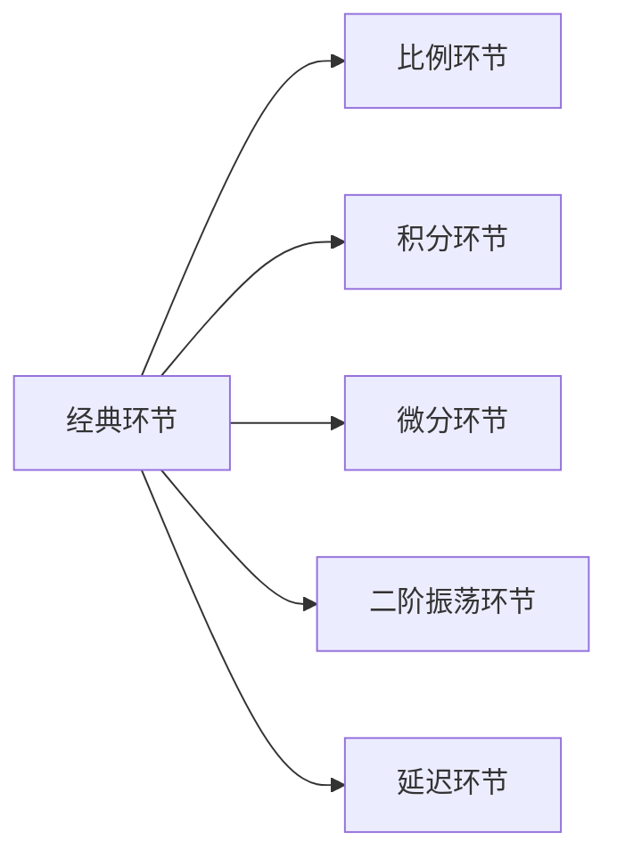

---
{"dg-publish":true,"dg-path":"自动控制原理/经典环节的传递函数.md","permalink":"/自动控制原理/经典环节的传递函数/","dgPassFrontmatter":true,"noteIcon":"","created":"2024-04-16T13:01:27.455+08:00","updated":"2024-05-09T08:26:31.882+08:00"}
---

[[传递函数\|传递函数]]
[[频域分析法\|频域分析法]]： [[Nyquist图\|Nyquist图]]   [[Bode图\|Bode图]]

### 基本环节
#### 比例/放大环节
$G(s)=K$   
$G(j\omega)=K+j0$

$$\begin{align}
 & |G(j\omega)|=K\\ 
& L(\omega )=20\lg K \\
 & \phi(\omega )=0^{\circ}
\end{align}$$
#### 纯积分环节
$G(s)=\dfrac{1}{s}$    
$G(j\omega)=\dfrac{1}{j\omega}=0-j \dfrac{1}{\omega}$
$$\begin{align}
 &|G(j\omega )|=\dfrac{1}{\omega } \\
& L(\omega)=-20\lg \omega  \\
 & \phi(\omega )=-90^{\circ}
\end{align}$$

#### 纯微分环节
$G(s)=s$
$G(j\omega)=j\omega=0+j\omega$
$$\begin{align} 
& |G_{j\omega }|=\omega  \\ 
& L(\omega )=20\lg \omega  \\
 & \phi(\omega )=90^{\circ}
\end{align}$$

#### 一阶惯性环节
$G(s)=\dfrac{1}{T s+1}$
$G(j\omega)=\dfrac{1}{1+j\omega T}=\dfrac{1}{1+T^{2}\omega^{2}}-j \dfrac{\omega T}{1+T^{2}\omega^{2}}$
$$\begin{align}
 |G(j\omega )|&= \dfrac{1}{\sqrt{ 1+\omega^{2}T^{2} }} \\
 L(\omega )&= 20\lg |G(j\omega )| \\
 & =-10\lg(1+\omega^{2}T^{2}) \\
 & \approx 0 (\omega \ll \dfrac{1}{T} 低频渐近线) \\
&\approx-20\lg \omega +20\lg \dfrac{1}{T}\quad (\omega \gg \dfrac{1}{T} 高频特性) \\
 \phi(\omega )&=-\arctan \omega T\quad (0^{\circ},-90^{\circ})
\end{align}$$

高频特性
$\omega=\dfrac{1}{T}$   转折频率/交接频率
- 对数幅频特性：曲线斜率为 $-20dB/dec$ 渐近线
- 对数幅频特性：$-45^{\circ}$

#### 一阶微分环节
$G(s)=\tau s+1$
$G(j\omega)=1+j\omega \tau$
$$\begin{align}
|G(j\omega )|&=\sqrt{ 1+\omega^{2}\tau^{2} } \\
L(\omega )&=20\lg|G(j\omega )| \\
&=10\lg(1+\omega^{2}\tau^{2}) \\
&\approx 20\lg(\omega )-20lg(\dfrac{1}{\tau})\quad  (\omega \gg \dfrac{1}{\tau}高频特性) \\
\phi(\omega )&=\arctan(\omega \tau)\quad (0^{\circ},90^{\circ})
\end{align}$$
高频特性
$\omega=\dfrac{1}{\tau}$   转折频率/交接频率
- 对数幅频特性：曲线斜率为 $20dB/dec$ 渐近线
- 对数幅频特性：$45^{\circ}$

#### 二阶振荡环节
$G(s)=\dfrac{1}{T^{2}s^{2}+2T \zeta s+1}= \dfrac{1}{(\dfrac{s}{\omega_{n}})^{2}+2\zeta(\dfrac{s}{\omega_{n}})+1}$
$G(j\omega)=\dfrac{1}{1- \dfrac{\omega^{2}}{\omega_{n}^{2}}+\dfrac{2\zeta \omega}{\omega_{n}}j}$
$$\begin{align}
 |G(j\omega )|&= \dfrac{1}{\sqrt{ \left(1- \dfrac{\omega^{2}}{\omega_{n}^{2}}\right)^{2} +4\zeta^{2} \dfrac{\omega^{2}}{\omega _{n}^{2}}}} \\
L(\omega )&=-20 \lg \sqrt{  \left(1- \dfrac{\omega^{2}}{\omega_{n}^{2}}\right)^{2} +4\zeta^{2} \dfrac{\omega^{2}}{\omega _{n}^{2}}} \\
 & \approx \quad 0    \quad \quad \quad \quad  (\omega \ll \omega _{n} 低频渐近)\\
& \approx -40\lg \dfrac{\omega}{\omega _{n}} \quad (\omega \gg \omega _{n}高频渐近)
\end{align}$$

$$\phi(\omega )= \begin{cases}
-\arctan \dfrac{\dfrac{2\zeta \omega}{\omega_{n}}}{1- \dfrac{\omega^{2}}{\omega _{n^{2}}}} \quad \omega \leq \omega _{n}\\
-180^{\circ}+\arctan\dfrac{\dfrac{2\zeta \omega}{\omega_{n}}}{ \dfrac{\omega^{2}}{\omega _{n^{2}}}-1}\quad \omega >\omega _{n} \\
\end{cases}
(0^{\circ},-180^{\circ})
$$

转折频率   $\omega=\omega_{n}$  
- 对数幅频特性：
	- 低频特性：斜率为 $0dB/dec$ 渐近线
	- 高频特性：斜率为 $-40dB/dec$ 渐近线
- 对数幅频特性：$-90^{\circ}$

谐振频率 $\omega_{r}=\omega_{n}\sqrt{ 1-2\zeta^{2} }\quad 0<\zeta< \dfrac{\sqrt{ 2 }}{2}\approx 0.707$
有最大幅值 (谐振峰值) $\dfrac{1}{2\zeta \sqrt{ 1-\zeta^{2} }}$
阻尼比越小，峰值越大

$\zeta=0$ 幅频特性曲线不连续，会产生分支
[[谐振\|谐振]]
[[二阶系统的时域分析\|二阶系统的时域分析]]

#### 二阶微分环节
$G(s)=\tau^{2} s^{2}+2\xi \tau s+1$
$G(j\omega)=(1-\tau^{2}\omega^{2})+2\zeta \tau \omega j$
$$\begin{align}
|G(j\omega )|&=\sqrt{  (1-\tau^{2}\omega^{2})^{2}+4\zeta^{2} \tau^{2} \omega^{2}} \\
L(\omega )&=20\lg \sqrt{  (1-\tau^{2}\omega^{2})^{2}+4\zeta^{2} \tau^{2} \omega^{2}} \\
&\approx 40\lg \omega \tau \quad (\omega \gg \dfrac{1}{\tau}高频渐近)
\end{align}$$
$$\phi(\omega )= \begin{cases}
\arctan \dfrac{\dfrac{2\zeta \omega}{\omega_{n}}}{1- \dfrac{\omega^{2}}{\omega _{n^{2}}}} \quad \omega \leq \omega _{n}\\
180^{\circ}-\arctan\dfrac{\dfrac{2\zeta \omega}{\omega_{n}}}{ \dfrac{\omega^{2}}{\omega _{n^{2}}}-1}\quad \omega >\omega _{n} \\
\end{cases}
(0^{\circ},180^{\circ})
$$

转折频率   $\omega=\omega_{n}=\dfrac{1}{\tau}$  
- 对数幅频特性：
	- 低频特性：斜率为 $0dB/dec$ 渐近线
	- 高频特性：斜率为 $40dB/dec$ 渐近线
- 对数幅频特性：$90^{\circ}$

#### 延迟环节
$U_{o}(t)=U_{i}(t-\tau)$
$G(s)=e^{ -\tau s }\approx \dfrac{1}{1+\tau s}$
$G(j\omega)=e^{ -j\omega \tau }$
$$\begin{align}
|G(j\omega )|&=1 \\
L(\omega )&=0 \\
\phi(\omega )&=-\omega \tau
\end{align}$$

### 对称关系
  纯积分环节  ---  纯微分环节
一阶惯性环节 --- 一阶微分环节
二阶振荡环节 --- 二阶微分环节 
互为倒数的传递函数：
**Bode图关于实轴对称**

非最小相位系统和最小相位系统
幅相特性曲线关于实轴对称

对数幅频特性曲线相同
对数相频特性曲线关于 0°线对称

